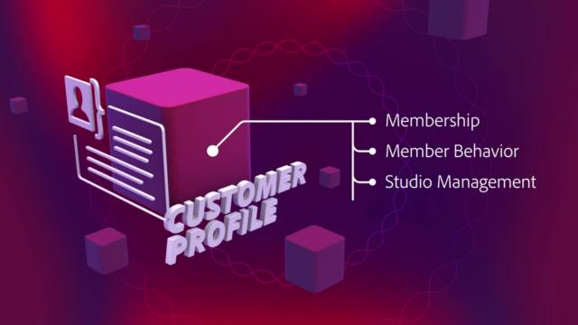

# Adobe Experience Platform-Tutorials

Adobe Experience Platform ist eines der leistungsfähigsten, flexibelsten und offensten auf dem Markt verfügbaren Systeme für die Einrichtung und Verwaltung umfassender Lösungen zur Umsetzung starker Kundenerlebnisse. Mit Adobe Experience Platform können Unternehmen Kundendaten und Content aus beliebigen Systemen zentral zusammenführen und standardisieren sowie mithilfe von Datenwissenschaft und maschinellem Lernen die Gestaltung und Bereitstellung umfassender, personalisierter Erlebnisse erheblich verbessern. In diesen Videos und Tutorials erfahren Sie mehr über die vielen Komponenten von Experience Platform.

## Mitarbeiterauswahl

<table style="margin-top: 0 !important">
<tr>
  <td>
    
    

      <a href="intro-to-platform/a-customer-experience-powered-by-experience-platform.md">
    <strong>Ein Kundenerlebnis auf Basis von Experience Platform</strong>
    </a>
    

    

    <em>Erfahren Sie, wie Platform zur Unterstützung eines Kundenerlebnisses verwendet werden kann</em>
    

  </td>
  <td>
    
    

      <a href="https://experienceleague.adobe.com/docs/platform-learn/getting-started-for-data-architects-and-data-engineers/overview.html?lang=de">
    <strong>Erste Schritte für Datenarchitekten und Dateningenieure</strong>
    </a>
    

    

    <em>Handübungen für die ersten Schritte</em>
    

  </td>
  <td>
    
    

      <a href="sources/overview.md">
    <strong>Grundlagen zu Quell-Connectoren</strong>
    </a>
    

    

    <em>Einfaches Erfassen Ihrer Daten</em>
    

  </td>
   <!--
   <td>
    
    

      <a href="data-ingestion/create-datasets-and-ingest-data.md">
    <strong>Create Datasets and Ingest Data</strong>
    </a>
    

    

    <em>Ingest your dataset.</em>
    

  </td>
  <td>
    
    

      <a href="segments/create-segments.md">
    <strong>Create Segments</strong>
    </a>
    

    

    <em>Build segments based on your data.</em>
    

  </td>-->
</tr>
</table>

