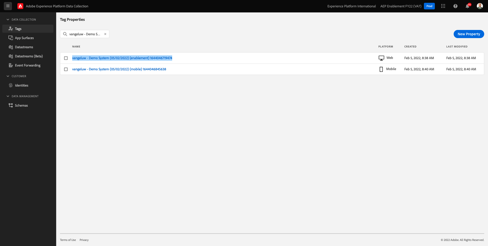
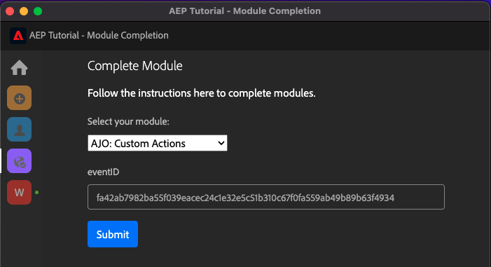
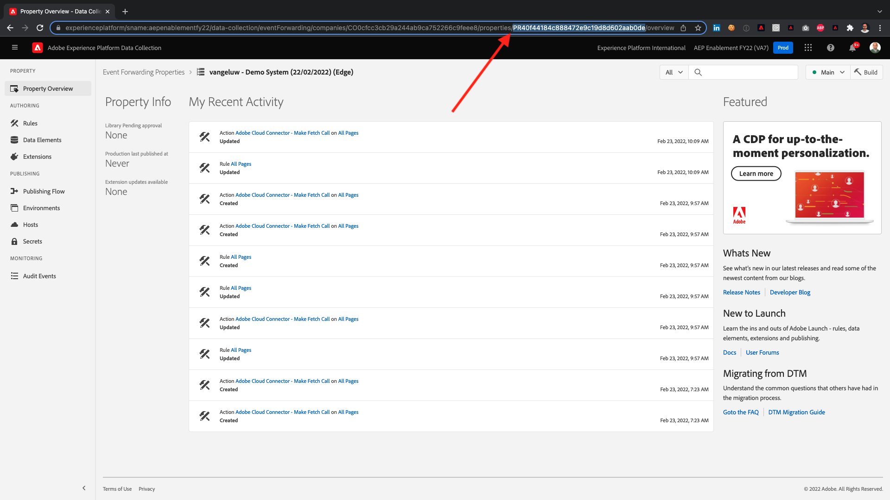

# Umfassendes technisches Tutorial für Adobe Experience Platform - Wie wird die Fertigstellung gemessen?

Sie können Ihren Abschluss des umfassenden Tutorials für Adobe Experience Platform mithilfe der erstellten Chrome-Erweiterung aktualisieren.

Nachdem Sie die Anweisungen in Modul 0 befolgt haben, haben Sie die **Konfigurations-ID** in der Chrome-Erweiterung und Sie haben sich angemeldet. Ihre Chrome-Erweiterung sollte jetzt wie folgt aussehen: Klicken Sie auf das violette Symbol, um den Abschluss eines Moduls zu senden.

Daraufhin sehen Sie Folgendes:

Durch Öffnen des Dropdown-Menüs können Sie auswählen, welches Modul Sie abschließen möchten:

Um ein Modul abzuschließen, müssen Sie einen Abschlussnachweis vorlegen.

Im Folgenden finden Sie die erwarteten Abschlussnachweise für jedes Modul.

## Erste Schritte

Der erwartete Nachweis der Fertigstellung des Moduls **Erste Schritte** ist die ID des von Ihnen erstellten Demosystemprojekts für das Web.

Die Kennung des Demo-System-Projekts für das Webformat sieht wie folgt aus: `--demoProfileLdap-- - OCUC`.

Auswählen **Erste Schritte** Geben Sie im Dropdown-Menü Ihre **ID des Demosystemprojekts** und klicken Sie auf **Einsenden** - Schaltfläche.

## Datenerfassung und Web-SDK

Der erwartete Nachweis der Fertigstellung des Moduls **Datenerfassung und Web-SDK** ist der Name der Datenerfassungseigenschaft für das Web.

Der Name der Datenerfassungseigenschaft für das Webformat sieht wie folgt aus: `--demoProfileLdap-- - Demo System (05/02/2022) (enablement) 1644046719474`.

Auswählen **Datenerfassung und Web-SDK** Geben Sie im Dropdown-Menü Ihre **Datenerfassungs-Eigenschaftsname für das Web** und klicken Sie auf **Einsenden** - Schaltfläche.

## Datenaufnahme

Der erwartete Nachweis der Fertigstellung des Moduls **Datenerfassung** ist die Datensatz-ID für die beiden Datensätze, die Sie erstellt haben.

Das Format der Datensatz-ID sieht wie folgt aus: **5f069724723ef41916a8b5d2**.

`--demoProfileLdap-- - Demo System - Event Dataset for Website`

`--demoProfileLdap-- - Demo System - Profile Dataset for Website`

Auswählen **Datenerfassung** Geben Sie im Dropdown-Menü Ihre **Datensatz-ID** für beide Datensätze in den Eingabefeldern und klicken Sie auf die **Einsenden** - Schaltfläche.

## Echtzeit-Kundenprofil

Der erwartete Nachweis der Fertigstellung des Moduls **Echtzeit-Kundenprofil** ist die **Segment-ID** des Segments, das Sie über die Benutzeroberfläche erstellt haben, `--demoProfileLdap-- - Male customers with interest in Montana Wind Jacket`.

Das Segment-ID-Format sieht wie folgt aus: **8cb7034d-d4ae-4d26-a61f-a76559c12457**.

Auswählen **Echtzeit-Kundenprofil** Geben Sie im Dropdown-Menü Ihre **Segment-ID** im Eingabefeld und klicken Sie auf die Schaltfläche **Einsenden** - Schaltfläche.

## Query Service

Der erwartete Nachweis der Fertigstellung des Moduls **Query Service** ist die Datensatz-ID für Ihre `--demoProfileLdap--_callcenter_interaction_analysis` - Datensatz, den Sie nach Abschluss des Moduls erhalten.

Das Format sieht folgendermaßen aus: **62076f68f14a9d194995d4e2**.

Auswählen **Query Service** Geben Sie im Dropdown-Menü Ihre **Datensatz-ID** im Eingabefeld und klicken Sie auf die Schaltfläche **Einsenden** - Schaltfläche.

## Intelligent Services

Der erwartete Nachweis der Fertigstellung des Moduls **Intelligent Services** ist die ID für Ihre **Propensity Customer AI Service für den Produktkauf**.

Das Format sieht folgendermaßen aus: **12729** und Sie können sie von der URL abrufen, wenn Sie Ihren Dienst geöffnet haben.

Auswählen **Intelligent Services** Geben Sie im Dropdown-Menü Ihre **Kunden-KI-Dienst-ID** im Eingabefeld und klicken Sie auf die Schaltfläche **Einsenden** - Schaltfläche.

## Real-Time CDP

Der erwartete Nachweis der Fertigstellung des Moduls **Real-Time CDP** ist die ID Ihrer **Adobe Target-Aktivität**.

Das Format sieht folgendermaßen aus: **111804**.

Auswählen **Real-Time CDP** Geben Sie im Dropdown-Menü Ihre **Adobe Target-Aktivitäts-ID** im Eingabefeld und klicken Sie auf die Schaltfläche **Einsenden** - Schaltfläche.

## AJO: Orchestrierung

Der erwartete Nachweis der Fertigstellung des Moduls **AJO: Orchestrierung** ist die eventID für Ihre `--demoProfileLdap--AccountCreationEvent`.

Das Format sieht folgendermaßen aus: **227402c540eb8f8855c6b2333adf6d54d7153d9d7d56fa475a6866081c57473 6**.

Auswählen **AJO: Orchestrierung** Geben Sie im Dropdown-Menü Ihre ** eventID** in das Eingabefeld ein und klicken Sie auf **Einsenden** - Schaltfläche.

## AJO: Benutzerdefinierte Aktionen

Der erwartete Nachweis der Fertigstellung des Moduls **AJO: Benutzerdefinierte Aktionen** ist die eventID für Ihr Ereignis `--demoProfileLdap--GeofenceEntry`.

Das Format sieht folgendermaßen aus: **fa42ab7982ba55f039eacec24c1e32e5c51b310c67f0fa559ab49b89b63f4934**.

Auswählen **AJO: Benutzerdefinierte Aktionen** Geben Sie im Dropdown-Menü Ihre **eventID** im Eingabefeld und klicken Sie auf die Schaltfläche **Einsenden** - Schaltfläche.

## AJO: Angebote

Der erwartete Nachweis der Fertigstellung des Moduls **AJO: Angebote** ist die ID der **Angebotsentscheidung** die Sie erstellt haben.

Sie finden die **Angebotsentscheidungen-ID**, der wie folgt aussieht **xcore:offer-activity:1122fcc4603ea499**, hier:

Auswählen **AJO: Angebote** Geben Sie im Dropdown-Menü Ihre **Angebotsentscheidungen-ID** im Eingabefeld und klicken Sie auf die Schaltfläche **Einsenden** - Schaltfläche.

## AJO: Veranstaltungen

Der erwartete Nachweis der Fertigstellung des Moduls **AJO: Veranstaltungen** ist die eventID für Ihre `--demoProfileLdap--StoreEntryEvent`.

Das Format sieht folgendermaßen aus: **e3a8f0bdc0b609667cd96a72a6b1e5aafa0ddaf6ccf121c574e6a2030860a633**.

Auswählen **AJO: Veranstaltungen** Geben Sie im Dropdown-Menü Ihre **eventID** im Eingabefeld und klicken Sie auf die Schaltfläche **Einsenden** - Schaltfläche.

## CJA

Der erwartete Nachweis der Fertigstellung des Moduls **CJA** ist die ID Ihres Projekts `--demoProfileLdap-- - Omnichannel Analysis`.

Das Format sieht folgendermaßen aus: **6217344f6249ac70c726db60**, können Sie sie in der URL finden, wenn Sie Ihr Projekt geöffnet haben.

Auswählen **CJA** Geben Sie im Dropdown-Menü Ihre **Projekt-ID** im Eingabefeld und klicken Sie auf die Schaltfläche **Einsenden** - Schaltfläche.

## CJA: BigQuery

Der erwartete Nachweis der Fertigstellung des Moduls **CJA: BigQuery** ist die ID Ihrer **BigQuery**-connection.

Sie finden die **BigQuery Connection ID**, der wie folgt aussieht **85a2394d-8b94-410c-a239-4d8b94b10c38**, hier:

Auswählen **CJA: BigQuery** Geben Sie im Dropdown-Menü Ihre **BigQuery Connection ID** im Eingabefeld und klicken Sie auf die Schaltfläche **Einsenden** - Schaltfläche.

## RTCDP: EventHub

Der erwartete Nachweis der Fertigstellung des Moduls **RTCDP: EventHub** ist die ID Ihrer **Microsoft Azure Event Hub** Ziel in Adobe Experience Platform.

Sie finden die **Microsoft Azure Event Hub-Ziel-ID**, der wie folgt aussieht **fa3f7ce5-86fd-4096-bf7c-e586fdc096ba**, hier:

Auswählen **RTCDP: EventHub** Geben Sie im Dropdown-Menü Ihre **Microsoft Azure Event Hub-Ziel-ID** im Eingabefeld und klicken Sie auf die Schaltfläche **Einsenden** - Schaltfläche.

## RTCDP-Verbindungen

Der erwartete Nachweis der Fertigstellung des Moduls **RTCDP-Verbindungen** ist **Ereignis-Weiterleitungs-Property-ID**.

Sie finden die **Ereignis-Weiterleitungs-Property-ID**, der wie folgt aussieht **PR40f44184c888472e9c19d8d602aab0de**, hier:

Auswählen **RTCDP-Verbindungen** Geben Sie im Dropdown-Menü Ihre **Ereignis-Weiterleitungs-Property-ID** im Eingabefeld und klicken Sie auf die Schaltfläche **Einsenden** - Schaltfläche.

## Apache Kafka

Der erwartete Nachweis der Fertigstellung des Moduls **Apache Kafka** ist die ID Ihres Quell-Connectors `--demoProfileLdap-- - Kafka`.

Die ID sieht wie folgt aus **f843d50a-ee30-4ca8-a766-0e4f3d29a2f7** und Sie finden ihn hier:

Auswählen **Apache Kafka** Geben Sie im Dropdown-Menü Ihre **Fluss-ID** im Eingabefeld und klicken Sie auf die Schaltfläche **Einsenden** - Schaltfläche.

[Zu allen Modulen zurückkehren](./overview.md)
