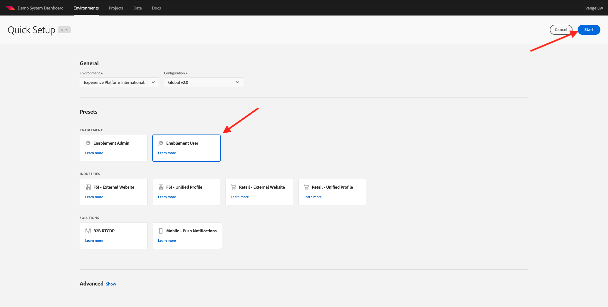

# 0.2 Demo-System verwenden Weiter zum Einrichten der Adobe Experience Platform-Datenerfassungs-Client-Eigenschaft

Nachdem Sie sich für das umfassende technische Tutorial für Adobe Experience Platform angemeldet haben, gibt es einen automatisierten Prozess, der Ihnen Zugriff auf Demo System bietet, sodass Sie auf die folgende Konfiguration zugreifen und sie ausführen können.

Sobald Sie Zugriff auf Demo System haben, fahren Sie mit den folgenden Schritten fort.

Navigieren Sie zu [https://dashboard.adobedemo.com/](https://dashboard.adobedemo.com/). Wählen Sie Ihre Sandbox aus und klicken Sie auf **Schnelleinstellungen**.

Sie sehen Folgendes:

under **Allgemein** - **Umgebung** wählen Sie Ihre Adobe Experience Platform-Instanz und Ihre Sandbox aus, in diesem Fall:

- **Experience Platform International**
- **aepenablementfy22**
- Konfiguration: Bitte wählen Sie **Global v2.0**

Wählen Sie als Nächstes die Vorgabe aus. **Aktivierungsbenutzer** und klicken Sie auf **Starten**.

Geben Sie im Popup-Fenster einen Namen für Ihre Datenerfassungseigenschaft ein. Bitte verwenden Sie diese Namenskonvention: **Demosystem (TT/MM/JJJJ)**. FYI: Ihr LDAP wird automatisch angehängt, Sie müssen es nicht selbst hinzufügen.

Klicken Sie auf **Starten**.

Anschließend wird Ihnen dieses Popup angezeigt, in dem Sie den Fortschritt beim Erstellen Ihrer Website und Mobile-App-Projekte sowie Ihrer Datenerfassungseigenschaften sehen.

Nach Abschluss des Schnellsetup-Prozesses verfügen Sie über Folgendes:

- 1 Web Retail-Projekt, das die Verwendung einer Demowebsite mit der Demomarke &quot;Luma&quot;ermöglicht
- 1 Mobile Retail-Projekt, das die Verwendung einer mobilen Demo-App mit der Demomarke &quot;Luma&quot;ermöglicht
- 1 CX-App-Einzelhandelsprojekt, das die Verwendung eines Callcenters und einer Clienteling-App mit der Demo-Marke Luma ermöglicht
- 1 Datenerfassungseigenschaft für das Web, mit der Sie Daten von der Website erfassen
- 1 Datenerfassungseigenschaft für Mobilgeräte, mit der Sie Daten aus der mobilen App erfassen

Lassen Sie diesen Bildschirm geöffnet, da Sie ihn in den nächsten Schritten benötigen werden.

Nächster Schritt: [0.3 Datenspeicher erstellen](./ex3.md)

[Zurück zu Modul 0](./getting-started.md)

[Zu allen Modulen zurückkehren](./../../overview.md)
