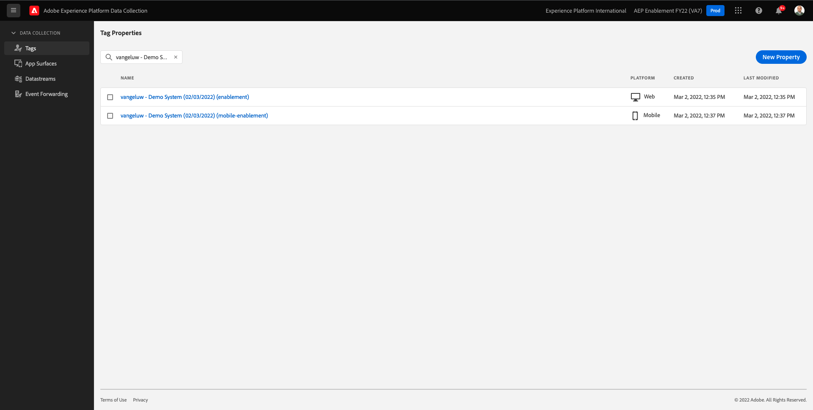
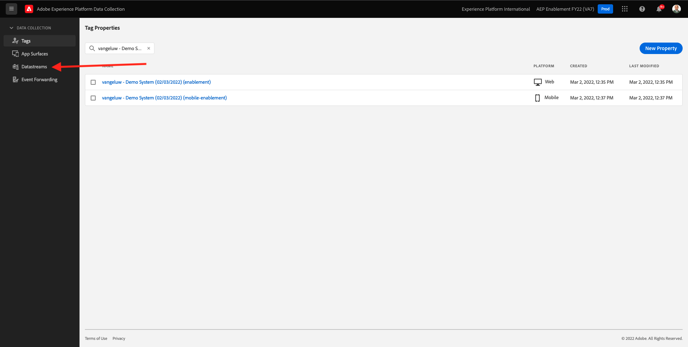

# 0.3 Datenspeicher erstellen

Navigieren Sie zu [https://experience.adobe.com/#/data-collection/](https://experience.adobe.com/#/data-collection/). Nach der vorherigen Übung verfügen Sie nun über zwei Datenerfassungseigenschaften: eine für Web und eine für Mobile.

Diese Eigenschaften können fast verwendet werden. Bevor Sie mit der Datenerfassung mit diesen Eigenschaften beginnen können, müssen Sie jedoch einen Datastream einrichten. Sie erhalten weitere Informationen über das Konzept, was ein Datastream ist und was es in Übung 1.2 bedeutet.

Befolgen Sie zunächst diese Schritte.

## 0.3.1 Erstellen Ihres Datenspeichers für Web

Klicken **[!UICONTROL Datenspeicher]** oder **[!UICONTROL Datenspeicher (Beta)]**.

Wählen Sie oben rechts auf Ihrem Bildschirm den Namen Ihrer Sandbox aus, der `--aepSandboxId--`.

Klicken **[!UICONTROL Neuer Datenspeicher]**.

Für **[!UICONTROL Anzeigename]** und geben Sie für die optionale Beschreibung `--demoProfileLdap-- - Demo System Datastream`. Wählen Sie für das Ereignisschema **Demosystem - Ereignisschema für Website (Global v1.1)**. Klicken Sie auf **Speichern**.

Dann wirst du das sehen. Klicken **Dienst hinzufügen**.

Wählen Sie den Dienst aus **[!UICONTROL Adobe Experience Platform]**, wodurch zusätzliche Felder angezeigt werden. Dann wirst du das sehen.

Wählen Sie für Ereignis-Datensatz die Option **Demosystem - Ereignis-Datensatz für Website (Global v1.1)** und für Profildatensatz wählen Sie **Demosystem - Profildatensatz für Website (Global v1.1)**. Klicken Sie auf **Speichern**.

Das wirst du jetzt sehen.

Das ist es vorerst. In [Modul 1](./../module1/data-ingestion-launch-web-sdk.md) Hier erfahren Sie mehr über das Web SDK und die Konfiguration aller Funktionen.

Klicken Sie im linken Menü auf **[!UICONTROL Tags]**.

Filtern Sie die Suchergebnisse, um Ihre beiden Datenerfassungseigenschaften anzuzeigen. Öffnen Sie die Eigenschaft für **Web** durch Klicken darauf.

Dann wirst du das sehen. Klicken **Erweiterungen**.

Klicken Sie in der Adobe Experience Platform Web SDK-Erweiterung auf **Konfigurieren**.

Dann wirst du das sehen. Für **Datenspeicher**, sehen Sie derzeit einen Platzhalterwert, der auf 1 gesetzt ist. Klicken Sie nun auf das **Aus Liste auswählen** Optionsfeld. Wählen Sie in der Dropdown-Liste den zuvor erstellten Datastream aus.

Stellen Sie sicher, dass Sie Ihre **Datastream**. TIPP: Sie können die Ergebnisse in der Dropdown-Liste einfach filtern, indem Sie Ihre `--demoProfileLdap--`.

Scrollen Sie nach unten, bis Sie **Datenerfassung**. Stellen Sie sicher, dass das Kontrollkästchen für **Aktivieren der Klickdatenerfassung** nicht aktiviert ist. Klicken Sie auf **Speichern**, um Ihre Änderungen zu speichern.

Navigieren Sie zu **Veröffentlichungsfluss**.

Klicken Sie auf **...** für **Main** Klicken Sie auf **Bearbeiten**.

Klicken **Alle geänderten Ressourcen hinzufügen** und klicken Sie anschließend auf **Speichern und erstellen für Entwicklung**.

Ihre Änderungen werden jetzt veröffentlicht und sind in einigen Minuten fertig.

## 0.3.2 Datenspeicher für Mobilgeräte erstellen

Navigieren Sie zu [https://experience.adobe.com/#/data-collection/](https://experience.adobe.com/#/data-collection/).

Klicken **[!UICONTROL Datenspeicher]** oder **[!UICONTROL Datenspeicher (Beta)]**.

Wählen Sie oben rechts auf Ihrem Bildschirm den Namen Ihrer Sandbox aus, der `--aepSandboxId--`.

Klicken **[!UICONTROL Neuer Datenspeicher]**.

Für **[!UICONTROL Anzeigename]** und geben Sie für die optionale Beschreibung `--demoProfileLdap-- - Demo System Datastream (Mobile)`. Wählen Sie für das Ereignisschema **Demosystem - Ereignisschema für mobile App (Global v1.1)**. Klicken Sie auf **Speichern**.

Klicken Sie auf **[!UICONTROL Speichern]**.

Dann wirst du das sehen. Klicken **Dienst hinzufügen**.

Wählen Sie den Dienst aus **[!UICONTROL Adobe Experience Platform]**, wodurch zusätzliche Felder angezeigt werden. Dann wirst du das sehen.

Wählen Sie für Ereignis-Datensatz die Option **Demosystem - Ereignis-Datensatz für mobile App (Global v1.1)** und für Profildatensatz wählen Sie **Demosystem - Profildatensatz für mobile App (Global v1.1)**. Klicken Sie auf **Speichern**.

Dann wirst du das sehen.

Ihr Datastream kann jetzt in Ihrer Adobe Experience Platform-Datenerfassungs-Client-Eigenschaft für Mobile verwendet werden.

Navigieren Sie zu **Tags** und filtern Sie die Suchergebnisse, um Ihre beiden Datenerfassungseigenschaften anzuzeigen. Öffnen Sie die Eigenschaft für **Mobile** durch Klicken darauf.

Dann wirst du das sehen. Klicken **Erweiterungen**.

Im **Adobe Experience Platform Edge Network** Erweiterung, klicken Sie **Konfigurieren**.

Dann wirst du das sehen. Jetzt müssen Sie die richtige Sandbox und den korrekt konfigurierten Datastream auswählen. Die zu verwendende Sandbox lautet `--aepSandboxId--` und der Datastream aufgerufen wird `--demoProfileLdap-- - Demo System Datastream (Mobile)`.

Für **Edge-Netzwerkdomäne** verwenden, verwenden Sie bitte die Standarddomäne , die **edge.adobedc.net**.

Klicken Sie auf **Speichern**, um Ihre Änderungen zu speichern.

Navigieren Sie zu **Veröffentlichungsfluss**.

Klicken Sie auf **...** neben **Main** Klicken Sie auf **Bearbeiten**.

Klicken **Alle geänderten Ressourcen hinzufügen** Klicken Sie auf **Speichern und erstellen für Entwicklung**.

Ihre Änderungen werden jetzt veröffentlicht und sind in einigen Minuten fertig.

Nächster Schritt: [0.4 Nutzung der Website](./ex4.md)

[Zurück zu Modul 0](./getting-started.md)

[Zu allen Modulen zurückkehren](./../../overview.md)