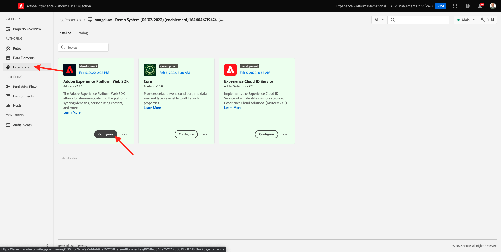
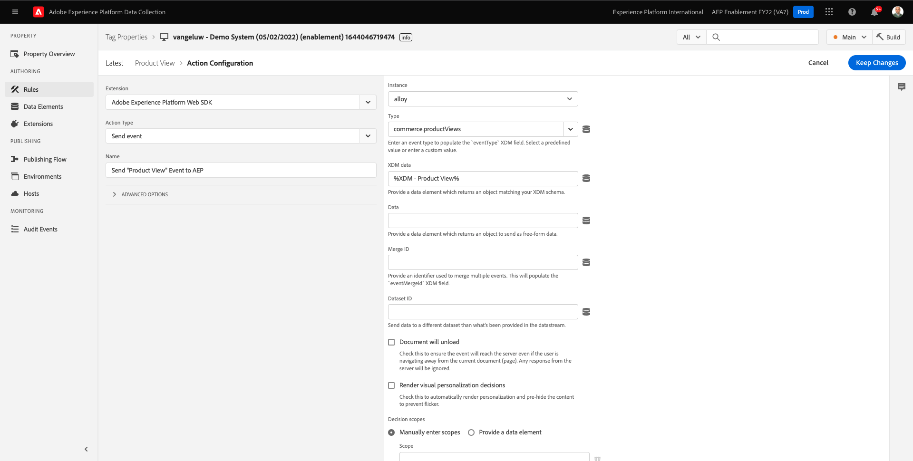

# 1.3 - Einführung in die Adobe Experience Platform-Datenerfassung

## Kontext

Sehen wir uns nun die Bausteine der Adobe Experience Platform-Datenerfassung genauer an, um zu verstehen, was auf Ihrer Demowebsite installiert ist. Sehen Sie sich die Adobe Experience Platform Web SDK-Erweiterung genauer an, konfigurieren Sie ein Datenelement und eine Regel und lernen Sie, wie Sie eine Bibliothek veröffentlichen.

## 1.3.1 - Adobe Experience Platform Web SDK-Erweiterung

Eine Erweiterung ist ein gepackter Code-Satz, der die Adobe Experience Platform-Datenerfassungsschnittstelle und die Bibliotheksfunktionalität erweitert. Die Adobe Experience Platform-Datenerfassung ist die Plattform. Erweiterungen sind wie Apps, die auf der Plattform ausgeführt werden. Alle im Tutorial verwendeten Erweiterungen werden von Adobe erstellt und verwaltet. Drittanbieter können jedoch eigene Erweiterungen erstellen, um die Anzahl der benutzerdefinierten Codes zu begrenzen, die Adobe Experience Platform Data Collection-Benutzer verwalten müssen.

Navigieren Sie zu [Adobe Experience Platform-Datenerfassung](https://experience.adobe.com/launch/) und wählen Sie **Tags**.

Dies ist die Seite mit den Eigenschaften der Adobe Experience Platform-Datenerfassung , die Sie zuvor gesehen haben.

In Modul 0 hat Demo System zwei Client-Eigenschaften für Sie erstellt: eine für die Website und eine für die mobile App. Suchen Sie sie, indem Sie nach `--demoProfileLdap--` im **[!UICONTROL Suche]** ankreuzen.

Öffnen Sie die **Web** -Eigenschaft.

Daraufhin wird die Seite Eigenschaftsübersicht angezeigt. Klicken Sie auf **[!UICONTROL Erweiterungen]** in der linken Leiste. Klicken Sie auf **[!UICONTROL Konfigurieren]** unter der Adobe Experience Platform Web SDK-Erweiterung.

Willkommen beim Adobe Experience Platform Web SDK! Hier können Sie die Erweiterung mit dem Datastream konfigurieren, den Sie in [Übung 0.2](./../module0/ex2.md) sowie eine erweiterte Konfiguration. Sie werden nur zwei Einstellungen für diese Übung konfigurieren.

Die standardmäßige Edge-Domäne ist immer **edge.adobedc.net**. Wenn Sie eine CNAME-Konfiguration in Ihrer Adobe Experience Cloud- oder Adobe Experience Platform-Umgebung implementiert haben, müssen Sie die **[!UICONTROL Edge-Domäne]**. Ihre Adobe Experience Platform-Instanz verwendet diese Edge-Domäne: `--webSdkEdgeDomain--`.

Wenn sich die Edge-Domäne Ihrer Instanz von der Standarddomäne unterscheidet, aktualisieren Sie die Edge-Domäne. Eine Edge-Domäne ermöglicht die Konfiguration eines Erstanbieter-Tracking-Servers, der dann eine CNAME-Konfiguration im Backend verwendet, um sicherzustellen, dass Daten in Adobe erfasst werden.

Stellen Sie nun sicher, dass die **[!UICONTROL Aus Liste auswählen]** Optionsfeld ist unter dem **[!UICONTROL Datenspeicher]** und wählen Sie Ihren Datenspeicher aus, der benannt ist: `--demoProfileLdap-- - Demo System Datastream`aus der Liste im **[!UICONTROL Datastream]** ankreuzen.

Klicken **[!UICONTROL Speichern]** , um zur Ansicht &quot;Erweiterungen&quot;zurückzukehren.

## 1.3.2 Datenelemente

Datenelemente sind Bausteine für Ihr Datenwörterbuch (oder Ihre Datenkarte). Verwenden Sie Datenelemente zum Sammeln, Organisieren und Bereitstellen von Daten in Marketing- und Werbetechnologie.

Ein einzelnes Datenelement ist eine Variable, deren Wert Abfragezeichenfolgen, URLs, Cookie-Werten, JavaScript-Variablen usw. zugeordnet werden kann. Sie können diesen Wert in der gesamten Adobe Experience Platform-Datenerfassung anhand seines Variablennamens referenzieren. Diese Sammlung von Datenelementen wird zum Wörterbuch definierter Daten, mit deren Hilfe Sie eigene Regeln erstellen können (Ereignisse, Bedingungen und Aktionen). Dieses Datenwörterbuch wird für die gesamte Adobe Experience Platform-Datenerfassung verwendet und kann mit jeder Erweiterung verwendet werden, die Sie Ihrer Eigenschaft hinzugefügt haben.

Sie werden jetzt ein bereits vorhandenes Datenelement im Format Web SDK Friendly bearbeiten.

Klicken Sie in der linken Leiste auf Datenelemente , um zur Seite Datenelemente zu gelangen.

>[!NOTE]
>
>Sie bearbeiten nur ein Datenelement in dieser Übung, Sie können jedoch die **[!UICONTROL Datenelement hinzufügen]** auf dieser Seite, die verwendet wird, um dem Datenwörterbuch eine neue Variable hinzuzufügen. Dies kann dann für die gesamte Adobe Experience Platform-Datenerfassung verwendet werden. Sehen Sie sich auch einige andere bereits vorhandene Datenelemente an, meist unter Verwendung des lokalen Speichers als Datenquelle.

Geben Sie in die Suchleiste **XDM - Produktansicht** und klicken Sie auf das zurückgegebene Datenelement.

Auf diesem Bildschirm wird das XDM-Objekt angezeigt, das Sie bearbeiten werden. Das Experience-Datenmodell (XDM) ist ein Konzept, das in diesem Tutorial viel weiter untersucht wird. Zunächst reicht es jedoch aus, es als das Format zu verstehen, das das Adobe Experience Platform Web SDK erfordert. Sie werden den Daten, die auf den Artikelseiten der Demo-Website erfasst wurden, ein wenig mehr Informationen hinzufügen.

Klicken Sie auf das Pluszeichen neben **Web** am unteren Ende des Baums.

Klicken Sie auf das Pluszeichen neben **webPageDetails**.

Klicken Sie auf **siteSection**. Sie sehen jetzt, dass **siteSection** ist noch nicht mit einem Datenelement verknüpft. Ändern wir das.

Scrollen Sie nach oben und geben Sie den Text ein. `%Product Category%`. Klicken Sie auf **[!UICONTROL Speichern]**.

An dieser Stelle wird die Adobe Experience Platform Web SDK-Erweiterung installiert und Sie haben ein Datenelement aktualisiert, um Daten anhand einer XDM-Struktur zu erfassen. Als Nächstes überprüfen wir die Regeln, die Daten zum richtigen Zeitpunkt senden.

## 1.3.3 Regeln

Die Adobe Experience Platform-Datenerfassung ist ein regelbasiertes System. Es wird nach Benutzerinteraktionen und verknüpften Daten gesucht. Wenn die in Ihren Regeln formulierten Kriterien erfüllt sind, löst die Regel die jeweils definierte Erweiterung, das Skript oder den clientseitigen Code aus.

Erstellen Sie Regeln, um die Daten und Funktionen von Marketing- und Werbetechnologien zu integrieren, die verschiedene Produkte in einer einzigen Lösung zusammenführen.

Unterteilen wir die Regel, die Daten auf Artikelseiten sendet.

Klicken Sie auf **[!UICONTROL Regeln]** in der linken Leiste.

**** Suchen Sie nach `Product View`.

Klicken Sie auf die zurückgegebene Regel.

Werfen wir einen Blick auf die einzelnen Elemente, aus denen diese Regel besteht. Für alle Regeln Wenn eine **[!UICONTROL Ereignis]** auftritt, wird die **[!UICONTROL Bedingungen]** ausgewertet werden, wird dann der angegebene **[!UICONTROL Aktionen]** bei Bedarf durchgeführt werden.

Klicken Sie auf das Ereignis **Benutzerspezifisches Ereignis - Produktansicht**. Dies ist die Ansicht, die geladen wird.

Klicken Sie auf **Ereignistyp** angezeigt.

Hier werden einige der Standardinteraktionen aufgelistet, mit denen Sie signalisieren können, dass die Adobe Experience Platform-Datenerfassung die Aktionen ausführt, falls die Bedingungen wahr sind.

Klicken **[!UICONTROL Abbrechen]** , um zur Regel zurückzukehren.

Klicken Sie auf die Aktion **Ereignis &quot;Produktansicht&quot;an AEP senden**.

Hier sehen Sie die Daten, die vom Adobe Experience Platform Web SDK an die Adobe Edge gesendet werden. Genauer gesagt verwendet dies die **Legierung** **[!UICONTROL Instanz]** des Web SDK. Einrichten eines weiteren **[!UICONTROL Instanz]** würde die Verwendung verschiedener Datastreams unter anderem ermöglichen. Sie haben das Ereignis angegeben **[!UICONTROL Typ]** als **commerce.productViews** und die XDM-Daten, die Sie senden, sind die **XDM - Produktansicht** -Datenelement, das Sie zuvor geändert haben.

Nachdem Sie sich die Regel angesehen haben, können Sie alle Ihre Änderungen in der Adobe Experience Platform-Datenerfassung veröffentlichen.

## 1.3.4 In einer Bibliothek veröffentlichen

Um die gerade aktualisierte Regel und das Datenelement zu validieren, müssen Sie schließlich eine Bibliothek veröffentlichen, die die bearbeiteten Elemente in unserer Eigenschaft enthält. Es gibt einige schnelle Schritte, die Sie im **[!UICONTROL Veröffentlichung]** Abschnitt der Adobe Experience Platform-Datenerfassung.

Klicken **[!UICONTROL Veröffentlichungsfluss]** in der linken Navigation

Klicken Sie auf die vorhandene Bibliothek mit dem Namen **Main**.

Klicken Sie auf **Alle geänderten Ressourcen hinzufügen** Schaltfläche.

Scrollen Sie nach unten, um zu sehen, dass die meisten Ressourcen wie folgt bleiben: **Revision 1 (neueste Version)**, aber die beiden haben wir geändert - **Datenelement: ruleArticlePages** und **Erweiterung: Adobe Experience Platform Web SDK** wird mit **Neueste**.

Klicken Sie auf **Speichern und erstellen für Entwicklung** Schaltfläche.

Die Erstellung der Bibliothek kann einige Minuten dauern. Wenn sie abgeschlossen ist, wird links neben dem Bibliotheksnamen ein grüner Punkt angezeigt.

Wie Sie auf dem Bildschirm &quot;Veröffentlichungsfluss&quot;sehen können, gibt es viel mehr im Veröffentlichungsprozess in der Adobe Experience Platform-Datenerfassung, was über den Rahmen dieses Tutorials hinausgeht. Wir werden nur eine einzige Bibliothek in unserer Entwicklungsumgebung verwenden.

Nächster Schritt: [1.4 Clientseitige Web-Datenerfassung](./ex4.md)

[Zurück zu Modul 1](./data-ingestion-launch-web-sdk.md)

[Zu allen Modulen zurückkehren](./../../overview.md)
