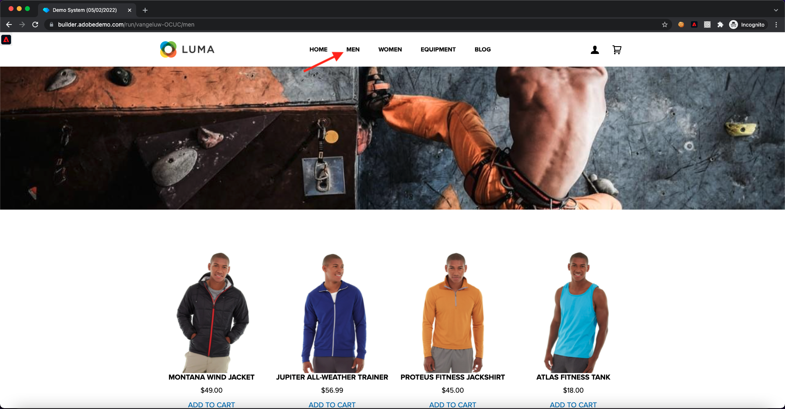

# 1.4 Clientseitige Web-Datenerfassung

## 1.4.1 Überprüfen der Daten in der Anforderung

### Installieren des Adobe Experience Platform Debuggers

Der Experience Platform Debugger ist eine Erweiterung, die für Chrome- und Firefox-Browser verfügbar ist und Ihnen dabei hilft, die auf Ihren Webseiten implementierte Adobe zu sehen. Laden Sie die Version für Ihren bevorzugten Browser herunter:

- [Firefox-Erweiterung](https://addons.mozilla.org/de/firefox/addon/adobe-experience-platform-dbg/)

- [Chrome-Erweiterung](https://chrome.google.com/webstore/detail/adobe-experience-platform/bfnnokhpnncpkdmbokanobigaccjkpob)

Wenn Sie den Debugger noch nie verwendet haben - und dieser von dem vorherigen Adobe Experience Cloud Debugger unterscheidet -, sollten Sie sich dieses fünfminütige Übersichtsvideo ansehen:

>[!VIDEO](https://video.tv.adobe.com/v/32156?quality=12&learn=on)

Da Sie die Demo-Website im Inkognito-Modus laden, müssen Sie sicherstellen, dass der Experience Platform-Debugger auch im Inkognito-Modus verfügbar ist. Gehen Sie dazu zu **chrome://extensions** in Ihrem Browser und öffnen Sie die Experience Platform Debugger-Erweiterung.

Stellen Sie sicher, dass diese beiden Einstellungen aktiviert sind:

- Entwicklermodus
- In Inkognito zulassen

### Öffnen Sie die Demowebsite

Navigieren Sie zu [https://builder.adobedemo.com/projects](https://builder.adobedemo.com/projects). Nach der Anmeldung bei Ihrer Adobe ID sehen Sie dies. Klicken Sie auf Ihr Website-Projekt, um es zu öffnen.

Im **Screens** Seite, klicken Sie auf **Ausführen**.

Sie werden dann Ihre Demowebsite öffnen sehen. Wählen Sie die URL aus und kopieren Sie sie in die Zwischenablage.

Öffnen Sie ein neues Inkognito-Browserfenster.

Fügen Sie die URL Ihrer Demo-Website ein, die Sie im vorherigen Schritt kopiert haben. Sie werden dann aufgefordert, sich mit Ihrer Adobe ID anzumelden.

Wählen Sie Ihren Kontotyp aus und schließen Sie den Anmeldevorgang ab.

Sie sehen dann Ihre Website in einem Inkognito-Browser-Fenster geladen. Für jede Demonstration müssen Sie ein neues Inkognito-Browser-Fenster verwenden, um Ihre Demo-Website-URL zu laden.

### Verwenden Sie den Experience Platform Debugger, um die Aufrufe zu Edge anzuzeigen.

Stellen Sie sicher, dass die Demo-Website geöffnet ist, und klicken Sie auf das Symbol Experience Platform Debugger-Erweiterung .

Der Debugger wird geöffnet und zeigt die Details der Implementierung an, die in Ihrer Adobe Experience Platform-Datenerfassungseigenschaft erstellt wurde. Denken Sie daran, dass Sie die Erweiterung und die Regeln debuggen, die Sie gerade bearbeitet haben.

Klicken Sie auf **[!UICONTROL Anmelden]** rechts oben zur Authentifizierung. Wenn Sie bereits über die Benutzeroberfläche zur Datenerfassung von Adobe Experience Platform eine Browser-Registerkarte geöffnet haben, wird der Authentifizierungsschritt automatisch durchgeführt und Sie müssen Ihren Benutzernamen und Ihr Kennwort nicht erneut eingeben.

Drücken Sie die Schaltfläche Neu laden auf Ihrer Demo-Website, um den Debugger mit dieser Registerkarte zu verbinden.

Vergewissern Sie sich, dass der Debugger **[!UICONTROL Verbunden mit Home]** wie oben dargestellt, und klicken Sie dann auf die **[!UICONTROL lock]** zum Sperren des Debuggers für die Demowebsite. Wenn Sie dies nicht tun, schaltet der Debugger weiter, um die Implementierungsdetails der Browser-Registerkarte anzuzeigen, die im Fokus ist, was verwirrend sein kann.

Navigieren Sie dann zu einer beliebigen Seite auf der Demo-Website, z. B. zum **Männer** Kategorieseite.

Jetzt klicken **[!UICONTROL Experience Platform Web SDK]** in der linken Navigation, um die **[!UICONTROL Netzwerkanforderungen]**.

Jede Anforderung enthält **[!UICONTROL events]** Zeile.

Klicken Sie auf , um die **[!UICONTROL events]** Zeile. Beachten Sie, dass die **web.webpageDetails.pageViews** -Ereignis sowie anderen nativen Variablen, die der **Web SDK ExperienceEvent XDM** Format.

Diese Arten von Anforderungsdetails sind auch auf der Registerkarte &quot;Netzwerk&quot;sichtbar. Nach Anforderungen filtern mit **interact** , um die vom Web SDK gesendeten Anfragen zu suchen. Alle Details der XDM-Payload finden Sie in den Headern der Anfrage-Payload:

Nächster Schritt: [1.5 Implementieren von Adobe Analytics und Adobe Audience Manager](./ex5.md)

[Zurück zu Modul 1](./data-ingestion-launch-web-sdk.md)

[Zu allen Modulen zurückkehren](./../../overview.md)
