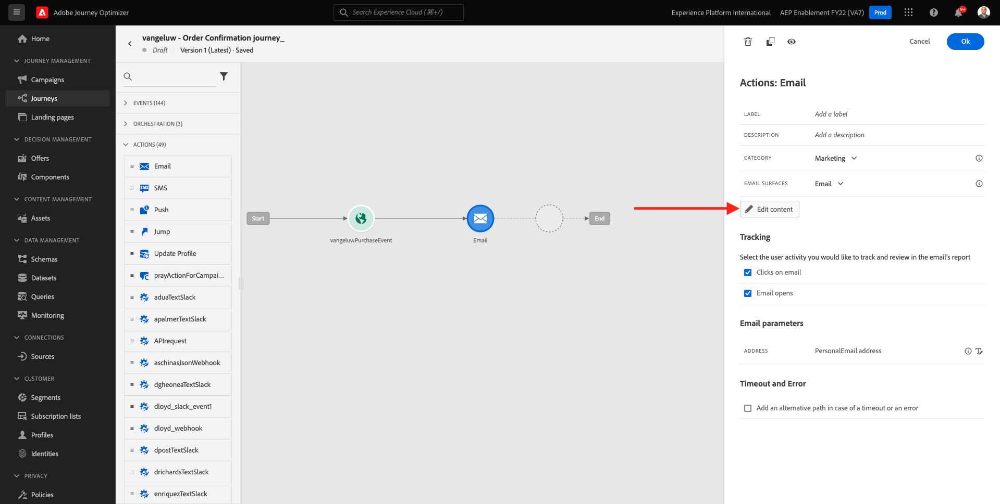

# 10.2 Batch-basierte Newsletter-Journey konfigurieren

Melden Sie sich bei Adobe Journey Optimizer an, indem Sie [Adobe Experience Cloud](https://experience.adobe.com). Klicken **Journey Optimizer**.

Sie werden zum **Startseite**  in Journey Optimizer anzeigen. Vergewissern Sie sich zunächst, dass Sie die richtige Sandbox verwenden. Die zu verwendende Sandbox heißt `--aepSandboxId--`. Um von einer Sandbox zu einer anderen zu wechseln, klicken Sie auf **PRODUKTIONSPROD (VA7)** und wählen Sie die Sandbox aus der Liste aus. In diesem Beispiel erhält die Sandbox den Namen **AEP-Aktivierung FY22**. Sie sind dann im **Startseite** Ansicht Ihrer Sandbox `--aepSandboxId--`.

## 10.2.1 Newsletter-Journey erstellen

Jetzt erstellen Sie eine Batch-basierte Journey. Im Gegensatz zur ereignisbasierten Journey der vorherigen Übung, bei der eingehende Erlebnisereignisse oder Segmenteinträge oder -ausstiege zum Trigger einer Journey für einen bestimmten Kunden verwendet werden, richten sich Batch-basierte Journey ein ganzes Segment einmal mit eindeutigen Inhalten wie Newslettern, einmaligen Promotions oder allgemeinen Informationen oder regelmäßig mit ähnlichen Inhalten, die regelmäßig gesendet werden, z. B. Geburtstagskampagnen und Erinnerungen.

Gehen Sie im Menü zu **Journey** und klicken Sie auf **Journey erstellen**.

Auf der rechten Seite sehen Sie ein Formular, in dem Sie den Journey-Namen und die Beschreibung angeben müssen. Geben Sie die folgenden Werte ein:

- **Name**: `--demoProfileLdap-- - Newsletter Journey`. Beispiel: **vangeluw - Newsletter-Journey**.
- **Beschreibung**: Monatlicher Newsletter

Klicken Sie auf **OK**.

under **Orchestrierung**, per Drag &amp; Drop **Segment lesen** auf die Arbeitsfläche. Das bedeutet, dass die Journey nach der Veröffentlichung mit dem Abrufen der gesamten Segmentzielgruppe beginnt, die dann zur Zielgruppe der Journey und Nachricht wird. Klicken **Segment auswählen**.

Im **Segment auswählen** Popup, suchen Sie nach Ihrem ldap und wählen Sie das Segment aus, das Sie in erstellt haben. [Modul 6: Echtzeit-Kundendatenplattform - Erstellen eines Segments und Ergreifen von Aktionen](../module6/real-time-cdp-build-a-segment-take-action.md) benannt `--demoProfileLdap-- - Interest in PROTEUS FITNESS JACKSHIRT`. Beispiel: vangeluw - Interesse an PROTEUS FITNESS JACKSHIRT. Klicken Sie auf **Speichern**.

Klicken Sie auf **OK**.

Suchen Sie im linken Menü die **Aktionen** und per Drag &amp; Drop **Email** Aktion auf die Arbeitsfläche.

Legen Sie die **Kategorie** nach **Marketing** und wählen Sie eine E-Mail-Oberfläche aus, über die Sie E-Mails versenden können. In diesem Fall ist die auszuwählende E-Mail-Oberfläche **Email**. Stellen Sie sicher, dass die Kontrollkästchen für **Klicks auf E-Mail** und **E-Mail-Öffnungen** beide aktiviert sind.

Der nächste Schritt besteht darin, Ihre Nachricht zu erstellen. Klicken Sie dazu auf **Inhalt bearbeiten**.

Das sehen Sie jetzt. Klicken Sie auf **Betreff** Textfeld.

Geben Sie diesen Text für die Betreffzeile ein: `Luma Newsletter - your monthly update has arrived.`. Klicken Sie auf **Speichern**.

Du wirst dann wieder hier sein. Klicken **Email Designer** , um mit der Erstellung des E-Mail-Inhalts zu beginnen.

Dann wirst du das sehen. Klicken **HTML importieren**.

Im Popup-Bildschirm müssen Sie die HTML-Datei der E-Mail per Drag-and-Drop verschieben. Sie finden die HTML-Vorlage [here](../../assets/html/ajo-newsletter.html.zip). Laden Sie die ZIP-Datei mit der HTML-Vorlage auf Ihren lokalen Computer herunter und dekomprimieren Sie sie auf Ihrem Desktop.

Datei per Drag-and-Drop verschieben **ajo-newsletter.html** , um es in Journey Optimizer hochzuladen. Klicken Sie auf **Importieren**.

Dieser E-Mail-Inhalt ist einsatzbereit, da er die erwartete Personalisierung, Bilder und Text aufweist. Leer bleibt nur der Angebots-Platzhalter.

Möglicherweise erhalten Sie eine Fehlermeldung: **Fehler beim Abrufen von Assets**. Dies ist mit dem Bild in der E-Mail verknüpft.

Wenn dieser Fehler auftritt, wählen Sie das Bild aus und klicken Sie auf die **Bild bearbeiten** Schaltfläche.

Klicken **Assets Essentials** , um zur AEM Assets Essentials-Bibliothek zurückzukehren.

Dann sehen Sie dieses Popup. Navigieren zum Ordner **enable-assets** und wählen Sie das Bild aus **luma-newsletterContent.png**. Klicken Sie auf **Auswählen**.

Ihre einfache Newsletter-E-Mail ist jetzt bereit. Klicken Sie auf **Speichern**.

Gehen Sie zum Nachrichten-Dashboard zurück, indem Sie auf die Schaltfläche **Pfeil** neben dem Betreffzeilentext in der oberen linken Ecke.

Klicken Sie auf den Pfeil in der oberen linken Ecke, um zu Ihrer Journey zurückzukehren.

Klicken **Ok** um Ihre E-Mail-Aktion zu schließen.

Ihre Newsletter-Journey kann jetzt veröffentlicht werden. Beachten Sie zunächst die **Zeitplan** -Abschnitt, in dem Sie diese Journey von einer einmaligen zu einer wiederkehrenden Kampagne wechseln können. Klicken Sie auf **Zeitplan** Schaltfläche.

Dann wirst du das sehen. Auswählen **Einmal**.

Wählen Sie ein Datum und eine Uhrzeit innerhalb der nächsten Stunde aus, damit Sie Ihre Journey testen können. Klicken Sie auf **OK**.

>[!NOTE]
>
>Datum und Uhrzeit des Nachrichtenversands müssen innerhalb von mehr als einer Stunde liegen.

Klicken Sie auf **Veröffentlichen**.

Klicken **Veröffentlichen** erneut.

Ihre grundlegende Newsletter-Journey ist jetzt veröffentlicht. Ihre Newsletter-E-Mail-Nachricht wird wie in Ihrem Zeitplan definiert gesendet und Ihre Journey wird beendet, sobald die letzte E-Mail gesendet wurde.

Du hast diese Übung beendet.

Nächster Schritt: [10.3 Personalisierung in einer E-Mail-Nachricht anwenden](./ex3.md)

[Zurück zu Modul 10](./journeyoptimizer.md)

[Zu allen Modulen zurückkehren](../../overview.md)
