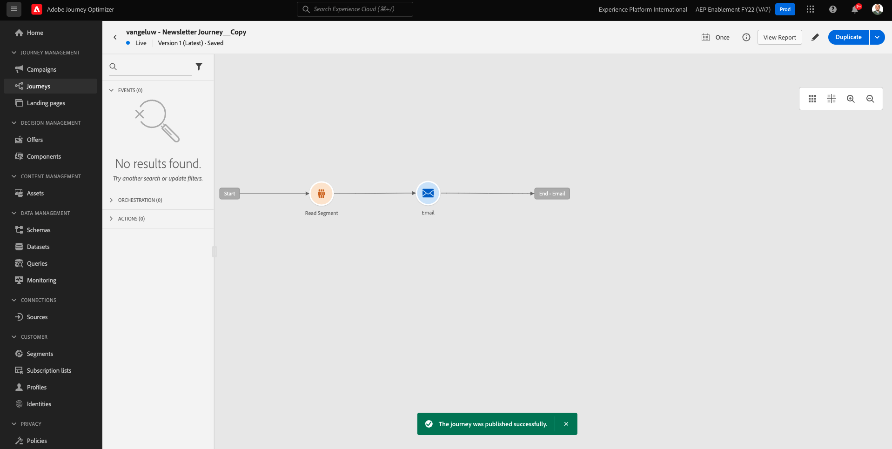

# 10.3 Personalisierung in einer E-Mail-Nachricht anwenden

Melden Sie sich bei Adobe Experience Cloud an, indem Sie [Adobe Experience Cloud](https://experience.adobe.com). Klicken **Adobe Journey Optimizer**.

Sie werden zum **Startseite** in Journey Optimizer anzeigen. Bevor Sie fortfahren, müssen Sie eine **Sandbox**. Die auszuwählende Sandbox heißt ``--aepTenantId--``. Klicken Sie hierzu auf den Text **[!UICONTROL Produktionsprodukt]** in der blauen Zeile auf Ihrem Bildschirm.

## 10.3.1 Segmentbasierte Personalisierung

In dieser Übung verbessern Sie Ihre Newsletter-E-Mail-Nachricht mit einem personalisierten Text, der auf der Segmentmitgliedschaft basiert.

Navigieren Sie zu **Journey**. Suchen Sie die Newsletter-Journey, die Sie in der vorherigen Übung erstellt haben. Suchen Sie nach `--demoProfileLdap-- - Newsletter`. Klicken Sie auf Ihre Journey, um sie zu öffnen.

Dann wirst du das sehen. Klicken Sie auf **Duplizieren**.

Klicken Sie auf ** Duplizieren**.

Wählen Sie Ihre **Email** Aktion und klicken Sie auf **Inhalt bearbeiten**.

Klicken **Email Designer**.

Dann wirst du das sehen.

Öffnen **Inhaltskomponenten** und ziehen Sie eine **Text** -Komponente unterhalb des aktuellen Newsletterinhalts.

Wählen Sie den gesamten Standardtext aus und löschen Sie ihn. Klicken Sie dann auf die **Personalisierung hinzufügen** in der Symbolleiste.

Daraufhin sehen Sie Folgendes:

Klicken Sie im linken Menü auf **Segmentzugehörigkeiten**.

>[!NOTE]
>
>Wenn Sie Ihr Segment nicht in dieser Liste finden, scrollen Sie nach unten, um Anweisungen zum manuellen Abrufen der Segment-ID zu erhalten.

Segment auswählen `Luma - Women's Category Interest` und klicken Sie auf **+** -Symbol, das wie folgt aussehen sollte:

Lassen Sie dann die erste Zeile unverändert und ersetzen Sie die Zeilen 2 und 3 durch diesen Code:

``
Psssst... a private sale in the women category will launch soon, we will keep you posted

Thanks for taking the time to read our newsletter. Here is a 10% promo code to use on the website: READER10

``

Dann haben Sie Folgendes:

Klicken **Bestätigen** um sicherzustellen, dass der Code korrekt ist. Klicken Sie auf **Speichern**.

Sie können diese Nachricht jetzt speichern, indem Sie auf **Speichern** in der oberen rechten Ecke. Klicken Sie anschließend auf **Inhalt simulieren**.

Wählen Sie eines der Profile aus, die Sie im Rahmen dieses Tutorials erstellt haben, und klicken Sie auf **Vorschau**. Sie sehen dann das Ergebnis Ihrer Konfiguration.

Dann wirst du das sehen. Klicken Sie anschließend auf **Schließen**.

Gehen Sie zum Nachrichten-Dashboard zurück, indem Sie auf die Schaltfläche **Pfeil** neben dem Betreffzeilentext in der oberen linken Ecke.

Klicken Sie auf den Pfeil in der oberen linken Ecke, um zu Ihrer Journey zurückzukehren.

Klicken **Ok** um Ihre E-Mail-Aktion zu schließen.

Ändern Sie Ihre **Zeitplan** nach **Einmal** und definieren Sie eine **Datum/Uhrzeit**. Klicken Sie auf **OK**.

>[!NOTE]
>
>Datum und Uhrzeit des Nachrichtenversands müssen innerhalb von mehr als einer Stunde liegen.

Klicken Sie auf **Veröffentlichen** in der Journey.

Klicken Sie im Popup-Fenster auf **Veröffentlichen** erneut.

Ihre grundlegende Newsletter-Journey ist jetzt veröffentlicht. Ihre Newsletter-E-Mail-Nachricht wird nach Ihrem Zeitplan gesendet und Ihre Journey wird beendet, sobald die letzte E-Mail gesendet wurde.

Du hast diese Übung beendet.

Nächster Schritt: [10.4 Push-Benachrichtigungen für iOS einrichten und verwenden](./ex4.md)

[Zurück zu Modul 10](./journeyoptimizer.md)

[Zu allen Modulen zurückkehren](../../overview.md)
