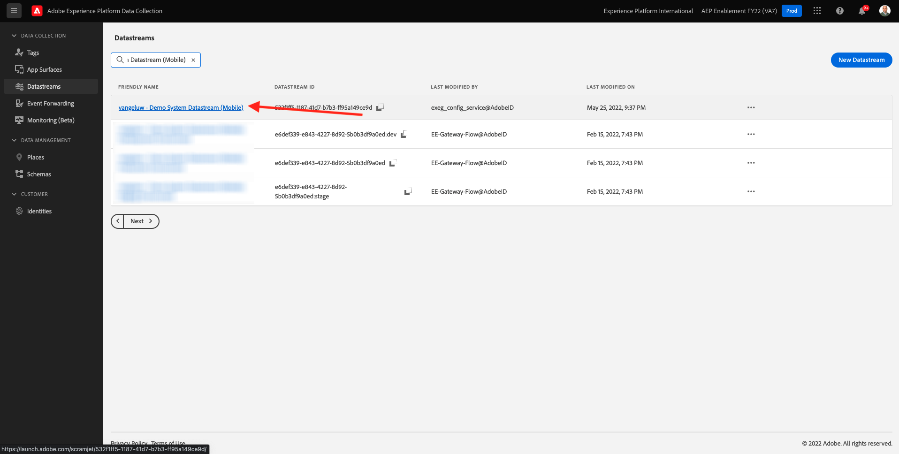
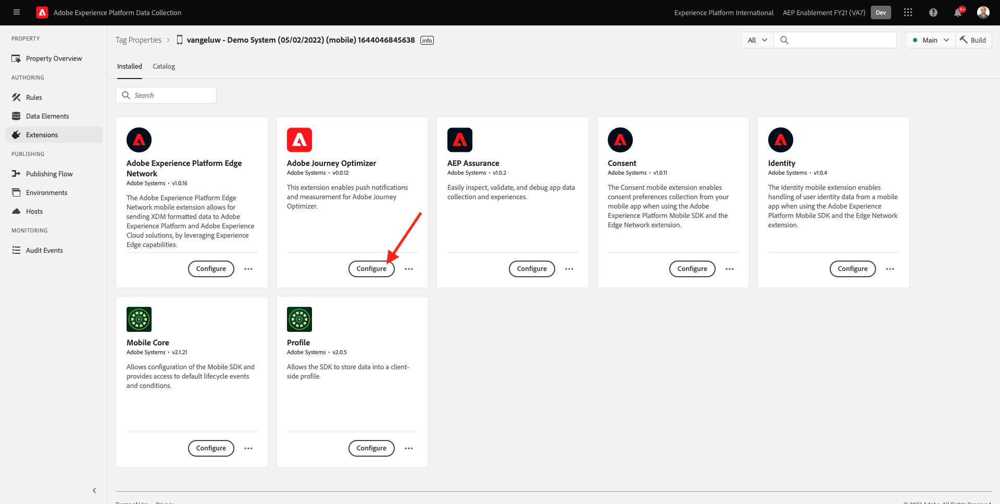
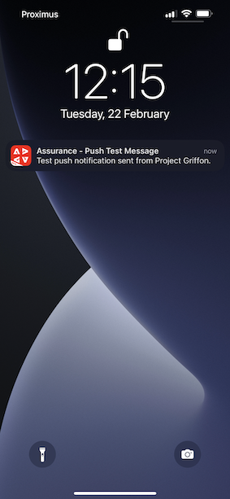
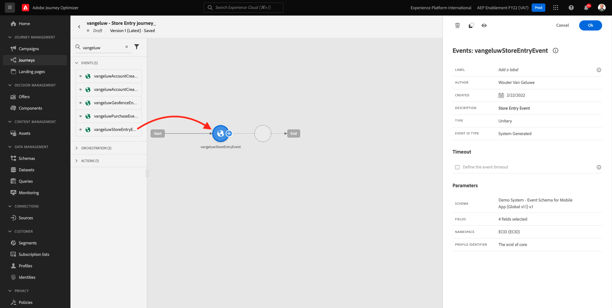
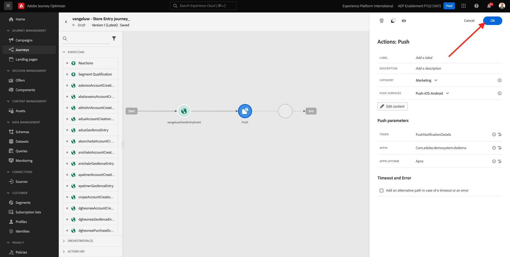
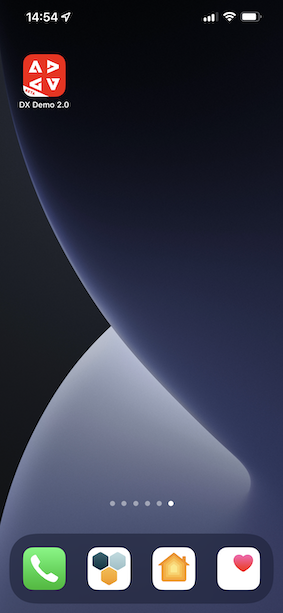

# 10.4 Push-Benachrichtigungen für iOS einrichten und verwenden

Um Push-Benachrichtigungen mit Adobe Journey Optimizer verwenden zu können, müssen Sie eine Reihe von Einstellungen festlegen.

Im Folgenden finden Sie alle zu überprüfenden Einstellungen:

- Datensätze und Schemata in Adobe Experience Platform
- Datenspeicher für Mobilgeräte
- Datenerfassungseigenschaft für Mobilgeräte
- App-Oberfläche für Push-Zertifikate
- Testen Sie Ihr Push-Setup mit AEP Assurance.

Lasst uns diese einzeln überprüfen.

Melden Sie sich bei Adobe Journey Optimizer an, indem Sie [Adobe Experience Cloud](https://experience.adobe.com). Klicken **Journey Optimizer**.

Sie werden zum **Startseite**  in Journey Optimizer anzeigen. Vergewissern Sie sich zunächst, dass Sie die richtige Sandbox verwenden. Die zu verwendende Sandbox heißt `--aepSandboxId--`. Um von einer Sandbox zu einer anderen zu wechseln, klicken Sie auf **PRODUKTIONSPROD (VA7)** und wählen Sie die Sandbox aus der Liste aus. In diesem Beispiel erhält die Sandbox den Namen **AEP-Aktivierung FY22**. Sie sind dann im **Startseite** Ansicht Ihrer Sandbox `--aepSandboxId--`.

## 10.4.1 Push-Datensätze

Adobe Journey Optimizer verwendet Datensätze, um Dinge wie Push-Token von Mobilgeräten oder Interaktionen mit Push-Nachrichten zu speichern (z. B.: Nachricht gesendet, Nachricht geöffnet usw.) in einem Datensatz in Adobe Journey Optimizer gespeichert.

Sie können diese Datensätze finden, indem Sie **[!UICONTROL Datensätze]** im Menü auf der linken Bildschirmseite. Um Systemdatensätze anzuzeigen, klicken Sie auf das Filtersymbol.

Aktivieren Sie die Option **Anzeigen von Systemdatensätzen** und suchen Sie nach **AJO**. Anschließend werden die für Push-Benachrichtigungen verwendeten Datensätze angezeigt.

## 10.4.2 Datenspeicher für Mobilgeräte

Navigieren Sie zu [https://experience.adobe.com/#/data-collection/](https://experience.adobe.com/#/data-collection/).

Gehen Sie im linken Menü zu **[!UICONTROL Datastream]** und suchen Sie nach Ihrem Datenspeicher, den Sie in erstellt haben. [Übung 0.2](./../module0/ex2.md), der `--demoProfileLdap-- - Demo System Datastream (Mobile)`. Klicken Sie auf , um es zu öffnen.

Klicken **Bearbeiten** auf **Adobe Experience Platform** Dienst.

Anschließend werden die definierten Datenspeichereinstellungen angezeigt, in denen Datensätze und Profilattribute gespeichert werden.

Es sind keine Änderungen erforderlich. Ihr Datastream kann jetzt in Ihrer Datenerfassungs-Client-Eigenschaft für Mobile verwendet werden.

## 10.4.3 Überprüfen Sie Ihre Datenerfassungseigenschaft für Mobile

Navigieren Sie zu [https://experience.adobe.com/#/data-collection/](https://experience.adobe.com/#/data-collection/). Als Teil von [Übung 0.1](./../module0/ex1.md), wurden 2 Datenerfassungseigenschaften erstellt.
Sie haben diese Datenerfassungs-Client-Eigenschaften bereits als Teil früherer Module verwendet.

Klicken Sie auf , um die Datenerfassungseigenschaft für Mobilgeräte zu öffnen.

Navigieren Sie in der Datenerfassungseigenschaft zu **Erweiterungen**. Anschließend werden die verschiedenen Erweiterungen angezeigt, die für die mobile App erforderlich sind. Klicken Sie auf , um die Erweiterung zu öffnen. **Adobe Experience Platform Edge Network**.

Dann sehen Sie, dass Ihr Datastream für Mobilgeräte hier verknüpft ist. Klicken Sie anschließend auf **Abbrechen** , um zur Übersicht über Ihre Erweiterungen zurückzukehren.

Du wirst dann wieder hier sein. Sie sehen die Erweiterung für **AEP Assurance**. Mit AEP Assurance können Sie die Datenerfassung und Bereitstellung von Erlebnissen in Ihrer App überprüfen, testen, simulieren und überprüfen. Weitere Informationen zu AEP Assurance und Project Griffon finden Sie hier . [https://aep-sdks.gitbook.io/docs/beta/project-griffon](https://aep-sdks.gitbook.io/docs/beta/project-griffon).

Klicken Sie anschließend auf **Konfigurieren** , um die Erweiterung zu öffnen **Adobe Journey Optimizer**.

Dann sehen Sie, dass der Datensatz für die Verfolgung von Push-Ereignissen hier verknüpft ist.

Sie müssen keine Änderungen an Ihrer Datenerfassungseigenschaft vornehmen.

## 10.4.4 Einrichten der App-Oberfläche überprüfen

Navigieren Sie zu [https://experience.adobe.com/#/data-collection/](https://experience.adobe.com/#/data-collection/). Gehen Sie im linken Menü zu **App-Oberflächen** und &quot;open&quot;, die App-Oberfläche für **DX Demo App-APNS**.

Anschließend wird die konfigurierte App-Oberfläche für iOS und Android angezeigt.

## 10.4.5 Testen der Einrichtung von Push-Benachrichtigungen mithilfe von AEP Assurance.

Sobald die App installiert ist, finden Sie sie auf dem Startbildschirm Ihres Geräts. Klicken Sie auf das Symbol , um die App zu öffnen.

Wenn Sie die App zum ersten Mal verwenden, werden Sie aufgefordert, sich mit Ihrer Adobe ID anzumelden. Schließen Sie den Anmeldevorgang ab.

Nach der Anmeldung wird eine Benachrichtigung angezeigt, in der Sie um Ihre Berechtigung zum Senden von Benachrichtigungen ersucht werden. Wir senden Benachrichtigungen im Rahmen des Tutorials. Klicken Sie daher auf **Zulassen**.

Sie sehen dann die Startseite der App. Navigieren Sie zu **Einstellungen**.

In den Einstellungen sehen Sie, dass derzeit ein **Öffentliches Projekt** in die App geladen wird. Klicken **Benutzerdefiniertes Projekt**.

Sie können jetzt ein benutzerdefiniertes Projekt laden. Klicken Sie auf den QR-Code, um Ihr Projekt einfach zu laden.

Nach Übung 0.1 hatten Sie dieses Ergebnis. Klicken Sie auf , um die **Mobiles Einzelhandelsprojekt** die für Sie erstellt wurde.

Falls Sie Ihr Browser-Fenster versehentlich geschlossen haben oder für zukünftige Demo- oder Aktivierungssitzungen, können Sie auch auf Ihr Website-Projekt zugreifen, indem Sie [https://builder.adobedemo.com/projects](https://builder.adobedemo.com/projects). Nach der Anmeldung bei Ihrer Adobe ID sehen Sie dies. Klicken Sie auf Ihr Mobile-App-Projekt, um es zu öffnen.

Dann wirst du das sehen. Klicken **Integrationen**.

Wählen Sie die Datenerfassungseigenschaft für Mobilgeräte aus, die in Übung 0.1 erstellt wurde. Klicken Sie anschließend auf **Ausführen**.

Dann sehen Sie dieses Popup, das einen QR-Code enthält. Scannen Sie diesen QR-Code aus der Mobile App heraus.

Anschließend wird Ihre Projekt-ID in der App angezeigt. Anschließend können Sie auf **Speichern**.

Gehen Sie zurück zu **Startseite** in der App. Ihre App kann jetzt verwendet werden.

Sie müssen jetzt einen QR-Code scannen, um Ihr mobiles Gerät mit Ihrer AEP Assurance-Sitzung zu verbinden.

Um eine AEP Assurance-Sitzung zu starten, gehen Sie zu [https://experience.adobe.com/#/@experienceplatform/griffon](https://experience.adobe.com/#/@experienceplatform/griffon). Klicken **Sitzung erstellen**.

Klicken Sie auf **Starten**.

Füllen Sie die Werte aus:

- Sitzungsname: use `--demoProfileLdap-- - push debugging` und ersetzen Sie ldap durch Ihren ldap
- Basis-URL: use **dxdemo://default**

Klicken Sie auf **Weiter**.

Daraufhin wird auf Ihrem Bildschirm ein QR-Code angezeigt, den Sie mit Ihrem iOS-Gerät scannen sollten.

Öffnen Sie auf Ihrem Mobilgerät die Kamera-App und scannen Sie den QR-Code, der von AEP Assurance angezeigt wird.

Dann sehen Sie einen Popup-Bildschirm, in dem Sie aufgefordert werden, den PIN-Code einzugeben. Kopieren Sie den PIN-Code aus Ihrem AEP Assurance-Bildschirm und klicken Sie auf **Verbinden**.

Dann wirst du das sehen.

In AEP Assurance sehen Sie jetzt, dass ein Gerät zur AEP Assurance-Sitzung gehört.

Navigieren Sie zu **Push Debug**. Du wirst so etwas sehen.

Einige Erklärungen:

- Die erste Spalte, **Client** zeigt die verfügbaren IDs auf Ihrem iOS-Gerät an. Es werden eine ECID und ein Push-Token angezeigt.
- Die zweite Spalte zeigt **Profil** Informationen mit zusätzlichen Informationen zur Plattform, auf der sich das Push-Token befindet (APNS oder APNSSandbox). Wenn Sie auf die **Inspect-Profil** -Schaltfläche, werden Sie zu Adobe Experience Platform weitergeleitet und erhalten das vollständige Echtzeit-Kundenprofil.
- Die dritte Spalte zeigt die **App-Konfiguration**, das im Rahmen der Übung eingerichtet wurde **10.5.4 App-Konfiguration in Launch erstellen**

Um die Einrichtung Ihrer Push-Konfiguration zu testen, klicken Sie auf das **Push-Benachrichtigung senden** Schaltfläche.

Sie müssen sicherstellen, dass die Variable **DX Demo** Die App ist zum Zeitpunkt des Klicks auf die **Push-Benachrichtigung senden** Schaltfläche. Wenn die App geöffnet ist, wird die Push-Benachrichtigung möglicherweise im Hintergrund empfangen und nicht angezeigt.

Daraufhin wird auf Ihrem Mobilgerät eine Push-Benachrichtigung wie diese angezeigt.

Wenn Sie die Push-Benachrichtigung erhalten haben, bedeutet dies, dass Ihr Setup korrekt ist und ordnungsgemäß funktioniert.

## 10.4.6 Neues Ereignis erstellen

Gehen Sie im Menü zu **Journey-Administration** und klicken Sie auf **Verwalten** under **Veranstaltungen**.

Im **Veranstaltungen** -Bildschirm angezeigt, sehen Sie eine ähnliche Ansicht. Klicken **Ereignis erstellen**.

Anschließend wird eine leere Ereigniskonfiguration angezeigt.

Geben Sie Ihrem Ereignis zunächst einen Namen wie den folgenden: `--demoProfileLdap--StoreEntryEvent` und legen Sie die Beschreibung auf `Store Entry Event`.

Als Nächstes folgt die **Ereignistyp** auswählen. Auswählen **Einzelfall**.

Als Nächstes folgt die **Ereignis-ID-Typ** auswählen. Auswählen **Systemgeneriert**

Als Nächstes folgt die Schemaauswahl. Für diese Übung wurde ein Schema vorbereitet. Bitte verwenden Sie das Schema `Demo System - Event Schema for Mobile App (Global v1.1) v.1`.

Nach Auswahl des Schemas werden im **Nutzlast** Abschnitt. Ihr Ereignis ist jetzt vollständig konfiguriert.

Dann sollten Sie das sehen. Klicken Sie auf **Speichern**.

Ihr Ereignis ist jetzt konfiguriert und gespeichert. Klicken Sie erneut auf Ihr Ereignis, um die **Ereignis bearbeiten** erneut angezeigt.

Bewegen Sie den Mauszeiger über die **Nutzlast** und klicken Sie auf **Payload anzeigen** Symbol.

Sie sehen nun ein Beispiel der erwarteten Payload.

Ihr Ereignis verfügt über eine eindeutige Orchestrierungs-eventID, die Sie finden können, indem Sie in dieser Payload nach unten scrollen, bis Sie `_experience.campaign.orchestration.eventID`.

Die Ereignis-ID muss an Adobe Experience Platform gesendet werden, um die Journey Trigger, die Sie im nächsten Schritt erstellen werden. Notieren Sie sich diese eventID, da Sie sie im nächsten Schritt benötigen werden.
`"eventID": "e3a8f0bdc0b609667cd96a72a6b1e5aafa0ddaf6ccf121c574e6a2030860a633"`

Klicken **Ok**, gefolgt von **Abbrechen**.

## 10.4.7 Journey erstellen

Gehen Sie im Menü zu **Journey** und klicken Sie auf **Journey erstellen**.

Dann wirst du das sehen. Benennen Sie Ihre Journey. Verwenden Sie `--demoProfileLdap-- - Store Entry journey`. Klicken Sie auf **OK**.

Zunächst müssen Sie Ihr Ereignis als Ausgangspunkt Ihrer Journey hinzufügen. Suchen nach Ihrem Ereignis `--demoProfileLdap--StoreEntryEvent` und ziehen Sie es auf die Arbeitsfläche. Klicken Sie auf **OK**.

Weiter, unter **Aktionen**, suchen Sie nach der **Push** Aktion.
Ziehen Sie die **Push** Aktion auf die Arbeitsfläche.

Legen Sie die **Kategorie** nach **Marketing** und wählen Sie eine Push-Oberfläche aus, über die Sie Push-Benachrichtigungen versenden können. In diesem Fall ist die auszuwählende E-Mail-Oberfläche **Push-iOS-Android**.

Der nächste Schritt besteht darin, Ihre Nachricht zu erstellen. Klicken Sie dazu auf **Inhalt bearbeiten**.

Dann wirst du das sehen. Klicken Sie auf **Personalisierung** -Symbol für **Titel** -Feld.

Dann wirst du das sehen. Sie können jetzt jedes Profilattribut direkt aus dem Echtzeit-Kundenprofil auswählen.

Suchen Sie nach dem Feld **Vorname** und klicken Sie dann auf **+** Symbol neben dem Feld **Vorname**. Daraufhin wird das Personalisierungstoken für Vorname hinzugefügt: **{{profile.person.name.firstName}}**.

Fügen Sie als Nächstes den Text hinzu **, willkommen in unserem Geschäft!** hinter **{{profile.person.name.firstName}}**.

Klicken Sie auf **Speichern**.

Das hast du jetzt. Klicken Sie auf **Personalisierung** -Symbol für **body** -Feld.

Text eingeben **Klicken Sie hier, um einen 10% Rabatt zu erhalten, wenn Sie heute kaufen!** und klicken Sie auf **Speichern**.

Dann wirst du das haben. Klicken Sie auf den Pfeil in der oberen linken Ecke, um zu Ihrer Journey zurückzukehren.

Klicken **OK** , um Ihre Push-Aktion zu schließen.

Klicken Sie auf **Veröffentlichen**.

Klicken **Veröffentlichen** erneut.

Ihre Journey ist jetzt veröffentlicht.

## 10.4.8 Journey und Push-Nachricht testen

Wechseln Sie in Ihrer DX Demo 2.0-Mobile-App zum **Einstellungen** angezeigt. Klicken Sie auf **Store Entry** Schaltfläche.

>[!NOTE]
>
>Die **Store Entry** -Schaltfläche derzeit implementiert. Sie werden es noch nicht in der App finden.

Stellen Sie sicher, dass Sie die App sofort schließen, nachdem Sie auf die **Store Entry** angezeigt, da andernfalls die Push-Nachricht nicht angezeigt wird.

Nach einigen Sekunden wird die Nachricht angezeigt.

Du hast diese Übung beendet.

Nächster Schritt: [10.5 Geschäftsereignis-Journey erstellen](./ex5.md)

[Zurück zu Modul 10](./journeyoptimizer.md)

[Zu allen Modulen zurückkehren](../../overview.md)
