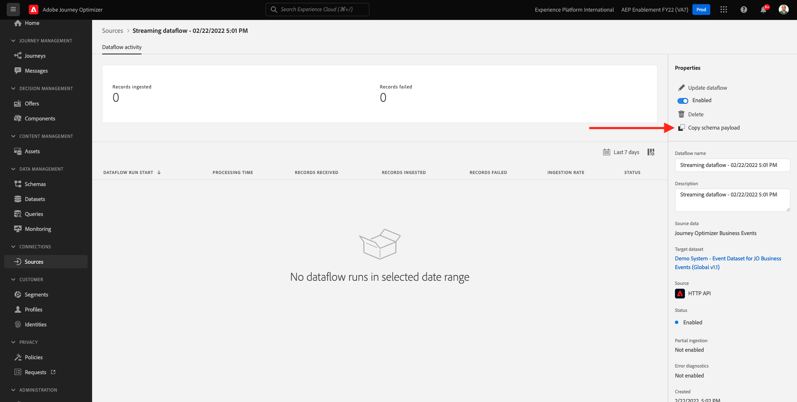

# 10.5 Geschäftsereignis-Journey erstellen

Melden Sie sich bei Adobe Journey Optimizer an, indem Sie [Adobe Experience Cloud](https://experience.adobe.com). Klicken **Journey Optimizer**.


Sie werden zum **Startseite**  in Journey Optimizer anzeigen. Vergewissern Sie sich zunächst, dass Sie die richtige Sandbox verwenden. Die zu verwendende Sandbox heißt `--aepSandboxId--`. Um von einer Sandbox zu einer anderen zu wechseln, klicken Sie auf **PRODUKTIONSPROD (VA7)** und wählen Sie die Sandbox aus der Liste aus. In diesem Beispiel erhält die Sandbox den Namen **AEP-Aktivierung FY22**. Sie sind dann im **Startseite** Ansicht Ihrer Sandbox `--aepSandboxId--`.


## 10.5.1 Geschäftsereignis erstellen

Klicken Sie im linken Menü auf **Konfigurationen**. Klicken Sie auf **Verwalten** -Schaltfläche in der **Veranstaltungen** Karte.


Geschäftsereignisse sind ein neuer Ereignistyp, den Sie in Journey Optimizer erstellen können. Im Gegensatz zu **Einzelfall** -Ereignisse, die Sie in vorherigen Modulen erstellt haben, werden die Geschäftsereignisse nicht vom Kunden, sondern vom Unternehmen ausgelöst. Jetzt erstellen Sie Ihr Geschäftsereignis.

Klicken **Ereignis erstellen**.


Geben Sie die folgenden Werte in das Formular Ereigniserstellung ein:

- **Name**: `--demoProfileLdap--ItemBackInStock`. Beispiel: **vangeluwItemBackInStock**
- **Beschreibung**: Dieses Ereignis wird ausgelöst, wenn ein Produkt wieder auf Lager ist
- **Typ**: select **Unternehmen** in der Dropdown-Liste


Wählen Sie für das Schema die Option **Demosystem - Ereignisschema für JO Business Events (Global v1.1) v.1**. Jetzt müssen Sie die Felder im Schema auswählen, die Sie für unseren Anwendungsfall benötigen.


Führen Sie folgende Schritte aus:

Klicken Sie auf **Bleistift** Symbol auf dem Feld, auf dem **1 Feld ausgewählt**.


Wählen Sie alle verfügbaren Felder im Schema aus und klicken Sie auf **OK**.


Für die Bedingung: müssen Sie angeben, welche Datensätze in diesem Schema das Geschäftsereignis auslösen.

Führen Sie folgende Schritte aus:

Klicken Sie auf **Bleistift** Symbol auf dem Feld, auf dem **Hinzufügen einer Bedingung**.


Erweitern Sie auf der linken Seite die `--aepTenantId--` Objekt, Objekt erweitern **joBusinessEvents** und ziehen Sie das Feld per Drag-and-Drop **eventName** auf die Arbeitsfläche.


Für das Feld **eventName** Geben Sie den folgenden Wert ein: `--demoProfileLdap--ItemBackInStock`. Beispiel: vangeluwItemBackInStock.
Klicken Sie auf **OK**.


Klicken Sie auf **OK**.


Schließlich sollte Ihr Formular zur Ereigniserstellung wie folgt aussehen: Klicken **Speichern** , um Ihr Geschäftsereignis zu speichern.


## 10.5.2 Geschäftsereignis-Journey erstellen

Sie können dieses Geschäftsereignis und die Nachricht jetzt in einer Journey nutzen. Navigieren Sie zu **Journey**. Klicken **Journey erstellen**.


Auf der rechten Seite sehen Sie ein Formular, in dem Sie den Journey-Namen und die Beschreibung angeben müssen. Geben Sie die folgenden Werte ein:

- **Name**: `--demoProfileLdap-- - Item back in stock journey`. Beispiel: vangeluw - Rücksendungen an Lager Journey
- **Beschreibung**: Diese Journey sendet eine SMS, wenn ein Artikel wieder auf Lager ist, an Besucher, die Interesse gezeigt haben.

Klicken Sie auf **OK**.


Im linken Menü unter **Veranstaltungen**, suchen Sie nach Ihrem ldap. Sie finden das zuvor erstellte Geschäftsereignis `--demoProfileLdap--ItemBackInStock`. Ziehen Sie dieses Ereignis auf die Arbeitsfläche, da dies der Ausgangspunkt der Journey sein wird.


Wie Sie sehen können, ist eine **Segment lesen** -Aktivität wurde der Arbeitsfläche automatisch hinzugefügt. Dies liegt daran, dass die Geschäftsereignisse nur einen Trigger senden, damit der Journey ein bestimmtes Segment liest, wodurch die Profilliste für diese Journey abgerufen wird.

Klicken Sie auf **Segment lesen** Aktivität.
Die **Segment lesen** -Konfiguration erwartet, dass Sie das Segment auswählen, das Sie über das gerade eingetretene Geschäftsereignis benachrichtigen möchten. Klicken Sie auf **Segment auswählen** -Feld.


Im **Segment auswählen** Popup, suchen Sie nach Ihrem ldap und wählen Sie das Segment aus, das Sie in erstellt haben. [Modul 6: Echtzeit-Kundendatenplattform - Erstellen eines Segments und Ergreifen von Aktionen](../module6/real-time-cdp-build-a-segment-take-action.md) benannt `--demoProfileLdap-- - Interest in PROTEUS FITNESS JACKSHIRT`. Beispiel: vangeluw - Interesse an PROTEUS FITNESS JACKSHIRT. Klicken Sie auf **Speichern**.


Klicken Sie anschließend auf **Ok**.


Der nächste Schritt besteht darin, die gewünschte Aktion per Drag-and-Drop in diese Journey zu ziehen. Aktion auswählen **SMS** und ziehen Sie es dann nach der soeben hinzugefügten Bedingung per Drag-and-Drop.


Legen Sie die **Kategorie** nach **Marketing** und wählen Sie eine SMS-Oberfläche aus, über die Sie SMS versenden können. In diesem Fall ist die auszuwählende E-Mail-Oberfläche **SMS**.


Der nächste Schritt besteht darin, Ihre Nachricht zu erstellen. Klicken Sie dazu auf **Inhalt bearbeiten**.


Jetzt wird das Nachrichten-Dashboard angezeigt, in dem Sie den Text Ihrer SMS konfigurieren können. Klicken Sie auf **Nachricht erstellen** Bereich, um Ihre Nachricht zu erstellen.


Geben Sie folgenden Text ein: `Hi {{profile.person.name.firstName}}, the Proteus Fitness Jackshirt is back in stock at Luma.`. Klicken Sie auf **Speichern**.


Gehen Sie zum Nachrichten-Dashboard zurück, indem Sie auf die Schaltfläche **Pfeil** neben dem Betreffzeilentext in der oberen linken Ecke.


Jetzt sehen Sie Ihre abgeschlossene SMS-Aktion. Klicken Sie auf **OK**.


Ihre Journey kann jetzt veröffentlicht werden. Klicken Sie auf **Veröffentlichen**.


Klicken **Veröffentlichen** erneut.


Ihre Journey ist jetzt veröffentlicht, können Sie sie jetzt testen!


## 10.5.3 Testen der Journey Ihres Geschäftsereignisses

Sie simulieren nun die Neuvorräte eines Produkts, indem Sie ein neues Ereignis mit dem **Demosystem - Ereignisschema für JO Business Events (Global v1.1) v.1** Postman verwenden.

Klicken Sie im linken Menü auf **Quellen** und klicken Sie dann auf **Konten** Registerkarte.


Im **Konten** -Tab, finden Sie das Konto mit dem Namen **Journey Optimizer Business Events**. Klicken Sie darauf, um es zu öffnen.


Dieses Konto hat nur einen Datenfluss, klicken Sie auf den Namen des Datenflusses, um ihn auszuwählen.


Klicken **Schema-Payload kopieren** im rechten Menü. Mit dieser Option wird die gesamte **curl** -Befehl zum Einfügen eines Datensatzes gegen die **Demosystem - Ereignisschema für JO Business Events (Global v1.1) v.1** in die Zwischenablage.



Fügen Sie den Befehl &quot;Curl&quot;in einen Texteditor ein.


Sehen wir uns diese Anfrage genauer an,

- Die POST-Anfrage wird an die DCS-Inlet-ID gesendet
- Die Anfrage verweist auf das Schema, den Datensatz und die Organisations-ID.
- Schließlich enthält es den Knoten xdmEntity , der die Daten darstellt, die wir im Datensatz erstellen möchten.

Sie müssen jetzt Folgendes ersetzen: `xdmEntity` Linie...

```json
"xdmEntity": {
  "_experienceplatform": {
    "joBusinessEvents": {
      "eventDescription": "string",
      "eventName": "string",
      "stockEventId": "string"
    }
  },
  "_id": "/uri-reference",
  "eventType": "advertising.completes",
  "timestamp": "2018-11-12T20:20:39+00:00"
}
```

...Überprüfen Sie anhand dieser Zeile das Feld eventName wie gewünscht. `--demoProfileLdap--ItemBackInStock`, der die Bedingung darstellt, die Sie in Ihrem Geschäftsereignis für den Trigger Ihrer Journey angegeben haben.

```json
"xdmEntity": {
  "_experienceplatform": {
    "joBusinessEvents": {
      "eventDescription": "Product Proteus Fitness Jackshirt is back in stock",
      "eventName": "--demoProfileLdap--ItemBackInStock",
      "stockEventId": "1"
    }
  },
  "_id": "/uri-reference",
  "eventType": "productBackInStock",
  "timestamp": "2021-04-19T15:25:39+00:00"
}
```

Die aktualisierten **curl** -Befehl sollte wie folgt aussehen:


Wählen Sie alles aus und kopieren Sie es in die Zwischenablage.

Öffnen Sie Postman. Klicken Sie links in Postman auf **Import**.


Wählen Sie die **Rohtext** und fügen Sie den zuvor kopierten Befehl ein. Klicken Sie auf **Weiter**.


Klicken Sie auf **Importieren**.


Postman hat die **curl** in einen REST-Befehl ein, der ausgelöst werden kann, drücken Sie einfach die **Senden** -Schaltfläche, um die Erstellung dieses Datensatzes im Datensatz anzufordern.


Überprüfen Sie, ob Ihre Anfrage erfolgreich empfangen wurde. Suchen Sie nach einer **200 OK** Status in Postman.


Es kann einige Minuten dauern, bis die SMS auf Ihrem Mobiltelefon ankommt. Wenn dies nicht der Fall ist, wird Ihr **Interesse am Proteus Fitness Jackshirt** -Segment enthält möglicherweise kein Profil mit einem korrekten Mobiltelefon. Wenn ja, besuchen Sie auf der Luma-Website die **Proteus Fitness Jackshirt** und registrieren Sie sich, während Sie sicherstellen, dass Sie die richtige Mobiltelefonnummer angeben.


Du bist jetzt mit dieser Übung fertig.

Nächster Schritt: [Zusammenfassung und Vorteile](./summary.md)

[Zurück zu Modul 10](./journeyoptimizer.md)

[Zu allen Modulen zurückkehren](../../overview.md)
