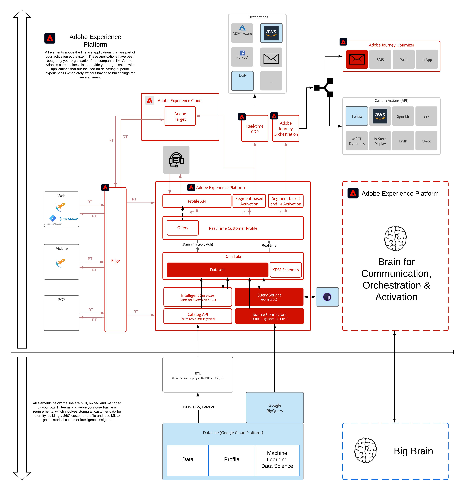

# 12. Erfassen und Analysieren von Google Analytics-Daten in Adobe Experience Platform mit dem BigQuery Source Connector

**Autoren: [Victor de la Iglesia](https://www.linkedin.com/in/victordelaiglesia/), [Wouter Van Geluwe](https://www.linkedin.com/in/woutervangeluwe/)**

In diesem Modul richten Sie Ihre eigene Instanz von Google Cloud Platform ein, laden Beispieldaten in Google Cloud Platform und verwenden dann den BigQuery Source Connector, um diese Daten von Google Cloud Platform in Adobe Experience Platform aufzunehmen. Schließlich verwenden Sie Customer Journey Analytics, um diese Daten zu visualisieren.

Quell-Connectoren in Adobe Experience Platform erleichtern die Datenübernahme in Adobe Experience Platform. Google BigQuery ist einer der bereits verfügbaren Connectoren. Dank Adobe Experience Platform und BigQuery Source Connector können wir jetzt Google Analytics-Daten in Analysis Workspace in Customer Journey Analytics importieren.

Darüber hinaus können wir die Daten dieser Google Analytics anreichern, indem wir sie mit anderen Datenquellen wie CRM-, Callcenter- oder Treuedaten in Customer Journey Analytics verbinden.

## Lernziele

- Kennenlernen der Google Cloud-Plattform und der BigQuery-Benutzeroberfläche
- Aufnehmen von Daten aus Google Analytics in Adobe Experience Platform
- Verwenden von Customer Journey Analytics für die Analyse von Google Analytics-Daten
- Anreicherung von Google Analytics-Daten mit Offline-Daten

## Voraussetzungen

- Es wird empfohlen, mit Customer Journey Analytics vertraut zu sein, dies ist jedoch nicht erforderlich
- Zugriff auf Adobe Experience Platform: [https://experience.adobe.com/platform](https://experience.adobe.com/platform)
- Zugriff auf Customer Journey Analytics
- Zugriff auf Google Cloud Platform und Google BigQuery
- **Herunterladen dieser Assets**:
   - [JSON - Beispieldaten: Treuedaten](./../../assets/json/bqLoyalty.json)

>[!IMPORTANT]
>
>Dieses Tutorial wurde erstellt, um ein bestimmtes Workshop-Format zu vereinfachen. Es verwendet bestimmte Systeme und Konten, auf die Sie möglicherweise keinen Zugriff haben. Auch ohne Zugriff können Sie noch viel lernen, indem Sie diesen sehr detaillierten Inhalt durchlesen. Wenn Sie an einem der Workshops teilnehmen und Ihre Zugangsdaten benötigen, wenden Sie sich an Ihren Kundenbetreuer, der Ihnen die erforderlichen Informationen zur Verfügung stellt.

## Architekturüberblick

Sehen Sie sich die folgende Architektur an, in der die Komponenten hervorgehoben werden, die in diesem Modul besprochen und verwendet werden.

## Sandbox zur Verwendung

Verwenden Sie für dieses Modul diese Sandbox: `--aepSandboxId--`.

>[!NOTE]
>
>Vergessen Sie nicht, die Chrome-Erweiterung zu installieren, zu konfigurieren und zu verwenden, wie unter [0.1 - Installieren der Chrome-Erweiterung für die Dokumentation zur Experience League](../module0/ex1.md)

## Übungen

[12.1 Google Cloud Platform-Konto erstellen](./ex1.md)

Erstellen Sie Ihr Google Cloud Platform-Konto.

[12.2 Erste Abfrage in BigQuery erstellen](./ex2.md)

Erfahren Sie, wie Sie BigQuery verwenden, um die Daten für das Laden in Platform vorzubereiten.

[12.3 GCP und BigQuery mit Adobe Experience Platform verbinden](./ex3.md)

Erfahren Sie, wie Sie den Quell-Connector in Adobe Experience Platform einrichten.

[12.4 Daten aus BigQuery in Adobe Experience Platform laden](./ex4.md)

Erfahren Sie, wie Sie den Quell-Connector BigQuery in Adobe Experience Platform für die Aufnahme Ihrer Google Analytics-Daten konfigurieren.

[12.5 Google Analytics-Daten mithilfe von Customer Journey Analytics analysieren](./ex5.md)

Erfahren Sie, wie Sie Google Analytics-Daten in Customer Journey Analytics analysieren und mit Loyalitätsdaten kombinieren.

[Zusammenfassung und Vorteile](./summary.md)

Zusammenfassung dieses Moduls und Übersicht über die Vorteile.

>[!NOTE]
>
>Vielen Dank, dass Sie Ihre Zeit investiert haben, um alles über Adobe Experience Platform zu erfahren. Wenn Sie Fragen haben, möchten allgemeine Rückmeldungen von Vorschlägen zu künftigen Inhalten teilen, wenden Sie sich bitte direkt an Wouter Van Geluwe, indem Sie eine E-Mail an **vangeluw@adobe.com**.

[Zu allen Modulen zurückkehren](../../overview.md)
