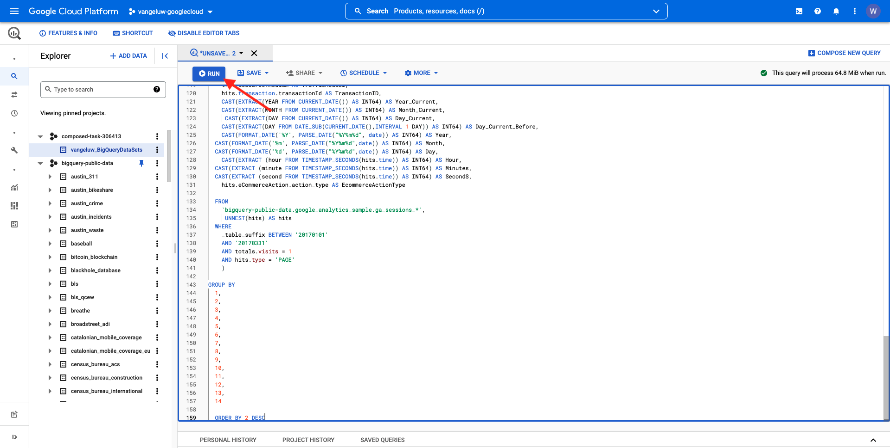

# 12.2 Erste Abfrage in BigQuery erstellen

## Ziele

- BigQuery-Benutzeroberfläche
- SQL-Abfrage in BigQuery erstellen
- Speichern Sie die Ergebnisse Ihrer SQL-Abfrage in einem Datensatz in BigQuery

## Kontext

Wenn Google Analytics-Daten in BigQuery vorliegen, werden Dimensionen, Metriken und andere Variablen verschachtelt. Außerdem werden die Daten der Google Analytics täglich in verschiedene Tabellen geladen. Das bedeutet, dass der Versuch, Google Analytics-Tabellen in BigQuery direkt mit Adobe Experience Platform zu verbinden, sehr schwierig ist und keine gute Idee ist.

Die Lösung dieses Problems besteht darin, die Daten von Google Analytics in ein lesbares Format umzuwandeln, um die Aufnahme in Adobe Experience Platform zu erleichtern.

## 12.2.1 Datensatz zum Speichern neuer BigQuery-Tabellen erstellen

Navigieren Sie zu [BigQuery-Konsole](https://console.cloud.google.com/bigquery).


In **Explorer** angezeigt wird, sehen Sie Ihre Projekt-ID. Klicken Sie auf Ihre Projekt-ID (klicken Sie nicht auf die **bigquery-public-data** Datensatz).


Sie können sehen, dass es noch keinen Datensatz gibt. Erstellen wir jetzt einen.
Klicken **DATENSATZ ERSTELLEN**.


Auf der rechten Bildschirmseite sehen Sie die **Datensatz erstellen** Menü.


Für **Datensatz-ID** verwenden Sie die folgende Namenskonvention. Für die anderen Felder behalten Sie die Standardeinstellungen bei.

| Namenskonvention | Beispiel |
| ----------------- | ------------- | 
| `--demoProfileLdap--_BigQueryDataSets` | vangeluw_BigQueryDataSets |


Klicken Sie anschließend auf **Datensatz erstellen**.


Sie befinden sich dann wieder in der BigQuery-Konsole, nachdem Sie Ihren Datensatz erstellt haben.


## 12.2.2 Erste SQL BigQuery erstellen

Als Nächstes erstellen Sie Ihre erste Abfrage in BigQuery. Ziel dieser Abfrage ist es, die Beispieldaten der Google Analytics zu nehmen und umzuwandeln, damit sie in Adobe Experience Platform aufgenommen werden können. Navigieren Sie zu **EDITOR** Registerkarte.


Kopieren Sie die folgende SQL-Abfrage und fügen Sie sie in den Abfrage-Editor ein. Lesen Sie die Abfrage und verstehen Sie die BigQuery-Syntax von Google Analytics.


```sql
SELECT
  CONCAT(fullVisitorId, CAST(hitTime AS String), '-', hitNumber) AS _id,
  TIMESTAMP(DATETIME(Year_Current, Month_Current, Day_Current, Hour, Minutes, Seconds)) AS timeStamp,
  fullVisitorId as GA_ID,
  -- Fake CUSTOMER ID
  CONCAT('3E-D4-',fullVisitorId, '-1W-93F' ) as customerID,
  Page,
  Landing_Page,
  Exit_Page,
  Device,
  Browser,
  MarketingChannel,
  TrafficSource,
  TrafficMedium,
  -- Enhanced Ecommerce
  TransactionID,
  CASE
      WHEN EcommerceActionType = '2' THEN 'Product_Detail_Views'
      WHEN EcommerceActionType = '3' THEN 'Adds_To_Cart'
      WHEN EcommerceActionType = '4' THEN 'Product_Removes_From_Cart'
      WHEN EcommerceActionType = '5' THEN 'Product_Checkouts'
      WHEN EcommerceActionType = '6' THEN 'Product_Refunds'
    ELSE
    NULL
  END
     AS Ecommerce_Action_Type,
  -- Entrances (metric)
  SUM(CASE
      WHEN isEntrance = TRUE THEN 1
    ELSE
    0
  END
    ) AS Entries,
    
--Pageviews (metric)
    COUNT(*) AS Pageviews,
    
 -- Exits 
    SUM(
    IF
      (isExit IS NOT NULL,
        1,
        0)) AS Exits,
        
 --Bounces
   SUM(CASE
      WHEN isExit = TRUE AND isEntrance = TRUE THEN 1
    ELSE
    0
  END
    ) AS Bounces,
        
  -- Unique Purchases (metric)
  COUNT(DISTINCT TransactionID) AS Unique_Purchases,
  -- Product Detail Views (metric)
  COUNT(CASE
      WHEN EcommerceActionType = '2' THEN fullVisitorId
    ELSE
    NULL
  END
    ) AS Product_Detail_Views,
  -- Product Adds To Cart (metric)
  COUNT(CASE
      WHEN EcommerceActionType = '3' THEN fullVisitorId
    ELSE
    NULL
  END
    ) AS Adds_To_Cart,
  -- Product Removes From Cart (metric)
  COUNT(CASE
      WHEN EcommerceActionType = '4' THEN fullVisitorId
    ELSE
    NULL
  END
    ) AS Product_Removes_From_Cart,
  -- Product Checkouts (metric)
  COUNT(CASE
      WHEN EcommerceActionType = '5' THEN fullVisitorId
    ELSE
    NULL
  END
    ) AS Product_Checkouts,
  -- Product Refunds (metric)
  COUNT(CASE
      WHEN EcommerceActionType = '7' THEN fullVisitorId
    ELSE
    NULL
  END
    ) AS Product_Refunds
  FROM (
  SELECT
    -- Landing Page (dimension)
    CASE
      WHEN hits.isEntrance = TRUE THEN hits.page.pageTitle
    ELSE NULL
  END
    AS Landing_page,
    
        -- Exit Page (dimension)
    CASE
      WHEN hits.isExit = TRUE THEN hits.page.pageTitle
    ELSE
    NULL
  END
    AS Exit_page,
    
    hits.page.pageTitle AS Page,
    hits.isEntrance,
    hits.isExit,
    hits.hitNumber as hitNumber,
    hits.time as hitTime,
    date as Fecha,
    fullVisitorId,
    visitStartTime,
    device.deviceCategory AS Device,
    device.browser AS Browser,
    channelGrouping AS MarketingChannel,
    trafficSource.source AS TrafficSource,
    trafficSource.medium AS TrafficMedium,
    hits.transaction.transactionId AS TransactionID,
    CAST(EXTRACT(YEAR FROM CURRENT_DATE()) AS INT64) AS Year_Current,
    CAST(EXTRACT(MONTH FROM CURRENT_DATE()) AS INT64) AS Month_Current,
     CAST(EXTRACT(DAY FROM CURRENT_DATE()) AS INT64) AS Day_Current,
    CAST(EXTRACT(DAY FROM DATE_SUB(CURRENT_DATE(),INTERVAL 1 DAY)) AS INT64) AS Day_Current_Before,
    CAST(FORMAT_DATE('%Y', PARSE_DATE("%Y%m%d", date)) AS INT64) AS Year,
  CAST(FORMAT_DATE('%m', PARSE_DATE("%Y%m%d",date)) AS INT64) AS Month,
  CAST(FORMAT_DATE('%d', PARSE_DATE("%Y%m%d",date)) AS INT64) AS Day,
    CAST(EXTRACT (hour FROM TIMESTAMP_SECONDS(hits.time)) AS INT64) AS Hour,
  CAST(EXTRACT (minute FROM TIMESTAMP_SECONDS(hits.time)) AS INT64) AS Minutes,
  CAST(EXTRACT (second FROM TIMESTAMP_SECONDS(hits.time)) AS INT64) AS SecondS,
    hits.eCommerceAction.action_type AS EcommerceActionType
  
  FROM
    `bigquery-public-data.google_analytics_sample.ga_sessions_*`,
     UNNEST(hits) AS hits
  WHERE
    _table_suffix BETWEEN '20170101'
    AND '20170331'
    AND totals.visits = 1
    AND hits.type = 'PAGE'
    )
    
GROUP BY
  1,
  2,
  3,
  4,
  5,
  6,
  7,
  8,
  9,
  10,
  11,
  12,
  13,
  14
    
  ORDER BY 2 DESC
```

Wenn Sie bereit sind, klicken Sie auf **Ausführen** , um die Abfrage auszuführen:



Die Ausführung der Abfrage kann einige Minuten dauern.

Sobald die Abfrage ausgeführt wurde, sehen Sie die folgende Ausgabe in der **Abfrageergebnisse**.


## 12.2.3 Speichern Sie die Ergebnisse Ihrer BigQuery SQL-Abfrage

Der nächste Schritt besteht darin, die Ausgabe Ihrer Abfrage zu speichern, indem Sie auf die **ERGEBNISSE SPEICHERN** Schaltfläche.


Wählen Sie als Speicherort für die Ausgabe **BigQuery-Tabelle**.


Sie sehen dann ein neues Popup, in dem Ihre **Projektname** und **Datensatzname** vorausgefüllt sind. Der Datensatzname sollte der Datensatz sein, den Sie zu Beginn dieser Übung anhand dieser Namenskonvention erstellt haben:

| Namenskonvention | Beispiel |
| ----------------- | ------------- | 
| `--demoProfileLdap--_BigQueryDataSets` | `vangeluw_BigQueryDataSets` |

Jetzt müssen Sie einen Tabellennamen eingeben. Bitte verwenden Sie diese Namenskonvention:

| Namenskonvention | Beispiel |
| ----------------- |------------- | 
| `--demoProfileLdap--_GAdataTableBigQuery` | `vangeluw_GAdataTableBigQuery` |


Klicken Sie auf **Speichern**.

Es kann einige Zeit dauern, bis die Daten in der von Ihnen erstellten Tabelle bereit sind. Aktualisieren Sie den Browser nach einigen Minuten. Anschließend sollte in Ihrem Datensatz die `--demoProfileLdap--_GAdataTableBigquery` Tabelle unter **Explorer** in Ihrem BigQuery-Projekt.


Sie fahren nun mit der nächsten Übung fort, in der Sie diese Tabelle mit Adobe Experience Platform verbinden werden.

Nächster Schritt: [12.3 GCP und BigQuery mit Adobe Experience Platform verbinden](./ex3.md)

[Zurück zu Modul 12](./customer-journey-analytics-bigquery-gcp.md)

[Zu allen Modulen zurückkehren](./../../overview.md)
