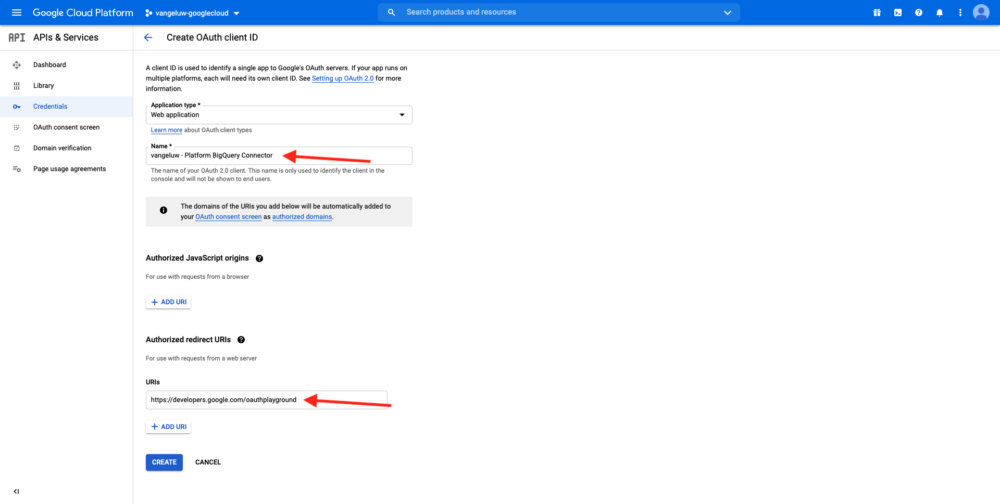

# 12.3 GCP und BigQuery mit Adobe Experience Platform verbinden

## Ziele

- API und Dienste in Google Cloud Platform
- Machen Sie sich mit OAuth Playground vertraut, um Google-APIs zu testen.
- Erstellen der ersten BigQuery-Verbindung in Adobe Experience Platform

## Kontext

Adobe Experience Platform bietet einen Connector in **Quellen** wird Ihnen dabei helfen, BigQuery-Datensätze in Adobe Experience Platform zu importieren. Dieser Data Connector basiert auf der Google BigQuery-API. Daher ist es wichtig, Ihre Google Cloud-Plattform und Ihre BigQuery-Umgebung ordnungsgemäß darauf vorzubereiten, API-Aufrufe von Adobe Experience Platform zu empfangen.

Zum Konfigurieren des BigQuery Source Connectors in Adobe Experience Platform benötigen Sie die folgenden vier Werte:

- Projekt
- clientId
- clientSecret
- refreshToken

Bisher gibt es nur den ersten **Projekt-ID**. Diese **Projekt-ID** ist eine zufällige ID, die von Google bei der Erstellung Ihres BigQuery-Projekts in Übung 12.1 generiert wurde.

Kopieren Sie die Projekt-ID in eine separate Textdatei.

| Anmeldedaten | Namenskonvention | Beispiel |
| ----------------- |-------------| -------------|
| Projekt-ID | random | created-task-306413 |

Sie können Ihre Projekt-ID jederzeit überprüfen, indem Sie auf Ihre **Projektname** in der oberen Menüleiste:

Auf der rechten Seite sehen Sie die Projekt-ID:

In dieser Übung erfahren Sie, wie Sie die anderen 3 erforderlichen Felder abrufen:

- clientId
- clientSecret
- refreshToken

## 12.3.1 Google Cloud-API und -Dienste

Gehen Sie zunächst zur Startseite der Google Cloud Platform zurück. Klicken Sie dazu einfach auf das Logo oben links im Bildschirm.

Sobald Sie sich auf der Startseite befinden, wechseln Sie zum linken Menü und klicken Sie auf **APIs und Dienste**, klicken Sie auf **Dashboard**.

Sie werden jetzt die **APIs und Dienste** homepage.

Auf dieser Seite können Sie die Nutzung Ihrer verschiedenen Google API-Verbindungen sehen. Führen Sie die folgenden Schritte aus, um eine API-Verbindung einzurichten, damit Adobe Experience Platform aus BigQuery lesen kann:

- Zunächst müssen Sie einen OAuth-Einverständnisbildschirm erstellen, um zukünftige Authentifizierungen zu ermöglichen. Aus Sicherheitsgründen von Google ist es auch erforderlich, dass ein Mensch die erste Authentifizierung durchführt, bevor ein programmatischer Zugriff erlaubt ist.
- Außerdem benötigen Sie API-Anmeldeinformationen (clientId und clientSecret), die für die API-Authentifizierung und den Zugriff auf Ihren BigQuery Connector verwendet werden.

## 12.3.2 OAuth-Einverständnisbildschirm

Beginnen wir mit der Erstellung des OAuth-Einverständnisbildschirms. Im linken Menü auf der **APIs und Dienste** homepage, click **OAuth-Einverständnisbildschirm**.

Daraufhin sehen Sie Folgendes:

Wählen Sie den Benutzertyp aus: **Externe**. Klicken Sie anschließend auf **ERSTELLEN**.

Sie werden dann auf der **OAuth Consent Screen-Konfiguration** Fenster.

Hier müssen Sie lediglich den Namen des Zustimmungsbildschirms im **Anwendungsname** und wählen Sie die **Benutzerunterstützungs-E-Mail**. Verwenden Sie für den Anwendungsnamen die folgende Benennungsregel:

| Namenskonvention | Beispiel |
| ----------------- |-------------| 
| `--demoProfileLdap-- - AEP BigQuery Connector` | vangeluw - AEP BigQuery Connector |

Scrollen Sie als Nächstes nach unten, bis Sie **Kontaktdaten für Entwickler** und geben Sie eine E-Mail-Adresse ein.

Klicken **SPEICHERN UND FORTFAHREN**.

Dann wirst du das sehen. Klicken **SPEICHERN UND FORTFAHREN**.

Dann wirst du das sehen. Klicken **SPEICHERN UND FORTFAHREN**.

Dann wirst du das sehen. Klicken **ZURÜCK ZUM DASHBOARD**.

Dann wirst du das sehen. Klicken **VERÖFFENTLICHEN DER APP**.

Klicken **BESTÄTIGEN**.

Dann wirst du das sehen.

Im nächsten Schritt werden Sie die API-Einrichtung abschließen und Ihre API-Anmeldeinformationen abrufen.

## 12.3.3 Google API-Anmeldeinformationen: Client-Geheimnis und Client-ID

Klicken Sie im linken Menü auf **Anmeldeinformationen**. Daraufhin sehen Sie Folgendes:

Klicken Sie auf **+ ANMELDEDATEN ERSTELLEN** Schaltfläche.

Sie werden drei Optionen sehen. Klicken Sie auf **OAuth-Client-ID**:

Wählen Sie im nächsten Bildschirm **Webanwendung**.

Es werden mehrere neue Felder angezeigt. Sie müssen nun die **Name** der OAuth-Client-ID und geben Sie außerdem die **Autorisierte Umleitungs-URIs**.

Befolgen Sie diese Benennungskonvention:

| Feld | Wert | Beispiel |
| ----------------- |-------------| -------------| 
| Name | ldap - AEP BigQuery Connector | vangeluw - Platform BigQuery Connector |
| Autorisierte Umleitungs-URIs | https://developers.google.com/oauthplayground | https://developers.google.com/oauthplayground |

Die **Autorisierte Umleitungs-URIs** -Feld ist ein sehr wichtiges Feld, da Sie es später benötigen werden, um das RefreshToken zu erhalten, das Sie benötigen, um die Einrichtung des BigQuery Source Connectors in Adobe Experience Platform abzuschließen.

Bevor Sie fortfahren, müssen Sie die **Eingabe** Schaltfläche nach Eingabe der URL zum Speichern des Werts im **Autorisierte Umleitungs-URIs** -Feld. Wenn Sie nicht auf die **Eingabe** -Schaltfläche, werden Sie zu einem späteren Zeitpunkt in der **OAuth 2.0 Playground**.

Klicken Sie anschließend auf **Erstellen**:

Jetzt sehen Sie Ihre Client-ID und Ihr Client-Geheimnis.

Kopieren Sie diese beiden Felder und fügen Sie sie in eine Textdatei auf Ihrem Desktop ein. Sie können auf diese Anmeldedaten immer zu einem späteren Zeitpunkt zugreifen. Es ist jedoch einfacher, sie in einer Textdatei neben Ihrer BigQuery Project-ID zu speichern.

Die folgenden Werte sind jetzt bereits verfügbar, da dies für Ihre BigQuery Source Connector-Einrichtung in Adobe Experience Platform erforderlich ist:

| BigQuery Connector-Anmeldedaten | Wert |
| ----------------- |-------------| 
| Projekt-ID | Ihre eigene Projekt-ID (z. B.: created-task-306413) |
| clientid | yourclientid |
| clientsecret | yourclientsecret |

Sie vermissen immer noch die **refreshToken**. Das refreshToken ist aus Sicherheitsgründen eine Anforderung. In der Welt der APIs laufen Token normalerweise alle 24 Stunden ab. Also **refreshToken** ist erforderlich, um das Sicherheits-Token alle 24 Stunden zu aktualisieren, damit Ihr Source Connector-Setup weiterhin eine Verbindung zu Google Cloud Platform und BigQuery herstellen kann.

## 12.3.4 BigQuery-API und der refreshToken

Es gibt viele Möglichkeiten, ein refreshToken für den Zugriff auf Google Cloud Platform-APIs abzurufen. Eine dieser Optionen ist beispielsweise die Verwendung von Postman.
Google hat jedoch etwas einfacher entwickelt, um ihre APIs zu testen und mit ihnen zu spielen, ein Tool namens **OAuth 2.0 Playground**.

So greifen Sie auf **OAuth 2.0 Playground**, gehen Sie zu [https://developers.google.com/oauthplayground](https://developers.google.com/oauthplayground).

Sie werden dann die **OAuth 2.0 Playground** homepage.

Klicken Sie auf **Zahnrad** rechts oben auf dem Bildschirm:

Stellen Sie sicher, dass Ihre Einstellungen mit denen im Bild oben übereinstimmen.

Überprüfen Sie, ob die Einstellungen zu 100 % sicher sind.

Wenn Sie fertig sind, aktivieren Sie das Kontrollkästchen von **Verwenden Ihrer eigenen OAuth-Anmeldeinformationen**

Es sollten zwei Felder angezeigt werden, für die Sie den Wert haben.

Bitte füllen Sie die Felder in dieser Tabelle aus:

| Einstellungen der Player-API | Ihre Google API-Anmeldeinformationen |
| ----------------- |-------------| 
| OAuth-Client-ID | Ihre eigene Client-ID (in der Textdatei auf Ihrem Desktop) |
| OAuth Client Secret | Ihr eigenes Client-Geheimnis (in der Textdatei auf Ihrem Desktop) |

Kopieren Sie die **Client-ID** und **Client Secret** aus der Textdatei, die Sie auf Ihrem Desktop erstellt haben.

Nachdem Sie Ihre Anmeldedaten ausgefüllt haben, klicken Sie auf **Schließen**

Im linken Menü sehen Sie alle verfügbaren Google-APIs. Suchen Sie nach **BigQuery API v2**.

Wählen Sie dann den Umfang wie in der folgenden Abbildung angegeben aus:

Nachdem Sie sie ausgewählt haben, sollte eine blaue Schaltfläche angezeigt werden, auf der **APIs autorisieren**. Klicken Sie darauf.

Wählen Sie das Google-Konto aus, das Sie zum Einrichten von GCP und BigQuery verwendet haben.

Möglicherweise wird eine große Warnung angezeigt: **Diese App ist nicht verifiziert**. Dies geschieht, weil Ihr Platform BigQuery-Connector noch nicht offiziell überprüft wurde. Google weiß also nicht, ob es sich um eine authentische App handelt oder nicht. Sie sollten diese Benachrichtigung ignorieren.

Klicken **Erweitert**.

Klicken Sie anschließend auf **Gehen Sie zu ldap - AEP BigQuery Connector (unsicher)**.

Sie werden zu unserem OAuth-Einverständnisbildschirm weitergeleitet, den Sie erstellt haben.

Wenn Sie Zweifaktorauthentifizierung (2FA) verwenden, geben Sie den an Sie gesendeten Verifizierungscode ein.

Google zeigt Ihnen jetzt acht verschiedene **Berechtigung** aufgefordert. Klicken **Zulassen** für alle acht Berechtigungsanfragen. (Dies ist ein Verfahren, das einmal von einem echten Menschen befolgt und bestätigt werden muss, bevor die API programmatische Anfragen zulässt.)

Auch hier: **acht verschiedene Popup-Fenster** nicht angezeigt wird, müssen Sie auf **Zulassen** für alle.

Nach den acht Berechtigungsanfragen wird diese Übersicht angezeigt. Klicken **Zulassen** , um den Prozess abzuschließen.

Nach dem letzten **Zulassen**-Klick, Sie werden zum OAuth 2.0-Playground zurückgesendet und sehen Folgendes:

Klicken **Exchange-Autorisierungscode für Token**.

Nach einigen Sekunden wird die **Schritt 2: Exchange authorization code for tokens** wird die Ansicht automatisch geschlossen und Sie sehen **Schritt 3: Anfrage an API konfigurieren**.

Du musst zurück zu **Schritt 2: Exchange authorization code for tokens** klicken Sie auf **Schritt 2: Exchange authorization code for tokens** erneut, um die **Aktualisierungstoken**.

Sie werden jetzt die **Aktualisierungstoken**.

Kopieren Sie die **Aktualisierungstoken** und fügen Sie sie zusammen mit den anderen BigQuery Source Connector-Anmeldeinformationen in die Textdatei auf Ihrem Desktop ein:

| BigQuery Source Connector-Anmeldeinformationen | Wert |
| ----------------- |-------------| 
| Projekt-ID | Ihre eigene zufällige Projekt-ID (z. B.: apt-summer-273608) |
| clientid | yourclientid |
| clientsecret | yourclientsecret |
| refreshToken | yourrefreshToken |

Als Nächstes richten wir Ihren Quell-Connector in Adobe Experience Platform ein.

## Übung 12.3.5 - Plattform mit Ihrer eigenen BigQuery-Tabelle verbinden

Melden Sie sich über diese URL bei Adobe Experience Platform an: [https://experience.adobe.com/platform](https://experience.adobe.com/platform).

Nach der Anmeldung landen Sie auf der Startseite von Adobe Experience Platform.

Bevor Sie fortfahren, müssen Sie eine **Sandbox**. Die auszuwählende Sandbox heißt ``--aepSandboxId--``. Klicken Sie hierzu auf den Text **[!UICONTROL Produktionsprodukt]** in der blauen Zeile auf Ihrem Bildschirm. Nachdem Sie die entsprechende Sandbox ausgewählt haben, wird die Bildschirmänderung angezeigt und Sie befinden sich jetzt in Ihrer dedizierten Sandbox.

Gehen Sie im linken Menü zu Quellen . Sie werden dann die **Quellen** homepage. Im **Quellen** Menü, klicken Sie auf **Datenbanken**. Klicken Sie auf **Google BigQuery** Karte. Klicken Sie anschließend auf **Einrichten** oder **+ Konfigurieren**.

Sie sollten jetzt eine neue Verbindung erstellen.

Klicken Sie auf **Neues Konto**. Jetzt müssen Sie alle folgenden Felder ausfüllen, basierend auf der Einrichtung, die Sie in GCP und BigQuery durchgeführt haben.

Beginnen wir mit der Benennung der Verbindung:

Bitte verwenden Sie diese Namenskonvention:

| BigQuery Connector-Anmeldedaten | Wert | Beispiel |
| ----------------- |-------------| -------------| 
| Kontoname | `--demoProfileLdap-- - BigQuery Connection` | vangeluw - BigQuery-Verbindung |
| Beschreibung | `--demoProfileLdap-- - BigQuery Connection` | vangeluw - BigQuery-Verbindung |

Was sollte Ihnen so etwas geben:

Füllen Sie als Nächstes die GCP- und BigQuery-API aus **Kontoauthentifizierung**-details, die Sie in einer Textdatei auf Ihrem Desktop gespeichert haben:

| BigQuery Connector-Anmeldedaten | Wert |
| ----------------- |-------------| 
| Projekt-ID | Ihre eigene zufällige Projekt-ID (z. B.: apt-summer-273608) |
| clientId | ... |
| clientSecret | ... |
| refreshToken | ... |

Ihre **Kontoauthentifizierung**-details sollten jetzt wie folgt aussehen:

Nachdem Sie alle diese Felder ausgefüllt haben, klicken Sie auf **Verbindung mit Quelle herstellen**.

Wenn **Kontoauthentifizierung** Informationen korrekt ausgefüllt wurden, sollten Sie nun eine visuelle Bestätigung darüber erhalten, dass die Verbindung ordnungsgemäß funktioniert. **Verbunden** Bestätigung.

Nachdem die Verbindung erstellt wurde, klicken Sie auf **Nächste**:

Jetzt wird der BigQuery-Datensatz angezeigt, den Sie in Übung 12.2 erstellt haben.

Gut gemacht! In der nächsten Übung laden Sie Daten aus dieser Tabelle und ordnen sie einem Schema und Datensatz in Adobe Experience Platform zu.

Nächster Schritt: [12.4 Daten aus BigQuery in Adobe Experience Platform laden](./ex4.md)

[Zurück zu Modul 12](./customer-journey-analytics-bigquery-gcp.md)

[Zu allen Modulen zurückkehren](./../../overview.md)
