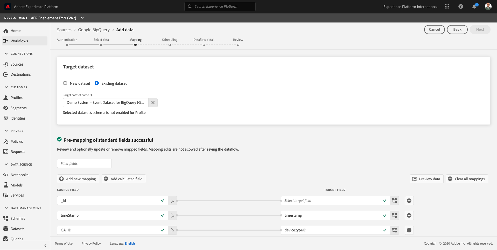
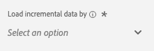

# 12.4 Daten aus BigQuery in Adobe Experience Platform laden

## Ziele

- BigQuery-Daten einem XDM-Schema zuordnen
- BigQuery-Daten in Adobe Experience Platform laden
- Machen Sie sich mit der Benutzeroberfläche von BigQuery Source Connector vertraut

## Vorbereitung

Nach Übung 12.3 sollte diese Seite in Adobe Experience Platform geöffnet sein:

**Wenn Sie es geöffnet haben, fahren Sie mit Übung 12.4.1 fort.**

**Wenn Sie es nicht geöffnet haben, gehen Sie zu [Adobe Experience Platform](https://experience.adobe.com/platform/home).**

Gehen Sie im linken Menü zu Quellen . Sie werden dann die **Quellen** homepage. Im **Quellen** Menü, klicken Sie auf **Datenbanken**.

Wählen Sie die **Google BigQuery** Source Connector und klicken Sie auf **+ Konfigurieren**.

Daraufhin wird der Bildschirm zur Auswahl des Google BigQuery-Kontos angezeigt.

Wählen Sie Ihr Konto aus und klicken Sie auf **Nächste**.

Sie werden dann die **Daten hinzufügen** anzeigen.

## 12.4.1 BigQuery-Tabellenauswahl

Im **Daten hinzufügen** anzeigen, wählen Sie Ihren BigQuery-Datensatz aus.

Sie können jetzt eine Beispieldatenvorschau der Google Analytics-Daten in BigQuery sehen.

Klicken Sie auf **Weiter**.

## 12.4.2 XDM-Zuordnung

Jetzt sehen Sie Folgendes:

Jetzt müssen Sie entweder einen neuen Datensatz erstellen oder einen vorhandenen Datensatz auswählen, in den die Google Analytics-Daten geladen werden sollen. Für diese Übung wurden bereits ein Datensatz und ein Schema erstellt. Sie müssen kein neues Schema oder neuen Datensatz erstellen.

Auswählen **Vorhandener Datensatz**. Öffnen Sie das Dropdown-Menü, um einen Datensatz auszuwählen. Suchen Sie nach dem Datensatz namens `Demo System - Event Dataset for BigQuery (Global v1.1)` und wählen Sie sie aus. Klicken Sie auf **Weiter**.

Scrollen Sie nach unten. Sie müssen jetzt jede **Quellfeld** von Google Analytics/BigQuery zu einem XDM **Zielfeld**, Feld nach Feld.

Verwenden Sie die folgende Zuordnungstabelle für diese Übung.

| Quellfeld | Zielfeld |
| ----------------- |-------------| 
| **_id** | _id |
| **_id** | channel._id |
| timeStamp | timestamp |
| GA_ID | ``--aepTenantId--``.identification.core.gaid |
| customerID | ``--aepTenantId--``.identification.core.loyaltyId |
| Seite | web.webPageDetails.name |
| Gerät | device.type |
| Browser | environment.browserDetails.vendor |
| MarketingChannel | marketing.trackingCode |
| TrafficSource | channel.typeAtSource |
| TrafficMedium | channel.mediaType |
| TransactionID | commerce.order.payments.transactionID |
| Ecommerce_Action_Type | eventType |
| Seitenansichten | web.webPageDetails.pageViews.value |
| Unique_Purchases | commerce.purchases.value |
| product_detail_views | commerce.productViews.value |
| Adds_To_Cart | commerce.productListAdds.value |
| product_removes_from_cart | commerce.productListRemovals.value |
| Product_Checkouts | commerce.checkouts.value |

Überprüfen Sie nach dem Kopieren und Einfügen der oben genannten Zuordnung in die Adobe Experience Platform-Benutzeroberfläche, ob keine Fehler aufgrund von Tippfehlern oder Leerzeichen am Anfang/Ende auftreten.

Sie haben jetzt eine **Zuordnung** wie folgt:

Die Quellfelder **GA_ID** und **customerID** werden in diesem XDM-Schema einer ID zugeordnet. Auf diese Weise können Sie Google Analytics-Daten (Web-/App-Verhaltensdaten) mit anderen Datensätzen wie Loyalität oder Callcenter-Daten anreichern.

Klicken Sie auf **Weiter**.

## 12.4.3 Verbindung und Datenerfassung planen

Sie werden jetzt die **Planung** tab:

Im **Planung** hinzufügen, können Sie eine Häufigkeit für den Datenerfassungsprozess für diese **Zuordnung** und Daten.

Da Sie Demodaten in Google BigQuery verwenden, die nicht aktualisiert werden, müssen Sie in dieser Übung keinen Zeitplan festlegen. Sie müssen jedoch eine Auswahl treffen und um zu viele unnötige Datenerfassungsprozesse zu vermeiden, müssen Sie die Häufigkeit wie folgt festlegen:

- Häufigkeit: **Woche**
- Intervall: **200**

**Wichtig**: Stellen Sie sicher, dass Sie die **Aufstockung** umschalten.

Nicht zuletzt müssen Sie eine **delta** -Feld.

Die **delta** wird verwendet, um die Verbindung zu planen und nur neue Zeilen hochzuladen, die in Ihren BigQuery-Datensatz aufgenommen werden. Ein Delta-Feld ist normalerweise immer eine Zeitstempelspalte. Für zukünftige geplante Datenerfassungen werden daher nur die Zeilen mit einem neuen, aktuelleren Zeitstempel erfasst.

Auswählen **timeStamp** als Delta-Feld.

Das hast du jetzt.

Klicken Sie auf **Weiter**.

## 12.4.4 Verbindung überprüfen und starten

Im **Datensatzflussdetails** anzeigen. Sie müssen Ihre Verbindung benennen, was Ihnen hilft, sie später zu finden.

Bitte verwenden Sie diese Namenskonvention:

| Feld | Namenskonvention | Beispiel |
| ----------------- |-------------| -------------|
| Name des Datensatzflusses | DataFlow - ldap - BigQuery Website Interaction | DataFlow - vangeluw - BigQuery Website Interaction |
| Beschreibung | DataFlow - ldap - BigQuery Website Interaction | DataFlow - vangeluw - BigQuery Website Interaction |

Klicken Sie auf **Weiter**.

Jetzt wird eine detaillierte Übersicht über Ihre Verbindung angezeigt. Stellen Sie sicher, dass alles korrekt ist, bevor Sie fortfahren, da einige Einstellungen danach nicht mehr geändert werden können, z. B. die XDM-Zuordnung.

Klicken Sie auf **Fertigstellen**.

Das Einrichten der Verbindung kann einige Zeit dauern. Daher sollten Sie sich keine Gedanken machen, wenn dies angezeigt wird:

Nachdem die Verbindung erstellt wurde, sehen Sie Folgendes:

Sie sind jetzt bereit, mit der nächsten Übung fortzufahren, in der Sie Customer Journey Analytics verwenden werden, um leistungsstarke Visualisierungen auf der Grundlage von Google Analytics-Daten zu erstellen.

Nächster Schritt: [12.5 Google Analytics-Daten mithilfe von Customer Journey Analytics analysieren](./ex5.md)

[Zurück zu Modul 12](./customer-journey-analytics-bigquery-gcp.md)

[Zu allen Modulen zurückkehren](./../../overview.md)
