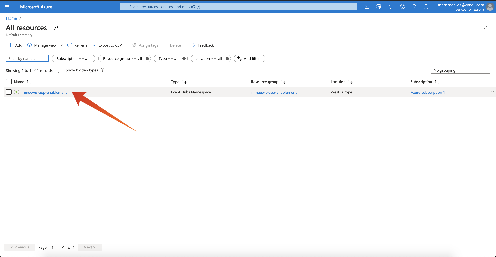
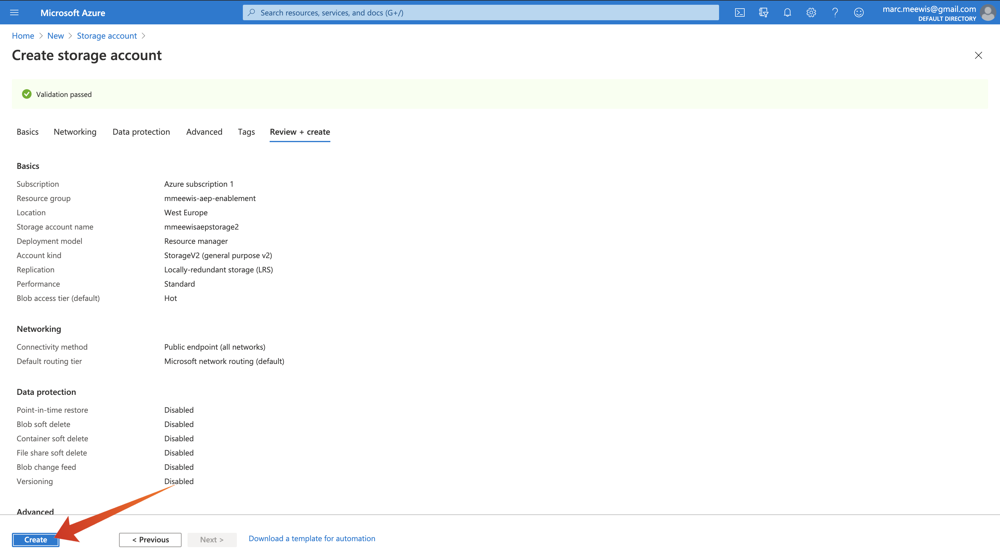

# 13.1 Konfigurieren der Microsoft Azure EventHub-Umgebung

Azure Event Hubs ist ein hochskalierbarer Publish-Subscribe-Service, der Millionen von Ereignissen pro Sekunde aufnehmen und in mehrere Anwendungen streamen kann. Auf diese Weise können Sie die enormen Datenmengen, die von Ihren verbundenen Geräten und Anwendungen erzeugt werden, verarbeiten und analysieren.

## 13.1.1 Was ist Azure Event Hub?

Azure Event Hubs ist eine Big Data-Streaming-Plattform und ein Dienst zur Erfassung von Ereignissen. Es kann Millionen von Ereignissen pro Sekunde empfangen und verarbeiten. An einen Ereignis-Hub gesendete Daten können mithilfe eines beliebigen Echtzeit-Analytics-Anbieters oder von Batch-/Speicheradaptern umgewandelt und gespeichert werden.

Ereignis-Hubs stellen die **Vorderseite** für eine Ereignis-Pipeline, die in Lösungsarchitekturen häufig als Ereignisaufnahme bezeichnet wird. Ein Ereignisaufruf ist eine Komponente oder ein Dienst, die bzw. der zwischen Ereignis-Herausgebern (wie Adobe Experience Platform RTCDP) und Ereigniskonsumenten sitzt, um die Produktion eines Ereignisstreams von der Nutzung dieser Ereignisse zu trennen. Event Hubs bietet eine einheitliche Streaming-Plattform mit Zeitaufbewahrungspuffer, wodurch Ereignisproduzenten von Ereigniskonsumenten abgekoppelt werden.

## 13.1.2 Namespace für Ereignis-Hubs erstellen

Navigieren Sie zu [https://portal.azure.com/#home](https://portal.azure.com/#home) und wählen Sie **Ressource erstellen**.

Geben Sie im Ressourcen-Bildschirm **Ereignis** in der Suchleiste und wählen Sie **Ereignis-Hubs** aus der Dropdown-Liste:

Klicken Sie auf **Erstellen**:

Wenn Sie in Azure zum ersten Mal eine Ressource erstellen, müssen Sie eine neue erstellen **Ressourcengruppe**. Wenn Sie bereits über eine Ressourcengruppe verfügen, können Sie diese auswählen (oder eine neue erstellen).

Auswählen **Neu erstellen**, benennen Sie Ihre Gruppe. `--demoProfileLdap---aep-enablement`.

Führen Sie den Test der Felder wie angegeben durch:

- Namespace : Definieren Sie Ihren Namespace. Er muss eindeutig sein. Verwenden Sie das folgende Muster. `--demoProfileLdap---aep-enablement`
- Ort: **Westeuropa** bezieht sich auf das Azure-Rechenzentrum in Amsterdam
- Preisklasse: **Allgemein**
- Durchsatzeinheiten: **1**

Klicken **Überprüfen und erstellen**.

Klicken Sie auf **Erstellen**.

Die Bereitstellung Ihrer Ressourcengruppe kann 1-2 Minuten dauern. Nach erfolgreichem Abschluss wird der folgende Bildschirm angezeigt:

## 13.1.3 Einrichten des Ereignis-Hub in Azure

Navigieren Sie zu [https://portal.azure.com/#home](https://portal.azure.com/#home) und wählen Sie **Alle Ressourcen**.

Wählen Sie in der Liste der Ressourcen Ihre `--demoProfileLdap---aep-enablement` namespace:

In `--demoProfileLdap---aep-enablement` Detailbildschirm, wählen Sie **Ereignis-Hubs**:

Klicken **+ Ereignis-Hub**.

Verwendung `--demoProfileLdap---aep-enablement-event-hub` als Namen angeben und auf **Erstellen**.

Klicken **Ereignis-Hubs** in Ihrem Ereignis-Hub-Namespace. Sie sollten jetzt Ihre **Ereignis-Hub** aufgelistet. In diesem Fall können Sie zur nächsten Übung übergehen.

## 13.1.4 Azure-Speicherkonto einrichten

Um Ihre Azure Event Hub-Funktion in späteren Übungen zu debuggen, müssen Sie im Rahmen der Einrichtung Ihres Visual Studio Code-Projekts ein Azure Storage-Konto bereitstellen. Sie erstellen jetzt dieses Azure Storage-Konto.

Navigieren Sie zu [https://portal.azure.com/#home](https://portal.azure.com/#home) und wählen Sie **Erstellen einer Ressource**.

Eingabe **Speicher** in der Suche und wählen Sie **Speicherkonto** aus der Liste.

Wählen Sie **Erstellen** aus.

Geben Sie Ihre **Ressourcengruppe** (zu Beginn dieser Übung erstellt), verwenden Sie `--demoProfileLdap--aepstorage` als Namen Ihres Speicherkontos verwenden, und wählen Sie **Lokal redundanter Speicher (LRS)** Klicken Sie auf **Überprüfen und erstellen**.

Klicken Sie auf **Erstellen**.

Die Erstellung Ihres Speicherkontos dauert einige Sekunden:

Wenn Sie fertig sind, zeigt der Bildschirm **Zu Ressource wechseln** Schaltfläche.

Klicken **Microsoft Azure**.

Ihr Speicherkonto ist jetzt unter **Letzte Ressourcen**.

Nächster Schritt: [13.2 Konfigurieren des Azure Event Hub-Ziels in Adobe Experience Platform](./ex2.md)

[Zurück zu Modul 13](./segment-activation-microsoft-azure-eventhub.md)

[Zu allen Modulen zurückkehren](./../../overview.md)
