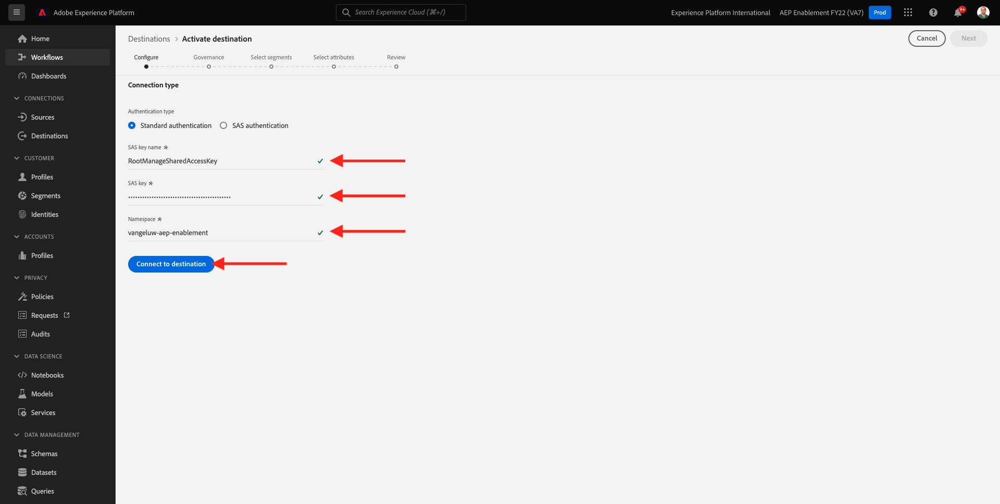

# 13.2 Konfigurieren des Azure Event Hub-Ziels in Adobe Experience Platform

## 13.2.1 Erforderliche Azure-Verbindungsparameter identifizieren

Um ein Event Hub-Ziel in Adobe Experience Platform zu definieren, benötigen Sie Folgendes:

- Ereignis-Hubs-Namespace
- Ereignis-Hub
- Azure SAS-Schlüsselname
- Azure SAS-Schlüssel

In der vorherigen Übung wurden Event Hub- und EventHub-Namespace definiert: [Übung 1: Einrichten des Ereignis-Hub in Azure](./ex1.md)

### Ereignis-Hubs-Namespace

Um die oben genannten Informationen in Azure Portal zu suchen, navigieren Sie zu [https://portal.azure.com/#home](https://portal.azure.com/#home). Stellen Sie sicher, dass Sie das richtige Azure-Konto verwenden.

Auswählen **Alle Ressourcen** in Azure Portal:

### Ereignis-Hub

Nach einer Ressource mit Ressourcentyp suchen **Ereignis-Hubs-Namespace** Wenn Sie die in der vorherigen Übung verwendeten Namenskonventionen befolgt haben, lautet der Ereignis-Hubs-Namespace `--demoProfileLdap---aep-enablement`. Notieren Sie sich das, Sie werden es in der nächsten Übung brauchen.

Klicken Sie auf den Namen des Ereignis-Hubs-Namespace , um die Details abzurufen:

Auswählen **Ereignis-Hubs** Um eine Liste der Ereignis-Hub zu erhalten, die in Ihrem Ereignis-Hub-Namespace definiert sind, finden Sie einen Ereignis-Hub mit dem Namen `--demoProfileLdap---aep-enablement-event-hub`. Notieren Sie sich das, Sie werden es in der nächsten Übung brauchen.

### SAS-Schlüsselname

Auswählen **Freigegebene Zugriffsrichtlinien** für Ihre **Ereignis-Hubs-Namespace**

Daraufhin wird eine Liste der Richtlinien für den freigegebenen Zugriff angezeigt. Der von uns gesuchte SAS-Schlüssel lautet **RootManageSharedAccessKey**. Dies ist der Name des SAS-Schlüssels. Schreib es auf.

### SAS-Schlüsselwert

Klicken Sie auf **RootManageSharedAccessKey** um den SAS-Schlüsselwert abzurufen. und drücken Sie die **In Zwischenablage kopieren** Symbol zum Kopieren der **Primärer Schlüssel**:

### Zielwertzusammenfassung

An dieser Stelle sollten Sie alle Werte identifiziert haben, die zum Definieren des Azure Event Hub-Ziels in der Echtzeit-Kundendatenplattform von Adobe Experience Platform erforderlich sind.

| Zielattribut-Name | Zielattribut-Wert | Beispielwert |
|---|---|---|
| sasKeyName | SAS-Schlüsselname | RootManageSharedAccessKey |
| sasKey | SAS-Schlüsselwert | srREx9ShJG1Rv7f/.. |
| namespace | Ereignis-Hubs-Namespace | `--demoProfileLdap---aep-enablement` |
| eventHubName | Ereignis-Hub | `--demoProfileLdap---aep-enablement-event-hub` |

## 13.2.2 Azure Event Hub-Ziel in Adobe Experience Platform erstellen

Melden Sie sich über diese URL bei Adobe Experience Platform an: [https://experience.adobe.com/platform](https://experience.adobe.com/platform).

Nach der Anmeldung landen Sie auf der Startseite von Adobe Experience Platform.

Bevor Sie fortfahren, müssen Sie eine **Sandbox**. Die auszuwählende Sandbox heißt ``--aepSandboxId--``. Klicken Sie hierzu auf den Text **[!UICONTROL Produktionsprodukt]** in der blauen Zeile auf Ihrem Bildschirm. Nachdem Sie die entsprechende Sandbox ausgewählt haben, wird die Bildschirmänderung angezeigt und Sie befinden sich jetzt in Ihrer dedizierten Sandbox.

Navigieren Sie zu **Ziele**, gehen Sie dann zu **Katalog**.

Auswählen **Cloud-Speicher** und gehen Sie zu **Azure Event Hubs** und klicken Sie auf **Einrichten** oder **Konfigurieren**:

Füllen Sie die Zielwerte aus, die Sie in der vorherigen Übung erfasst haben. Klicken Sie anschließend auf **Mit Ziel verbinden**.

Wenn Ihre Anmeldedaten korrekt waren, wird eine Bestätigung angezeigt: **Verbunden**.

Jetzt müssen Name und Beschreibung im Format `--demoProfileLdap---aep-enablement`. Geben Sie die **eventHubName** (siehe vorherige Übung) sieht es wie folgt aus: `--demoProfileLdap---aep-enablement-event-hub`) und klicken Sie auf **Nächste**.

Klicken **Speichern und beenden**.

Ihr Ziel wurde jetzt in Adobe Experience Platform erstellt und verfügbar gemacht.

Nächster Schritt: [13.3 Segment erstellen](./ex3.md)

[Zurück zu Modul 13](./segment-activation-microsoft-azure-eventhub.md)

[Zu allen Modulen zurückkehren](./../../overview.md)
