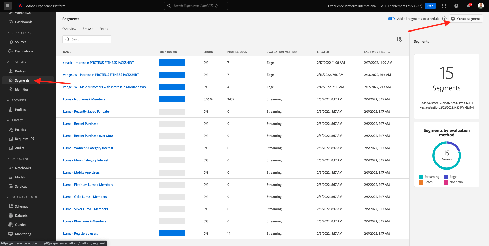

# 13.3 Segment erstellen

## 13.3.1 Einführung

Sie erstellen ein einfaches Segment:

- **Interesse an Ausrüstung** für welche Kundenprofile beim Besuch der **Ausrüstung** Seite der Demowebsite von Luma.

### Gut zu wissen

Die Echtzeit-Kundendatenplattform Trigger eine Aktivierung an ein Ziel, wenn Sie sich für ein Segment qualifizieren, das Teil der Aktivierungsliste dieses Ziels ist. Wenn dies der Fall ist, enthält die Payload der Segmentqualifizierung, die an dieses Ziel gesendet wird **alle Segmente, für die Ihr Profil qualifiziert ist**.

Ziel dieses Moduls ist es, zu zeigen, dass die Segmentqualifikation Ihres Kundenprofils an **Ihre** Ereignis-Hub-Ziel in Echtzeit.

### Segmentstatus

Eine Segmentqualifizierung in Adobe Experience Platform weist immer eine **status**-Eigenschaft und kann eine der folgenden sein:

- **realisiert**: Dies weist auf eine neue Segmentqualifizierung hin
- **vorhandene**: Dies weist auf eine vorhandene Segmentqualifizierung hin.
- **beendet**: Dies bedeutet, dass das Profil nicht mehr für das Segment qualifiziert ist.

## 13.3.2 Segment erstellen

Das Erstellen eines Segments wird ausführlich unter [Modul 6](../module6/real-time-cdp-build-a-segment-take-action.md).

### Segment erstellen

Melden Sie sich über diese URL bei Adobe Experience Platform an: [https://experience.adobe.com/platform](https://experience.adobe.com/platform).

Nach der Anmeldung landen Sie auf der Startseite von Adobe Experience Platform.


Bevor Sie fortfahren, müssen Sie eine **Sandbox**. Die auszuwählende Sandbox heißt ``--aepSandboxId--``. Klicken Sie hierzu auf den Text **[!UICONTROL Produktionsprodukt]** in der blauen Zeile auf Ihrem Bildschirm. Nachdem Sie die entsprechende Sandbox ausgewählt haben, wird die Bildschirmänderung angezeigt und Sie befinden sich jetzt in Ihrer dedizierten Sandbox.


Navigieren Sie zu **Segmente**. Klicken Sie auf **+ Segment erstellen** Schaltfläche.



Benennen Sie Ihr Segment. `--demoProfileLdap-- - Interest in Equipment` und fügen Sie das Erlebnisereignis für Seitennamen hinzu:

Klicken Sie auf **Veranstaltungen**, per Drag &amp; Drop **XDM ExperienceEvent > Web > Webseitendetails > Name**. Eingabe **Ausrüstung** als Wert:


Drag &amp; Drop **XDM ExperienceEvent > `--aepTenantIdSchema--` > demoEnvironment > brandName**. Eingabe `--demoProfileLdap--` als Wert festlegen, setzen Sie den Vergleichsparameter auf **contains** und klicken Sie auf **Speichern**:


### PQL-Definition

Die PQL Ihres Segments sieht wie folgt aus:

```code
CHAIN(xEvent, timestamp, [C0: WHAT(web.webPageDetails.name.equals("equipment", false) and _experienceplatform.demoEnvironment.brandName.contains("--demoProfileLdap--", false))])
```

Nächster Schritt: [13.4 Segment aktivieren](./ex4.md)

[Zurück zu Modul 13](./segment-activation-microsoft-azure-eventhub.md)

[Zu allen Modulen zurückkehren](./../../overview.md)
