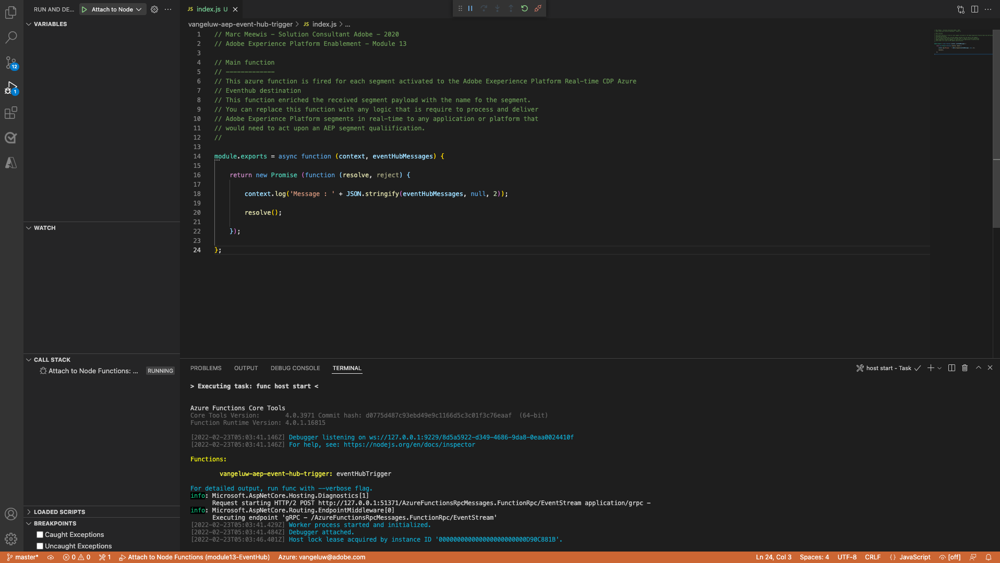

# 13.5 Microsoft Azure-Projekt erstellen

## 13.5.1 Azure Event Hub-Funktionen kennenlernen

Mit Azure-Funktionen können Sie kleine Codeabschnitte ausführen (genannt **Funktionen**), ohne sich um die Anwendungsinfrastruktur zu sorgen. Mit Azure Functions stellt die Cloud-Infrastruktur alle aktuellen Server bereit, die Sie benötigen, um Ihre Anwendung im Maßstab ausführen zu können.

Eine Funktion ist **auslösen** durch einen bestimmten Ereignistyp. Zu den unterstützten Triggern gehören die Reaktion auf Datenänderungen, die Reaktion auf Nachrichten (z. B. Ereignis-Hubs), die planmäßige Ausführung oder die Ausführung einer HTTP-Anfrage.

Azure Functions ist ein Server-loser Compute-Dienst, mit dem Sie ereignisbasierten Code ausführen können, ohne Infrastruktur explizit bereitstellen oder verwalten zu müssen.

Azure Event Hub ist mit Azure Functions für eine Server-lose Architektur integriert.

## 13.5.2 Visual Studio-Code öffnen und bei Azure anmelden

Visual Studio Code macht es einfach...

- Definieren und Binden von Azure-Funktionen an Event-Hubs
- lokal testen
- Bereitstellung auf Azure
- Ausführung der Remote-Protokollfunktion

### Öffnen von Visual Studio Code

Um Visual Studio Code zu öffnen, geben Sie ein **visuell** in der Suche Ihres Betriebssystems (Spotlight-Suche unter OSX, Suche in der Taskleiste von Windows). Wenn Sie ihn nicht finden, müssen Sie die Schritte unter [Übung 0 - Voraussetzungen](./ex0.md).


### Melden Sie sich bei Azure an

Wenn Sie sich mit Ihrem Azure-Konto anmelden, bei dem Sie sich früher angemeldet haben [Übung 0 - Voraussetzungen](./ex0.md)können Sie mit Visual Studio Code alle Event Hub-Ressourcen suchen und binden.

Klicken Sie auf **Azure** in Visual Studio Code. Wenn Sie diese Option nicht haben, ist bei der Installation der erforderlichen Erweiterungen möglicherweise etwas schiefgelaufen.

Nächste Auswahl **Bei Azure anmelden**:


Sie werden zu Ihrem Browser weitergeleitet, um sich anzumelden. Denken Sie daran, das Azure-Konto auszuwählen, das Sie zur Registrierung verwendet haben.


Wenn der folgende Bildschirm in Ihrem Browser angezeigt wird, sind Sie bei Visual Code Studio angemeldet:


Kehren Sie zu Visual Code Studio zurück (Sie sehen den Namen Ihres Azure-Abonnements, z. B. **Azure-Abonnement 1**):


## 13.5.3 Erstellen eines Azure-Projekts

Wenn Sie den Mauszeiger darüber bewegen **Azure-Abonnement 1**, wird ein Menü über dem Abschnitt angezeigt, wählen Sie **Neues Projekt erstellen...**:


Wählen Sie einen lokalen Ordner Ihrer Wahl aus, um das Projekt zu speichern, und klicken Sie auf **Auswählen**:


Geben Sie nun den Assistenten zur Projekterstellung ein. Auswählen **JavaScript** als Sprache für Ihr Projekt:


Auswählen **Azure Event Hub-Trigger** als erste Funktionsvorlage Ihres Projekts:


Geben Sie einen Namen für Ihre Funktion ein. Verwenden Sie dazu das folgende Format `--demoProfileLdap---aep-event-hub-trigger` und drücken Sie die Eingabetaste:


Auswählen **Neue Einstellung für lokale Apps erstellen**:


Wählen Sie einen Ereignis-Hub-Namespace aus, sollte Ihnen der Event-Hub angezeigt werden, den Sie in **Übung 2**. In diesem Beispiel lautet der Ereignis-Hub-Namespace **vangeluw-aep-enablement**:


Wählen Sie Ihren Ereignis-Hub aus. Sie sollten den Ereignis-Hub sehen, den Sie in **Übung 2**. In meinem Fall ist dies **vangeluw-aep-enablement-event-hub**:


Auswählen **RootManageSharedAccessKey** als Ihre Ereignis-Hub-Richtlinie:


Zu verwendende Eingabe eingeben **$Default**:


Auswählen **Zum Arbeitsbereich hinzufügen** Informationen zum Öffnen des Projekts:


Nachdem Sie das Projekt erstellt haben, klicken Sie auf **index.js** , damit die Datei im Editor geöffnet wird:


Die Payload, die von Adobe Experience Platform an Ihren Event Hub gesendet wird, umfasst die Segment-IDs:

```json
[{
"segmentMembership": {
"ups": {
"ca114007-4122-4ef6-a730-4d98e56dce45": {
"lastQualificationTime": "2020-08-31T10:59:43Z",
"status": "realized"
},
"be2df7e3-a6e3-4eb4-ab12-943a4be90837": {
"lastQualificationTime": "2020-08-31T10:59:56Z",
"status": "realized"
},
"39f0feef-a8f2-48c6-8ebe-3293bc49aaef": {
"lastQualificationTime": "2020-08-31T10:59:56Z",
"status": "realized"
}
}
},
"identityMap": {
"ecid": [{
"id": "08130494355355215032117568021714632048"
}]
}
}]
```

Ersetzen Sie den Code in der index.js-Datei Ihres Visual Studio-Codes durch den unten stehenden Code. Dieser Code wird jedes Mal ausgeführt, wenn die Echtzeit-Kundendatenplattform Segmentqualifikationen an Ihr Event Hub-Ziel sendet. In unserem Beispiel geht es im Code nur darum, die empfangene Payload anzuzeigen und zu verbessern. Sie können sich jedoch jede Art von Funktion vorstellen, um Segmentqualifikationen in Echtzeit zu verarbeiten.

```javascript
// Marc Meewis - Solution Consultant Adobe - 2020
// Adobe Experience Platform Enablement - Module 13

// Main function
// -------------
// This azure function is fired for each segment activated to the Adobe Exeperience Platform Real-time CDP Azure 
// Eventhub destination
// This function enriched the received segment payload with the name fo the segment. 
// You can replace this function with any logic that is require to process and deliver
// Adobe Experience Platform segments in real-time to any application or platform that 
// would need to act upon an AEP segment qualiification.
// 

module.exports = async function (context, eventHubMessages) {

    return new Promise (function (resolve, reject) {

        context.log('Message : ' + JSON.stringify(eventHubMessages, null, 2));

        resolve();

    });    

};
```

Das Ergebnis sollte wie folgt aussehen:


## 13.5.4 Azure-Projekt ausführen

Jetzt ist es an der Zeit, Ihr Projekt auszuführen. In dieser Phase werden wir das Projekt nicht auf Azure bereitstellen. Sie wird lokal im Debug-Modus ausgeführt. Wählen Sie das Symbol Ausführen und danach den grünen Pfeil aus.


Wenn Sie Ihr Projekt zum ersten Mal im Debug-Modus ausführen, müssen Sie ein Azure-Speicherkonto anhängen. Klicken Sie auf **Speicherkonto auswählen**.


Wählen Sie aus der Liste der Speicherkonten das Konto aus, das Sie als Teil von [13.1.4 Azure-Speicherkonto einrichten](./ex1.md). Ihr Speicherkonto heißt `--demoProfileLdap--aepstorage`, beispielsweise: **mmeewisaepstorage**.


Ihr Projekt läuft jetzt und listet Ereignisse auf dem Ereignis-Hub auf. In der nächsten Übung werden Sie das Verhalten auf der Demowebsite von Luma demonstrieren, das Sie für diese Segmente qualifizieren wird. Daher erhalten Sie im Terminal Ihrer Event Hub-Trigger-Funktion eine Payload für die Segmentqualifizierung:



## 13.5.5 Azure-Projekt beenden

Um Ihr Projekt zu stoppen, wählen Sie die **Terminal** auf, klicken Sie in das Terminal-Fenster und drücken Sie die **CMD-C** auf OSX oder **STRG-C** unter Windows:


Nächster Schritt: [13.6 End-to-End-Szenario](./ex6.md)

[Zurück zu Modul 13](./segment-activation-microsoft-azure-eventhub.md)

[Zu allen Modulen zurückkehren](./../../overview.md)
