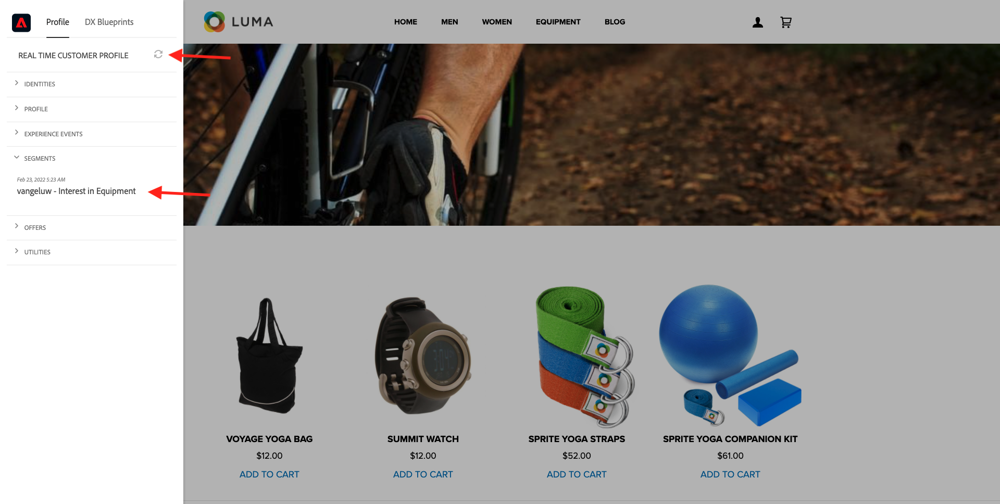

# 13.6 End-to-End-Szenario

## 13.6.1 Azure Event Hub-Trigger starten

Um die Payload anzuzeigen, die von der Echtzeit-Kundendatenplattform von Adobe Experience Platform bei Segmentqualifizierung an unseren Azure Event Hub gesendet wird, müssen wir unsere einfache Azure Event Hub-Trigger-Funktion starten. Diese Funktion vereinfacht die Nutzlast in der Konsole in Visual Studio Code. Beachten Sie jedoch, dass diese Funktion auf jede Weise erweitert werden kann, um mit allen möglichen Umgebungen mit dedizierten APIs und Protokollen zu arbeiten.

### Visual Studio-Code starten und Projekt starten

Stellen Sie sicher, dass Ihr Visual Studio Code-Projekt geöffnet und ausgeführt wird.

Informationen zum Starten/Stoppen/Neustart Ihrer Azure-Funktion in Visual Studio Code finden Sie in den folgenden Übungen:

- [Übung 13.5.4 - Azure-Projekt starten](./ex5.md)
- [Übung 13.5.5 - Azure-Projekt beenden](./ex5.md)

Ihr Visual Studio-Code **Terminal** sollte etwas Ähnliches erwähnen:

```code
[2022-02-23T05:03:41.429Z] Worker process started and initialized.
[2022-02-23T05:03:41.484Z] Debugger attached.
[2022-02-23T05:03:46.401Z] Host lock lease acquired by instance ID '000000000000000000000000D90C881B'.
```


## 13.6.2 Luma-Website laden

Navigieren Sie zu [https://builder.adobedemo.com/projects](https://builder.adobedemo.com/projects). Nach der Anmeldung bei Ihrer Adobe ID sehen Sie dies. Klicken Sie auf Ihr Website-Projekt, um es zu öffnen.


Sie können nun den unten stehenden Fluss ausführen, um auf die Website zuzugreifen. Klicken **Integrationen**.


Im **Integrationen** müssen Sie die Datenerfassungseigenschaft auswählen, die in Übung 0.1 erstellt wurde.


Sie werden dann Ihre Demowebsite öffnen sehen. Wählen Sie die URL aus und kopieren Sie sie in die Zwischenablage.


Öffnen Sie ein neues Inkognito-Browserfenster.


Fügen Sie die URL Ihrer Demo-Website ein, die Sie im vorherigen Schritt kopiert haben. Sie werden dann aufgefordert, sich mit Ihrer Adobe ID anzumelden.


Wählen Sie Ihren Kontotyp aus und schließen Sie den Anmeldevorgang ab.


Sie sehen dann Ihre Website in einem Inkognito-Browser-Fenster geladen. Für jede Demonstration müssen Sie ein neues Inkognito-Browser-Fenster verwenden, um Ihre Demo-Website-URL zu laden.


## 13.6.3 Für Ihr Interesse am Segment Ausrüstung qualifizieren

Navigieren Sie zum **Ausrüstung** einmal und **Laden Sie sie nicht neu oder aktualisieren Sie sie nicht.**. Diese Aktion sollte Sie für Ihre `--demoProfileLdap-- - Interest in Equipment` Segment.


Öffnen Sie dazu das Bedienfeld Profil-Viewer . Sie sollten jetzt Mitglied der `--demoProfileLdap-- - Interest in Equipment`. Wenn Ihre Segmentmitgliedschaften noch nicht in Ihrem Profil-Viewer-Bedienfeld aktualisiert wurden, klicken Sie auf die Schaltfläche &quot;Neu laden&quot;.



Wechseln Sie zurück zu Visual Studio Code und sehen Sie sich Ihre **TERMINAL** angezeigt, sollte eine Liste von Segmenten für Ihre spezifische **ECID**. Diese Aktivierungs-Payload wird an Ihren Ereignis-Hub bereitgestellt, sobald Sie sich für `--demoProfileLdap-- - Interest in Equipment` Segment.

Wenn Sie sich die Segment-Payload genauer ansehen, sehen Sie Folgendes: `--demoProfileLdap-- - Interest in Equipment` befindet sich im Status **realisiert**.

Ein Segmentstatus von **realisiert** bedeutet, dass unser Profil gerade in das Segment eingegeben wurde. Während **vorhandene** status bedeutet, dass sich unser Profil weiterhin im Segment befindet.


## 13.6.4 Besuchen Sie die Seite &quot;Ausrüstung&quot;zum zweiten Mal.

Führen Sie eine harte Aktualisierung der **Ausrüstung** Seite.


Wechseln Sie jetzt zurück zu Visual Studio Code und überprüfen Sie Ihre **TERMINAL** Registerkarte. Sie werden sehen, dass wir Ihr Segment noch haben, aber jetzt den Status haben **vorhandene** bedeutet, dass unser Profil weiterhin im Segment enthalten ist.


## 13.6.5 Zum dritten Mal die Seite &quot;Sport&quot;besuchen

Wenn Sie die **Sport** zum dritten Mal erfolgt keine Aktivierung, da es keine Statusänderung aus Segmentsicht gibt.

Segmentaktivierungen treten nur dann auf, wenn sich der Status des Segments ändert:


Nächster Schritt: [Zusammenfassung und Vorteile](./summary.md)

[Zurück zu Modul 13](./segment-activation-microsoft-azure-eventhub.md)

[Zu allen Modulen zurückkehren](./../../overview.md)
