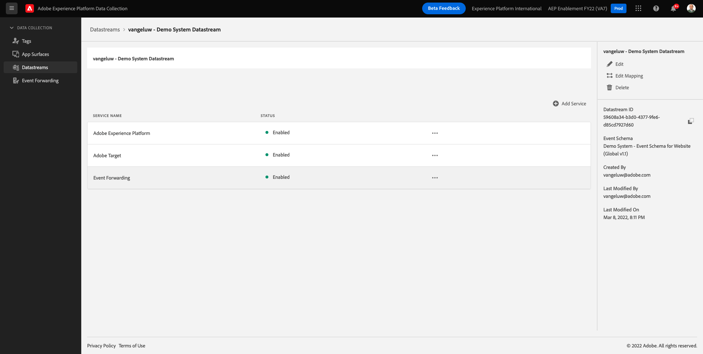

# 14.2 Aktualisieren Sie Ihren Datenspeicher, um Daten für Ihre Adobe Experience Platform-Datenerfassungsservereigenschaft verfügbar zu machen.

## 14.2.1 Datenspeicher aktualisieren

In [Übung 0.2](./../../modules/module0/ex2.md), haben Sie eine eigene **[!UICONTROL Datastream]**. Sie haben dann den Namen `--demoProfileLdap-- - Demo System Datastream`.

In dieser Übung müssen Sie Folgendes konfigurieren: **[!UICONTROL Datastream]** , um **[!DNL Data Collection Server property]**.

Gehen Sie dazu zu [https://experience.adobe.com/#/data-collection/](https://experience.adobe.com/#/data-collection/). Dann wirst du das sehen. Klicken Sie im linken Menü auf **[!UICONTROL Datenspeicher]**.

Wählen Sie oben rechts auf Ihrem Bildschirm den Namen Ihrer Sandbox aus, der `--aepSandboxId--`.

Suchen Sie nach Ihrer **[!UICONTROL Datastream]**, der `--demoProfileLdap-- - Demo System Datastream`. Klicken Sie auf **[!UICONTROL Datastream]** um es zu öffnen.

Dann wirst du das sehen. Klicken **[!UICONTROL + Dienst hinzufügen]**.

Wählen Sie den Dienst aus **Ereignisweiterleitung**. Dadurch werden Ihnen zwei zusätzliche Einstellungen angezeigt. Wählen Sie die Ereignisweiterleitungseigenschaft aus, die Sie in der vorherigen Übung erstellt haben und die den Namen hat `--demoProfileLdap-- - Demo System (DD/MM/YYYY) (Edge)`. Wählen Sie anschließend **Entwicklung** under **Umgebung**. Klicken Sie auf **Speichern**.

Ihr Datastream wurde aktualisiert und kann jetzt verwendet werden.

Ihr Datastream kann jetzt mit Ihrem **[!DNL Event Forwarding property]**.

Nächster Schritt: [14.3 Benutzerdefinierten Webhook erstellen und konfigurieren](./ex3.md)

[Zurück zu Modul 14](./aep-data-collection-ssf.md)

[Zu allen Modulen zurückkehren](./../../overview.md)
