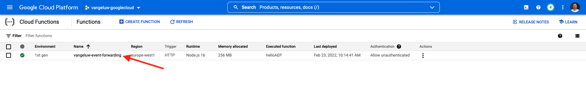

# 14.4 Erstellen und Konfigurieren einer Google Cloud-Funktion

## 14.4.1 Google-Cloud-Funktion erstellen

Navigieren Sie zu [https://console.cloud.google.com/](https://console.cloud.google.com/). Navigieren Sie zu **Cloud-Funktionen**.


Dann wirst du das sehen. Klicken **ERSTELLUNGSFUNKTION**.


Dann wirst du das sehen.


Nehmen Sie die folgenden Optionen vor:

- **Funktionsname**: `--demoProfileLdap---event-forwarding`
- **Region**: beliebige Region auswählen
- **Trigger Type**: select **HTTP**
- **Authentifizierung**: select **Nicht authentifizierte Aufrufe zulassen**

Du solltest das jetzt haben. Klicken Sie auf **Speichern**.


Klicken **NÄCHSTES**.


Daraufhin sehen Sie Folgendes:


Nehmen Sie die folgenden Optionen vor:

- **Laufzeit**: select **Node.js 16** (oder neuer)
- **Einstiegspunkt**: enter **helloAEP**

Klicken **API AKTIVIEREN** aktivieren **Cloud Build-API**. Dann sehen Sie ein neues Fenster. Klicken Sie in diesem neuen Fenster auf **AKTIVIEREN** erneut.


Dann wirst du das sehen. Klicken **Aktivieren**.


Einmal **Cloud Build-API** aktiviert wurde, sehen Sie dies.


Kehren Sie zu Ihrem **Cloud-Funktion**.
Vergewissern Sie sich im Inline-Editor Ihrer Cloud-Funktion, dass der folgende Code vorhanden ist:

```javascript
/**
 * Responds to any HTTP request.
 *
 * @param {!express:Request} req HTTP request context.
 * @param {!express:Response} res HTTP response context.
 */
exports.helloAEP = (req, res) => {
  let message = req.query.message || req.body.message || 'Hello World!';
  res.status(200).send(message);
};
```

Klicken Sie anschließend auf **BEREITSTELLEN**.


Dann wirst du das sehen. Ihre Cloud-Funktion wird jetzt erstellt. Dies kann einige Minuten dauern.


Sobald Ihre Funktion erstellt und ausgeführt wurde, wird dies angezeigt. Klicken Sie auf den Namen Ihrer Funktion, um sie zu öffnen.


Dann wirst du das sehen. Navigieren Sie zu **Trigger**. Sie werden dann die **Trigger-URL** wird verwendet, um den Endpunkt im Server-seitigen Launch zu definieren.


Kopieren Sie die Trigger-URL, die wie folgt aussieht: **https://europe-west1-dazzling-pillar-273812.cloudfunctions.net/vangeluw-event-forwarding**.

In den nächsten Schritten konfigurieren Sie den Adobe Experience Platform-Datenerfassungsserver so, dass spezifische Informationen über **Seitenansichten** zu Ihrer Google Cloud-Funktion hinzufügen. Anstatt die volle Payload unverändert weiterzuleiten, senden Sie nur Dinge wie **ECID**, **timestamp** und **Seitenname** zu Ihrer Google Cloud-Funktion hinzufügen.

Hier ist ein Beispiel für eine Payload, die Sie analysieren müssen, um die oben genannten Variablen herauszufiltern:

```json
{
  "events": [
    {
      "xdm": {
        "eventType": "web.webpagedetails.pageViews",
        "web": {
          "webPageDetails": {
            "URL": "https://builder.adobedemo.com/run/vangeluw-OCUC",
            "name": "vangeluw-OCUC",
            "viewName": "vangeluw-OCUC",
            "pageViews": {
              "value": 1
            }
          },
          "webReferrer": {
            "URL": "https://builder.adobedemo.com/run/vangeluw-OCUC/equipment"
          }
        },
        "device": {
          "screenHeight": 1080,
          "screenWidth": 1920,
          "screenOrientation": "landscape"
        },
        "environment": {
          "type": "browser",
          "browserDetails": {
            "viewportWidth": 1920,
            "viewportHeight": 451
          }
        },
        "placeContext": {
          "localTime": "2022-02-23T06:51:07.140+01:00",
          "localTimezoneOffset": -60
        },
        "timestamp": "2022-02-23T05:51:07.140Z",
        "implementationDetails": {
          "name": "https://ns.adobe.com/experience/alloy/reactor",
          "version": "2.8.0+2.9.0",
          "environment": "browser"
        },
        "_experienceplatform": {
          "identification": {
            "core": {
              "ecid": "08346969856929444850590365495949561249"
            }
          },
          "demoEnvironment": {
            "brandName": "vangeluw-OCUC"
          },
          "interactionDetails": {
            "core": {
              "channel": "web"
            }
          }
        }
      },
      "query": {
        "personalization": {
          "schemas": [
            "https://ns.adobe.com/personalization/html-content-item",
            "https://ns.adobe.com/personalization/json-content-item",
            "https://ns.adobe.com/personalization/redirect-item",
            "https://ns.adobe.com/personalization/dom-action"
          ],
          "decisionScopes": [
            "eyJ4ZG06YWN0aXZpdHlJZCI6Inhjb3JlOm9mZmVyLWFjdGl2aXR5OjE0YzA1MjM4MmUxYjY1MDUiLCJ4ZG06cGxhY2VtZW50SWQiOiJ4Y29yZTpvZmZlci1wbGFjZW1lbnQ6MTRiZjA5ZGM0MTkwZWJiYSJ9",
            "__view__"
          ]
        }
      }
    }
  ],
  "query": {
    "identity": {
      "fetch": [
        "ECID"
      ]
    }
  },
  "meta": {
    "state": {
      "domain": "adobedemo.com",
      "cookiesEnabled": true,
      "entries": [
        {
          "key": "kndctr_907075E95BF479EC0A495C73_AdobeOrg_identity",
          "value": "CiYwODM0Njk2OTg1NjkyOTQ0NDg1MDU5MDM2NTQ5NTk0OTU2MTI0OVIPCPn66KfyLxgBKgRJUkwx8AH5-uin8i8="
        },
        {
          "key": "kndctr_907075E95BF479EC0A495C73_AdobeOrg_consent_check",
          "value": "1"
        },
        {
          "key": "kndctr_907075E95BF479EC0A495C73_AdobeOrg_consent",
          "value": "general=in"
        }
      ]
    }
  }
}
```

Dies sind die Felder, die die Informationen enthalten, die analysiert werden müssen:

- ECID: **events.xdm._experienceplatform.identification.core.ecid**
- timestamp: **timestamp**
- Seitenname: **events.xdm.web.webPageDetails.name**

Gehen wir jetzt zum Adobe Experience Platform-Datenerfassungsserver, um die Datenelemente so zu konfigurieren, dass dies möglich ist.

## 14.4.2 Eigenschaft &quot;Ereignisweiterleitung&quot;aktualisieren: Datenelemente

Navigieren Sie zu [https://experience.adobe.com/#/data-collection/](https://experience.adobe.com/#/data-collection/) und gehen Sie zu **Ereignisweiterleitung**. Suchen Sie die Eigenschaft &quot;Ereignisweiterleitung&quot;und klicken Sie darauf, um sie zu öffnen.


Gehen Sie im linken Menü zu **Datenelemente**. Klicken **Datenelement hinzufügen**.


Anschließend wird ein neues Datenelement angezeigt, das konfiguriert werden soll.


Wählen Sie Folgendes aus:

- Als **Name**, eingeben **customerECID**.
- Als **Erweiterung** auswählen **Core**.
- Als **Datenelementtyp** auswählen **Pfad**.
- Als **Pfad**, eingeben `arc.event.xdm.--aepTenantId--.identification.core.ecid`. Durch Eingabe dieses Pfads filtern Sie das Feld aus **ecid** aus der Ereignis-Payload, die von der Website oder App an die Adobe Edge gesendet wird.

>[!NOTE]
>
>In den oben und unten aufgeführten Pfaden wird ein Verweis auf **Bogen**. **Bogen** steht für Adobe Resource Context und **Bogen** steht immer für das höchste verfügbare Objekt, das im serverseitigen Kontext verfügbar ist. Anreicherungen und Umwandlungen können hinzugefügt werden. **Bogen** -Objekt, das die Datenerfassungsserverfunktionen von Adobe Experience Platform verwendet.
>
>In den oben und unten aufgeführten Pfaden wird ein Verweis auf **event**. **event** steht für ein eindeutiges Ereignis und Adobe Experience Platform Data Collection Server wertet jedes Ereignis immer einzeln aus. Manchmal wird Ihnen ein Verweis auf **events** in der vom Web SDK Client Side gesendeten Payload, aber in Adobe Experience Platform Data Collection Server wird jedes Ereignis einzeln ausgewertet.

Das wirst du jetzt haben. Klicken Sie auf **Speichern**.


Klicken **Datenelement hinzufügen**.


Anschließend wird ein neues Datenelement angezeigt, das konfiguriert werden soll.


Wählen Sie Folgendes aus:

- Als **Name**, eingeben **eventTimestamp**.
- Als **Erweiterung** auswählen **Core**.
- Als **Datenelementtyp** auswählen **Pfad**.
- Als **Pfad**, eingeben **arc.event.xdm.timestamp**. Durch Eingabe dieses Pfads filtern Sie das Feld aus **timestamp** aus der Ereignis-Payload, die von der Website oder App an die Adobe Edge gesendet wird.

Das wirst du jetzt haben. Klicken Sie auf **Speichern**.


Klicken **Datenelement hinzufügen**.


Anschließend wird ein neues Datenelement angezeigt, das konfiguriert werden soll.


Wählen Sie Folgendes aus:

- Als **Name**, eingeben **pageName**.
- Als **Erweiterung** auswählen **Core**.
- Als **Datenelementtyp** auswählen **Pfad**.
- Als **Pfad**, eingeben **arc.event.xdm.web.webPageDetails.name**. Durch Eingabe dieses Pfads filtern Sie das Feld aus **name** aus der Ereignis-Payload, die von der Website oder App an die Adobe Edge gesendet wird.

Das wirst du jetzt haben. Klicken Sie auf **Speichern**.


Sie haben jetzt diese Datenelemente erstellt:


## 14.4.3 Eigenschaft &quot;Ereignisweiterleitung&quot;aktualisieren: Aktualisieren einer Regel

Gehen Sie im linken Menü zu **Regeln**. In der vorherigen Übung haben Sie die Regel erstellt **Alle Seiten**. Klicken Sie auf diese Regel, um sie zu öffnen.


Dann wirst du das machen. Klicken Sie auf **+** Symbol unter **Aktionen** , um eine neue Aktion hinzuzufügen.


Dann wirst du das sehen.


Wählen Sie Folgendes aus:

- Wählen Sie die **Erweiterung**: **Adobe Cloud Connector**.
- Wählen Sie die **Aktionstyp**: **Abrufen eines Aufrufs**.

Das sollte dir das geben **Name**: **Adobe Cloud Connector - Abrufen eines Aufrufs**. Sie sollten jetzt Folgendes sehen:


Konfigurieren Sie als Nächstes Folgendes:

- Ändern Sie das Anfrageprotokoll von GET in **POST**
- Geben Sie die URL der Google Cloud-Funktion ein, die Sie in einem der vorherigen Schritte erstellt haben und wie folgt aussieht: **https://europe-west1-dazzling-pillar-273812.cloudfunctions.net/vangeluw-event-forwarding**

Du solltest das jetzt haben. Navigieren Sie als Nächstes zu **body**.


Dann wirst du das sehen. Klicken Sie auf die Optionsschaltfläche für **JSON**.


Konfigurieren Sie die **body** wie folgt:

| SCHLÜSSEL | WERT |
|--- |--- |
| customerECID | {{customerECID}} |
| pageName | {{pageName}} |
| eventTimestamp | {{eventTimestamp}} |

Dann wirst du das sehen. Klicken Sie auf **Änderungen beibehalten**.


Dann wirst du das sehen. Klicken Sie auf **Speichern**.


Sie haben Ihre vorhandene Regel jetzt in einer Adobe Experience Platform-Datenerfassungsservereigenschaft aktualisiert. Navigieren Sie zu **Veröffentlichungsfluss** , um Ihre Änderungen zu veröffentlichen. Entwicklungsbibliothek öffnen **Main** durch Klicken auf **Bearbeiten** wie angegeben.


Klicken Sie auf **Alle geänderten Ressourcen hinzufügen** -Schaltfläche, nach der Ihre Regel und Ihr Datenelement in dieser Bibliothek angezeigt werden. Klicken Sie anschließend auf **Speichern und erstellen für Entwicklung**. Ihre Änderungen werden jetzt bereitgestellt.


Nach einigen Minuten werden Sie feststellen, dass die Implementierung abgeschlossen ist und getestet werden kann.


## 14.3.4 Testen der Konfiguration

Navigieren Sie zu [https://builder.adobedemo.com/projects](https://builder.adobedemo.com/projects). Nach der Anmeldung bei Ihrer Adobe ID sehen Sie dies. Klicken Sie auf Ihr Website-Projekt, um es zu öffnen.


Sie können nun den unten stehenden Fluss ausführen, um auf die Website zuzugreifen. Klicken **Integrationen**.


Im **Integrationen** müssen Sie die Datenerfassungseigenschaft auswählen, die in Übung 0.1 erstellt wurde.


Sie werden dann Ihre Demowebsite öffnen sehen. Wählen Sie die URL aus und kopieren Sie sie in die Zwischenablage.


Öffnen Sie ein neues Inkognito-Browserfenster.


Fügen Sie die URL Ihrer Demo-Website ein, die Sie im vorherigen Schritt kopiert haben. Sie werden dann aufgefordert, sich mit Ihrer Adobe ID anzumelden.


Wählen Sie Ihren Kontotyp aus und schließen Sie den Anmeldevorgang ab.


Sie sehen dann Ihre Website in einem Inkognito-Browser-Fenster geladen. Für jede Demonstration müssen Sie ein neues Inkognito-Browser-Fenster verwenden, um Ihre Demo-Website-URL zu laden.


Wenn Sie die Entwickleransicht des Browsers öffnen, können Sie Netzwerkanforderungen wie unten angegeben überprüfen. Wenn Sie den Filter verwenden **interact** angezeigt, sehen Sie die Netzwerkanforderungen, die vom Adobe Experience Platform-Datenerfassungsclient an die Adobe Edge gesendet werden.


Wechseln Sie Ihre Ansicht zu Ihrer Google Cloud-Funktion und navigieren Sie zu **PROTOKOLLE**. Sie sollten jetzt eine ähnliche Ansicht wie diese haben, wobei eine Reihe von Protokolleinträgen angezeigt wird. Jedes Mal, wenn Sie **Funktionsausführung gestartet** bedeutet dies, dass eingehender Traffic in Ihrer Google Cloud-Funktion empfangen wurde.


Aktualisieren wir Ihre Funktion ein wenig, um mit den eingehenden Daten zu arbeiten, und zeigen wir die Informationen an, die vom Adobe Experience Platform-Datenerfassungsserver empfangen wurden. Navigieren Sie zu **QUELLE** und klicken Sie auf **BEARBEITEN**.


Klicken Sie im nächsten Bildschirm auf **NÄCHSTES**.


Aktualisieren Sie Ihren Code wie folgt:

```javascript
/**
 * Responds to any HTTP request.
 *
 * @param {!express:Request} req HTTP request context.
 * @param {!express:Response} res HTTP response context.
 */
exports.helloAEP = (req, res) => {
  console.log('>>>>> Function has started. The following information was received from Event Forwarding:');
  console.log(req.body);

  let message = req.query.message || req.body.message || 'Hello World!';
  res.status(200).send(message);
};
```

Dann wirst du das haben. Klicken **BEREITSTELLEN**.


Nach einigen Minuten wird Ihre Funktion erneut bereitgestellt. Klicken Sie auf Ihren Funktionsnamen, um ihn zu öffnen.



Navigieren Sie auf Ihrer Demowebsite zu einem Produkt, z. B. **RELAXED-FIT-CAPRI**.


Wechseln Sie Ihre Ansicht zu Ihrer Google Cloud-Funktion und navigieren Sie zu **PROTOKOLLE**. Sie sollten jetzt eine ähnliche Ansicht wie diese haben, wobei eine Reihe von Protokolleinträgen angezeigt wird.

Für jeden Seitenaufruf auf Ihrer Demowebsite sollte nun in den Protokollen Ihrer Google Cloud-Funktion ein neues Protokolleintrag angezeigt werden, in dem die empfangenen Informationen angezeigt werden.


Sie haben jetzt erfolgreich von der Adobe Experience Platform-Datenerfassung erfasste Daten in Echtzeit an einen Google Cloud-Funktionsendpunkt gesendet. Von dort können diese Daten von jeder beliebigen Google Cloud Platform-Anwendung verwendet werden, z. B. BigQuery für Speicherung und Reporting oder für Anwendungsfälle des maschinellen Lernens.

Nächster Schritt: [14.5 Weiterleiten von Ereignissen an das AWS-Ökosystem](./ex5.md)

[Zurück zu Modul 14](./aep-data-collection-ssf.md)

[Zu allen Modulen zurückkehren](./../../overview.md)
