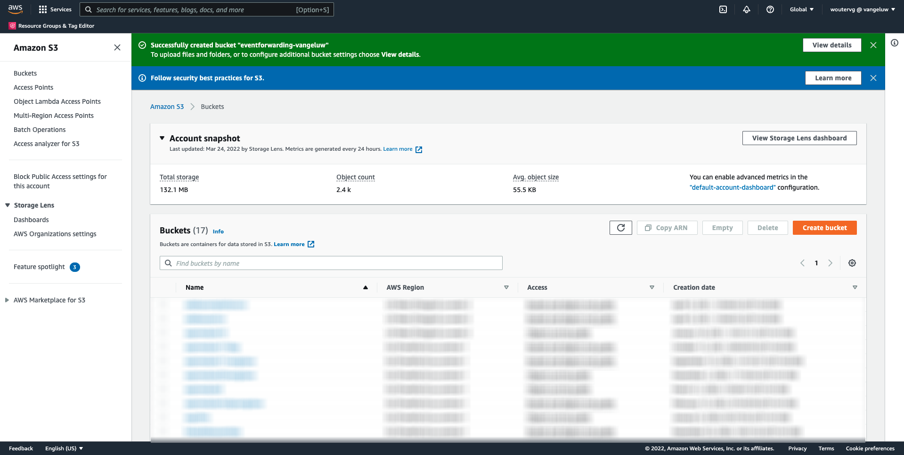
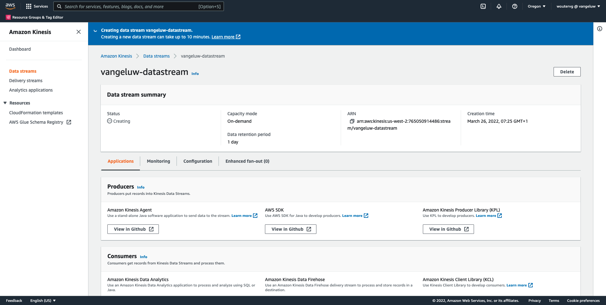
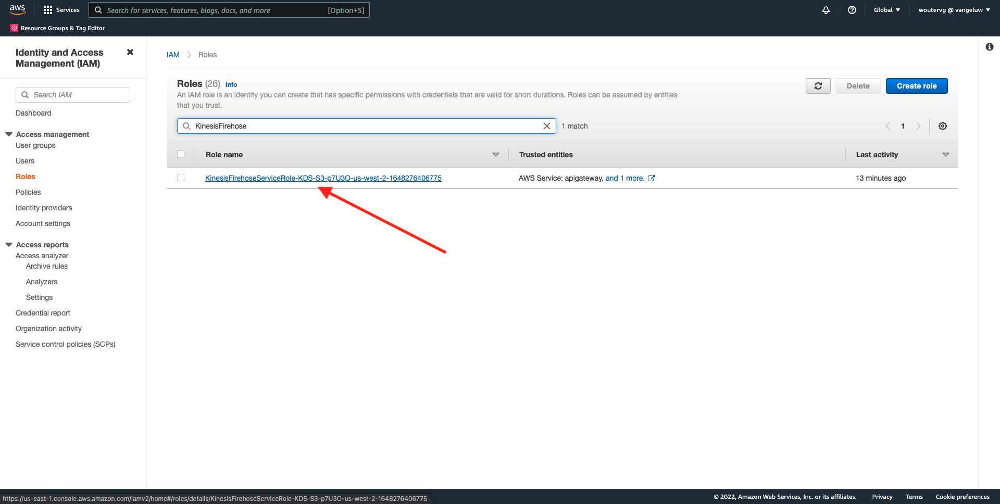
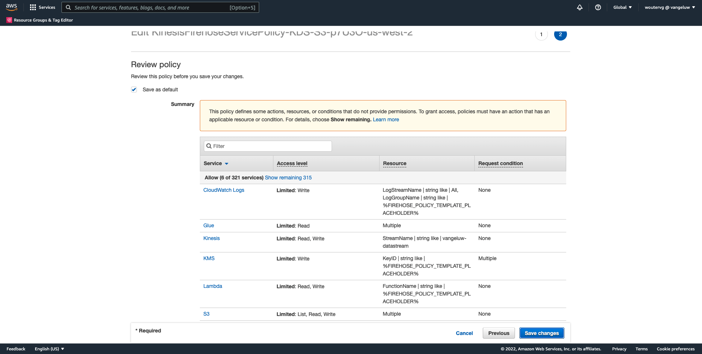
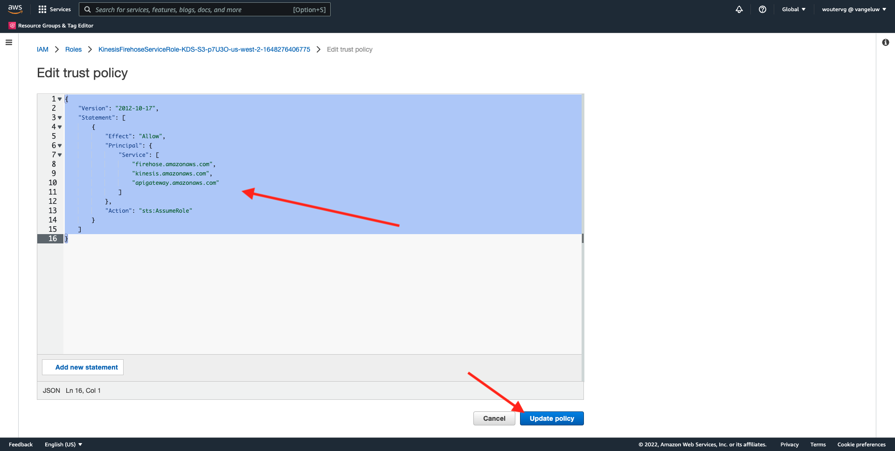
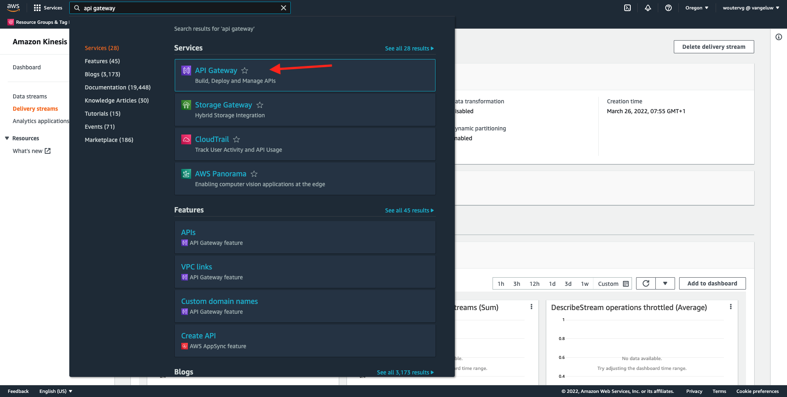
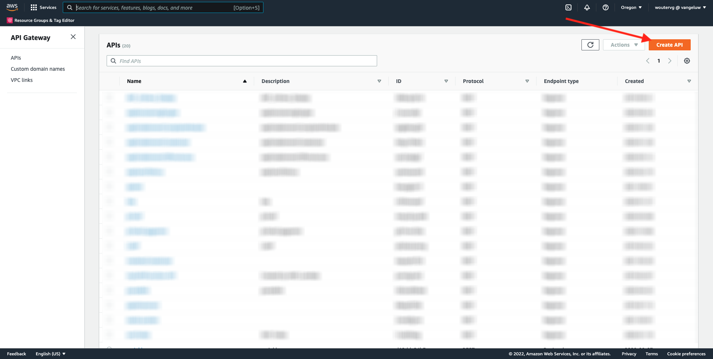
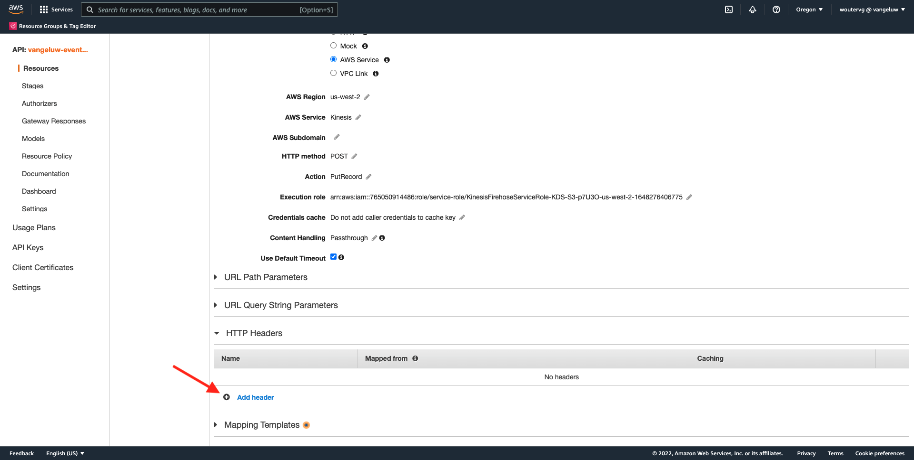
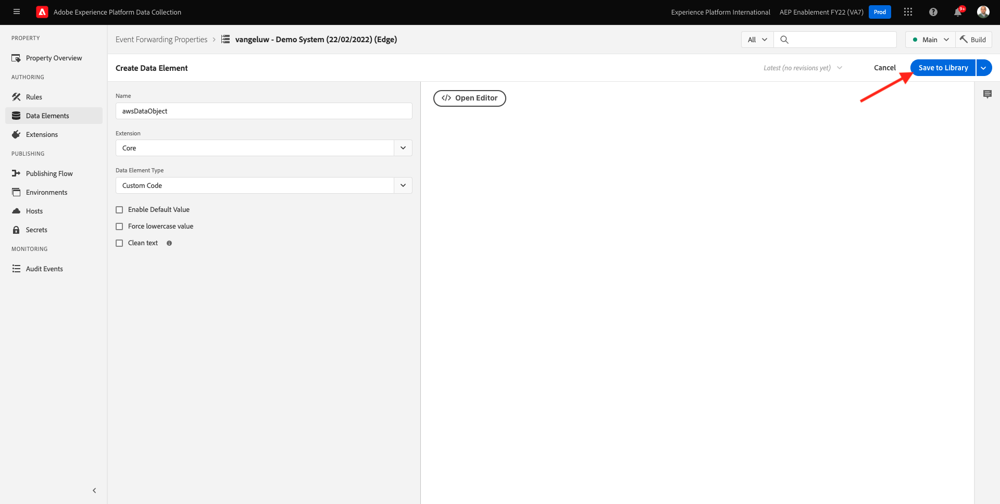
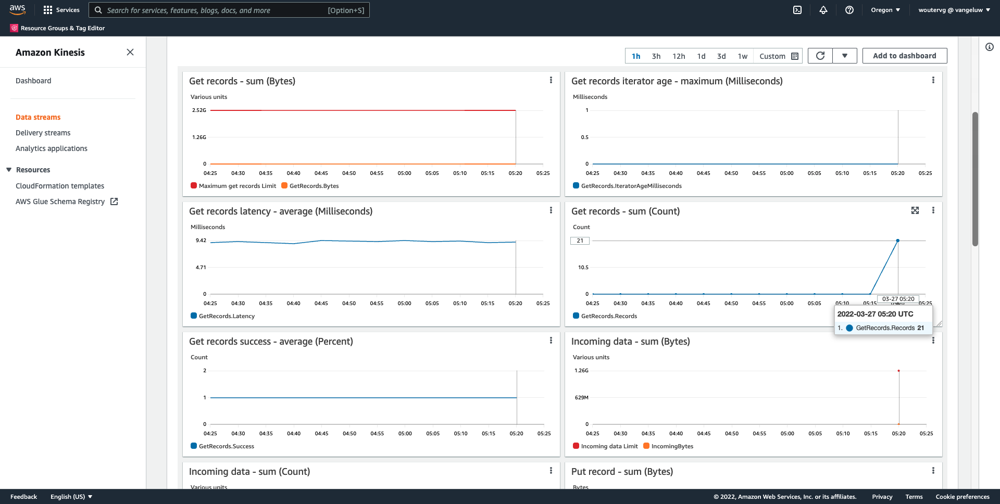

# 14.5 Weiterleiten von Ereignissen an das AWS-Ökosystem

>[!IMPORTANT]
>
>Der Abschluss dieser Übung ist optional und erfordert die Nutzung von AWS Kinesis Kosten. AWS bietet ein Konto der freien Ebene, mit dem Sie viele Dienste ohne Kosten testen und konfigurieren können. AWS Kinesis ist jedoch nicht Teil dieses Kontos der freien Ebene. Um diese Übung zu implementieren und zu testen, sind also Kosten für die Nutzung von AWS Kinesis erforderlich.

## Gut zu wissen

Adobe Experience Platform unterstützt verschiedene Amazon-Dienste als Ziel.
Kinesis und S3 sind beide [Profilexportziele](https://experienceleague.adobe.com/docs/experience-platform/destinations/destination-types.html?lang=en) und kann als Teil von Adobe Experience Platform Real-Time CDP verwendet werden.
Sie können einfach hochwertige Segmentereignisse und zugehörige Profilattribute in Ihre Systeme Ihrer Wahl einspeisen.

In diesem Hinweis erfahren Sie, wie Sie Ihren eigenen Amazon Kinesis-Stream einrichten, um Ereignisdaten aus dem Adobe Experience Platform Edge-Ökosystem an ein Cloud-Speicher-Ziel wie Amazon S3 zu streamen. Dies ist nützlich, wenn Sie Erlebnisereignisse aus Web- und mobilen Eigenschaften erfassen und zur Analyse und operativen Berichterstellung in Ihren Datensatz übertragen möchten. Datalakes erfassen Daten in der Regel im Batch-Modus mit großen täglichen Dateiimporten. Sie stellen keinen öffentlichen HTTP-Endpunkt bereit, der in Verbindung mit der Ereignisweiterleitung verwendet werden könnte.

Wenn Sie die oben genannten Anwendungsfälle unterstützen, müssen gestreamte Daten gepuffert oder in eine Warteschlange gestellt werden, bevor sie in eine Datei geschrieben werden. Es muss darauf geachtet werden, dass die Datei nicht für den Schreibzugriff über mehrere Prozesse hinweg geöffnet wird. Diese Aufgabe an ein dediziertes System zu delegieren ist ideal, um eine gute Skalierung zu erreichen und gleichzeitig ein hohes Serviceniveau zu gewährleisten. Hier kommt Kinesis zur Rettung.

Amazon Kinesis Data Streams konzentriert sich auf die Erfassung und Speicherung von Datenströmen. Kinesis Data Firewalls dienen der Bereitstellung von Datenströmen an ausgewählte Ziele, z. B. S3-Behälter.

Im Rahmen dieser Übung...

- Grundlegende Einrichtung eines Kinesis-Datenstreams durchführen
- Erstellen Sie einen Firewalls-Versand-Stream und verwenden Sie den S3-Behälter als Ziel.
- Konfigurieren des Amazon API-Gateways als REST-API-Endpunkt zum Empfangen Ihrer Ereignisdaten
- Weiterleiten von Rohereignisdaten von Adobe Edge an Ihren Kinesis-Stream

## 14.5.1 Konfigurieren des AWS S3-Buckets

Navigieren Sie zu [https://console.aws.amazon.com](https://console.aws.amazon.com) und melden Sie sich mit dem zuvor erstellten Amazon-Konto an.


Nach der Anmeldung werden Sie zum **AWS Management Console**.


Im **Dienste suchen** Menü, suchen Sie nach **s3**. Klicken Sie auf das erste Suchergebnis: **S3 - Skalierbarer Speicher in der Cloud**.


Sie werden dann die **Amazon S3** homepage. Klicken **Bucket erstellen**.


Im **Bucket erstellen** müssen Sie zwei Dinge konfigurieren:

- Name: den Namen verwenden `eventforwarding---demoProfileLdap--`. In dieser Übung lautet der Bucket-Name beispielsweise **aepmodulertcdpvangeluw**
- Region: Region verwenden **EU (Frankfurt) eu-central-1**


Behalten Sie alle anderen Standardeinstellungen bei. Scrollen Sie nach unten und klicken Sie auf **Behälter erstellen**.


Sie werden sehen, wie Ihr Bucket erstellt wird und zur Amazon S3-Homepage weitergeleitet wird.



## 14.5.2 Konfigurieren des AWS Kinesis Data Streams

Im **Dienste suchen** Menü, suchen Sie nach **Kinesis**. Klicken Sie auf das erste Suchergebnis: **Kinesis - Arbeiten mit Echtzeit-Streaming-Daten**.


Auswählen **Kinesis Data Streams**. Klicken **Datenstrom erstellen**.


Für **Datenstroamname**, verwenden `--demoProfileLdap---datastream`.


Die anderen Einstellungen müssen nicht geändert werden. Scrollen Sie nach unten und klicken Sie auf **Datenstrom erstellen**.


Dann wirst du das sehen. Sobald Ihr Datenstrom erfolgreich erstellt wurde, können Sie mit der nächsten Übung fortfahren.



## 14.5.3 Konfigurieren des AWS Firewalls-Bereitstellungs-Streams

Im **Dienste suchen** Menü, suchen Sie nach **Kinesis**. Klicken **Kinesis Data Firewalls**.


Klicken **Versandstream erstellen**.


Für **Quelle** auswählen **Amazon Kinesis Data Streams**. Für **Ziel** auswählen **Amazon S3**. Klicken **Durchsuchen** , um Ihren Daten-Stream auszuwählen.


Wählen Sie Ihren Daten-Stream aus. Klicken **Auswählen**.


Dann wirst du das sehen. Speichern Sie die **Name des Versand-Streams** wie Sie es später brauchen werden.


Scrollen Sie nach unten, bis Sie **Zieleinstellungen**. Klicken **Durchsuchen** , um Ihren S3-Behälter auszuwählen.


Wählen Sie Ihren S3-Bucket aus und klicken Sie auf **Auswählen**.


Dann wirst du so etwas sehen. Aktualisieren Sie die folgenden Einstellungen:

- Dynamische Partitionierung: auf **Aktiviert**
- Mehrfachdatensatzdeaggregation: auf **Behinderte**
- Neues Trennzeichen: auf **Aktiviert**
- Inline-Parsing für JSON: auf **Aktiviert**


Scrollen Sie ein wenig nach unten, dann sehen Sie das hier. Aktualisieren Sie die folgenden Einstellungen:

- Dynamische Partitionierungsschlüssel
   - Schlüsselname: **dynamicPartitioningKey**
   - JQ-Ausdruck: **.dynamicPartitioningKey**
- S3-Bucket-Präfix: den folgenden Code hinzufügen:

```bash
!{partitionKeyFromQuery:dynamicPartitioningKey}/!{timestamp:yyyy}/!{timestamp:MM}/!{timestamp:dd}/!{timestamp:HH}/}
```

- S3-Bucket-Fehlerausgabepräfix: auf **error**


Scrollen Sie abschließend noch ein wenig nach unten und klicken Sie auf **Versandstream erstellen**


Nach einigen Minuten wird Ihr Versand-Stream erstellt und **Aktiv**.


## 14.5.4 Konfigurieren der AWS IAM-Rolle

Im **Dienste suchen** Menü, suchen Sie nach **iam**. Klicken **API-Gateway**.


Klicken **Rollen**.


Suchen Sie nach Ihrer **KinesisFireschlauch** Rolle. Klicken Sie darauf, um es zu öffnen.



Klicken Sie auf den Namen Ihrer Berechtigungsrichtlinie , um sie zu öffnen.


Klicken Sie im sich öffnenden Bildschirm auf **Richtlinie bearbeiten**.


under **Kinesis** - **Aktionen** stellen sicher, dass **Schreiben** Berechtigungen für **PutRecord** aktiviert ist. Klicken **Überprüfungsrichtlinie**.


Klicken Sie auf **Änderungen speichern**.



Du wirst dann wieder hier sein. Klicken **Rollen**.


Suchen Sie nach Ihrer **KinesisFireschlauch** Rolle. Klicken Sie darauf, um es zu öffnen.


Navigieren Sie zu **Vertrauensbeziehungen** und klicken Sie auf **Vertrauensrichtlinie bearbeiten**.


Überschreiben Sie die aktuelle Vertrauensrichtlinie, indem Sie diesen Code einfügen, um den vorhandenen Code zu ersetzen:

```json
{
	"Version": "2012-10-17",
	"Statement": [
		{
			"Effect": "Allow",
			"Principal": {
				"Service": [
                    "firehose.amazonaws.com",
                    "kinesis.amazonaws.com",
                    "apigateway.amazonaws.com"
                ]
			},
			"Action": "sts:AssumeRole"
		}
	]
}
```

Klicken **Richtlinie aktualisieren**



Dann wirst du das sehen. Sie müssen die **ARN** für diese Rolle im nächsten Schritt.


## 14.5.5 AWS API Gateway konfigurieren

Amazon API Gateway ist ein AWS-Dienst zum Erstellen, Veröffentlichen, Warten, Überwachen und Sichern von REST-, HTTP- und WebSocket-APIs beliebiger Größe. API-Entwickler können APIs erstellen, die auf AWS oder andere Webdienste zugreifen, sowie Daten, die in der AWS Cloud gespeichert sind.

Sie stellen den Kinesis-Datenstrom jetzt über einen HTTPS-Endpunkt im Internet bereit, der dann direkt von Adobe-Diensten wie der Ereignisweiterleitung genutzt werden kann.

Im **Dienste suchen** Menü, suchen Sie nach **API-Gateway**. Klicken **API-Gateway**.



Dann wirst du so etwas sehen. Klicken **API erstellen**.



Klicken **Build** auf **REST-API** Karte.


Dann wirst du das sehen. Füllen Sie die Einstellungen wie folgt aus:

- Wählen Sie das Protokoll aus: select **REST**
- Neue API erstellen: select **Neue API**
- Einstellungen:
   - API-Name: use `--demoProfileLdap---eventforwarding`
   - Endpunkttyp: select **Region**

Klicken **API erstellen**.


Dann wirst du das sehen. Klicken **Aktionen** und klicken Sie anschließend auf **Ressource erstellen**.


Dann wirst du das sehen. Satz **Ressourcenname** nach **stream**. Klicken **Ressource erstellen**.


Dann wirst du das sehen. Klicken **Aktionen** und klicken Sie anschließend auf **Methode erstellen**.


Wählen Sie im Dropdown-Menü **POST** und klicken Sie auf **v** Schaltfläche.


Dann wirst du das sehen. Füllen Sie die Einstellungen wie folgt aus:

- Integrationstyp: **AWS-Dienst**
- Region AWS: Wählen Sie in diesem Fall die Region aus, die vom Kinesis Data Stream verwendet wird: **us-west-2**
- AWS-Dienst: select **Kinesis**
- AWS-Subdomäne: leer lassen
- HTTP-Methode: select **POST**
- Aktionstyp: select **Aktionsname verwenden**
- Aktion: enter **PutRecord**
- Ausführungsrolle: einfügen **ARN** der Ausführungsrolle, die von Ihrem Kinesis Data Firewalls verwendet wird, wie in der vorherigen Übung beschrieben
- Content Handling: select **Durchgang**
- Use Default Timeout: Aktivieren des Kontrollkästchens

Klicken Sie auf **Speichern**.


Dann wirst du das sehen. Klicken **Integrationsanfrage**.


Klicken **HTTP-Header**.


Scrollen Sie nach unten und klicken Sie auf **Header hinzufügen**.



Satz **Name** nach **Content-Type**, set **Zugeordnet von** nach `'application/x-amz-json-1.1'`. Klicken Sie auf **v** zum Speichern der Änderungen.


Dann wirst du das sehen. Für **Passwort des Anfragetexts** auswählen **Wenn keine Vorlagen definiert sind (empfohlen)**. Klicken Sie anschließend auf **Zuordnungsvorlage hinzufügen**.


under **Content-Type**, eingeben **application/json**. Klicken Sie auf **v** zum Speichern der Änderungen.


Scrollen Sie nach unten, um ein Fenster mit dem Code-Editor zu finden. Fügen Sie den folgenden Code dorthin ein:

```json
{
  "StreamName": "$input.path('StreamName')",
  "Data": "$util.base64Encode($input.json('$.Data'))",
  "PartitionKey": "$input.path('$.PartitionKey')"
}
```

Klicken Sie auf **Speichern**.


Scrollen Sie nach oben und klicken Sie auf **&lt;- Methodenausführung** zurück.


Klicken **TEST**.


Scrollen Sie nach unten und fügen Sie diesen Code unter ein. **Anfrageinhalt**. Klicken Sie auf **Testen**.

```json
{
  "Data": {
    "message": "Hello World",
    "dynamicPartitioningKey": "v2"
  },
  "PartitionKey": "1",
  "StreamName": "--demoProfileLdap---datastream"
}
```


Dann sehen Sie ein ähnliches Ergebnis:


Dann wirst du das sehen. Klicken **Aktionen** und klicken Sie anschließend auf **API bereitstellen**.


Für **Bereitstellungsphase** auswählen **Neue Phase**. As **Staging-Name**, eingeben **prod**. Klicken **Bereitstellen**.


Dann wirst du das sehen. Klicken Sie auf **Änderungen speichern**. FYI: Die URL im Bild ist die URL, an die Daten gesendet werden sollen (in diesem Beispiel: https://vv1i5vwg2k.execute-api.us-west-2.amazonaws.com/prod).


Sie können Ihre Einrichtung mithilfe der folgenden cURL-Anfrage testen. Sie müssen lediglich die folgende URL durch Ihre ersetzen. `https://vv1i5vwg2k.execute-api.us-west-2.amazonaws.com/prod` in diesem Beispiel und fügen Sie `/stream` am Ende der URL.

```json
curl --location --request POST 'https://vv1i5vwg2k.execute-api.us-west-2.amazonaws.com/prod/stream' \
--header 'Content-Type: application/json' \
--data-raw '{
    "Data": {
        "userid": "--demoProfileLdap--@adobe.com",
        "firstName":"--demoProfileLdap--",
        "offerName":"10% off on outdoor gears",
        "offerCode": "10OFF-SPRING",
        "dynamicPartitioningKey": "campaign"
    },
    "PartitionKey": "1",
    "StreamName": "--demoProfileLdap---datastream"
}'
```

Fügen Sie den oben aktualisierten Code in ein Terminal-Fenster ein und drücken Sie die Eingabetaste. Diese Antwort wird Ihnen dann ähnlich der Antwort angezeigt, die Sie beim obigen Test sehen konnten.


## 14.5.6 Eigenschaft &quot;Ereignisweiterleitung&quot;aktualisieren

Sie können jetzt über das AWS API Gateway für Ihren AWS Kinesis-Datenstrom aktivieren, damit Sie Ihre Roh-Erlebnisereignisse jetzt in das AWS-Ökosystem senden können. Mithilfe von Real-Time CDP-Verbindungen und Ereignisweiterleitung können Sie jetzt auf einfache Weise die Ereignisweiterleitung zum neu erstellten AWS API Gateway-Endpunkt aktivieren.

### 14.5.6.1 Eigenschaft &quot;Ereignisweiterleitung&quot;aktualisieren: Erstellen eines Datenelements

Navigieren Sie zu [https://experience.adobe.com/#/data-collection/](https://experience.adobe.com/#/data-collection/) und gehen Sie zu **Ereignisweiterleitung**. Suchen Sie die Eigenschaft &quot;Ereignisweiterleitung&quot;und klicken Sie darauf, um sie zu öffnen.


Gehen Sie im linken Menü zu **Datenelemente**. Klicken **Datenelement hinzufügen**.


Anschließend wird ein neues Datenelement angezeigt, das konfiguriert werden soll.


Wählen Sie Folgendes aus:

- Als **Name**, eingeben **awsDataObject**.
- Als **Erweiterung** auswählen **Core**.
- Als **Datenelementtyp** auswählen **Benutzerspezifischer Code**.

Das wirst du jetzt haben. Klicken **&lt;/> Editor öffnen**.


Fügen Sie im Editor den folgenden Code in Zeile 3 ein. Klicken Sie auf **Speichern**.

```javascript
const newObj = {...arc.event.xdm, dynamicPartitioningKey: "event_forwarding"}
return JSON.stringify(newObj);
```


>[!NOTE]
>
>Im obigen Pfad wird ein Verweis auf **Bogen**. **Bogen** steht für Adobe Resource Context und **Bogen** steht immer für das höchste verfügbare Objekt, das im serverseitigen Kontext verfügbar ist. Anreicherungen und Umwandlungen können hinzugefügt werden. **Bogen** -Objekt, das die Datenerfassungsserverfunktionen von Adobe Experience Platform verwendet.
>
>Im obigen Pfad wird ein Verweis auf **event**. **event** steht für ein eindeutiges Ereignis und Adobe Experience Platform Data Collection Server wertet jedes Ereignis immer einzeln aus. Manchmal wird Ihnen ein Verweis auf **events** in der vom Web SDK Client Side gesendeten Payload, aber bei der Adobe Experience Platform-Datenerfassungs-Ereignisweiterleitung wird jedes Ereignis einzeln ausgewertet.

Du wirst dann wieder hier sein. Klicken **Speichern** oder **In Bibliothek speichern**.



### 14.5.6.2 Eigenschaft des Adobe Experience Platform-Datenerfassungsservers aktualisieren: Regel aktualisieren

Gehen Sie im linken Menü zu **Regeln**. Klicken Sie auf , um die Regel zu öffnen. **Alle Seiten** , die Sie in einer der vorherigen Übungen erstellt haben.


Dann wirst du das sehen. Klicken Sie auf **+** -Symbol, um eine neue Aktion hinzuzufügen.


Dann wirst du das sehen. Wählen Sie Folgendes aus:

- Wählen Sie die **Erweiterung**: **Adobe Cloud Connector**.
- Wählen Sie die **Aktionstyp**: **Abrufen eines Aufrufs**.

Das sollte dir das geben **Name**: **Adobe Cloud Connector - Abrufen eines Aufrufs**. Sie sollten jetzt Folgendes sehen:


Konfigurieren Sie als Nächstes Folgendes:

- Ändern Sie die Anforderungsmethode von GET in **POST**
- Geben Sie die URL des AWS API Gateway-Endpunkts ein, den Sie in einem der vorherigen Schritte erstellt haben und der wie folgt aussieht: `https://vv1i5vwg2k.execute-api.us-west-2.amazonaws.com/prod/stream`

Du solltest das jetzt haben. Navigieren Sie als Nächstes zu **Kopfzeilen**.


Fügen Sie unter Kopfzeilen eine neue Kopfzeile mit Schlüssel hinzu **Content-Type** und Wert **application/json**. Navigieren Sie als Nächstes zu **body**.


Dann wirst du das sehen. Fügen Sie den folgenden Code in das Feld ein **Hauptteil (roh)**. Klicken Sie auf **Änderungen beibehalten**.

```json
{
    "Data":{{awsDataObject}},
    "PartitionKey": "1",
    "StreamName": "--demoProfileLdap---datastream"
}
```


Du wirst dann wieder hier sein sehen. Klicken **Speichern** oder **In Bibliothek speichern**.


Sie haben Ihre erste Regel jetzt in einer Eigenschaft für die Ereignisweiterleitung konfiguriert. Navigieren Sie zu **Veröffentlichungsfluss** , um Ihre Änderungen zu veröffentlichen.
Öffnen Sie Ihre Entwicklungsbibliothek durch Klicken auf **Main**.


Klicken Sie auf **Alle geänderten Ressourcen hinzufügen** -Schaltfläche, nach der Ihre Änderungen an Regeln und Datenelementen in dieser Bibliothek angezeigt werden. Klicken Sie anschließend auf **Speichern und erstellen für Entwicklung**. Ihre Änderungen werden jetzt bereitgestellt.


Nach einigen Minuten werden Sie feststellen, dass die Implementierung abgeschlossen ist und getestet werden kann.


## 14.5.7 Testen der Konfiguration

Navigieren Sie zu [https://builder.adobedemo.com/projects](https://builder.adobedemo.com/projects). Nach der Anmeldung bei Ihrer Adobe ID sehen Sie dies. Klicken Sie auf Ihr Website-Projekt, um es zu öffnen.


Sie können nun den unten stehenden Fluss ausführen, um auf die Website zuzugreifen. Klicken **Integrationen**.


Im **Integrationen** müssen Sie die Datenerfassungseigenschaft auswählen, die in Übung 0.1 erstellt wurde.


Sie werden dann Ihre Demowebsite öffnen sehen. Wählen Sie die URL aus und kopieren Sie sie in die Zwischenablage.


Öffnen Sie ein neues Inkognito-Browserfenster.


Fügen Sie die URL Ihrer Demo-Website ein, die Sie im vorherigen Schritt kopiert haben. Sie werden dann aufgefordert, sich mit Ihrer Adobe ID anzumelden.


Wählen Sie Ihren Kontotyp aus und schließen Sie den Anmeldevorgang ab.


Sie sehen dann Ihre Website in einem Inkognito-Browser-Fenster geladen. Für jede Demonstration müssen Sie ein neues Inkognito-Browser-Fenster verwenden, um Ihre Demo-Website-URL zu laden.


Wenn Sie die Entwickleransicht des Browsers öffnen, können Sie Netzwerkanforderungen wie unten angegeben überprüfen. Wenn Sie den Filter verwenden **interact** angezeigt, sehen Sie die Netzwerkanforderungen, die vom Adobe Experience Platform-Datenerfassungsclient an die Adobe Edge gesendet werden.


Wenn Sie die Rohdaten-Payload auswählen, navigieren Sie zu [https://jsonformatter.org/json-pretty-print](https://jsonformatter.org/json-pretty-print) und fügen Sie die Payload ein. Klicken **Make Pretty**. Sie sehen dann die JSON-Payload, die **events** -Objekt und **xdm** -Objekt. In einem der vorherigen Schritte haben Sie bei der Definition des Datenelements die Referenz verwendet **arc.event.xdm**, was dazu führt, dass Sie die **xdm** -Objekt dieser Payload.


Wechseln Sie in der Ansicht zu **AWS**. Durch Öffnen Ihres Datenstreams und Aufrufen der **Überwachung** angezeigt, wird nun der eingehende Traffic angezeigt.



Wenn Sie dann Ihren Versand-Stream öffnen und zum **Überwachung** angezeigt, wird auch der eingehende Traffic angezeigt.


Wenn Sie sich schließlich Ihren S3-Bucket ansehen, werden Sie feststellen, dass dort Dateien infolge Ihrer Datenerfassung erstellt werden.


Wenn Sie eine solche Datei herunterladen und sie mit einem Texteditor öffnen, sehen Sie, dass sie die XDM-Payload aus den weitergeleiteten Ereignissen enthält.


Nächster Schritt: [Zusammenfassung und Vorteile](./summary.md)

[Zurück zu Modul 14](./aep-data-collection-ssf.md)

[Zu allen Modulen zurückkehren](./../../overview.md)
