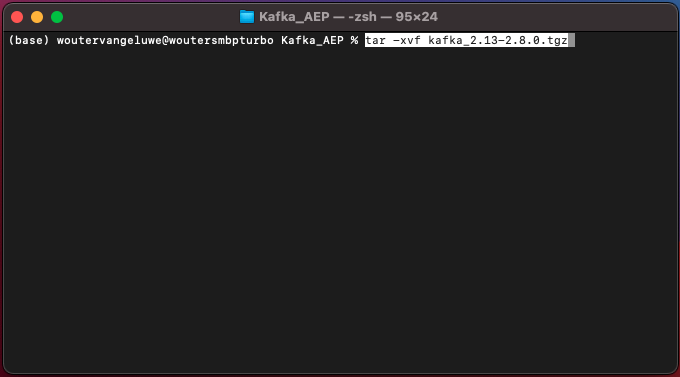
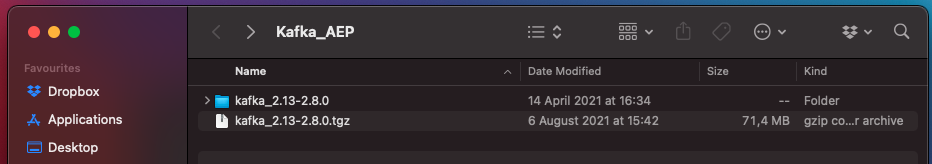
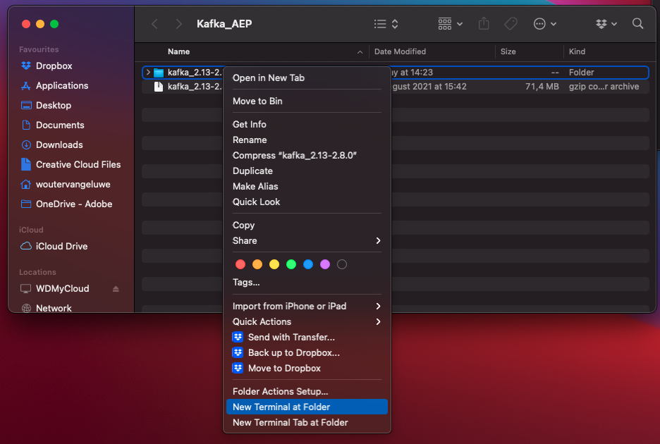
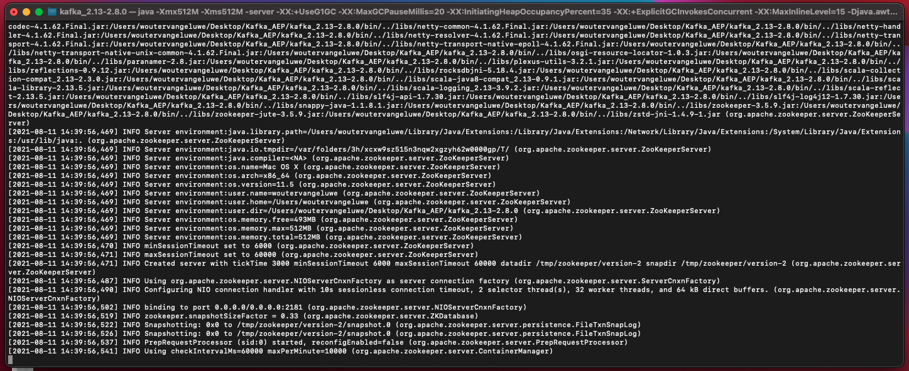
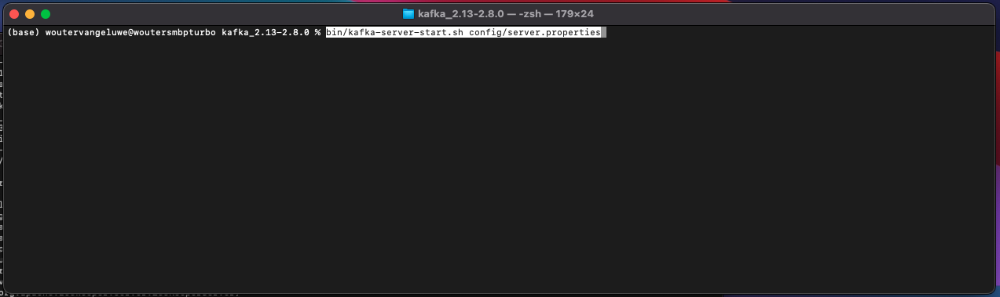
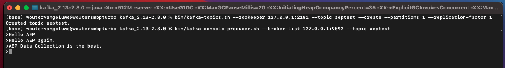

# 15.2 Kafka-Cluster installieren und konfigurieren

## 15.2.1 Apache Kafka herunterladen

Navigieren Sie zu [https://kafka.apache.org/downloads](https://kafka.apache.org/downloads) und laden Sie die neueste veröffentlichte Version herunter. Wählen Sie in diesem Fall die neueste Binärversion aus. **Scala 2.13**.

Sie werden dann zu einer Mirrorseite geführt. Klicken Sie auf den Link zum Herunterladen von Kafka.

Erstellen Sie auf Ihrem Desktop einen Ordner mit dem Namen **Kafka_AEP** und speichern Sie die heruntergeladene Datei in diesem Verzeichnis.

Öffnen Sie eine **Terminal** durch Rechtsklick auf den Ordner und Klicken auf **Neues Terminal im Ordner**.

Führen Sie diesen Befehl in Ihrem Terminal-Fenster aus, um die heruntergeladene Datei zu entpacken:

`tar -xvf kafka_2.13-3.1.0.tgz`

>[!NOTE]
>
>Überprüfen Sie, ob der obige Befehl mit der Version der heruntergeladenen Datei übereinstimmt. Wenn Ihre Version aktueller ist, müssen Sie den obigen Befehl entsprechend dieser Version aktualisieren.

Daraufhin sehen Sie Folgendes:

Nach dem Dekomprimieren dieser Datei haben Sie nun ein Verzeichnis wie dieses:

Und in diesem Verzeichnis sehen Sie diese Unterverzeichnisse:

Kehren Sie zu Ihrem Terminal-Fenster zurück. Geben Sie den folgenden Befehl ein:

`cd kafka_2.13-3.1.0`

>[!NOTE]
>
>Überprüfen Sie, ob der obige Befehl mit der Version der heruntergeladenen Datei übereinstimmt. Wenn Ihre Version aktueller ist, müssen Sie den obigen Befehl entsprechend dieser Version aktualisieren.

Geben Sie als Nächstes den Befehl ein. `bin/kafka-topics.sh`.

Sie sollten dann diese Antwort sehen. Dies bedeutet, dass Kafka ordnungsgemäß installiert ist und dass Java gut funktioniert. (Erinnerung: Sie benötigen Java 8 JDK oder Java 11 JDK installiert, damit dies funktioniert! Mithilfe des Befehls können Sie sehen, welche Java-Version Sie installiert haben. `java -version`.

## 15.2.2 Kafka starten

Um Kafka zu starten, müssen Sie Kafka Zookeeper und Kafka in dieser Reihenfolge starten.

Öffnen Sie eine **Terminal** Fenster durch Rechtsklick auf den Ordner **kafka_2.13-3.1.0** und klicken **Neues Terminal im Ordner**.

Geben Sie folgenden Befehl ein:

`bin/zookeeper-server-start.sh config/zookeeper.properties`

Daraufhin sehen Sie Folgendes:

Lassen Sie dieses Fenster offen, während Sie durch diese Übungen gehen!

Öffnen Sie eine weitere, neue **Terminal** Fenster durch Rechtsklick auf den Ordner **kafka_2.13-3.1.0** und klicken **Neues Terminal im Ordner**.

Geben Sie folgenden Befehl ein:

`bin/kafka-server-start.sh config/server.properties`

Daraufhin sehen Sie Folgendes:

Lassen Sie dieses Fenster offen, während Sie durch diese Übungen gehen!

## 15.2.3 Kafka-Thema erstellen

Öffnen Sie eine **Terminal** Fenster durch Rechtsklick auf den Ordner **kafka_2.13-3.1.0** und klicken **Neues Terminal im Ordner**.

Geben Sie diesen Befehl ein, um ein neues Kafka-Thema mit dem Namen zu erstellen **Akzeptanz**. Dieses Thema wird für Tests in dieser Übung verwendet.

`bin/kafka-topics.sh --create --topic aeptest --bootstrap-server localhost:9092`

Daraufhin wird eine ähnliche Bestätigung angezeigt:

Geben Sie diesen Befehl ein, um ein neues Kafka-Thema mit dem Namen zu erstellen **aep**. Dieses Thema wird vom Adobe Experience Platform Sink Connector verwendet, den Sie in den nächsten Übungen konfigurieren werden.

`bin/kafka-topics.sh --create --topic aep --bootstrap-server localhost:9092`

Daraufhin wird eine ähnliche Bestätigung angezeigt:

## 15.2.4 Ereignisse produzieren

Gehen Sie zurück zum Terminal-Fenster, in dem Sie Ihr erstes Kafka-Thema erstellt haben, und geben Sie den folgenden Befehl ein:

`bin/kafka-console-producer.sh --broker-list 127.0.0.1:9092 --topic aeptest`

Dann wirst du das sehen. Jede neue Zeile, gefolgt von der Schaltfläche &quot;Enter&quot;, führt zum Senden einer neuen Nachricht an das Thema **Akzeptanz**.

Eingabe `Hello AEP` und drücken Sie die Eingabetaste. Ihr erstes Ereignis wurde jetzt an Ihre lokale Kafka-Instanz zum Thema gesendet **Akzeptanz**.

Eingabe `Hello AEP again.` und drücken Sie die Eingabetaste.

Eingabe `AEP Data Collection is the best.` und drücken Sie die Eingabetaste.

Sie haben nun 3 Veranstaltungen zum Thema **Akzeptanz**. Diese Ereignisse können jetzt von einer Anwendung genutzt werden, die diese Daten möglicherweise benötigt.

Klicken Sie auf der Tastatur auf `Control` und `C` zur gleichen Zeit, um Ihren Hersteller zu schließen.

## 15.2.4 Verbrauchsereignisse

Geben Sie im selben Terminal-Fenster, das Sie zum Erstellen von Ereignissen verwendet haben, den folgenden Befehl ein:

`bin/kafka-console-consumer.sh --bootstrap-server 127.0.0.1:9092 --topic aeptest --from-beginning`

Dann sehen Sie alle Nachrichten, die in der vorherigen Übung für das Thema erstellt wurden **Akzeptanz** im Verbraucher angezeigt. So wirkt Apache Kafka: ein Hersteller Ereignisse in einer Pipeline erstellt und ein Verbraucher diese Ereignisse verbraucht.

Klicken Sie auf der Tastatur auf `Control` und `C` zur gleichen Zeit, um Ihren Hersteller zu schließen.

In dieser Übung haben Sie alle Grundlagen durchlaufen, um einen lokalen Kafka-Cluster einzurichten, ein Kafka-Thema zu erstellen, Ereignisse zu produzieren und Ereignisse zu nutzen.

Ziel dieses Moduls ist es zu simulieren, was passieren würde, wenn eine echte Organisation bereits einen Apache Kafka-Cluster implementiert hat und Daten aus ihrem Kafka-Cluster in Adobe Experience Platform streamen möchte.

Um eine solche Implementierung zu erleichtern, wurde ein Adobe Experience Platform Sink Connector erstellt, der mithilfe von Kafka Connect implementiert werden kann. Die Dokumentation zu diesem Adobe Experience Platform Sink Connector finden Sie hier: [https://github.com/adobe/experience-platform-streaming-connect](https://github.com/adobe/experience-platform-streaming-connect).

In den nächsten Übungen implementieren Sie alles, was Sie für die Verwendung dieses Adobe Experience Platform Sink-Connectors benötigen, aus Ihrem eigenen lokalen Kafka-Cluster.

Schließen Sie Ihr Terminal-Fenster.

Du hast diese Übung beendet.

Nächster Schritt: [15.3 HTTP-API-Endpunkt in Adobe Experience Platform konfigurieren](./ex3.md)

[Zurück zu Modul 15](./aep-apache-kafka.md)

[Zu allen Modulen zurückkehren](../../overview.md)
