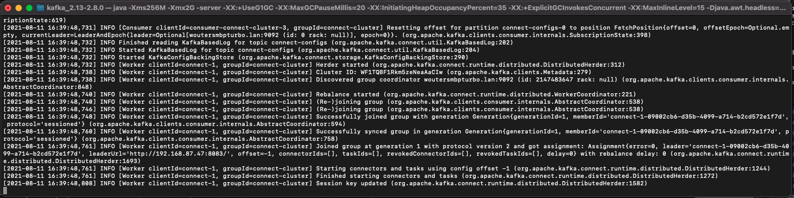
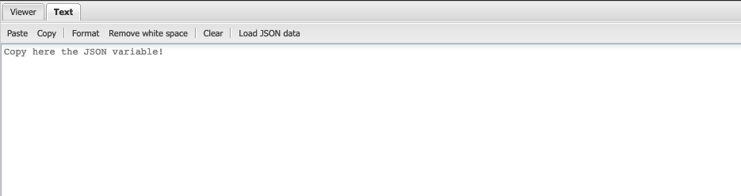

# 15.4 Installieren und Konfigurieren von Kafka Connect und Adobe Experience Platform Sink Connector

## 15.4.1 Adobe Experience Platform Sink Connector herunterladen

Navigieren Sie zu [https://github.com/adobe/experience-platform-streaming-connect/releases](https://github.com/adobe/experience-platform-streaming-connect/releases) und laden Sie die neueste offizielle Version des Adobe Experience Platform Sink Connectors herunter.


Platzieren Sie die Download-Datei, **streaming-connect-sink-0.0.14-java-11.jar** auf Ihren Desktop.


## 15.4.2 Kafka Connect konfigurieren

Navigieren Sie zum Ordner auf Ihrem Desktop mit dem Namen **Kafka_AEP** und zum Ordner navigieren `kafka_2.13-3.1.0/config`.
Öffnen Sie in diesem Ordner die Datei . **connect-distribution.properties** mit einem beliebigen Texteditor verwenden.


Navigieren Sie im Texteditor zu den Zeilen 34 und 35 und stellen Sie sicher, dass die Felder festgelegt sind. `key.converter.schemas.enable` und `value.converter.schemas.enable` nach `false`

```json
key.converter.schemas.enable=false
value.converter.schemas.enable=false
```

Speichern Sie Ihre Änderungen in dieser Datei.


Gehen Sie anschließend zurück zum Ordner . `kafka_2.13-3.1.0` und erstellen manuell einen neuen Ordner und benennen Sie ihn. `connectors`.


Klicken Sie mit der rechten Maustaste auf den Ordner und klicken Sie auf **Neues Terminal im Ordner**.


Dann wirst du das sehen. Geben Sie den Befehl ein `pwd` , um den vollständigen Pfad für diesen Ordner abzurufen. Wählen Sie den vollständigen Pfad aus und kopieren Sie ihn in die Zwischenablage.


Kehren Sie zum Texteditor zurück, zur -Datei **connect-distribution.properties** und scrollen Sie zur letzten Zeile herunter (Zeile 86 im Screenshot). Sie sollten den Kommentar für die Zeile, die mit `# plugin.path=` und Sie sollten den vollständigen Pfad zum Ordner mit dem Namen `connectors`. Das Ergebnis sollte in etwa wie folgt aussehen:

`plugin.path=/Users/woutervangeluwe/Desktop/Kafka_AEP/kafka_2.13-3.1.0/connectors`

Speichern Sie Ihre Änderungen in der Datei **connect-distribution.properties** und schließen Sie den Texteditor.


Kopieren Sie als Nächstes die neueste offizielle Version des Adobe Experience Platform Sink Connectors, die Sie in den Ordner mit dem Namen `connectors`. Die Datei, die Sie zuvor heruntergeladen haben, heißt **streaming-connect-sink-0.0.14-java-11.jar** können Sie sie einfach in die `connectors` Ordner.


Öffnen Sie als Nächstes ein neues Terminal-Fenster auf der Ebene der **kafka_2.13-3.1.0** Ordner. Klicken Sie mit der rechten Maustaste auf diesen Ordner und klicken Sie auf **Neues Terminal im Ordner**.

Fügen Sie im Terminal-Fenster diesen Befehl ein: `bin/connect-distributed.sh config/connect-distributed.properties` und klicken Sie auf **Eingabe**. Mit diesem Befehl wird Kafka Connect gestartet und die Bibliothek des Adobe Experience Platform Sink Connectors geladen.


Nach ein paar Sekunden sehen Sie etwas wie Folgendes:



## 15.4.3 Adobe Experience Platform Sink-Connector mit Postman erstellen

Sie können jetzt mit Kafka Connect über Postman interagieren. Laden Sie dazu herunter [Diese Postman-Sammlung](../../assets/postman/postman_kafka.zip) und entpacken sie auf Ihrem lokalen Computer auf dem Desktop. Sie verfügen dann über eine Datei mit dem Namen `Kafka_AEP.postman_collection.json`.


Sie müssen diese Datei in Postman importieren. Öffnen Sie dazu Postman und klicken Sie auf **Import**, die Datei per Drag-and-Drop verschieben `Kafka_AEP.postman_collection.json` in das Popup-Fenster ein und klicken Sie auf **Import**.


Diese Kollektion finden Sie dann im linken Menü von Postman. Klicken Sie auf die erste Anforderung, **GET Verfügbare Kafka Connect-Connectoren** um es zu öffnen.


Dann wirst du das sehen. Klicken Sie auf Blau **Senden** -Schaltfläche, nach der eine leere Antwort angezeigt werden sollte `[]`. Die leere Antwort ist darauf zurückzuführen, dass derzeit keine Kafka Connect-Connectoren definiert sind.


Um einen Connector zu erstellen, klicken Sie auf , um die zweite Anforderung in der Kafka-Sammlung zu öffnen. **POST Erstellen von AEP Sink Connector**. Dann wirst du das sehen. In Zeile 11, wo **&quot;aep.endpoint&quot;: &quot;&quot;** müssen Sie in die HTTP-API-Streaming-Endpunkt-URL einfügen, die Sie am Ende der Übung erhalten haben [Artikel 15 Absatz 3](./ex3.md). Die URL des HTTP-API-Streaming-Endpunkts sieht wie folgt aus: `https://dcs.adobedc.net/collection/d282bbfc8a540321341576275a8d052e9dc4ea80625dd9a5fe5b02397cfd80dc`.


Nach dem Einfügen sollte der Hauptteil Ihrer Anforderung wie folgt aussehen: Klicken Sie auf Blau **Senden** -Schaltfläche, um Ihren Connector zu erstellen. Sie erhalten eine sofortige Antwort von der Erstellung Ihres Connectors.


Klicken Sie auf die erste Anforderung, **GET Verfügbare Kafka Connect-Connectoren** , um es erneut zu öffnen, und klicken Sie auf &quot;Blau&quot; **Senden** erneut. Sie werden sehen, dass ein Kafka Connect-Connector erstellt wurde.


Öffnen Sie als Nächstes die dritte Anforderung in der Kafka-Sammlung, **GET Check Kafka Connect Connector Status**. Klicken Sie auf Blau **Senden** -Schaltfläche, erhalten Sie eine Antwort wie die unten stehende, in der Sie darauf hingewiesen werden, dass der Connector ausgeführt wird.


## 15.4.4 Ereignis produzieren

Neu öffnen **Terminal** Fenster durch Rechtsklick auf den Ordner **kafka_2.13-3.1.0** und klicken **Neues Terminal im Ordner**.


Geben Sie den folgenden Befehl ein:

`bin/kafka-console-producer.sh --broker-list 127.0.0.1:9092 --topic aep`


Dann wirst du das sehen. Jede neue Zeile, gefolgt von der Schaltfläche &quot;Enter&quot;, führt zum Senden einer neuen Nachricht an das Thema **aep**.


Jetzt können Sie eine Nachricht senden, die vom Adobe Experience Platform Sink Connector genutzt wird und in Echtzeit in Adobe Experience Platform aufgenommen wird.

Lass uns ein kleines Demo machen, um das zu testen.

Navigieren Sie zu [https://builder.adobedemo.com/projects](https://builder.adobedemo.com/projects). Nach der Anmeldung bei Ihrer Adobe ID sehen Sie dies. Klicken Sie auf Ihr Website-Projekt, um es zu öffnen.


Im **Screens** Seite, klicken Sie auf **Ausführen**.


Sie werden dann Ihre Demowebsite öffnen sehen. Wählen Sie die URL aus und kopieren Sie sie in die Zwischenablage.


Öffnen Sie ein neues Inkognito-Browserfenster.


Fügen Sie die URL Ihrer Demo-Website ein, die Sie im vorherigen Schritt kopiert haben. Sie werden dann aufgefordert, sich mit Ihrer Adobe ID anzumelden.


Wählen Sie Ihren Kontotyp aus und schließen Sie den Anmeldevorgang ab.


Sie sehen dann Ihre Website in einem Inkognito-Browser-Fenster geladen. Für jede Demonstration müssen Sie ein neues Inkognito-Browser-Fenster verwenden, um Ihre Demo-Website-URL zu laden.


Klicken Sie auf das Symbol für das Adobe-Logo oben links im Bildschirm, um den Profilanzeige zu öffnen.


Sehen Sie sich das Bedienfeld Profil-Viewer und das Echtzeit-Kundenprofil mit dem **Experience Cloud-ID** als primäre Kennung für diesen derzeit unbekannten Kunden.


Gehen Sie zur Seite Registrieren/Anmelden . Klicken **KONTO ERSTELLEN**.


Füllen Sie Ihre Details aus und klicken Sie auf **registrieren** Danach werden Sie zur vorherigen Seite weitergeleitet.


Öffnen Sie das Bedienfeld Profil-Viewer und wechseln Sie zum Echtzeit-Kundenprofil. Im Bedienfeld &quot;Profil-Viewer&quot;sollten alle Ihre personenbezogenen Daten angezeigt werden, z. B. Ihre neu hinzugefügten E-Mail- und Telefonkennungen.


Möglicherweise werden einige Erlebnisereignisse auf der Grundlage vergangener Aktivitäten angezeigt.


Ändern wir das und senden ein Callcenter-Erlebnisereignis von Kafka nach Adobe Experience Platform.

Nehmen Sie die folgende Beispielnutzlast für Erlebnisereignisse und kopieren Sie sie in einen Texteditor.

```json
{
  "header": {
    "datasetId": "61fe23fd242870194a6d779c",
    "imsOrgId": "--aepImsOrgID--",
    "source": {
      "name": "Launch"
    },
    "schemaRef": {
      "id": "https://ns.adobe.com/experienceplatform/schemas/b0190276c6e1e1e99cf56c99f4c07a6e517bf02091dcec90",
      "contentType": "application/vnd.adobe.xed-full+json;version=1"
    }
  },
  "body": {
    "xdmMeta": {
      "schemaRef": {
        "id": "https://ns.adobe.com/experienceplatform/schemas/b0190276c6e1e1e99cf56c99f4c07a6e517bf02091dcec90",
        "contentType": "application/vnd.adobe.xed-full+json;version=1"
      }
    },
    "xdmEntity": {
      "eventType": "callCenterInteractionKafka",
      "_id": "",
      "timestamp": "2022-02-23T09:54:12.232Z",
      "_experienceplatform": {
        "identification": {
          "core": {
            "phoneNumber": ""
          }
        },
        "interactionDetails": {
          "core": {
            "callCenterAgent": {
              "callID": "Support Contact - 3767767",
              "callTopic": "contract",
              "callFeeling": "negative"
            }
          }
        }
      }
    }
  }
}
```

Dann wirst du das sehen. Sie müssen zwei Felder manuell aktualisieren:

- **_id**: Setzen Sie es auf eine zufällige ID, beispielsweise `--demoProfileLdap--1234`
- **timestamp**: Aktualisieren des Zeitstempels auf das aktuelle Datum und die aktuelle Uhrzeit
- **phoneNumber**: Geben Sie die phoneNumber des Kontos ein, das gerade auf der Demowebsite erstellt wurde. Sie finden ihn im Bereich &quot;Profil-Viewer&quot;unter **Identitäten**.

Sie müssen auch diese Felder überprüfen und gegebenenfalls aktualisieren:
- **datasetId**: Sie müssen die Datensatz-ID für das Datensatzdemo-System - Ereignis-Datensatz für das Callcenter kopieren (globale Version 1.1).
- **imsOrgID**: Ihre IMS-Organisations-ID lautet `--aepImsOrgId--`

>[!NOTE]
>
>Das Feld **_id** muss für jede Datenerfassung eindeutig sein. Wenn Sie mehrere Ereignisse erzeugen, aktualisieren Sie das Feld. **_id** jedes Mal auf einen neuen eindeutigen Wert.


Sie sollten dann etwas wie Folgendes haben:


Kopieren Sie dann Ihr gesamtes Erlebnisereignis in die Zwischenablage. Der Leerraum Ihrer JSON-Payload muss entfernt werden. Dazu verwenden wir ein Online-Tool. Navigieren Sie zu [http://jsonviewer.stack.hu/](http://jsonviewer.stack.hu/) um dies zu tun.



Fügen Sie Ihr Erlebnisereignis in den Editor ein und klicken Sie auf **Leerraum entfernen**.


Wählen Sie anschließend den gesamten Ausgabetext aus und kopieren Sie ihn in die Zwischenablage.


Kehren Sie zu Ihrem Terminal-Fenster zurück.


Fügen Sie die neue Payload ohne Leerzeichen in das Terminal-Fenster ein und klicken Sie auf **Eingabe**.


Gehen Sie anschließend zurück zu Ihrer Demo-Website und aktualisieren Sie die Seite. Sie sollten jetzt ein Erlebnisereignis in Ihrem Profil sehen, unter **Sonstige Ereignisse**, wie im Folgenden gezeigt:


>[!NOTE]
>
>Wenn Ihre Callcenter-Interaktionen im Profil-Viewer-Bedienfeld angezeigt werden sollen, müssen Sie die folgende Beschriftung hinzufügen und in Ihrem Projekt nach [https://builder.adobedemo.com/projects](https://builder.adobedemo.com/projects), indem Sie zur Registerkarte wechseln **Profil-Viewer**.


Du hast diese Übung beendet.

Nächster Schritt: [Zusammenfassung und Vorteile](./summary.md)

[Zurück zu Modul 15](./aep-apache-kafka.md)

[Zu allen Modulen zurückkehren](../../overview.md)
