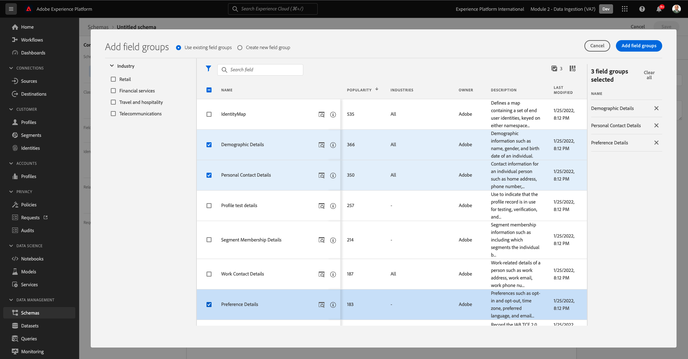
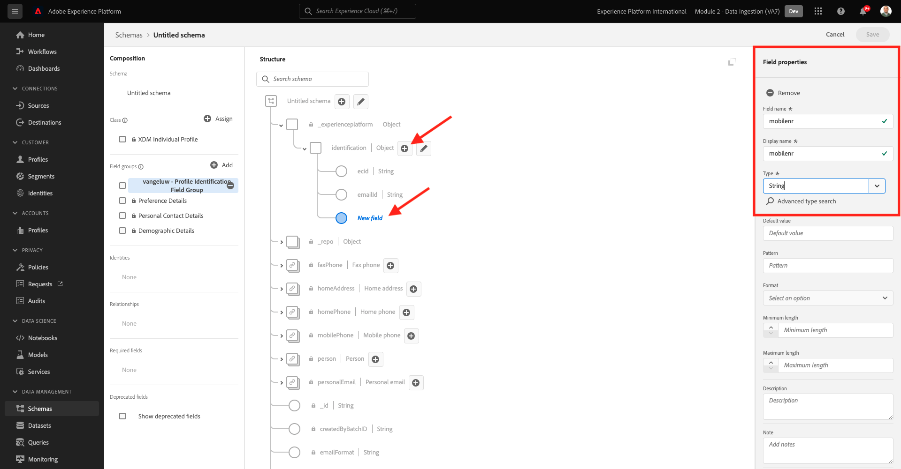
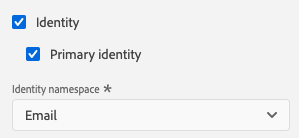
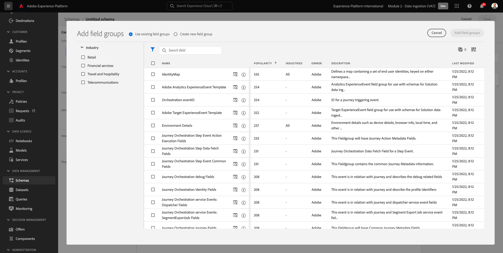
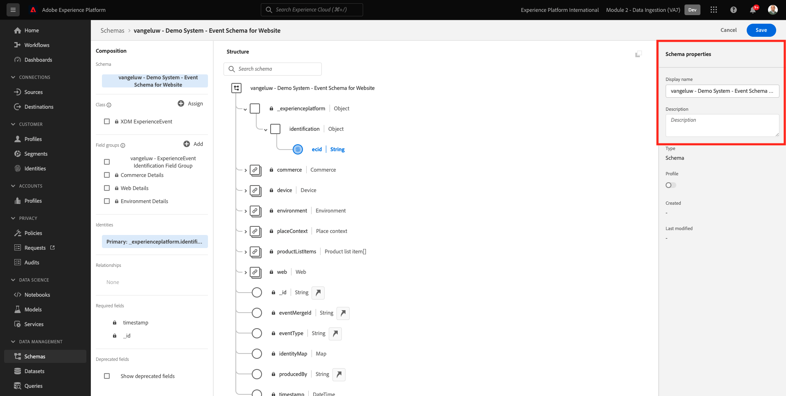

# 2.2 Konfigurieren von Schemata und Festlegen von Kennungen

In dieser Übung konfigurieren Sie die erforderlichen XDM-Schemas, um Profilinformationen und Kundenverhalten zu klassifizieren. In jedem XDM-Schema müssen Sie auch eine primäre Kennung konfigurieren, mit der alle Informationen verknüpft werden.

## Geschichte

Bevor Sie mit der Konfiguration von XDM-Schemas und dem Festlegen Primärer IDs beginnen, müssen wir über den Geschäftskontext dessen nachdenken, was wir versuchen zu tun:

- Sie möchten Daten
- Sie möchten Daten mit einem Kunden verknüpfen
- Sie möchten ein progressives Echtzeit-Kundenprofil erstellen

Es gibt zwei Arten von Daten, die wir erfassen möchten:

- Wer ist dieser Kunde?
- Was macht dieser Kunde?

Die Frage **Wer ist dieser Kunde?** ist eine sehr offene Frage, die viele Antworten hat. Wenn Ihr Unternehmen diese Frage beantworten möchte, suchen Sie nach demografischen Informationen wie Vorname, Nachname und Adresse. Aber auch für Kontaktinformationen wie E-Mail-Adresse oder Mobiltelefonnummer. Und auch für Informationen bezüglich Sprache, OptIn/OptOut und vielleicht sogar Profilbilder. Und schließlich müssen Sie wirklich wissen, wie wir diesen Kunden in den verschiedenen Systemen identifizieren, die Ihr Unternehmen verwendet.

Dasselbe gilt für die Frage **Was macht dieser Kunde?**. Es ist eine sehr offene Frage mit vielen Antworten. Wenn Ihr Unternehmen diese Frage beantworten möchte, suchen Sie nach einer Interaktion, die ein Kunde mit einer Ihrer Online- und Offline-Eigenschaften hatte. Welche Seiten oder Produkte wurden besucht? Hat dieser Kunde seinem Warenkorb ein Produkt hinzugefügt oder sogar einen Artikel gekauft? Welches Gerät und welcher Browser wurden zum Durchsuchen der Website verwendet? Nach welcher Art von Informationen sucht dieser Kunde und wie können wir diese verwenden, um diesem Kunden ein angenehmes Erlebnis zu bieten? Und schließlich müssen wir wissen, wie wir diesen Kunden in den verschiedenen Systemen identifizieren, die Ihr Unternehmen verwenden wird.

## 2.1.1 - Wer ist dieser Kunde?

Erfassen der Antwort auf **Wer ist dieser Kunde?** für Ihr Unternehmen über die Anmelde-/Anmeldeseite erfolgen.

Aus Schema-Sicht betrachten wir dies als **Klasse**. Die Frage: **Wer ist dieser Kunde?** ist etwas, das wir in der Klasse definieren **[!UICONTROL XDM Individual Profile]**.

Wenn Sie also ein XDM-Schema erstellen, um die Antwort zu erfassen **Wer ist dieser Kunde?** Zunächst müssen Sie ein Schema erstellen und definieren, das auf die Klasse verweist **[!UICONTROL XDM Individual Profile]**.

Um festzulegen, welche Art von Antworten auf diese Frage gegeben werden können, müssen Sie [!UICONTROL Feldergruppen]. [!UICONTROL Feldergruppen] sind Erweiterungen der Profil-Klasse und haben sehr spezifische Konfigurationen. demografische Informationen wie Vorname, Nachname, Geschlecht und Geburtstag sind beispielsweise Teil der [!UICONTROL Feldergruppe]: **[!UICONTROL Demografische Details]**.

Zweitens muss Ihr Unternehmen entscheiden, wie dieser Kunde identifiziert werden kann. Im Fall Ihres Unternehmens kann die Hauptkennung für einen bekannten Kunden eine bestimmte Kunden-ID sein, z. B. eine E-Mail-Adresse. Technisch gesehen gibt es jedoch andere Möglichkeiten, einen Kunden in Ihrem Unternehmen zu identifizieren, wie etwa die Verwendung einer Mobiltelefonnummer.
In diesem Labor definieren wir die E-Mail-Adresse als primäre Kennung und die Telefonnummer als sekundäre Kennung.

Schließlich ist es wichtig, den Kanal zu unterscheiden, auf dem Daten erfasst wurden. In diesem Fall sprechen wir über Website-Registrierungen und das zu definierende Schema muss **where** die Registrierungsdaten erfasst wurden. Der Kanal spielt außerdem eine wichtige Rolle bei der Beeinflussung der erfassten Daten. Daher empfiehlt es sich, Schemas für jede Kombination von Kanal, primärer Kennung und Typ der erfassten Daten zu definieren.

Auf der Grundlage der oben stehenden Elemente müssen Sie ein Schema in Adobe Experience Platform konfigurieren.

Melden Sie sich über diese URL bei Adobe Experience Platform an: [https://experience.adobe.com/platform](https://experience.adobe.com/platform).

Nach der Anmeldung landen Sie auf der Startseite von Adobe Experience Platform.

Bevor Sie fortfahren, müssen Sie eine **Sandbox**. Die auszuwählende Sandbox heißt ``--module2sandbox--``. Klicken Sie hierzu auf den Text **[!UICONTROL Produktionsprodukt]** in der blauen Zeile auf Ihrem Bildschirm. Nachdem Sie die entsprechende Sandbox ausgewählt haben, wird die Bildschirmänderung angezeigt und Sie befinden sich jetzt in Ihrer dedizierten Sandbox.

Klicken Sie in Adobe Experience Platform auf **[!UICONTROL Schemas]** im Menü auf der linken Bildschirmseite. Sie sehen die Liste der verfügbaren [!UICONTROL Schemas].

Sie sollten ein neues Schema erstellen. Um ein neues Schema zu erstellen, klicken Sie auf die Schaltfläche **[!UICONTROL + Schema erstellen]** und wählen Sie **[!UICONTROL XDM Individual Profile]**.

Nachdem Sie auf **[!UICONTROL + Schema erstellen]** -Schaltfläche ein neues Schema erstellt und Sie werden aufgefordert, ein neues auszuwählen oder zu erstellen. **Feldergruppen**.

Jetzt müssen Sie definieren, was eine Antwort auf die Frage ist **Wer ist dieser Kunde?** sollte so aussehen.
In der Einführung dieses Labors haben wir festgestellt, dass folgende Attribute erforderlich sind, um einen Kunden zu definieren:

- Demografische Informationen wie Vorname, Nachname und Adresse
- Kontaktinformationen wie Privatadresse, E-Mail-Adresse oder Mobiltelefonnummer
- Andere Informationen bezüglich Sprache, OptIn/OptOut und vielleicht sogar Profilbilder.
- Primäre Kennung für einen Kunden

Um diese Informationen in Ihr Schema aufzunehmen, müssen Sie Folgendes hinzufügen [!UICONTROL Feldergruppen] in Ihr Schema:

- Demografische Details (demografische Informationen)
- Persönliche Kontaktdaten (Kontaktinformationen)
- Präferenzdetails (weitere Informationen)
- Benutzerdefinierte Profilidentifizierungsfeldgruppe Ihres Unternehmens (Primäre und Sekundäre Kennungen)

Im **[!UICONTROL Feldergruppe hinzufügen]** Bildschirm, wählen Sie die [!UICONTROL Feldergruppe] **[!UICONTROL Demografische Details]**, **[!UICONTROL Persönliche Kontaktangaben]** und **[!UICONTROL Präferenzdetails]**.

Klicken Sie auf **[!UICONTROL Feldergruppen hinzufügen]** Schaltfläche zum Hinzufügen des [!UICONTROL Feldergruppe] in Ihr Schema ein.

Jetzt haben Sie Folgendes:

Als Nächstes benötigen Sie eine neue [!UICONTROL Feldergruppe] zum Erfassen der **[!UICONTROL Kennung]** für die Datenerfassung verwendet werden. Wie Sie in der vorherigen Übung gesehen haben, gibt es ein Konzept von Primären und Sekundären Kennungen. Eine Primäre Kennung ist die wichtigste, da alle erfassten Daten mit dieser Kennung verknüpft werden.

Erstellen Sie jetzt Ihre eigenen benutzerdefinierten [!UICONTROL Feldergruppe] und als solche erweitern Sie die [!UICONTROL XDM-Schema] um die Anforderungen Ihres eigenen Unternehmens zu erfüllen.

Klicken Sie auf **[!UICONTROL + Hinzufügen]** Schaltfläche zum Hinzufügen eines [!UICONTROL Feldergruppe].

Anstatt eine vorhandene [!UICONTROL Feldergruppe], erstellen Sie jetzt Ihre eigene [!UICONTROL Feldergruppe]. Wählen Sie dazu **[!UICONTROL Neue Feldergruppe erstellen]**.

Sie müssen jetzt eine **[!UICONTROL Anzeigename]** und **[!UICONTROL Beschreibung]** für neue [!UICONTROL Feldergruppe].

Als Name für unser Schema verwenden wir Folgendes:
`--demoProfileLdap-- - Profile Identification Field Group`

Beispiel für ldap **[!UICONTROL Vangeluw]**, sollte dies der Name des Schemas sein:

**[!UICONTROL vangeluw - Feldergruppe zur Profilidentifizierung]**

Das sollte Ihnen etwas wie Folgendes geben:

Klicken Sie auf **[!UICONTROL Feldergruppen hinzufügen]** Schaltfläche zum Hinzufügen der neu erstellten [!UICONTROL Feldergruppe] in Ihr Schema ein.

Diese Schemastruktur sollte jetzt vorhanden sein.

Neue [!UICONTROL Feldergruppe] leer ist, müssen Sie jetzt Felder hinzufügen. [!UICONTROL Feldergruppe].
Im [!UICONTROL Feldergruppe]-list, klicken Sie auf Ihre benutzerdefinierte [!UICONTROL Feldergruppe].

Es werden jetzt einige neue Schaltflächen angezeigt.

Klicken Sie auf der obersten Ebene Ihres Schemas auf die **[!UICONTROL + Feld hinzufügen]** Schaltfläche.

Nachdem Sie auf **[!UICONTROL + Feld hinzufügen]** Schaltfläche, sehen Sie jetzt eine neue **[!UICONTROL Objekt]** in Ihrem Schema. Dieses Objekt stellt eine benutzerdefinierte **[!UICONTROL Objekt]** in Ihrem Schema und nach Ihrer Adobe Experience Platform-Mandanten-ID benannt. Ihre Adobe Experience Platform-Mandanten-ID lautet `--aepTenantId--`.

Sie fügen jetzt ein neues Objekt unter diesem Mandanten hinzu. Klicken Sie dazu auf das Feld **[!UICONTROL Neues Feld]** unter dem Mandanten-Objekt.

Verwenden Sie diese Objektdefinitionen:

- Feldname: **[!UICONTROL Identifizierung]**
- Anzeigename:  **[!UICONTROL Identifizierung]**
- Typ: **[!UICONTROL Objekt]**

Klicken **[!UICONTROL Anwenden]** , um Ihre Änderungen zu speichern.

Nach dem Klicken **[!UICONTROL Anwenden]**, sehen Sie nun Ihre **[!UICONTROL Identifizierung]** -Objekt im Schema.

Sie fügen jetzt 3 neue Felder unter dem  **[!UICONTROL Identifizierung]** -Objekt:

- ecid:
   - Feldname: **[!UICONTROL ecid]**
   - Anzeigename:  **[!UICONTROL ecid]**
   - Typ:**[!UICONTROL String]**

- emailId
   - Feldname: **[!UICONTROL emailId]**
   - Anzeigename:  **[!UICONTROL emailId]**
   - Typ:**[!UICONTROL String]**

- mobilenr
   - Feldname: **[!UICONTROL mobilenr]**
   - Anzeigename:  **[!UICONTROL mobilenr]**
   - Typ:**[!UICONTROL String]**

Jedes Feld wird als Typ definiert **[!UICONTROL Zeichenfolge]** und wir konfigurieren diese Felder als **[!UICONTROL Identitäten]**. Für das Schema **[!UICONTROL Website-Registrierungsschema]** angenommen wird, wird ein Kunde immer anhand seiner E-Mail-Adresse identifiziert, was bedeutet, dass Sie das Feld konfigurieren müssen **[!UICONTROL emailId]** as a **[!UICONTROL primary]** Kennung und die anderen Felder als **[!UICONTROL Sekundär]** Kennungen.

Um die Felder hinzuzufügen, klicken Sie auf die Schaltfläche **[!UICONTROL +]** Schaltfläche neben **[!UICONTROL Identifizierung]** -Objekt.

Sie haben jetzt ein leeres Feld. Konfigurieren Sie die drei oben genannten Felder wie angegeben.

So sollte jedes Feld auf Ihre ursprüngliche Feldkonfiguration achten.

Klicken Sie auf **[!UICONTROL +]** Schaltfläche neben **[!UICONTROL Identifizierung]** -Objekt, um ein neues Feld zu erstellen und die Felder wie angegeben auszufüllen.

- ecid

Scrollen Sie zum Speichern des Felds nach unten im **[!UICONTROL Feldeigenschaften]** bis die Schaltfläche angezeigt wird **[!UICONTROL Anwenden]**. Klicken Sie auf **[!UICONTROL Anwenden]** Schaltfläche.

Klicken Sie auf **[!UICONTROL +]** Schaltfläche neben **[!UICONTROL Identifizierung]** -Objekt, um ein neues Feld zu erstellen und die Felder wie angegeben auszufüllen.

- emailId

Scrollen Sie zum Speichern des Felds nach unten im **[!UICONTROL Feldeigenschaften]** bis die Schaltfläche angezeigt wird **[!UICONTROL Anwenden]**. Klicken Sie auf **[!UICONTROL Anwenden]** Schaltfläche.

Klicken Sie auf **[!UICONTROL +]** Schaltfläche neben **[!UICONTROL Identifizierung]** -Objekt, um ein neues Feld zu erstellen und die Felder wie angegeben auszufüllen.

- mobilenr

Scrollen Sie zum Speichern des Felds nach unten im **[!UICONTROL Feldeigenschaften]** bis die Schaltfläche angezeigt wird **[!UICONTROL Anwenden]**. Klicken Sie auf **[!UICONTROL Anwenden]** Schaltfläche.

Sie haben jetzt 3 Felder, diese Felder wurden jedoch nicht als **[!UICONTROL Identität]**-noch.

Definieren Sie diese Felder als **[!UICONTROL Identität]**-fields, führen Sie die folgenden Schritte aus:

- Feld auswählen **[!UICONTROL emailId]**.
- Scrollen Sie rechts in den Feldeigenschaften nach unten, bis Sie **[!UICONTROL Identität]**. Aktivieren Sie das Kontrollkästchen für **[!UICONTROL Identität]**.

   

- Aktivieren Sie jetzt das Kontrollkästchen für **[!UICONTROL Primäre Identität]**.

   

- Wählen Sie abschließend den Namespace aus. **[!UICONTROL Email]** aus der Liste der **[!UICONTROL Namespaces]**. Ein Namespace wird vom Identitätsdiagramm in Adobe Experience Platform verwendet, um IDs in Namespaces zu klassifizieren und die Beziehung zwischen diesen Namespaces zu definieren.

   

- Klicken Sie abschließend auf **[!UICONTROL Anwenden]** , um Ihre Änderungen zu speichern.

   

Als Nächstes müssen Sie die anderen Felder für **[!UICONTROL ecid]** und **[!UICONTROL mobilenr]** als sekundäre Kennungen.

- Feld auswählen **[!UICONTROL ecid]**.
- Scrollen Sie rechts in den Feldeigenschaften nach unten, bis Sie **[!UICONTROL Identität]**. Aktivieren Sie das Kontrollkästchen für **[!UICONTROL Identität]**.

   

- Wählen Sie als Nächstes den Namespace aus. **[!UICONTROL ECID]** aus der Liste der **[!UICONTROL Namespaces]**. A [!UICONTROL Namespace] wird vom Identitätsdiagramm in Adobe Experience Platform verwendet, um IDs in Namespaces zu klassifizieren und die Beziehung zwischen diesen Namespaces zu definieren.

   

- Klicken **[!UICONTROL Anwenden]** , um Ihre Änderungen zu speichern.

   

- Feld auswählen **[!UICONTROL mobilenr]**.
- Scrollen Sie rechts in den Feldeigenschaften nach unten, bis Sie **[!UICONTROL Identität]**. Aktivieren Sie das Kontrollkästchen für **[!UICONTROL Identität]**.

   

- Wählen Sie den Namespace aus. **[!UICONTROL Telefon]** aus der Liste der **[!UICONTROL Namespaces]**. Ein Namespace wird vom Identitätsdiagramm in Adobe Experience Platform verwendet, um IDs in Namespaces zu klassifizieren und die Beziehung zwischen diesen Namespaces zu definieren.

   

- Klicken **[!UICONTROL Anwenden]** , um Ihre Änderungen zu speichern.

   

Die **[!UICONTROL Identifizierung]** -Objekt sollte nun wie folgt aussehen, wobei die 3 ID-Felder jetzt auch eine **[!UICONTROL Fingerabdruck]** -Symbol, um anzuzeigen, dass sie als Bezeichner definiert wurden.

Geben wir nun Ihrem Schema einen Namen. Feld auswählen **Unbenanntes Schema**.

Als Name für unser Schema verwenden Sie Folgendes:

`--demoProfileLdap-- - Demo System - Profile Schema for Website`

Ersetzen **[!UICONTROL ldap]** durch Ihren spezifischen ldap. Beispiel für ldap **[!UICONTROL Vangeluw]**, sollte dies der Name des Schemas sein:

**[!UICONTROL vangeluw - Demosystem - Profilschema für Website]**

Das sollte Ihnen etwas wie Folgendes geben:

Sie haben jetzt ein Schema definiert, das bereits existiert und neu erstellt verknüpft ist. [!UICONTROL Feldergruppen] und über definierte Kennungen verfügen.

Klicken Sie auf **[!UICONTROL Speichern]**, um Ihre Änderungen zu speichern.

Das Letzte, was Sie hier tun können, ist, das Schema zu aktivieren, das mit dem **[!UICONTROL Profil]**.
Durch die Aktivierung Ihres Schemas für Profile stellen Sie sicher, dass alle Daten, die mit diesem Schema an Adobe Experience Platform gesendet werden, Teil der Echtzeit-Kundenprofil-Umgebung sind, die sicherstellt, dass alle diese Daten in Echtzeit für Abfragen, Segmentierung und Aktivierung verwendet werden können.

Wählen Sie dazu den Namen Ihres Schemas aus.

Auf der rechten Registerkarte Ihres Schemas wird ein **[!UICONTROL Profil-Umschalter]**, der derzeit deaktiviert ist.

Aktivieren Sie die [!UICONTROL Profil] - wechseln, indem Sie darauf klicken.

Sie sehen diese Meldung:

Klicken **[!UICONTROL Aktivieren]** um dieses Schema für Profil zu aktivieren.

Ihr Schema ist jetzt so konfiguriert, dass es Teil der [!UICONTROL Echtzeit-Kundenprofil].

Klicken Sie abschließend auf **[!UICONTROL Speichern]** , um Ihr Schema zu speichern.

### 2.1.2 - Was macht dieser Kunde?

Erfassen der Antwort auf die Frage **Was macht dieser Kunde?** für Ihr Unternehmen erfolgt beispielsweise über eine Produktansicht auf einer Produktseite.

Aus der Sicht eines Schemas betrachten wir dies als **[!UICONTROL Klasse]**. Die Frage: **Was macht dieser Kunde?** ist etwas, das wir in der Klasse definiert haben **[!UICONTROL ExperienceEvent]**.

Wenn Sie also eine [!UICONTROL XDM-Schema] , um die Antwort zu erfassen **Was macht dieser Kunde?** Zunächst müssen Sie ein Schema erstellen und definieren, das auf die Klasse verweist **[!UICONTROL ExperienceEvent]**.

Um festzulegen, welche Art von Antworten auf diese Frage gegeben werden können, müssen Sie [!UICONTROL Feldergruppe]. [!UICONTROL Feldergruppen] sind Erweiterungen der [!UICONTROL ExperienceEvent]-Klasse und haben sehr spezifische Konfigurationen. Informationen darüber, welche Art von Produkten ein Kunde angesehen oder zu seinem Warenkorb hinzugefügt hat, sind beispielsweise Teil der [!UICONTROL Feldergruppe] **Commerce-Details**.

Zweitens muss Ihr Unternehmen entscheiden, wie Sie das Verhalten dieses Kunden identifizieren. Da wir über Interaktionen auf einer Website sprechen, ist es möglich, dass Ihr Unternehmen den Kunden kennt, aber es ist ebenso möglich, dass ein unbekannter, anonymer Besucher auf der Website aktiv ist. Wir können also keine Kennung wie E-Mail-Adresse verwenden. In diesem Fall wird Ihr Unternehmen wahrscheinlich entscheiden, die [!UICONTROL Experience Cloud-ID (ECID)] als primäre Kennung.

Schließlich ist es wichtig, den Kanal zu unterscheiden, auf dem Daten erfasst wurden. In diesem Fall sprechen wir über Website-Interaktionen und das zu definierende Schema muss **where** die Interaktionsdaten erfasst wurden. Der Kanal spielt außerdem eine wichtige Rolle bei der Beeinflussung der erfassten Daten. Daher empfiehlt es sich, Schemas für jede Kombination von Kanal, primärer Kennung und Typ der erfassten Daten zu definieren.

Auf der Grundlage der obigen Informationen müssen Sie ein Schema in Adobe Experience Platform konfigurieren.

Nach der Anmeldung landen Sie auf der Startseite von Adobe Experience Platform.

Bevor Sie fortfahren, müssen Sie eine **[!UICONTROL Sandbox]**. Die [!UICONTROL Sandbox] zum Auswählen heißt ``--module2sandbox--``. Klicken Sie hierzu auf den Text **[!UICONTROL Produktionsprodukt]** in der blauen Zeile auf Ihrem Bildschirm. Nachdem Sie die entsprechende Sandbox ausgewählt haben, wird die Bildschirmänderung angezeigt und Sie befinden sich jetzt in Ihrer dedizierten Sandbox.

Klicken Sie in Adobe Experience Platform auf **[!UICONTROL Schemas]** im Menü auf der linken Bildschirmseite.

In [!UICONTROL Schemas]angezeigt, werden alle vorhandenen Schemas angezeigt.

Sie sollten ein neues Schema erstellen. Um ein neues Schema zu erstellen, klicken Sie auf die Schaltfläche **[!UICONTROL + Schema erstellen]** und wählen Sie **[!UICONTROL XDM ExperienceEvent]**.

Nachdem Sie auf **[!UICONTROL + Schema erstellen]** -Schaltfläche ein neues Schema erstellt und Sie werden aufgefordert, ein neues auszuwählen oder zu erstellen. **Feldergruppen**.

Jetzt müssen Sie definieren, was eine Antwort auf die Frage ist **Was macht dieser Kunde?** sollte so aussehen.
In der Einführung dieses Labors haben wir festgestellt, dass folgende Attribute erforderlich sind, um zu definieren, was ein Kunde tut:

- Welche Seiten oder Produkte wurden besucht?
- Hat dieser Kunde seinem Warenkorb ein Produkt hinzugefügt oder sogar einen Artikel gekauft?
- Welches Gerät und welcher Browser wurden zum Durchsuchen der Website verwendet?
- Nach welcher Art von Informationen sucht dieser Kunde und wie können wir diese verwenden, um diesem Kunden ein angenehmes Erlebnis zu bieten?
- Primäre Kennung für einen Kunden

Um diese Informationen in Ihr Schema aufzunehmen, müssen Sie Folgendes hinzufügen [!UICONTROL Feldergruppe] in Ihr Schema:

- Web-Details
- Commerce-Details
- Umgebungsdetails
- benutzerdefinierte Profilkennung Ihres Unternehmens [!UICONTROL Feldergruppe] (Primäre und Sekundäre Kennungen)

Im **[!UICONTROL Feldergruppe hinzufügen]** Bildschirm, wählen Sie die [!UICONTROL Feldergruppen] **[!UICONTROL Webdetails]**, **[!UICONTROL Commerce-Details]** und **[!UICONTROL Umgebungsdetails]**.

Klicken Sie auf **[!UICONTROL Feldergruppen hinzufügen]** -Schaltfläche, um Ihrem Schema die Feldergruppe hinzuzufügen.

Dann haben Sie Folgendes:

Als Nächstes müssen Sie eine neue [!UICONTROL Feldergruppe] zum Erfassen der **[!UICONTROL Kennung]** für die Datenerfassung verwendet werden. Wie Sie in der vorherigen Übung gesehen haben, gibt es ein Konzept von Primären und Sekundären Kennungen. Eine Primäre Kennung ist die wichtigste, da alle erfassten Daten mit dieser Kennung verknüpft werden.

Erstellen Sie jetzt Ihre eigenen benutzerdefinierten [!UICONTROL Feldergruppe] und als solche erweitern Sie die [!UICONTROL XDM-Schema] um die Anforderungen Ihres eigenen Unternehmens zu erfüllen.

A [!UICONTROL Feldergruppe] ist mit einer [!UICONTROL Klasse], sodass Sie die zuvor erstellte [!UICONTROL Feldergruppe].

Klicken Sie auf **[!UICONTROL + Hinzufügen]** Schaltfläche zum Hinzufügen eines [!UICONTROL Feldergruppe].

Anstatt eine vorhandene [!UICONTROL Feldergruppe], erstellen Sie jetzt Ihre eigene [!UICONTROL Feldergruppe]. Wählen Sie dazu **[!UICONTROL Neue Feldergruppe erstellen]**.

Sie müssen jetzt eine **[!UICONTROL Anzeigename]** und **[!UICONTROL Beschreibung]** für Ihre neue Feldergruppe.

Verwenden Sie als Namen für Ihre Feldergruppe Folgendes:

`--demoProfileLdap-- - ExperienceEvent Identification Field Group`

Beispiel für ldap **[!UICONTROL Vangeluw]**, sollte dies der Name des Schemas sein:

**[!UICONTROL vangeluw - ExperienceEvent Identification Field Group]**

Das sollte Ihnen etwas wie Folgendes geben:

Klicken Sie auf **[!UICONTROL Feldergruppe hinzufügen]** Schaltfläche zum Hinzufügen der neu erstellten [!UICONTROL Feldergruppe] in Ihr Schema ein.

Sie sollten jetzt [!UICONTROL Schema] -Struktur.

Neue [!UICONTROL Feldergruppe] leer ist, müssen Sie dieser Feldergruppe nun Felder hinzufügen.
Im [!UICONTROL Feldergruppe]-list, klicken Sie auf Ihre benutzerdefinierte [!UICONTROL Feldergruppe].

Es werden jetzt einige neue Schaltflächen angezeigt.

Klicken Sie auf der obersten Ebene Ihres Schemas neben Ihrem Schema - name auf das **[!UICONTROL +]** Schaltfläche.

Nachdem Sie auf **[!UICONTROL +]** Schaltfläche, sehen Sie jetzt eine neue **[!UICONTROL Objekt]** in Ihrem Schema. Dieses Objekt stellt eine benutzerdefinierte **[!UICONTROL Objekt]** in [!UICONTROL Schema] und wird nach Ihrer Adobe Experience Platform-Mandanten-ID benannt. Ihre Adobe Experience Platform-Mandanten-ID lautet `--aepTenantId--`.

Sie fügen jetzt ein neues Objekt unter diesem Mandanten hinzu. Klicken Sie dazu auf das Feld **[!UICONTROL Neues Feld]** unter dem Mandanten-Objekt.

Verwenden Sie diese Objektdefinitionen:

- Feldname: **[!UICONTROL Identifizierung]**
- Anzeigename:  **[!UICONTROL Identifizierung]**
- Typ: **[!UICONTROL Objekt]**

Scrollen Sie nach unten und klicken Sie auf **[!UICONTROL Anwenden]** , um Ihre Änderungen zu speichern.

Nach dem Klicken **[!UICONTROL Anwenden]**, sehen Sie nun Ihre **[!UICONTROL Identifizierung]** -Objekt im Schema.

Sie fügen jetzt 1 neues Feld unter dem  **[!UICONTROL Identifizierung]** -Objekt.

Klicken Sie auf **[!UICONTROL +]** Schaltfläche neben **[!UICONTROL Identifizierung]** -Objekt, um ein neues Feld zu erstellen.

Das ECID-Feld wird als Typ definiert **[!UICONTROL Zeichenfolge]** und Sie konfigurieren dieses Feld als **[!UICONTROL Identität]**. Für das Schema **[!UICONTROL Demosystem - Ereignisschema für Website]**, gehen wir davon aus, dass ein Kunde immer durch seine [!UICONTROL ECID], was bedeutet, dass Sie das Feld konfigurieren müssen **[!UICONTROL ECID]** as a **primary** identifier

Sie haben jetzt ein leeres Feld. Sie müssen das obige Feld wie angegeben konfigurieren.

- ecid:

   - Feldname: **[!UICONTROL ecid]**
   - Anzeigename:  **[!UICONTROL ecid]**
   - Typ:**[!UICONTROL String]**

So wird die [!UICONTROL ecid]-field sollte sich um Ihre anfängliche Feldkonfiguration kümmern:

Scrollen Sie nach unten und klicken Sie auf **[!UICONTROL Anwenden]**.

Sie haben jetzt ein neues Feld, dieses Feld wurde jedoch nicht als **[!UICONTROL Identität]**-Feld noch ein.

Definieren Sie diese Felder als **[!UICONTROL Identität]**-fields, führen Sie die folgenden Schritte aus:

- Feld auswählen **[!UICONTROL ecid]**.
- Scrollen Sie rechts in den Feldeigenschaften nach unten, bis Sie **[!UICONTROL Identität]**. Aktivieren Sie das Kontrollkästchen für **[!UICONTROL Identität]**.

- Aktivieren Sie jetzt das Kontrollkästchen für **[!UICONTROL Primäre Identität]**.

- Wählen Sie abschließend den Namespace aus. **[!UICONTROL ECID]** aus der Liste der **[!UICONTROL Namespaces]**. A [!UICONTROL Namespace] wird von der [!UICONTROL Identitätsdiagramm] in Adobe Experience Platform , um Kennungen in Namespaces zu klassifizieren und die Beziehung zwischen diesen Namespaces zu definieren.

   

- Klicken Sie abschließend auf **[!UICONTROL Anwenden]** , um Ihre Änderungen zu speichern.

   

Die **[!UICONTROL Identifizierung]** -Objekt sollte nun wie folgt aussehen, wobei das ecid-Feld jetzt auch eine **Fingerabdruck** -Symbol, um anzuzeigen, dass sie als Bezeichner definiert wurden.

Geben wir nun Ihrem Schema einen Namen. Feld auswählen **Unbenanntes Schema**.

Als Name für unser Schema verwenden wir Folgendes:
`--demoProfileLdap-- - Demo System - Event Schema for Website`

Beispiel für ldap **[!UICONTROL Vangeluw]**, sollte dies der Name des Schemas sein:

**[!UICONTROL vangeluw - Demosystem - Ereignisschema für Website]**

Das sollte Ihnen etwas wie Folgendes geben:

Klicken Sie auf **[!UICONTROL Speichern]**, um Ihre Änderungen zu speichern.

Beachten Sie, dass beim letzten Erfassen von Daten für dieses Schema einige Felder erforderlich sind.
Beispielsweise werden die Felder **[!UICONTROL _id]** und **[!UICONTROL timestamp]** sind erforderliche Felder.

- _id muss eine eindeutige ID für eine bestimmte Datenaufnahme enthalten
- timestamp muss der Zeitstempel dieses Treffers im Format **[!UICONTROL &quot;YYYY-MM-DDTHH:MM:SSSZ&quot;]**, z. B.: **[!UICONTROL &quot;2019-04-08T07:20:000Z&quot;]**

Sie haben jetzt ein Schema definiert, ein existierendes und neu erstelltes verknüpftes [!UICONTROL Feldergruppen] und über definierte Kennungen verfügen.

Das Letzte, was Sie hier tun können, ist, das Schema zu aktivieren, das mit dem **[!UICONTROL Profil]**.
Durch Aktivierung Ihres Schemas für [!UICONTROL Profil]stellen Sie sicher, dass alle Daten, die mit diesem Schema an Adobe Experience Platform gesendet werden, Teil des Echtzeit-Kundenprofils sind, das sicherstellt, dass alle diese Daten in Echtzeit für Abfragen, Segmentierung und Aktivierung verwendet werden können.

Wählen Sie dazu den Namen Ihres Schemas aus.

Auf der rechten Registerkarte Ihres Schemas wird ein **[!UICONTROL Profil] Umschalten**, der derzeit deaktiviert ist.

Aktivieren Sie die [!UICONTROL Profil] - wechseln, indem Sie darauf klicken.

Sie sehen diese Meldung:

Klicken **[!UICONTROL Aktivieren]** um dieses Schema für Profil zu aktivieren.

Ihr Schema ist jetzt so konfiguriert, dass es Teil des Echtzeit-Kundenprofils ist.

Klicken Sie abschließend auf **[!UICONTROL Speichern]** , um Ihr Schema zu speichern.

Sie haben nun die Erstellung von Schemata abgeschlossen, die für die Verwendung im Echtzeit-Kundenprofil aktiviert sind.

Sehen wir uns die Datensätze in der nächsten Übung an.

Nächster Schritt: [2.3 Datensätze konfigurieren](./ex3.md)

[Zurück zu Modul 2](./data-ingestion.md)

[Zu allen Modulen zurückkehren](../../overview.md)
