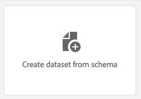

# 2.3 Datensätze konfigurieren

In dieser Übung konfigurieren Sie die erforderlichen Datensätze, um Profilinformationen und Kundenverhalten zu erfassen und zu speichern. Jeder Datensatz, den Sie in diesem erstellen, verwendet eines der Schemas, die Sie im vorherigen Schritt erstellt haben.

## Geschichte

Nach der Definition der Antwort auf die Fragen **Wer ist dieser Kunde?** und **Was macht dieser Kunde?** sollte so aussehen, müssen Sie jetzt einen Behälter erstellen, der diese Informationen verwendet, um an Adobe Experience Platform gesendete Daten zu empfangen und zu validieren.

## 2.3.1 - Datensätze erstellen

Erstellen Sie nun zwei Datensätze:

- 1 Datensatz zum Erfassen der Informationen, die die **Wer ist dieser Kunde?** - Frage.
- 1 Datensatz zum Erfassen der Informationen, die die **Was macht dieser Kunde?** - Frage.

Melden Sie sich über diese URL bei Adobe Experience Platform an: [https://experience.adobe.com/platform](https://experience.adobe.com/platform).

Nach der Anmeldung landen Sie auf der Startseite von Adobe Experience Platform.

Bevor Sie fortfahren, müssen Sie eine **[!UICONTROL Sandbox]**. Die auszuwählende Sandbox heißt ``--module2sandbox--``. Klicken Sie hierzu auf den Text **[!UICONTROL Produktionsprodukt]** in der blauen Zeile auf Ihrem Bildschirm. Nach Auswahl der entsprechenden [!UICONTROL Sandbox], sehen Sie die Änderung des Bildschirms und befinden sich jetzt in Ihrem [!UICONTROL Sandbox].

Klicken Sie in Adobe Experience Platform auf **[!UICONTROL Datensätze]** im Menü auf der linken Bildschirmseite.  Daraufhin sehen Sie Folgendes:

Erstellen wir zunächst den Datensatz, um die Website-Registrierungsinformationen zu erfassen.

Sie sollten einen neuen Datensatz erstellen. Um einen neuen Datensatz zu erstellen, klicken Sie auf die Schaltfläche **[!UICONTROL + Datensatz erstellen]**.

Nachdem Sie auf **[!UICONTROL + Datensatz erstellen]** -Schaltfläche, sehen Sie den folgenden Bildschirm.

Sie müssen einen Datensatz aus dem Schema definieren, das Sie im vorherigen Schritt definiert haben. Klicken Sie auf **[!UICONTROL Datensatz aus Schema erstellen]** - Option.

Wählen Sie im nächsten Bildschirm das Schema aus, das Sie in 1 erstellt haben. `--demoProfileLdap-- - Demo System - Profile Schema for Website`.

Klicken Sie nach Auswahl des Schemas auf **[!UICONTROL Nächste]** , um fortzufahren.

Geben wir einen Namen für Ihren Datensatz ein.

Verwenden Sie als Namen für unseren Datensatz Folgendes:

`--demoProfileLdap-- - Demo System - Profile Dataset for Website`

Beispiel für ldap **[!UICONTROL Vangeluw]**, sollte dies der Name des Schemas sein:

**[!UICONTROL vangeluw - Demosystem - Profildatensatz für Website]**

Das sollte Ihnen etwas wie Folgendes geben:

Klicken **[!UICONTROL Beenden]** , um Ihre Datensatzkonfiguration abzuschließen.

Jetzt sehen Sie Folgendes:

Gehen Sie zurück zu [!UICONTROL Datensätze] Übersicht. Der erstellte Datensatz wird nun in der Übersicht angezeigt.

Als Nächstes konfigurieren Sie einen zweiten Datensatz, um Interaktionen mit Websites zu erfassen.

Sie sollten einen neuen Datensatz erstellen. Um einen neuen Datensatz zu erstellen, klicken Sie auf die Schaltfläche **[!UICONTROL + Datensatz erstellen]**.

Nachdem Sie auf **[!UICONTROL + Datensatz erstellen]** -Schaltfläche, sehen Sie den folgenden Bildschirm.

Sie müssen einen Datensatz aus dem Schema definieren, das Sie im vorherigen Schritt definiert haben. Klicken Sie auf **[!UICONTROL Datensatz aus Schema erstellen]** - Option.

Wählen Sie im nächsten Bildschirm das Schema aus, das Sie in Version 2.2 erstellt haben. `--demoProfileLdap-- - Demo System - Event Schema for Website`.

Klicken Sie nach Auswahl des Schemas auf **[!UICONTROL Nächste]** , um fortzufahren.

Geben wir einen Namen für Ihren Datensatz ein.

Als Name für unseren Datensatz verwenden wir Folgendes:

`--demoProfileLdap-- - Demo System - Event Dataset for Website`

Beispiel für ldap **[!UICONTROL Vangeluw]**, sollte dies der Name des Schemas sein:

**[!UICONTROL vangeluw - Demosystem - Ereignisdatensatz für Website]**

Das sollte Ihnen etwas wie Folgendes geben:

Klicken **[!UICONTROL Beenden]** , um Ihre Datensatzkonfiguration abzuschließen.

Daraufhin sehen Sie Folgendes:

Gehen Sie zurück zu [!UICONTROL Datensätze] Übersichtsbildschirm.

Jetzt müssen Sie Ihre Datensätze aktivieren, damit sie Teil des Echtzeit-Kundenprofils von Adobe Experience Platform sind.

Datensatz öffnen `--demoProfileLdap--` - Demosystem - Profildatensatz für Website durch Klicken darauf.

Suchen Sie die [!UICONTROL Profil] Umschaltsymbol auf der rechten Seite des Bildschirms.

Klicken Sie auf [!UICONTROL Profil] Umschalten zum Aktivieren dieses Datensatzes für [!UICONTROL Profil].

Klicken Sie auf **[!UICONTROL Aktivieren]**.

Ihr Datensatz ist jetzt für [!UICONTROL Profil].

Gehen Sie zurück zur Datensatzübersicht und öffnen Sie den Datensatz. `--demoProfileLdap-- - Demo System - Event Dataset` für die Website durch Klicken darauf.

Suchen Sie die [!UICONTROL Profil] Umschaltsymbol auf der rechten Seite des Bildschirms.

Klicken Sie auf [!UICONTROL Profil] Aktivieren [!UICONTROL Profil].

Klicken **[!UICONTROL Aktivieren]**.

Ihr Datensatz ist jetzt für [!UICONTROL Profil].

Nächster Schritt: [2.4 Datenerfassung aus Offline-Quellen](./ex4.md)

[Zurück zu Modul 2](./data-ingestion.md)

[Zu allen Modulen zurückkehren](../../overview.md)
