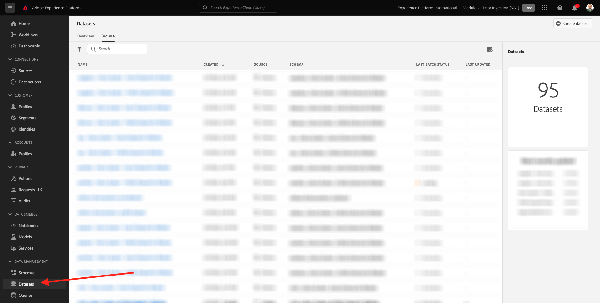
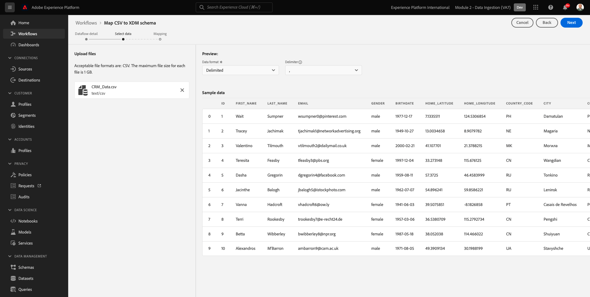
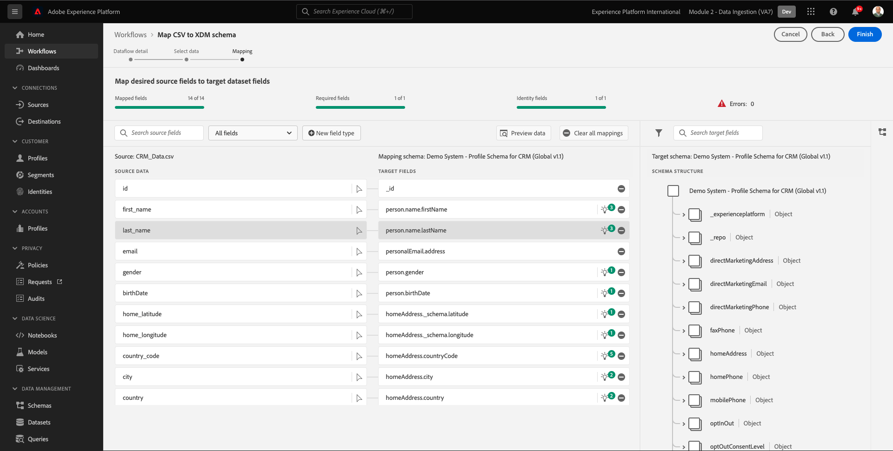
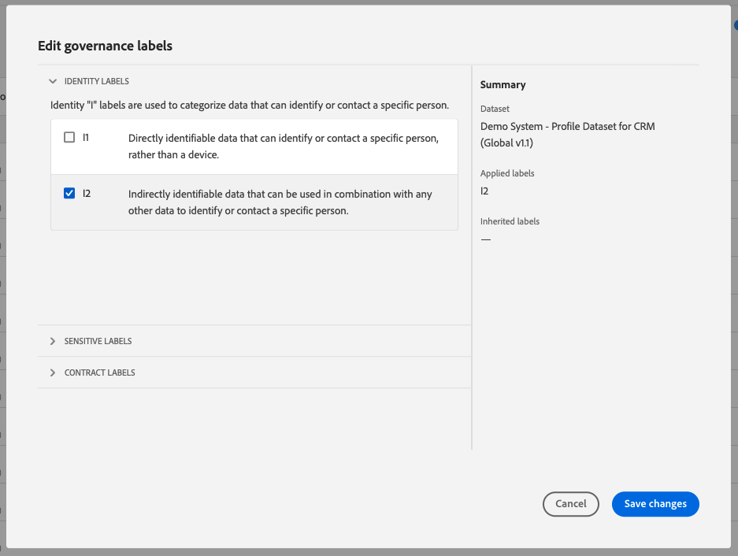

# 2.4 Datenerfassung aus Offline-Quellen

In dieser Übung besteht das Ziel darin, externe Daten wie CRM-Daten in Platform zu integrieren.

## Lernziele

- Erfahren Sie, wie Sie Testdaten generieren
- Erfahren Sie, wie Sie CSV erfassen.
- Erfahren Sie, wie Sie die Web-Benutzeroberfläche für die Datenerfassung über Workflows verwenden.
- Grundlegendes zu den Data Governance-Funktionen von Experience Platform

## Ressourcen

- Mockaroo-Benutzeroberfläche: [https://www.mockaroo.com/](https://www.mockaroo.com/)
- Experience Platform-Benutzeroberfläche: [https://experience.adobe.com/platform/](https://experience.adobe.com/platform/)

## Aufgaben

- Erstellen Sie eine CSV-Datei mit dem Demodatum. Erfassen Sie die CSV-Datei in Adobe Experience Platform, indem Sie die verfügbaren Workflows verwenden.
- Data Governance-Optionen in Adobe Experience Platform

## 2.4.1 Erstellen Sie Ihren CRM-Datensatz mit einem Tool zum Generieren von Daten.

Dazu benötigen Sie 1000 Beispielzeilen von CRM-Daten.

Öffnen Sie die Mockaroo-Vorlage, indem Sie [https://www.mockaroo.com/12674210](https://www.mockaroo.com/12674210).

Auf der Vorlage werden die folgenden Felder angezeigt:

- id
- first_name
- last_name
- email
- gender
- birthDate
- home_latitude
- home_longitude
- country_code
- city
- country

Alle diese Felder wurden definiert, um Daten zu erzeugen, die mit Platform kompatibel sind.

Um Ihre CSV-Datei zu generieren, klicken Sie auf das **[!UICONTROL Daten herunterladen]** -Schaltfläche, über die Sie eine CSV-Datei mit 1000 Zeilen Demodaten erhalten.

Öffnen Sie Ihre CSV-Datei in Microsoft Excel, um den Inhalt zu visualisieren.

Wenn Ihre CSV-Datei fertig ist, können Sie mit der Zuordnung zu XDM fortfahren.

### 2.4.2 CRM-Onboarding-Datensatz in Adobe Experience Platform überprüfen

Öffnen [Adobe Experience Platform](https://experience.adobe.com/platform) und gehen Sie zu **[!UICONTROL Datensätze]**.

Bevor Sie fortfahren, müssen Sie eine **[!UICONTROL Sandbox]**. Die auszuwählende Sandbox heißt ``--module2sandbox--``. Klicken Sie hierzu auf den Text **[!UICONTROL Produktionsprodukt]** in der blauen Zeile auf Ihrem Bildschirm. Nach Auswahl der entsprechenden [!UICONTROL Sandbox], sehen Sie die Änderung des Bildschirms und befinden sich jetzt in Ihrem [!UICONTROL Sandbox].

Klicken Sie in Adobe Experience Platform auf **[!UICONTROL Datensätze]** im Menü auf der linken Bildschirmseite.

Sie verwenden einen freigegebenen Datensatz, der auf dieser Aktivierung basiert. Der freigegebene Datensatz wurde bereits erstellt und heißt **[!UICONTROL Demosystem - Profildatensatz für CRM (Global v1.1)]**.

Datensatz öffnen **[!UICONTROL Demosystem - Profildatensatz für CRM (Global v1.1)]**.

Auf dem Übersichtsbildschirm können Sie drei Hauptinformationen sehen.

Zunächst die [!UICONTROL Datensatzaktivität] Dashboard zeigt die Gesamtzahl der CRM-Datensätze im Datensatz sowie die erfassten Batches und ihren Status an

Außerdem können Sie durch Scrollen auf der Seite überprüfen, wann Datenstapel erfasst wurden, wie viele Datensätze integriert wurden und ob der Batch erfolgreich integriert wurde oder nicht. Die **[!UICONTROL Batch-Kennung]** ist die Kennung für einen bestimmten Batch-Auftrag und die **[!UICONTROL Batch-Kennung]** ist wichtig, da sie zur Fehlerbehebung verwendet werden kann, warum ein bestimmter Batch nicht erfolgreich integriert wurde.

Schließlich [!UICONTROL Datensatzinformationen] enthält wichtige Informationen wie [!UICONTROL Datensatz-ID] (erneut wichtig aus Sicht der Fehlerbehebung), den Namen des Datensatzes und ob der Datensatz für Profil aktiviert wurde.

Die wichtigste Einstellung hier ist die Verknüpfung zwischen dem Datensatz und dem Schema. Das Schema definiert, wie Daten erfasst werden können und wie diese aussehen sollen.

In diesem Fall verwenden wir die **[!UICONTROL Demosystem - Profilschema für CRM (Global v1.1)]**, die der Klasse von **[!UICONTROL Profil]** und hat Erweiterungen implementiert, auch als Feldergruppen bezeichnet.

Wenn Sie auf den Namen des Schemas klicken, gelangen Sie zum [!UICONTROL Schema] -Übersicht alle für dieses Schema aktivierten Felder anzeigen.

Für jedes Schema muss ein benutzerdefinierter, primärer Deskriptor definiert sein. Im Fall unseres CRM-Datensatzes hat das Schema definiert, dass das Feld **[!UICONTROL crmId]** sollte die primäre Kennung sein. Wenn Sie ein Schema erstellen und es mit dem [!UICONTROL Echtzeit-Kundenprofil], müssen Sie eine benutzerdefinierte [!UICONTROL Feldergruppe] , der auf Ihren primären Deskriptor verweist.

Im obigen Screenshot können Sie sehen, dass sich unser Deskriptor unter `--aepTenantId--.identification.core.crmId`, der als [!UICONTROL Primäre Kennung], verknüpft mit der [!UICONTROL namespace] von **[!UICONTROL Demosystem - CRMID]**.

Jedes Schema und als solches jeden Datensatz, der im [!UICONTROL Echtzeit-Kundenprofil] sollte eine [!UICONTROL Primäre Kennung]. Diese [!UICONTROL Primäre Kennung] ist der Kennungsbenutzer der Marke für einen Kunden in diesem Datensatz. Bei einem CRM-Datensatz kann es sich um die E-Mail-Adresse oder die CRM-ID handeln. Bei einem Call-Center-Datensatz kann es sich um die Mobiltelefonnummer eines Kunden handeln.

Es empfiehlt sich, für jeden Datensatz ein separates, spezifisches Schema zu erstellen und den Deskriptor für jeden Datensatz so festzulegen, dass er mit der aktuellen Funktionsweise der von der Marke verwendeten Lösungen übereinstimmt.

### 2.4.3 Verwenden eines Workflows zum Zuordnen einer CSV-Datei zu einem XDM-Schema

Ziel ist es, CRM-Daten in Platform zu integrieren. Alle Daten, die in Platform erfasst werden, sollten dem jeweiligen XDM-Schema zugeordnet werden. Derzeit verfügen Sie über einen CSV-Datensatz mit 1000 Zeilen auf der einen Seite und einen Datensatz, der mit einem Schema auf der anderen Seite verknüpft ist. Um diese CSV-Datei in diesen Datensatz zu laden, muss eine Zuordnung vorgenommen werden. Um diese Zuordnungsübung zu erleichtern, haben wir **[!UICONTROL Workflows]** in Adobe Experience Platform verfügbar.

Die [!UICONTROL Workflow] die wir hier verwenden werden, ist die [!UICONTROL Workflow] benannt **[!UICONTROL Zuordnen von CSV zu XDM-Schema]** im [!UICONTROL Datenerfassung] Menü.

Klicken Sie auf **[!UICONTROL Zuordnen von CSV zu XDM-Schema]** Schaltfläche. Klicken **[!UICONTROL Launch]** , um den Prozess zu starten.

Im nächsten Bildschirm müssen Sie einen Datensatz auswählen, in dem Ihre Datei aufgenommen werden soll. Sie haben die Wahl zwischen der Auswahl eines bereits vorhandenen Datensatzes oder der Erstellung eines neuen Datensatzes. Für diese Übung verwenden wir eine vorhandene: Bitte wählen Sie **[!UICONTROL Demosystem - Profildatensatz für CRM (Global v1.1)]** wie unten angegeben, und lassen Sie die anderen Einstellungen auf &quot;Standard&quot;eingestellt.

Klicken **[!UICONTROL Nächste]** , um zum nächsten Schritt zu gelangen.

Ziehen Sie Ihre CSV-Datei per Drag-and-Drop oder klicken Sie auf **[!UICONTROL Durchsuchen]** Navigieren Sie auf Ihrem Computer zu Ihrem Desktop und wählen Sie Ihre CSV-Datei aus.

Nachdem Sie Ihre CSV-Datei ausgewählt haben, wird sie sofort hochgeladen und Sie erhalten innerhalb von Sekunden eine Vorschau Ihrer Datei.

Klicken **[!UICONTROL Nächste]** , um zum nächsten Schritt zu gelangen. Es kann einige Sekunden dauern, bis die Datei vollständig verarbeitet ist.

Jetzt müssen Sie Ihre CSV-Spaltenkopfzeilen mit einer XDM-Eigenschaft in Ihrer **[!UICONTROL Demosystem - Profildatensatz für CRM]**.

Adobe Experience Platform hat bereits einige Vorschläge für Sie gemacht, indem er versucht, die [!UICONTROL Quellattribute] mit dem [!UICONTROL Zielschemafelder].

Für [!UICONTROL Schemazuordnungen]hat Adobe Experience Platform bereits versucht, Felder miteinander zu verknüpfen. Allerdings sind nicht alle Vorschläge zur Kartierung korrekt. Sie müssen jetzt **Annehmen von Zielfeldern** Eins-für-Eins.

#### birthDate

Feld &quot;Quellschema&quot; **birthDate** sollte mit dem Zielfeld verknüpft werden **person.birthDate**.

#### city

Feld &quot;Quellschema&quot; **city** sollte mit dem Zielfeld verknüpft werden **homeAddress.city**.

#### country

Feld &quot;Quellschema&quot; **country** sollte mit dem Zielfeld verknüpft werden **homeAddress.country**.

#### country_code

Feld &quot;Quellschema&quot; **country_code** sollte mit dem Zielfeld verknüpft werden **homeAddress.countryCode**.

#### email

Feld &quot;Quellschema&quot; **email** sollte mit dem Zielfeld verknüpft werden **personalEmail.address**.

#### crmid

Das Feld Quellschema ** crmid** sollte mit dem Zielfeld verknüpft werden **`--aepTenantId--`.identification.core.crmId**.

#### first_name

Feld &quot;Quellschema&quot; **first_name** sollte mit dem Zielfeld verknüpft werden **person.name.firstName**.

#### gender

Feld &quot;Quellschema&quot; **gender** sollte mit dem Zielfeld verknüpft werden **person.gender**.

#### home_latitude

Feld &quot;Quellschema&quot; **home_latitude** sollte mit dem Zielfeld verknüpft werden **homeAddress._schema.latitude**.

#### home_longitude

Feld &quot;Quellschema&quot; **home_longitude** sollte mit dem Zielfeld verknüpft werden **homeAddress._schema.longitude**.

#### id

Feld &quot;Quellschema&quot; **id** sollte mit dem Zielfeld verknüpft werden **_id**.

#### last_name

Feld &quot;Quellschema&quot; **last_name** sollte mit dem Zielfeld verknüpft werden **person.name.lastName**.

Sie sollten jetzt Folgendes haben:

Klicken Sie auf **[!UICONTROL Beenden]** Schaltfläche, um den Workflow abzuschließen.

Nach dem Klicken **[!UICONTROL Beenden]**, sehen Sie dann die **Dataflow** und nach einigen Minuten können Sie den Bildschirm aktualisieren, um festzustellen, ob der Workflow erfolgreich abgeschlossen wurde. Klicken Sie auf **Name des Zieldatensatzes**.

Anschließend sehen Sie den Datensatz, in dem Ihre Aufnahme verarbeitet wurde.

Im Datensatz wird eine [!UICONTROL Batch-Kennung] die gerade aufgenommen wurde, mit 1000 aufgenommenen Datensätzen und einem Status von **[!UICONTROL Erfolg]**.

Klicken Sie auf **[!UICONTROL Vorschau eines Datensatzes anzeigen]**- Schaltfläche, um einen schnellen Überblick über eine kleine Stichprobe des Datensatzes zu erhalten, um sicherzustellen, dass die geladenen Daten korrekt sind.

Nachdem die Daten geladen wurden, können Sie den richtigen Data Governance-Ansatz für unseren Datensatz definieren.

### 2.5.4 Hinzufügen von Data Governance zu Ihrem Datensatz

Nachdem Ihre Kundendaten erfasst wurden, müssen Sie sicherstellen, dass dieser Datensatz ordnungsgemäß für die Verwendung und Exportsteuerung verwaltet wird. Klicken Sie auf **[!UICONTROL Data Governance]** und beachten Sie, dass Sie drei Arten von Einschränkungen festlegen können: Vertragliche, Identitäts- und vertrauliche Daten.

Weitere Informationen zu den verschiedenen Bezeichnungen und ihrer zukünftigen Durchsetzung finden Sie über das Richtlinien-Framework auf diesem Link: [https://www.adobe.io/apis/experienceplatform/home/dule/duleservices.html](https://www.adobe.io/apis/experienceplatform/home/dule/duleservices.html)

Schränken wir Identitätsdaten für den gesamten Datensatz ein. Bewegen Sie den Mauszeiger über den Namen Ihres Datensatzes und klicken Sie auf das Stiftsymbol, um die Einstellungen zu bearbeiten.

Navigieren Sie zu **[!UICONTROL Identitätsdaten]** und Sie werden sehen, dass die **[!UICONTROL I2]** aktiviert ist - hierbei wird davon ausgegangen, dass alle Informationen in diesem Datensatz zumindest indirekt für die Person identifizierbar sind.

Klicken **[!UICONTROL Änderungen speichern]** und beachten Sie, dass **[!UICONTROL I2]** ist jetzt für alle Datenfelder im Datensatz festgelegt.

Sie können diese Flags auch für einzelne Datenfelder festlegen, z. B. die **[!UICONTROL firstName]** -Feld wird wahrscheinlich als **[!UICONTROL I1]** Ebene für direkt identifizierbare Informationen.

Feld auswählen **[!UICONTROL firstName]** indem Sie das Kontrollkästchen aktivieren und auf **[!UICONTROL Governance-Beschriftungen bearbeiten]** in der oberen rechten Ecke des Bildschirms.

Navigieren Sie zu **[!UICONTROL Identitätsdaten]** und Sie werden sehen, dass die **[!UICONTROL I2]** -Option bereits aktiviert ist (aus dem Datensatz übernommen). Das Feld firstName verfügt auch über eine feldspezifische Konfiguration und wird als **[!UICONTROL I1 - Direkt identifizierbare Daten]**.

Damit haben Sie jetzt erfolgreich CRM-Daten in Adobe Experience Platform erfasst und klassifiziert.

Nächster Schritt: [2.5 Einstiegszone für Daten](./ex5.md)

[Zurück zu Modul 2](./data-ingestion.md)

[Zu allen Modulen zurückkehren](../../overview.md)
