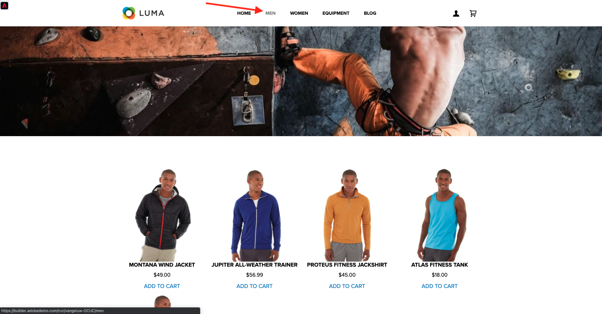
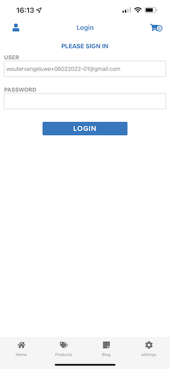
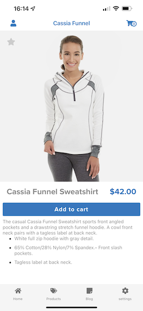

# 3.1 Von unbekannt zu bekannt auf der Website

## Kontext

Die Journey von unbekanntem bis bekanntem ist eines der wichtigsten Themen der heutigen Marken, ebenso wie die Journey des Kunden von der Akquise bis zur Aufbewahrung.

Adobe Experience Platform spielt bei diesem Journey eine große Rolle. Plattform ist das Gehirn für Kommunikation, das &quot;Erlebnissystem der Aufzeichnungen&quot;.

Platform ist eine Umgebung, in der das Wort Kunde breiter ist als nur die bekannten Kunden. Ein unbekannter Besucher auf der Website ist auch aus Sicht von Platform ein Kunde. Daher wird das gesamte Verhalten als unbekannter Besucher auch an Platform gesendet. Durch diesen Ansatz kann eine Marke visualisieren, was vor diesem Zeitpunkt auch passiert ist, wenn dieser Besucher schließlich ein bekannter Kunde wird. Dies hilft aus der Sicht der Attribution und Erlebnisoptimierung.

## Journey-Fluss des Kunden

Navigieren Sie zu [https://builder.adobedemo.com/projects](https://builder.adobedemo.com/projects). Nach der Anmeldung bei Ihrer Adobe ID sehen Sie dies. Klicken Sie auf Ihr Website-Projekt, um es zu öffnen.

Im **Screens** Seite, klicken Sie auf **Ausführen**.

Sie werden dann Ihre Demowebsite öffnen sehen. Wählen Sie die URL aus und kopieren Sie sie in die Zwischenablage.

Öffnen Sie ein neues Inkognito-Browserfenster.

Fügen Sie die URL Ihrer Demo-Website ein, die Sie im vorherigen Schritt kopiert haben. Sie werden dann aufgefordert, sich mit Ihrer Adobe ID anzumelden.

Wählen Sie Ihren Kontotyp aus und schließen Sie den Anmeldevorgang ab.

Sie sehen dann Ihre Website in einem Inkognito-Browser-Fenster geladen. Für jede Demonstration müssen Sie ein neues Inkognito-Browser-Fenster verwenden, um Ihre Demo-Website-URL zu laden.

Klicken Sie auf das Symbol für das Adobe-Logo oben links im Bildschirm, um den Profilanzeige zu öffnen.

Sehen Sie sich das Bedienfeld Profil-Viewer und das Echtzeit-Kundenprofil mit dem **Experience Cloud-ID** als primäre Kennung für diesen derzeit unbekannten Kunden.

Sie können auch alle Erlebnisereignisse sehen, die basierend auf dem Kundenverhalten erfasst wurden. Die Liste ist derzeit leer, aber das wird sich bald ändern.

Navigieren Sie zu **Männer** Produktkategorie. Klicken Sie anschließend auf das Produkt **Montana Wind Jacket**.

Daraufhin wird die Produktdetailseite angezeigt. Erlebnisereignis des Typs **Produktansicht** wurde jetzt mit der Web SDK-Implementierung an Adobe Experience Platform gesendet, die Sie in Modul 1 überprüft haben.

Öffnen Sie das Bedienfeld &quot;Viewer für Bereitstellung&quot;und sehen Sie sich Ihre **Erlebnisereignisse**.

Gehen Sie zurück zu **Frauen** und klicken Sie auf ein anderes Produkt. Ein weiteres Erlebnisereignis wurde an Adobe Experience Platform gesendet.

Öffnen Sie das Bedienfeld Profil-Viewer . Es werden nun zwei Erlebnisereignisse des Typs angezeigt **Produktansicht**. Während das Verhalten anonym ist, können wir jeden Klick verfolgen und in Adobe Experience Platform speichern. Sobald der anonyme Kunde bekannt ist, können wir das gesamte anonyme Verhalten automatisch mit dem Bekannten Profil zusammenführen.

Gehen Sie zur Seite Registrieren/Anmelden . Klicken **KONTO ERSTELLEN**.

Füllen Sie Ihre Details aus und klicken Sie auf **registrieren** Danach werden Sie zur vorherigen Seite weitergeleitet.

Öffnen Sie das Bedienfeld Profil-Viewer und wechseln Sie zum Echtzeit-Kundenprofil. Im Bedienfeld &quot;Profil-Viewer&quot;sollten alle Ihre personenbezogenen Daten angezeigt werden, z. B. Ihre neu hinzugefügten E-Mail- und Telefonkennungen.

Wechseln Sie im Bereich &quot;Profil-Viewer&quot;zu &quot;Erlebnisereignisse&quot;. Sie sehen die beiden Produkte, die Sie zuvor im Bereich &quot;Profil-Viewer&quot;angezeigt haben. Beide Ereignisse sind jetzt auch mit Ihrem &quot;bekannten&quot;Profil verbunden.

Sie haben jetzt Daten in Adobe Experience Platform erfasst und diese Daten mit Identifikatoren wie ECIDs und E-Mail-Adressen verknüpft. Das Ziel ist es, den geschäftlichen Kontext dessen zu verstehen, was Sie tun werden. In der nächsten Übung beginnen Sie mit der Konfiguration von allem, was Sie benötigen, um die gesamte Datenerfassung zu ermöglichen.

### Navigieren zur mobilen App

Nachdem Sie ein bekannter Kunde geworden sind, ist es an der Zeit, mit der Verwendung der App zu beginnen. Öffnen Sie die App in Ihrer iPhone und melden Sie sich dann bei der App an.

Wenn Sie die App nicht mehr installiert haben oder sich nicht mehr daran erinnern können, wie Sie sie installieren, sehen Sie sich bitte hier an: [0.5 Mobile App verwenden](../module0/ex5.md)

Nachdem Sie die App wie angewiesen installiert haben, sehen Sie die Landingpage der App mit der geladenen Marke Luma. Klicken Sie auf das Kontosymbol im oberen linken Bereich des Bildschirms.

Melden Sie sich im Anmeldebildschirm mit der E-Mail-Adresse an, die Sie auf der Desktop-Website verwendet haben. Klicken Sie auf **Anmelden**.

Rufen Sie den Startbildschirm der App auf und klicken Sie auf , um ein beliebiges Produkt zu öffnen.

Daraufhin wird die Produktdetailseite angezeigt.

Wechseln Sie in der App zum Startbildschirm und wischen Sie auf dem Bildschirm nach links, um das Bedienfeld &quot;Profil-Viewer&quot;anzuzeigen. Daraufhin wird das soeben angezeigte Produkt im **Erlebnisereignisse** zusammen mit allen Produktansichten aus der Website-Sitzung zuvor.

Kehren Sie nun zu Ihrem Desktop-Computer zurück und aktualisieren Sie die Startseite, nach der das Produkt auch dort angezeigt wird.

Sie haben jetzt Daten in Adobe Experience Platform erfasst und diese Daten mit Identifikatoren wie ECIDs und E-Mail-Adressen verknüpft. Ziel dieser Übung war es, den geschäftlichen Kontext dessen zu verstehen, was Sie tun werden. Sie haben jetzt effektiv ein echtzeitübergreifendes Kundenprofil erstellt. In der nächsten Übung werden Sie Ihr Profil in Adobe Experience Platform visualisieren.

Nächster Schritt: [3.2 Visualisieren Sie Ihr eigenes Echtzeit-Kundenprofil - Benutzeroberfläche](./ex2.md)

[Zurück zu Modul 3](./real-time-customer-profile.md)

[Zu allen Modulen zurückkehren](../../overview.md)
