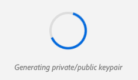
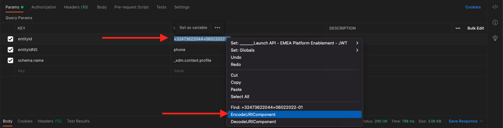
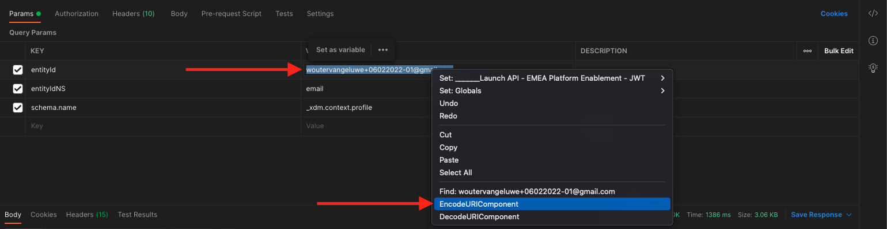
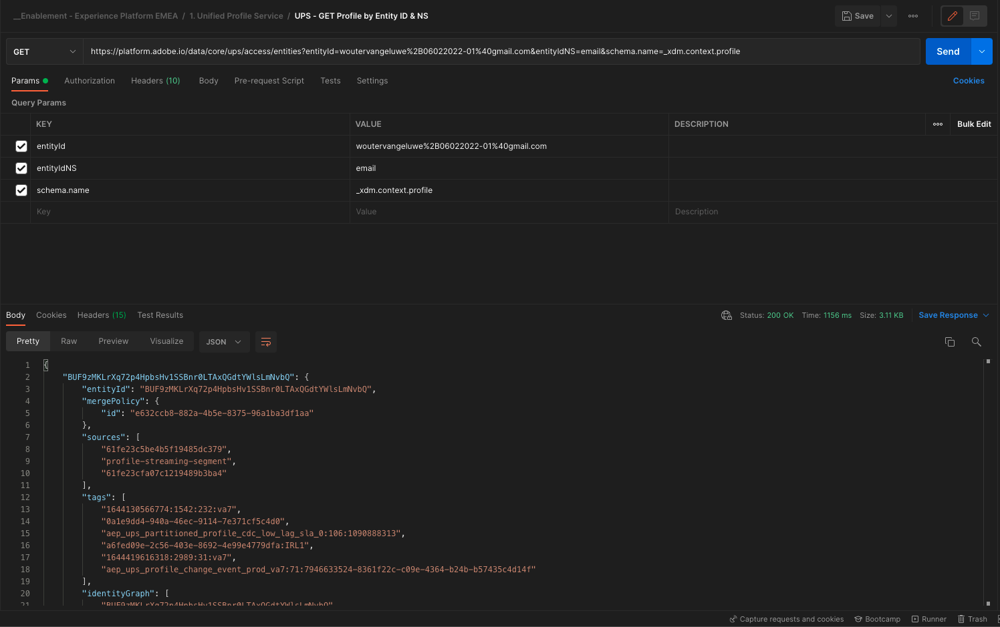
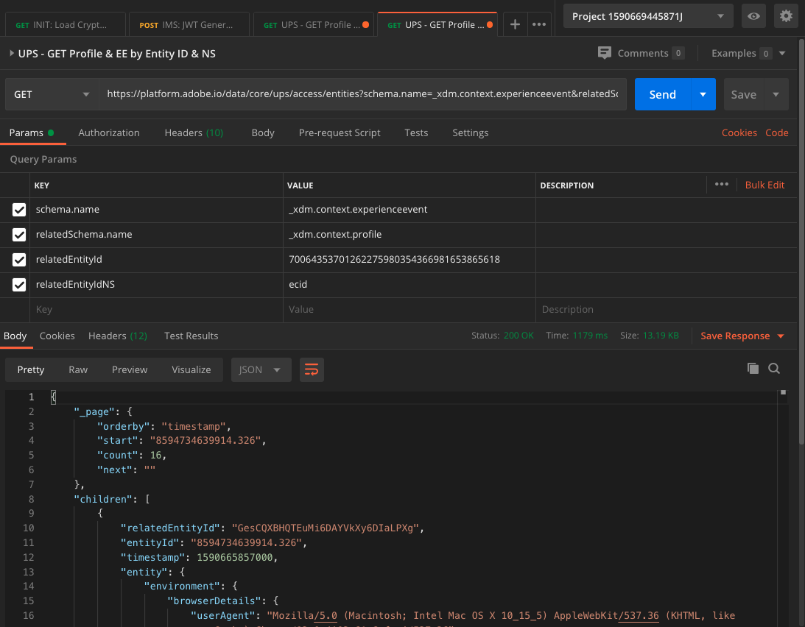

# 3.3 Visualisieren Sie Ihr eigenes Echtzeit-Kundenprofil - API

In dieser Übung verwenden Sie Postman und Adobe I/O, um Adobe Experience Platform-APIs abzufragen und Ihr eigenes Echtzeit-Kundenprofil anzuzeigen.

## Geschichte

Im Echtzeit-Kundenprofil werden alle Profildaten zusammen mit Ereignisdaten sowie vorhandenen Segmentmitgliedschaften angezeigt. Die angezeigten Daten können von überall kommen, von Adobe-Applikationen und externen Lösungen. Dies ist die leistungsstärkste Ansicht in Adobe Experience Platform, dem Erlebnissystem der Aufzeichnungen.

Das Echtzeit-Kundenprofil kann von allen Adobe Apps genutzt werden, aber auch von externen Lösungen wie Call Center oder In-store-Clienteling-Apps. Dazu müssen diese externen Lösungen mit den Adobe Experience Platform-APIs verbunden werden.

## 3.3.1 Ihre Kennungen

Im Bedienfeld &quot;Profil-Viewer&quot;auf der Website finden Sie mehrere Identitäten. Jede Identität ist mit einem Namespace verknüpft.


Im Röntgen-Bedienfeld können wir vier verschiedene Kombinationen von IDs und Namespaces sehen:

| Identität | Namespace |
|:-------------:| :---------------:|
| Experience Cloud ID (ECID) | 12507560687324495704459439363261812234 |
| Email ID | woutervangeluwe+06022022-01@gmail.com |
| Mobiltelefonnummer | +32473622044+06022022-01 |

Merken Sie sich diese IDs für den nächsten Schritt.

Navigieren Sie mit diesen Kennungen im Hinterkopf zu Postman.

## 3.3.2 Adobe I/O-Projekt einrichten

In dieser Übung werden Sie Adobe I/O recht intensiv verwenden, um die APIs von Platform abzufragen. Führen Sie die folgenden Schritte aus, um die Adobe I/O einzurichten.

Navigieren Sie zu [https://developer.adobe.com/console/home](https://developer.adobe.com/console/home)


Wählen Sie oben rechts auf Ihrem Bildschirm die richtige Adobe Experience Platform-Instanz aus. Ihre Instanz ist `--envName--`.


Klicken Sie auf **Neues Projekt erstellen**.

 oder


Auswählen **+ Zum Projekt hinzufügen** und wählen Sie **API**.


Daraufhin sehen Sie Folgendes:


Klicken Sie auf **Adobe Experience Platform** Symbol.


Klicken **Experience Platform-API**.


Klicken Sie auf **Weiter**.


Jetzt können Sie festlegen, ob Adobe I/O das Sicherheitsschlüsselpaar generieren oder ein vorhandenes Schlüsselpaar hochladen soll.

Auswählen **Option 1 - Generieren eines Schlüsselpaars**.


Klicken **Generieren von keypair**.


Du wirst einen Spinner für etwa 30 Sekunden sehen.



Sie sehen dies und Ihr generiertes Keypair wird als ZIP-Datei heruntergeladen: **config.zip**.

Entpacken Sie die Datei. **config.zip** Auf Ihrem Desktop sehen Sie, dass es zwei Dateien enthält:


- **certificate_pub.crt** ist Ihr Zertifikat mit öffentlichem Schlüssel. Aus sicherheitspolitischer Sicht ist dies das Zertifikat, das frei zum Einrichten von Integrationen mit Online-Anwendungen verwendet wird.
- **private.key** ist Ihr privater Schlüssel. Das sollte niemals, niemals mit jemandem geteilt werden. Der private Schlüssel dient zur Authentifizierung bei Ihrer API-Implementierung und sollte ein Geheimnis sein. Wenn Sie Ihren privaten Schlüssel für andere freigeben, können diese auf Ihre Implementierung zugreifen und die API dazu nutzen, schädliche Daten in Platform zu erfassen und alle Daten zu extrahieren, die sich in Platform befinden.


Achten Sie darauf, die **config.zip** an einem sicheren Speicherort speichern, da Sie dies für die nächsten Schritte und für den zukünftigen Zugriff auf Adobe I/O- und Adobe Experience Platform-APIs benötigen werden.

Klicken Sie auf **Weiter**.


Sie müssen nun die **Produktprofil(e)** für Ihre Integration.

Wählen Sie die erforderlichen Produktprofile aus.

**FYI**: in Ihrer Adobe Experience Platform-Instanz haben die Produktprofile eine andere Benennung. Sie müssen mindestens ein Produktprofil mit den entsprechenden Zugriffsrechten auswählen, die in der Adobe Admin Console eingerichtet sind.


Klicken **Konfigurierte API speichern**.


Du wirst ein paar Sekunden lang einen Spinner sehen.


Als Nächstes sehen Sie Ihre Integration.


Klicken Sie auf **Herunterladen für Postman** und klicken Sie auf **Dienstkonto (JWT)** um eine Postman-Umgebung herunterzuladen (warten Sie, bis die Umgebung heruntergeladen wurde. Dies kann einige Sekunden dauern).


Scrollen Sie nach unten, bis Sie **Dienstkonto (JWT)** Hier finden Sie alle Integrationsdetails, die zum Konfigurieren der Integration mit Adobe Experience Platform verwendet werden.


Ihr IO-Projekt hat derzeit einen generischen Namen. Sie müssen Ihrer Integration einen benutzerfreundlichen Namen geben. Klicken Sie auf **Projekt 1** (oder ähnliche Bezeichnung) wie angegeben


Klicken **Projekt bearbeiten**.


Geben Sie einen Namen und eine Beschreibung für Ihre Integration ein. Als Namenskonvention verwenden wir `AEP API --demoProfileLdap--`. Ersetzen Sie ldap durch Ihren ldap.
Wenn Ihr ldap beispielsweise Vangeluw ist, lautet der Name und die Beschreibung Ihrer Integration AEP API Vangeluw.

Eingabe `AEP API --demoProfileLdap--` als **Projekttitel**. Klicken Sie auf **Speichern**.


Ihre Adobe I/O-Integration ist jetzt abgeschlossen.


## 3.3.3 Postman-Authentifizierung für Adobe I/O

Navigieren Sie zu [https://www.getpostman.com/](https://www.getpostman.com/).

Klicken Sie auf **Erste Schritte**.


Laden Sie als Nächstes Postman herunter und installieren Sie es.


Starten Sie nach der Installation von Postman das Programm.

In Postman gibt es zwei Konzepte: Umgebungen und Sammlungen.

- Die Umgebung enthält all Ihre Umgebungsvariablen, die mehr oder weniger konsistent sind. In der Umgebung finden Sie Dinge wie IMSOrg unserer Platform-Umgebung, neben Sicherheitsberechtigungen wie Ihren privaten Schlüssel und andere. Die Umgebungsdatei ist diejenige, die Sie während der Adobe I/O-Einrichtung in der vorherigen Übung heruntergeladen haben. Sie hat folgenden Namen: **service.postman_environment.json**.

- Die Sammlung enthält eine Reihe von API-Anfragen, die Sie verwenden können. Wir werden zwei Sammlungen verwenden
   - 1 Sammlung für Authentifizierung bei Adobe I/0
   - 1 Sammlung für die Übungen in diesem Modul
   - 1 Sammlung für die Übungen im Real-Time CDP-Modul, für Destination Authoring

Bitte laden Sie die Datei herunter [postman.zip](../../assets/postman/postman_profile.zip) auf Ihren lokalen Desktop.

In diesem **postman.zip** -Datei, finden Sie die folgenden Dateien:

- `_Adobe I-O - Token.postman_collection.json`
- `_Adobe Experience Platform Enablement.postman_collection.json`
- `Destination_Authoring_API.json`

Entpacken Sie die **postman.zip** und speichern Sie diese 3 Dateien in einem Ordner auf Ihrem Desktop, zusammen mit der heruntergeladenen Postman-Umgebung von Adobe I/O. Sie müssen diese 4 Dateien in diesem Ordner haben:


Gehen Sie zurück zu Postman. Klicken Sie auf **Importieren**.


Klicken **Hochladen von Dateien**.


Navigieren Sie zum Ordner auf Ihrem Desktop, in den Sie die 4 heruntergeladenen Dateien extrahiert haben. Wählen Sie diese 4 Dateien gleichzeitig aus und klicken Sie auf **Öffnen**.


Nachdem Sie geklickt haben **Öffnen** zeigt Ihnen Postman einen Überblick über die Umgebung und Sammlungen, die Sie importieren möchten. Klicken Sie auf **Importieren**.


Sie haben jetzt alles, was Sie in Postman benötigen, um über die APIs mit Adobe Experience Platform zu interagieren.

Zunächst müssen Sie sicherstellen, dass Sie ordnungsgemäß authentifiziert sind. Um authentifiziert zu werden, müssen Sie ein Zugriffstoken anfordern.

Stellen Sie sicher, dass Sie die richtige Umgebung ausgewählt haben, bevor Sie eine Anforderung ausführen. Sie können die aktuell ausgewählte Umgebung überprüfen, indem Sie die Dropdown-Liste Umgebung oben rechts überprüfen.

Die ausgewählte Umgebung sollte einen ähnlichen Namen haben:


Klicken Sie auf **Auge** und klicken Sie dann auf **Bearbeiten** , um den privaten Schlüssel in der Umgebungsdatei zu aktualisieren.


Dann wirst du das sehen. Alle Felder sind vorausgefüllt, mit Ausnahme des Felds **PRIVATE_KEY**.


Der private Schlüssel wurde bei der Erstellung Ihres Adobe I/O-Projekts generiert. Es wurde als ZIP-Datei mit dem Namen **config.zip**. Extrahieren Sie diese ZIP-Datei auf Ihren Desktop.


Öffnen Sie den Ordner . **config** und öffnen Sie die Datei **private.key** mit Ihrem Texteditor Ihrer Wahl.


Sie sehen dann etwas, das diesem ähnelt, kopieren Sie den gesamten Text in die Zwischenablage.


Gehen Sie zurück zu Postman und fügen Sie den privaten Schlüssel in die Felder neben der Variablen ein. **PRIVATE_KEY** für beide Spalten **ERSTER WERT** und **AKTUELLER WERT**. Klicken Sie auf **Speichern**.


Ihre Postman-Umgebung und -Sammlungen sind jetzt konfiguriert und funktionieren. Sie können sich jetzt von Postman zu Adobe I/O authentifizieren.

Dazu müssen Sie eine externe Bibliothek laden, die für die Verschlüsselung und Entschlüsselung der Kommunikation sorgt. Um diese Bibliothek zu laden, müssen Sie die Anfrage mit dem Namen ausführen **INIT: Crypto-Bibliothek für RS256 laden**. Wählen Sie diese Anforderung im **_Adobe I/O - Token-Sammlung** und Sie sehen es in der Mitte Ihres Bildschirms.


Klicken Sie auf Blau **Senden** Schaltfläche. Nach einigen Sekunden sollte eine Antwort im **body** Abschnitt von Postman:


Nachdem die Kryptobibliothek jetzt geladen ist, können wir uns bei der Adobe I/O authentifizieren.

Im **\_Adobe I/O - Token-Sammlung**, wählen Sie die Anforderung mit dem Namen aus. **IMS: JWT-Generierung + Auth**. Auch hier werden die Anfragedetails in der Mitte des Bildschirms angezeigt.


Klicken Sie auf Blau **Senden** Schaltfläche. Nach einigen Sekunden sollte eine Antwort im **body** Abschnitt von Postman:


Wenn Ihre Konfiguration erfolgreich war, sollte eine ähnliche Antwort mit den folgenden Informationen angezeigt werden:

| Schlüssel | Wert |
|:-------------:| :---------------:| 
| token_type | **bearer** |
| access_token | **eyJ4NXUiJpbXNfbmEx...QT7mqZkumN1tdsPEioOEl4087Dg** |
| expires_in | **86399973** |

Adobe I/O hat Ihnen einen **bearer**-token mit einem bestimmten Wert (dieses sehr lange access_token) und einem Ablauffenster.

Das Token, das wir erhalten haben, gilt nun für 24 Stunden. Das bedeutet, dass Sie nach 24 Stunden ein neues Token generieren müssen, indem Sie diese Anfrage erneut ausführen, wenn Sie Postman zur Authentifizierung bei Adobe I/O verwenden möchten.

## 3.3.4 Echtzeit-Kundenprofil-API, Schema: Profil

Jetzt können Sie Ihre erste Anfrage an die Echtzeit-Kundenprofil-APIs von Platform senden.

Suchen Sie in Postman die Sammlung. **_Adobe Experience Platform-Aktivierung**.


In **1. Unified Profile Service**, wählen Sie die erste Anforderung mit dem Namen aus. **UPS - GET Profile by Entity ID &amp; NS**.


Für diese Anfrage sind drei erforderliche Variablen erforderlich:

| Schlüssel | Wert | Definition |
|:-------------:| :---------------:| :---------------:| 
| entityId | **id** | die spezifische Kunden-ID |
| entityIdNS | **namespace** | den spezifischen Namespace, der für die ID gilt |
| schema.name | **_xdm.context.profile** | das spezifische Schema, für das Sie Informationen erhalten möchten |

Wenn Sie also die APIs von Adobe Experience Platform bitten möchten, Ihnen alle Profilinformationen für Ihre eigene ECID zurückzugeben, müssen Sie die Anfrage wie folgt konfigurieren:

| Schlüssel | Wert |
|:-------------:| :---------------:| 
| entityId | **yourECID** |
| entityIdNS | **ecid** |
| schema.name | **_xdm.context.profile** |


Sie sollten auch die **Kopfzeile** - Felder Ihrer Anfrage. Navigieren Sie zu **Kopfzeilen**. Daraufhin sehen Sie Folgendes:


| Schlüssel | Wert |
| ----------- | ----------- |
| x-sandbox-name | `--aepSandboxId--` |

>[!NOTE]
>
>Sie müssen den Namen der verwendeten Adobe Experience Platform-Sandbox angeben. Ihr x-sandbox-name sollte `--aepSandboxId--`.

Klicken **Senden** , um Ihre Anfrage an Platform zu senden.

Sie sollten eine sofortige Antwort von Platform erhalten, die Ihnen Folgendes zeigt:


Dies ist die vollständige Antwort von Platform:

```javascript
{
    "A28iM3aJBJRbEQpOnUh5HOM9": {
        "entityId": "A28iM3aJBJRbEQpOnUh5HOM9",
        "mergePolicy": {
            "id": "e632ccb8-882a-4b5e-8375-96a1ba3df1aa"
        },
        "sources": [
            "61fe23c5be4b5f19485dc379",
            "profile-streaming-segment",
            "61fe23cfa07c1219489b3ba4"
        ],
        "tags": [
            "1644130566774:1542:232:va7",
            "0a1e9dd4-940a-46ec-9114-7e371cf5c4d0",
            "aep_ups_partitioned_profile_cdc_low_lag_sla_0:106:1090888313",
            "a6fed09e-2c56-403e-8692-4e99e4779dfa:IRL1",
            "1644419616318:2989:31:va7",
            "aep_ups_profile_change_event_prod_va7:71:7946633524-8361f22c-c09e-4364-b24b-b57435c4d14f"
        ],
        "identityGraph": [
            "BUF9zMKLrXq72p4HpbsHv1SSBnr0LTAxQGdtYWlsLmNvbQ",
            "GkicrkFjgmCjUg",
            "GtCbrkFjgkSOFg",
            "A2-AP9zOsakzNTe9Rqwf7Wse",
            "BkFuK4QcJpSPByuSBnr0LTAx",
            "A28jSB484ziuECF3fEoXmFlF",
            "A28iM3aJBJRbEQpOnUh5HOM9"
        ],
        "entity": {
            "_experienceplatform": {
                "individualCharacteristics": {},
                "loyaltyDetails": {
                    "level": "Basic",
                    "points": 0
                },
                "identification": {
                    "core": {
                        "phoneNumber": "+32473622044+06022022-01",
                        "email": "woutervangeluwe+06022022-01@gmail.com",
                        "loyaltyId": "5415776",
                        "ecid": "12019606991718502754997192487345616673",
                        "crmId": "1478212"
                    }
                }
            },
            "personalEmail": {
                "address": "woutervangeluwe+06022022-01@gmail.com"
            },
            "_repo": {
                "createDate": "2022-02-06T06:56:06.424Z"
            },
            "testProfile": true,
            "homeAddress": {
                "postalCode": "1831",
                "city": "Diegem",
                "street1": "Culliganlaan 2F"
            },
            "mobilePhone": {
                "number": "+32473622044+06022022-01"
            },
            "segmentMembership": {
                "ups": {
                    "bc999ded-b6d7-40d4-87a7-d3a280b950e3": {
                        "lastQualificationTime": "2022-02-09T20:38:33Z",
                        "status": "exited"
                    },
                    "23b1cd4e-d62f-44bd-8392-3095a33109c4": {
                        "lastQualificationTime": "2022-02-09T20:38:33Z",
                        "status": "exited"
                    },
                    "f0807704-a1c8-4ac4-85dd-60db2fbf18f1": {
                        "lastQualificationTime": "2022-02-09T20:38:33Z",
                        "status": "existing"
                    }
                }
            },
            "person": {
                "name": {
                    "lastName": "Van Geluwe",
                    "firstName": "Wouter"
                },
                "gender": "female",
                "birthDate": "1982-07-08"
            },
            "userActivityRegions": {
                "IRL1": {
                    "captureTimestamp": "2022-02-09T15:21:11Z"
                }
            },
            "identityMap": {
                "email": [
                    {
                        "id": "woutervangeluwe+06022022-01@gmail.com"
                    }
                ],
                "crmid": [
                    {
                        "id": "1478212"
                    }
                ],
                "ecid": [
                    {
                        "id": "12507560687324495704459439363261812234"
                    },
                    {
                        "id": "12019606991718502754997192487345616673"
                    },
                    {
                        "id": "38335942889672702722192106363935964471"
                    }
                ],
                "phone": [
                    {
                        "id": "+32473622044+06022022-01"
                    }
                ],
                "loyaltyid": [
                    {
                        "id": "5415776"
                    }
                ]
            }
        },
        "lastModifiedAt": "2022-02-09T20:38:36Z"
    }
}
```

Dies sind derzeit alle in Platform für diese ECID verfügbaren Profildaten.

Sie müssen die ECID nicht verwenden, um Profildaten vom Echtzeit-Kundenprofil von Platform anzufordern. Sie können zur Anforderung dieser Daten eine beliebige ID in einem Namespace verwenden.

Gehen wir zurück zu Postman und tun so, als wären wir das Callcenter. Senden Sie eine Anfrage an Platform, in der der Namespace von **Telefon** und Ihre Mobiltelefonnummer.

Wenn Sie also die Platform-APIs bitten möchten, Ihnen alle Profilinformationen für ein bestimmtes Telefon zurückzugeben, müssen Sie die Anfrage wie folgt konfigurieren:

| Schlüssel | Wert |
|:-------------:| :---------------:| 
| entityId | **Ihre Telefonnummer** |
| entityIdNS | **phone** (Ersetzen Sie ecid durch phone) |
| schema.name | **_xdm.context.profile** |

Wenn Ihre Telefonnummer spezielle Symbole enthält, z. B. **+**, müssen Sie Ihre vollständige Telefonnummer auswählen, mit der rechten Maustaste klicken und klicken. **EncodeURIComponent**.



Dann haben Sie Folgendes:


Sie sollten auch die **Kopfzeile** - Felder Ihrer Anfrage. Navigieren Sie zu **Kopfzeilen**. Daraufhin sehen Sie Folgendes:


| Schlüssel | Wert |
| ----------- | ----------- |
| x-sandbox-name | `--aepSandboxId--` |

>[!NOTE]
>
>Sie müssen den Namen der verwendeten Adobe Experience Platform-Sandbox angeben. Ihr x-sandbox-name sollte `--aepSandboxId--`.

Klicken Sie auf Blau **Senden** und überprüfen Sie die Antwort.


Lassen Sie uns dasselbe für Ihre E-Mail-Adresse tun, indem Sie den Namespace von **email** und Ihre E-Mail-Adresse.

Wenn Sie also die APIs von Platform bitten möchten, Ihnen alle Profilinformationen für eine bestimmte E-Mail-Adresse zurückzugeben, müssen Sie die Anfrage wie folgt konfigurieren:

| Schlüssel | Wert |
|:-------------:| :---------------:| 
| entityId | **youremail** |
| entityIdNS | **email** (Telefon durch E-Mail ersetzen) |
| schema.name | **_xdm.context.profile** |

Wenn Ihre E-Mail-Adresse bestimmte Symbole enthält, z. B. **+**, müssen Sie Ihre vollständige E-Mail-Adresse auswählen, mit der rechten Maustaste klicken und klicken. **EncodeURIComponent**.



Dann haben Sie Folgendes:


Sie sollten auch die **Kopfzeile** - Felder Ihrer Anfrage. Navigieren Sie zu **Kopfzeilen**. Daraufhin sehen Sie Folgendes:


| Schlüssel | Wert |
| ----------- | ----------- |
| x-sandbox-name | `--aepSandboxId--` |

>[!NOTE]
>
>Sie müssen den Namen der verwendeten Adobe Experience Platform-Sandbox angeben. Ihr x-sandbox-name sollte `--aepSandboxId--`.

Klicken Sie auf Blau **Senden** und überprüfen Sie die Antwort.



Dies ist eine sehr wichtige Art von Flexibilität, die Marken angeboten wird. Das bedeutet, dass jede Umgebung eine Anfrage mit ihrer eigenen ID und ihrem eigenen Namespace an Platform senden kann, ohne die Komplexität mehrerer Namespaces und IDs verstehen zu müssen.

Beispiel:

- Das Callcenter fordert mithilfe des Namespace Daten von Platform an. **phone**
- Das Treuesystem fordert Daten von Platform mithilfe des Namespace an **email**
- Online-Anwendungen verwenden möglicherweise den Namespace **ecid**

Das Callcenter weiß nicht unbedingt, welche Art von Kennung im Treueprogramm-System verwendet wird, und das Treuesystem weiß nicht unbedingt, welche Art von Kennung von Online-Anwendungen verwendet wird. Jedes einzelne System kann die Informationen verwenden, die es besitzt und versteht, um die benötigten Informationen zu erhalten, wenn es sie benötigt.

## 3.3.5 Echtzeit-Kundenprofil-API, Schema: Profil und ExperienceEvent

Nachdem wir die Platform-APIs erfolgreich für Profildaten abgefragt haben, sollten wir nun dasselbe mit ExperienceEvent-Daten tun.

Suchen Sie in Postman die Sammlung. **_Adobe Experience Platform-Aktivierung**.


In **1. Unified Profile Service**, wählen Sie die zweite Anforderung mit dem Namen aus. **UPS - GET Profile &amp; EE nach Entitäts-ID und NS**.


Für diese Anfrage sind vier erforderliche Variablen erforderlich:

| Schlüssel | Wert | Definition |
|:-------------:| :---------------:|  :---------------:| 
| schema.name | **_xdm.context.experience.event** | das spezifische Schema, für das Sie Informationen erhalten möchten. In diesem Fall suchen wir nach Daten, die dem ExperienceEvent-Schema zugeordnet sind. |
| relatedSchema.name | **_xdm.context.profile** | Während wir nach Daten suchen, die dem ExperienceEvent-Schema zugeordnet sind, müssen wir eine Identität angeben, für die wir diese Daten empfangen möchten. Das Schema, das Zugriff auf die Identität hat, ist das Profil-Schema, daher ist das relatedSchema hier das Profil-Schema. |
| relatedEntityId | **id** | spezifische Kunden-ID |
| relatedEntityIdNS | **namespace** | den spezifischen Namespace, der für die ID gilt |

Wenn Sie also die APIs von Platform bitten möchten, Ihnen alle Profilinformationen für Ihren eigenen ecid zurückzugeben, müssen Sie die Anfrage wie folgt konfigurieren:

| Schlüssel | Wert |
|:-------------:| :---------------:| 
| schema.name | **_xdm.context.experience.event** |
| relatedSchema.name | **_xdm.context.profile** |
| relatedEntityId | **yourECID** |
| relatedEntityIdNS | **ecid** |


Sie sollten auch die **Kopfzeile** - Felder Ihrer Anfrage. Navigieren Sie zu **Kopfzeilen**. Daraufhin sehen Sie Folgendes:


| Schlüssel | Wert |
| ----------- | ----------- |
| x-sandbox-name | `--aepSandboxId--` |

>[!NOTE]
>
>Sie müssen den Namen der verwendeten Adobe Experience Platform-Sandbox angeben. Ihr x-sandbox-name sollte `--aepSandboxId--`.

Klicken **Senden** , um Ihre Anfrage an Platform zu senden.

Sie sollten eine sofortige Antwort von Platform erhalten, die Ihnen Folgendes zeigt:



Unten finden Sie die vollständige Antwort von Platform. In diesem Beispiel sind acht ExperienceEvents mit der ECID dieses Kunden verknüpft. Sehen Sie sich die folgenden Variablen an, um die verschiedenen Variablen für die Anforderung anzuzeigen, da die folgende Abbildung die direkte Folge Ihrer Konfiguration in Launch in vorherigen Übungen ist.

Wenn das Röntgen-Bedienfeld ExperienceEvent-Informationen anzeigt, verwendet es die folgende Payload, um Informationen wie Produktname (suchen Sie in der unten stehenden Payload nach productName) und Produktbild-URL (suchen Sie in der unten stehenden Payload nach productImageUrl ) zu analysieren und abzurufen.

```javascript
{
    "_page": {
        "orderby": "timestamp",
        "start": "d686ab8a-2d0c-4722-9ff5-bfc1020b0b55-0",
        "count": 31,
        "next": ""
    },
    "children": [
        {
            "relatedEntityId": "A28iM3aJBJRbEQpOnUh5HOM9",
            "entityId": "d686ab8a-2d0c-4722-9ff5-bfc1020b0b55-0",
            "timestamp": 1644127126596,
            "entity": {
                "environment": {
                    "ipV4": "213.118.129.117",
                    "type": "browser",
                    "browserDetails": {
                        "viewportHeight": 969,
                        "viewportWidth": 1920,
                        "userAgent": "Mozilla/5.0 (Macintosh; Intel Mac OS X 10_15_7) AppleWebKit/537.36 (KHTML, like Gecko) Chrome/98.0.4758.80 Safari/537.36"
                    }
                },
                "web": {
                    "webPageDetails": {
                        "pageViews": {
                            "value": 1
                        },
                        "name": "vangeluw-OCUC",
                        "URL": "https://builder.adobedemo.com/run/vangeluw-OCUC"
                    },
                    "webReferrer": {
                        "URL": "https://adobe.okta.com/"
                    }
                },
                "_experienceplatform": {
                    "interactionDetails": {
                        "core": {
                            "channel": "web"
                        }
                    },
                    "demoEnvironment": {
                        "brandName": "vangeluw-OCUC"
                    },
                    "identification": {
                        "core": {
                            "ecid": "12507560687324495704459439363261812234"
                        }
                    }
                },
                "implementationDetails": {
                    "name": "https://ns.adobe.com/experience/alloy/reactor",
                    "version": "2.8.0+2.9.0",
                    "environment": "browser"
                },
                "identityMap": {
                    "ECID": [
                        {
                            "id": "12507560687324495704459439363261812234",
                            "authenticatedState": "ambiguous",
                            "primary": true
                        }
                    ]
                },
                "eventType": "web.webpagedetails.pageViews",
                "_id": "d686ab8a-2d0c-4722-9ff5-bfc1020b0b55-0",
                "placeContext": {
                    "localTime": "2022-02-06T06:58:46.596+01:00",
                    "localTimezoneOffset": -60
                },
                "device": {
                    "screenOrientation": "landscape",
                    "screenWidth": 1920,
                    "screenHeight": 1080
                },
                "timestamp": "2022-02-06T05:58:46.596Z"
            },
            "lastModifiedAt": "2022-02-06T05:59:48Z"
        },
        {
            "relatedEntityId": "A28iM3aJBJRbEQpOnUh5HOM9",
            "entityId": "919a46bf-a591-4c32-9201-b72250d5f5d9-0",
            "timestamp": 1644127129876,
            "entity": {
                "environment": {
                    "ipV4": "213.118.129.117",
                    "type": "browser",
                    "browserDetails": {
                        "viewportHeight": 969,
                        "viewportWidth": 1920,
                        "userAgent": "Mozilla/5.0 (Macintosh; Intel Mac OS X 10_15_7) AppleWebKit/537.36 (KHTML, like Gecko) Chrome/98.0.4758.80 Safari/537.36"
                    }
                },
                "web": {
                    "webPageDetails": {
                        "pageViews": {
                            "value": 1
                        },
                        "name": "vangeluw-OCUC#",
                        "URL": "https://builder.adobedemo.com/run/vangeluw-OCUC#"
                    },
                    "webReferrer": {
                        "URL": "https://adobe.okta.com/"
                    }
                },
                "_experienceplatform": {
                    "interactionDetails": {
                        "core": {
                            "channel": "web"
                        }
                    },
                    "demoEnvironment": {
                        "brandName": "vangeluw-OCUC"
                    },
                    "identification": {
                        "core": {
                            "ecid": "12507560687324495704459439363261812234"
                        }
                    }
                },
                "implementationDetails": {
                    "name": "https://ns.adobe.com/experience/alloy/reactor",
                    "version": "2.8.0+2.9.0",
                    "environment": "browser"
                },
                "identityMap": {
                    "ECID": [
                        {
                            "id": "12507560687324495704459439363261812234",
                            "authenticatedState": "ambiguous",
                            "primary": true
                        }
                    ]
                },
                "eventType": "web.webpagedetails.pageViews",
                "_id": "919a46bf-a591-4c32-9201-b72250d5f5d9-0",
                "placeContext": {
                    "localTime": "2022-02-06T06:58:49.876+01:00",
                    "localTimezoneOffset": -60
                },
                "device": {
                    "screenOrientation": "landscape",
                    "screenWidth": 1920,
                    "screenHeight": 1080
                },
                "timestamp": "2022-02-06T05:58:49.876Z"
            },
            "lastModifiedAt": "2022-02-06T05:59:48Z"
        },
        {
            "relatedEntityId": "A28iM3aJBJRbEQpOnUh5HOM9",
            "entityId": "41a80489-00d4-446c-b456-8cb19c3f309a-0",
            "timestamp": 1644130597134,
            "entity": {
                "environment": {
                    "ipV4": "213.118.129.117",
                    "type": "browser",
                    "browserDetails": {
                        "viewportHeight": 1001,
                        "viewportWidth": 1920,
                        "userAgent": "Mozilla/5.0 (Macintosh; Intel Mac OS X 10_15_7) AppleWebKit/537.36 (KHTML, like Gecko) Chrome/98.0.4758.80 Safari/537.36"
                    }
                },
                "web": {
                    "webPageDetails": {
                        "pageViews": {
                            "value": 1
                        },
                        "name": "login",
                        "URL": "https://builder.adobedemo.com/run/vangeluw-OCUC/login"
                    },
                    "webReferrer": {
                        "URL": "https://builder.adobedemo.com/run/vangeluw-OCUC/login"
                    }
                },
                "_experienceplatform": {
                    "interactionDetails": {
                        "core": {
                            "channel": "web"
                        }
                    },
                    "demoEnvironment": {
                        "brandName": "vangeluw-OCUC"
                    },
                    "identification": {
                        "core": {
                            "ecid": "12507560687324495704459439363261812234"
                        }
                    }
                },
                "implementationDetails": {
                    "name": "https://ns.adobe.com/experience/alloy/reactor",
                    "version": "2.8.0+2.9.0",
                    "environment": "browser"
                },
                "identityMap": {
                    "ECID": [
                        {
                            "id": "12507560687324495704459439363261812234",
                            "authenticatedState": "ambiguous",
                            "primary": true
                        }
                    ]
                },
                "eventType": "web.webpagedetails.pageViews",
                "_id": "41a80489-00d4-446c-b456-8cb19c3f309a-0",
                "placeContext": {
                    "localTime": "2022-02-06T07:56:37.134+01:00",
                    "localTimezoneOffset": -60
                },
                "device": {
                    "screenOrientation": "landscape",
                    "screenWidth": 1920,
                    "screenHeight": 1080
                },
                "timestamp": "2022-02-06T06:56:37.134Z"
            },
            "lastModifiedAt": "2022-02-06T06:56:38Z"
        },
        {
            "relatedEntityId": "A28jSB484ziuECF3fEoXmFlF",
            "entityId": "8ACC7B6C-2320-4865-B414-3B0CFA01F628",
            "timestamp": 1644419615000,
            "entity": {
                "environment": {
                    "ipV4": "213.118.129.117",
                    "browserDetails": {
                        "userAgent": "Mozilla/5.0 (iPhone; CPU OS 15_3 like Mac OS X; en_BE)"
                    }
                },
                "eventType": "application.login",
                "_id": "8ACC7B6C-2320-4865-B414-3B0CFA01F628",
                "_experienceplatform": {
                    "interactionDetails": {
                        "core": {
                            "channel": "mobile"
                        }
                    },
                    "demoEnvironment": {
                        "brandName": "vangeluw-2L6V"
                    },
                    "identification": {
                        "core": {
                            "ecid": "12019606991718502754997192487345616673",
                            "email": "woutervangeluwe+06022022-01@gmail.com"
                        }
                    }
                },
                "timestamp": "2022-02-09T15:13:35Z",
                "identityMap": {
                    "ECID": [
                        {
                            "id": "12019606991718502754997192487345616673",
                            "authenticatedState": "ambiguous",
                            "primary": true
                        }
                    ]
                }
            },
            "lastModifiedAt": "2022-02-09T15:13:38Z"
        },
        {
            "relatedEntityId": "A28jSB484ziuECF3fEoXmFlF",
            "entityId": "54F68CE5-E9E1-4AD0-91B1-7B607A9285C4",
            "timestamp": 1644419658000,
            "entity": {
                "environment": {
                    "ipV4": "213.118.129.117",
                    "browserDetails": {
                        "userAgent": "Mozilla/5.0 (iPhone; CPU OS 15_3 like Mac OS X; en_BE)"
                    }
                },
                "_experienceplatform": {
                    "interactionDetails": {
                        "core": {
                            "channel": "mobile"
                        }
                    },
                    "demoEnvironment": {
                        "brandName": "vangeluw-2L6V"
                    },
                    "identification": {
                        "core": {
                            "ecid": "12019606991718502754997192487345616673"
                        }
                    }
                },
                "identityMap": {
                    "ECID": [
                        {
                            "id": "12019606991718502754997192487345616673",
                            "authenticatedState": "ambiguous",
                            "primary": true
                        }
                    ]
                },
                "eventType": "commerce.productViews",
                "_id": "54F68CE5-E9E1-4AD0-91B1-7B607A9285C4",
                "commerce": {
                    "productViews": {
                        "value": 1
                    }
                },
                "productListItems": [
                    {
                        "quantity": 1,
                        "productAddMethod": "Mobile",
                        "_experienceplatform": {
                            "core": {
                                "mainCategory": "Women",
                                "productURL": "product1",
                                "imageURL": "https://contentviewer.s3.amazonaws.com/helium/wh08-white_main.jpg"
                            }
                        },
                        "priceTotal": 42,
                        "name": "Cassia Funnel Sweatshirt",
                        "SKU": "product1",
                        "currencyCode": "USD"
                    }
                ],
                "timestamp": "2022-02-09T15:14:18Z"
            },
            "lastModifiedAt": "2022-02-09T15:14:21Z"
        },
        {
            "relatedEntityId": "A2-AP9zOsakzNTe9Rqwf7Wse",
            "entityId": "bfe26684-bc3b-40c5-9fe5-5aba854c3227-0",
            "timestamp": 1644420036035,
            "entity": {
                "environment": {
                    "ipV4": "193.105.139.131",
                    "type": "browser",
                    "browserDetails": {
                        "viewportHeight": 969,
                        "viewportWidth": 1920,
                        "userAgent": "Mozilla/5.0 (Macintosh; Intel Mac OS X 10_15_7) AppleWebKit/537.36 (KHTML, like Gecko) Chrome/98.0.4758.80 Safari/537.36"
                    }
                },
                "web": {
                    "webPageDetails": {
                        "pageViews": {
                            "value": 1
                        },
                        "name": "vangeluw-OCUC",
                        "URL": "https://builder.adobedemo.com/run/vangeluw-OCUC"
                    },
                    "webReferrer": {
                        "URL": "https://adobe.okta.com/"
                    }
                },
                "_experienceplatform": {
                    "interactionDetails": {
                        "core": {
                            "channel": "web"
                        }
                    },
                    "demoEnvironment": {
                        "brandName": "vangeluw-OCUC"
                    },
                    "identification": {
                        "core": {
                            "ecid": "38335942889672702722192106363935964471"
                        }
                    }
                },
                "implementationDetails": {
                    "name": "https://ns.adobe.com/experience/alloy/reactor",
                    "version": "2.8.0+2.9.0",
                    "environment": "browser"
                },
                "identityMap": {
                    "ECID": [
                        {
                            "id": "38335942889672702722192106363935964471",
                            "authenticatedState": "ambiguous",
                            "primary": true
                        }
                    ]
                },
                "eventType": "web.webpagedetails.pageViews",
                "_id": "bfe26684-bc3b-40c5-9fe5-5aba854c3227-0",
                "placeContext": {
                    "localTime": "2022-02-09T16:20:36.035+01:00",
                    "localTimezoneOffset": -60
                },
                "device": {
                    "screenOrientation": "landscape",
                    "screenWidth": 1920,
                    "screenHeight": 1080
                },
                "timestamp": "2022-02-09T15:20:36.035Z"
            },
            "lastModifiedAt": "2022-02-09T15:20:39Z"
        },
        {
            "relatedEntityId": "A2-AP9zOsakzNTe9Rqwf7Wse",
            "entityId": "0480c434-8fcd-4a80-b298-c561276ac989-0",
            "timestamp": 1644420037078,
            "entity": {
                "environment": {
                    "ipV4": "193.105.139.131",
                    "type": "browser",
                    "browserDetails": {
                        "viewportHeight": 969,
                        "viewportWidth": 1920,
                        "userAgent": "Mozilla/5.0 (Macintosh; Intel Mac OS X 10_15_7) AppleWebKit/537.36 (KHTML, like Gecko) Chrome/98.0.4758.80 Safari/537.36"
                    }
                },
                "web": {
                    "webPageDetails": {
                        "pageViews": {
                            "value": 1
                        },
                        "name": "vangeluw-OCUC#",
                        "URL": "https://builder.adobedemo.com/run/vangeluw-OCUC#"
                    },
                    "webReferrer": {
                        "URL": "https://adobe.okta.com/"
                    }
                },
                "_experienceplatform": {
                    "interactionDetails": {
                        "core": {
                            "channel": "web"
                        }
                    },
                    "demoEnvironment": {
                        "brandName": "vangeluw-OCUC"
                    },
                    "identification": {
                        "core": {
                            "ecid": "38335942889672702722192106363935964471"
                        }
                    }
                },
                "implementationDetails": {
                    "name": "https://ns.adobe.com/experience/alloy/reactor",
                    "version": "2.8.0+2.9.0",
                    "environment": "browser"
                },
                "identityMap": {
                    "ECID": [
                        {
                            "id": "38335942889672702722192106363935964471",
                            "authenticatedState": "ambiguous",
                            "primary": true
                        }
                    ]
                },
                "eventType": "web.webpagedetails.pageViews",
                "_id": "0480c434-8fcd-4a80-b298-c561276ac989-0",
                "placeContext": {
                    "localTime": "2022-02-09T16:20:37.078+01:00",
                    "localTimezoneOffset": -60
                },
                "device": {
                    "screenOrientation": "landscape",
                    "screenWidth": 1920,
                    "screenHeight": 1080
                },
                "timestamp": "2022-02-09T15:20:37.078Z"
            },
            "lastModifiedAt": "2022-02-09T15:20:39Z"
        },
        {
            "relatedEntityId": "A2-AP9zOsakzNTe9Rqwf7Wse",
            "entityId": "6b1b3983-6966-4551-a711-6b6e410fd819-0",
            "timestamp": 1644420045993,
            "entity": {
                "environment": {
                    "ipV4": "193.105.139.131",
                    "type": "browser",
                    "browserDetails": {
                        "viewportHeight": 969,
                        "viewportWidth": 1920,
                        "userAgent": "Mozilla/5.0 (Macintosh; Intel Mac OS X 10_15_7) AppleWebKit/537.36 (KHTML, like Gecko) Chrome/98.0.4758.80 Safari/537.36"
                    }
                },
                "web": {
                    "webPageDetails": {
                        "pageViews": {
                            "value": 1
                        },
                        "name": "login",
                        "URL": "https://builder.adobedemo.com/run/vangeluw-OCUC/login"
                    },
                    "webReferrer": {
                        "URL": "https://adobe.okta.com/"
                    }
                },
                "_experienceplatform": {
                    "interactionDetails": {
                        "core": {
                            "channel": "web"
                        }
                    },
                    "demoEnvironment": {
                        "brandName": "vangeluw-OCUC"
                    },
                    "identification": {
                        "core": {
                            "ecid": "38335942889672702722192106363935964471"
                        }
                    }
                },
                "implementationDetails": {
                    "name": "https://ns.adobe.com/experience/alloy/reactor",
                    "version": "2.8.0+2.9.0",
                    "environment": "browser"
                },
                "identityMap": {
                    "ECID": [
                        {
                            "id": "38335942889672702722192106363935964471",
                            "authenticatedState": "ambiguous",
                            "primary": true
                        }
                    ]
                },
                "eventType": "web.webpagedetails.pageViews",
                "_id": "6b1b3983-6966-4551-a711-6b6e410fd819-0",
                "placeContext": {
                    "localTime": "2022-02-09T16:20:45.993+01:00",
                    "localTimezoneOffset": -60
                },
                "device": {
                    "screenOrientation": "landscape",
                    "screenWidth": 1920,
                    "screenHeight": 1080
                },
                "timestamp": "2022-02-09T15:20:45.993Z"
            },
            "lastModifiedAt": "2022-02-09T15:20:47Z"
        },
        {
            "relatedEntityId": "A2-AP9zOsakzNTe9Rqwf7Wse",
            "entityId": "ae0f3551-7753-4467-8547-8fdbb66c2214-0",
            "timestamp": 1644420058565,
            "entity": {
                "environment": {
                    "ipV4": "193.105.139.131",
                    "type": "browser",
                    "browserDetails": {
                        "viewportHeight": 969,
                        "viewportWidth": 1920,
                        "userAgent": "Mozilla/5.0 (Macintosh; Intel Mac OS X 10_15_7) AppleWebKit/537.36 (KHTML, like Gecko) Chrome/98.0.4758.80 Safari/537.36"
                    }
                },
                "web": {
                    "webPageDetails": {
                        "URL": "https://builder.adobedemo.com/run/vangeluw-OCUC/home"
                    },
                    "webReferrer": {
                        "URL": "https://adobe.okta.com/"
                    }
                },
                "_experienceplatform": {
                    "interactionDetails": {
                        "core": {
                            "channel": "web"
                        }
                    },
                    "demoEnvironment": {
                        "brandName": "vangeluw-OCUC"
                    },
                    "identification": {
                        "core": {
                            "ecid": "38335942889672702722192106363935964471",
                            "email": "woutervangeluwe+06022022-01@gmail.com"
                        }
                    }
                },
                "implementationDetails": {
                    "name": "https://ns.adobe.com/experience/alloy/reactor",
                    "version": "2.8.0+2.9.0",
                    "environment": "browser"
                },
                "identityMap": {
                    "ECID": [
                        {
                            "id": "38335942889672702722192106363935964471",
                            "authenticatedState": "ambiguous",
                            "primary": true
                        }
                    ]
                },
                "eventType": "web.login",
                "_id": "ae0f3551-7753-4467-8547-8fdbb66c2214-0",
                "placeContext": {
                    "localTime": "2022-02-09T16:20:58.565+01:00",
                    "localTimezoneOffset": -60
                },
                "device": {
                    "screenOrientation": "landscape",
                    "screenWidth": 1920,
                    "screenHeight": 1080
                },
                "timestamp": "2022-02-09T15:20:58.565Z"
            },
            "lastModifiedAt": "2022-02-09T15:20:59Z"
        },
        {
            "relatedEntityId": "A2-AP9zOsakzNTe9Rqwf7Wse",
            "entityId": "5e67a9c9-b201-4e21-bd3a-4d10475f6156-0",
            "timestamp": 1644420058653,
            "entity": {
                "environment": {
                    "ipV4": "193.105.139.131",
                    "type": "browser",
                    "browserDetails": {
                        "viewportHeight": 969,
                        "viewportWidth": 1920,
                        "userAgent": "Mozilla/5.0 (Macintosh; Intel Mac OS X 10_15_7) AppleWebKit/537.36 (KHTML, like Gecko) Chrome/98.0.4758.80 Safari/537.36"
                    }
                },
                "web": {
                    "webPageDetails": {
                        "pageViews": {
                            "value": 1
                        },
                        "name": "home",
                        "URL": "https://builder.adobedemo.com/run/vangeluw-OCUC/home"
                    },
                    "webReferrer": {
                        "URL": "https://adobe.okta.com/"
                    }
                },
                "_experienceplatform": {
                    "interactionDetails": {
                        "core": {
                            "channel": "web"
                        }
                    },
                    "demoEnvironment": {
                        "brandName": "vangeluw-OCUC"
                    },
                    "identification": {
                        "core": {
                            "ecid": "38335942889672702722192106363935964471"
                        }
                    }
                },
                "implementationDetails": {
                    "name": "https://ns.adobe.com/experience/alloy/reactor",
                    "version": "2.8.0+2.9.0",
                    "environment": "browser"
                },
                "identityMap": {
                    "ECID": [
                        {
                            "id": "38335942889672702722192106363935964471",
                            "authenticatedState": "ambiguous",
                            "primary": true
                        }
                    ]
                },
                "eventType": "web.webpagedetails.pageViews",
                "_id": "5e67a9c9-b201-4e21-bd3a-4d10475f6156-0",
                "placeContext": {
                    "localTime": "2022-02-09T16:20:58.653+01:00",
                    "localTimezoneOffset": -60
                },
                "device": {
                    "screenOrientation": "landscape",
                    "screenWidth": 1920,
                    "screenHeight": 1080
                },
                "timestamp": "2022-02-09T15:20:58.653Z"
            },
            "lastModifiedAt": "2022-02-09T15:21:00Z"
        },
        {
            "relatedEntityId": "A2-AP9zOsakzNTe9Rqwf7Wse",
            "entityId": "33253c5a-6a7e-4858-a7d2-4e6d4a1c7901-0",
            "timestamp": 1644420061804,
            "entity": {
                "environment": {
                    "ipV4": "193.105.139.131",
                    "type": "browser",
                    "browserDetails": {
                        "viewportHeight": 969,
                        "viewportWidth": 1920,
                        "userAgent": "Mozilla/5.0 (Macintosh; Intel Mac OS X 10_15_7) AppleWebKit/537.36 (KHTML, like Gecko) Chrome/98.0.4758.80 Safari/537.36"
                    }
                },
                "web": {
                    "webPageDetails": {
                        "pageViews": {
                            "value": 1
                        },
                        "name": "vangeluw-OCUC",
                        "URL": "https://builder.adobedemo.com/run/vangeluw-OCUC"
                    },
                    "webReferrer": {
                        "URL": "https://builder.adobedemo.com/run/vangeluw-OCUC/home"
                    }
                },
                "_experienceplatform": {
                    "interactionDetails": {
                        "core": {
                            "channel": "web"
                        }
                    },
                    "demoEnvironment": {
                        "brandName": "vangeluw-OCUC"
                    },
                    "identification": {
                        "core": {
                            "ecid": "38335942889672702722192106363935964471"
                        }
                    }
                },
                "implementationDetails": {
                    "name": "https://ns.adobe.com/experience/alloy/reactor",
                    "version": "2.8.0+2.9.0",
                    "environment": "browser"
                },
                "identityMap": {
                    "ECID": [
                        {
                            "id": "38335942889672702722192106363935964471",
                            "authenticatedState": "ambiguous",
                            "primary": true
                        }
                    ]
                },
                "eventType": "web.webpagedetails.pageViews",
                "_id": "33253c5a-6a7e-4858-a7d2-4e6d4a1c7901-0",
                "placeContext": {
                    "localTime": "2022-02-09T16:21:01.804+01:00",
                    "localTimezoneOffset": -60
                },
                "device": {
                    "screenOrientation": "landscape",
                    "screenWidth": 1920,
                    "screenHeight": 1080
                },
                "timestamp": "2022-02-09T15:21:01.804Z"
            },
            "lastModifiedAt": "2022-02-09T15:21:03Z"
        },
        {
            "relatedEntityId": "A2-AP9zOsakzNTe9Rqwf7Wse",
            "entityId": "d8e81fb7-6de9-44c1-b9c6-60d93b520209-0",
            "timestamp": 1644420071737,
            "entity": {
                "environment": {
                    "ipV4": "193.105.139.131",
                    "type": "browser",
                    "browserDetails": {
                        "viewportHeight": 969,
                        "viewportWidth": 1920,
                        "userAgent": "Mozilla/5.0 (Macintosh; Intel Mac OS X 10_15_7) AppleWebKit/537.36 (KHTML, like Gecko) Chrome/98.0.4758.80 Safari/537.36"
                    }
                },
                "web": {
                    "webPageDetails": {
                        "pageViews": {
                            "value": 1
                        },
                        "name": "vangeluw-OCUC",
                        "URL": "https://builder.adobedemo.com/run/vangeluw-OCUC"
                    },
                    "webReferrer": {
                        "URL": "https://builder.adobedemo.com/run/vangeluw-OCUC/home"
                    }
                },
                "_experienceplatform": {
                    "interactionDetails": {
                        "core": {
                            "channel": "web"
                        }
                    },
                    "demoEnvironment": {
                        "brandName": "vangeluw-OCUC"
                    },
                    "identification": {
                        "core": {
                            "ecid": "38335942889672702722192106363935964471"
                        }
                    }
                },
                "implementationDetails": {
                    "name": "https://ns.adobe.com/experience/alloy/reactor",
                    "version": "2.8.0+2.9.0",
                    "environment": "browser"
                },
                "identityMap": {
                    "ECID": [
                        {
                            "id": "38335942889672702722192106363935964471",
                            "authenticatedState": "ambiguous",
                            "primary": true
                        }
                    ]
                },
                "eventType": "web.webpagedetails.pageViews",
                "_id": "d8e81fb7-6de9-44c1-b9c6-60d93b520209-0",
                "placeContext": {
                    "localTime": "2022-02-09T16:21:11.737+01:00",
                    "localTimezoneOffset": -60
                },
                "device": {
                    "screenOrientation": "landscape",
                    "screenWidth": 1920,
                    "screenHeight": 1080
                },
                "timestamp": "2022-02-09T15:21:11.737Z"
            },
            "lastModifiedAt": "2022-02-09T15:21:14Z"
        }
    ],
    "_links": {
        "next": {
            "href": ""
        }
    }
}
```

Dies sind derzeit alle verfügbaren ExperienceEvent-Daten in Platform für diese ECID.

Sie müssen die ECID nicht verwenden, um ExperienceEvent-Daten vom Echtzeit-Profil von Adobe Experience Platform anzufordern. Sie können zur Anforderung dieser Daten eine beliebige ID in einem Namespace verwenden.

Nächster Schritt: [3.4 Segment erstellen - Benutzeroberfläche](./ex4.md)

[Zurück zu Modul 3](./real-time-customer-profile.md)

[Zu allen Modulen zurückkehren](../../overview.md)
