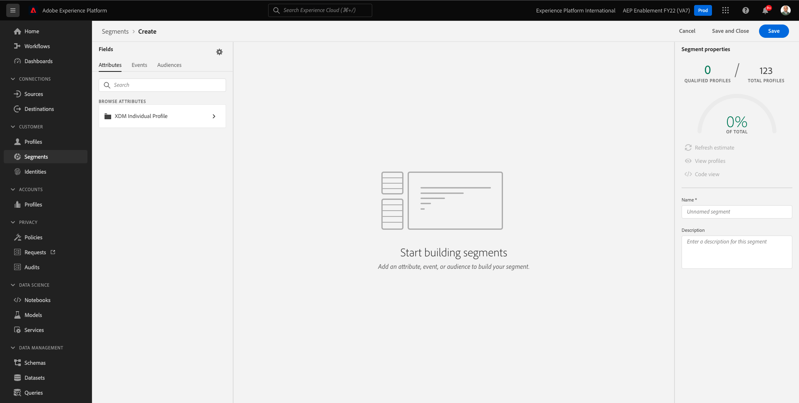

# 3.4 Segment erstellen - Benutzeroberfläche

In dieser Übung erstellen Sie ein Segment, indem Sie den Segmentaufbau von Adobe Experience Platform verwenden.

## Geschichte

Navigieren Sie zu [Adobe Experience Platform](https://experience.adobe.com/platform). Nach der Anmeldung landen Sie auf der Startseite von Adobe Experience Platform.


Bevor Sie fortfahren, müssen Sie eine **Sandbox**. Die auszuwählende Sandbox heißt ``--aepSandboxId--``. Klicken Sie hierzu auf den Text **[!UICONTROL Produktionsprodukt]** in der blauen Zeile auf Ihrem Bildschirm. Nach Auswahl der entsprechenden [!UICONTROL Sandbox], sehen Sie die Änderung des Bildschirms und befinden sich jetzt in Ihrem [!UICONTROL Sandbox].


Gehen Sie im Menü auf der linken Seite zu **Segmente**. Auf dieser Seite sehen Sie eine Übersicht über alle vorhandenen Segmente. Klicken Sie auf **+ Segment erstellen** -Schaltfläche, um mit der Erstellung eines neuen Segments zu beginnen.


Sobald Sie sich im neuen Segment-Builder befinden, wird Ihnen sofort die **Attribute** Menüoption und **XDM Individual Profile** Referenz.



Da XDM die Sprache ist, die das Erlebnisgeschäft steuert, ist XDM auch die Grundlage für den Segment-Builder. Alle Daten, die in Platform erfasst werden, sollten XDM zugeordnet werden. Daher werden alle Daten Teil desselben Datenmodells, unabhängig davon, woher diese Daten stammen. Dies bietet Ihnen beim Erstellen von Segmenten einen großen Vorteil. So können Sie in dieser einzigen Segment Builder-Benutzeroberfläche Daten aus jedem beliebigen Ursprung im selben Workflow kombinieren. In Segment Builder erstellte Segmente können zur Aktivierung an Lösungen wie Adobe Target, Adobe Campaign und Adobe Audience Manager gesendet werden.

Erstellen wir ein Segment, das alle **male** -Kunden.

Um zum Geschlechterattribut zu gelangen, müssen Sie XDM verstehen und kennen.

Geschlecht ist ein Attribut von Person, das unter Attribute zu finden ist. Um dorthin zu gelangen, klicken Sie auf **XDM Individual Profile**. Dann wirst du das sehen. Aus dem **XDM Individual Profile** auswählen **Person**.


Dann wirst du das sehen. In **Person**, können Sie die **Geschlecht** -Attribut. Ziehen Sie das Attribut Geschlecht in den Segment Builder.


Jetzt können Sie aus den vorausgefüllten Optionen das spezifische Geschlecht auswählen. In diesem Fall wählen wir **Männlich**.


Nach Auswahl **Männlich** können Sie eine Schätzung der Segmentpopulation erhalten, indem Sie die **Schätzung aktualisieren** Schaltfläche. Dies ist für einen Business-Anwender sehr hilfreich, damit er die Auswirkungen bestimmter Attribute auf die resultierende Segmentgröße sehen kann.


Daraufhin wird eine Schätzung wie die folgende angezeigt:


Als Nächstes sollten Sie Ihr Segment etwas verfeinern. Sie müssen ein Segment aller männlichen Kunden erstellen, die das Produkt angesehen haben **Proteus Fitness Jackshirt (Orange)**.

Um dieses Segment zu erstellen, müssen Sie ein Erlebnisereignis hinzufügen. Klicken Sie auf die Schaltfläche **Veranstaltungen** im **Felder** Menüleiste.


Als Nächstes sehen Sie die oberste Ebene. **XDM ExperienceEvents** Knoten. Klicken Sie auf **XDM ExperienceEvent**.


Navigieren Sie zu **Produktlistenelemente**.


Auswählen **Name** und ziehen Sie die **Name** -Objekt aus dem linken Menü auf die Arbeitsfläche des Segmentaufbaus in der **Veranstaltungen** Abschnitt.


Daraufhin sehen Sie Folgendes:


Der Vergleichsparameter sollte **gleich** und geben Sie im Eingabefeld **MONTANA WIND JACKET**.


Jedes Mal, wenn Sie ein Element zum Segment Builder hinzufügen, können Sie auf die **Schätzung aktualisieren** -Schaltfläche, um eine neue Schätzung der Population in Ihrem Segment zu erhalten.

Bisher haben Sie nur die Benutzeroberfläche zum Erstellen Ihres Segments verwendet, aber es gibt auch eine Code-Option zum Erstellen eines Segments.

Beim Erstellen eines Segments stellen Sie tatsächlich eine PQL-Abfrage (Profile Query Language) zusammen. Um den PQL-Code zu visualisieren, können Sie auf die **Codeansicht** Umschalter in der oberen rechten Ecke des Segment-Builders.


Jetzt können Sie die vollständige PQL-Anweisung sehen:

```sql
person.gender in ["male"] and CHAIN(xEvent, timestamp, [C0: WHAT(productListItems.exists(name.equals("MONTANA WIND JACKET", false)))])
```

Sie können auch eine Vorschau der Kundenprofile anzeigen, die Teil dieses Segments sind, indem Sie auf **Profile anzeigen**.


Geben wir schließlich Ihrem Segment einen Namen und speichern es.

Verwenden Sie als Namenskonvention:

- `--demoProfileLdap-- - Male customers with interest in Montana Wind Jacket`


Klicken Sie dann auf die **Speichern und schließen** zum Speichern Ihres Segments, woraufhin Sie zur Übersichtsseite Segment zurückgeleitet werden.


Sie können jetzt mit der nächsten Übung fortfahren und ein Segment über die API erstellen.

Nächster Schritt: [3.5 Segment erstellen - API](./ex5.md)

[Zurück zu Modul 3](./real-time-customer-profile.md)

[Zu allen Modulen zurückkehren](../../overview.md)
