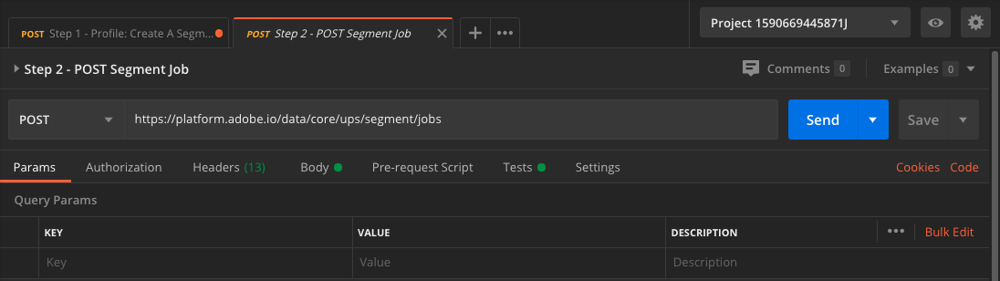
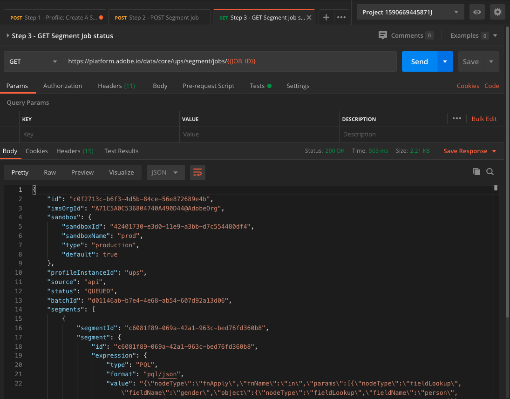

# 3.5 Segment erstellen - API

In dieser Übung verwenden Sie Postman und Adobe I/O, um ein Segment zu erstellen und die Ergebnisse dieses Segments als Datensatz zu speichern, indem Sie Adobe Experience Platform-APIs verwenden.

## Geschichte

Im Echtzeit-Kundenprofil werden alle Profildaten zusammen mit Ereignisdaten und vorhandenen Segmentmitgliedschaften angezeigt. Die angezeigten Daten können von einer beliebigen Stelle, von Adobe-Applikationen und externen Lösungen stammen. Dies ist die leistungsstärkste Ansicht in Adobe Experience Platform, dem Erlebnissystem der Aufzeichnungen.

## Übung 3.5.1 - Erstellen eines Segments über die Platform-API

Navigieren Sie zu Postman.

Suchen Sie die Sammlung: **_Adobe Experience Platform-Aktivierung**. In dieser Sammlung wird ein Ordner angezeigt **2. Segmentierung**. Wir werden diese Anfragen in dieser Übung nutzen.


Als Nächstes führen wir alle erforderlichen Schritte aus, um ein Segment über die API zu erstellen. Wir werden ein einfaches Segment erstellen: &quot;**ldap** - Alle weiblichen Kunden&quot;.

### Schritt 1: Erstellen einer Segmentdefinition

Klicken Sie auf die Anforderung namens **1. Schritt - Profil: Erstellen einer Segmentdefinition**.


Gehen Sie zum **body** -Abschnitt dieser Anfrage.


Im **body** dieser Anfrage sehen Sie Folgendes:


Die für diese Anfrage verwendete Sprache heißt Profile Query Language (Profilabfragesprache) oder **PQL**.

Weitere Informationen und Dokumentationen zu PQL finden Sie [here](https://experienceleague.adobe.com/docs/experience-platform/segmentation/pql/overview.html?lang=de).


Achtung: bitte die Variable aktualisieren **name** in der folgenden Anfrage durch **ldap** mit **ldap**.

```json
{
    "name" : "ldap - API - All Female Customer",
    "expression" : {"type":"PQL", "format":"pql/json", "value":"{\"nodeType\":\"fnApply\",\"fnName\":\"in\",\"params\":[{\"nodeType\":\"fieldLookup\",\"fieldName\":\"gender\",\"object\":{\"nodeType\":\"fieldLookup\",\"fieldName\":\"person\",\"object\":{\"nodeType\":\"literal\",\"literalType\":\"XDMObject\",\"value\":\"profile\"}}},{\"literalType\":\"List\",\"nodeType\":\"literal\",\"value\":[\"female\"]}]}"},
    "createdBy": "ldap",
    "schema" : { "name" : "_xdm.context.profile"},
    "ttlInDays" : 90
}
```

Nach dem Hinzufügen Ihrer spezifischen **ldap**, sollte der Hauptteil in etwa wie folgt aussehen:

```json
{
    "name" : "vangeluw - API - All Female Customer",
    "expression" : {"type":"PQL", "format":"pql/json", "value":"{\"nodeType\":\"fnApply\",\"fnName\":\"in\",\"params\":[{\"nodeType\":\"fieldLookup\",\"fieldName\":\"gender\",\"object\":{\"nodeType\":\"fieldLookup\",\"fieldName\":\"person\",\"object\":{\"nodeType\":\"literal\",\"literalType\":\"XDMObject\",\"value\":\"profile\"}}},{\"literalType\":\"List\",\"nodeType\":\"literal\",\"value\":[\"female\"]}]}"},
    "createdBy": "vangeluw",
    "schema" : { "name" : "_xdm.context.profile"},
    "ttlInDays" : 90
}
```

Sie sollten auch die **Kopfzeile** - Felder Ihrer Anfrage. Navigieren Sie zu **Kopfzeilen**. Daraufhin sehen Sie Folgendes:


| Schlüssel | Wert |
| -------------- | ------------------ |
| x-sandbox-name | `--aepSandboxId--` |

>[!NOTE]
>
>Sie müssen den Namen der verwendeten Adobe Experience Platform-Sandbox angeben. Ihr x-sandbox-name sollte `--aepSandboxId--`.

Klicken Sie nun auf das blaue **Senden** -Schaltfläche, um das Segment zu erstellen und die Ergebnisse anzuzeigen.


Nach diesem Schritt können Sie Ihre Segmentdefinition in der Platform-Benutzeroberfläche anzeigen. Um dies zu überprüfen, melden Sie sich bei Adobe Experience Platform an und navigieren Sie zu **Segmente**.


### Schritt 2: Erstellen eines Auftrags für die SegmentPOST

In der vorherigen Übung haben Sie eine _Streaming_ Segment. Ein Streaming-Segment bewertet kontinuierlich Qualifikationen in Echtzeit. Was du hier tust, ist ein _Batch_ Segment. Das Batch-Segment gibt Ihnen eine Vorschau darüber, wie das Segment in Bezug auf Qualifikationen aussehen könnte, aber _das nicht bedeutet, dass das Segment tatsächlich ausgeführt wurde_. Zurzeit _Für dieses Segment qualifiziert sich keiner_. Um Personen zu qualifizieren, muss das Batch-Segment ausgeführt werden, was wir hier tun werden.

POST eines Segmentauftrags

Navigieren Sie zu Postman.


Klicken Sie in Ihrer Postman-Sammlung auf die Anforderung mit dem Namen **Schritt 2: Auftrag des POST-Segments** um es zu öffnen.



Sie sollten auch die **Kopfzeile** - Felder Ihrer Anfrage. Navigieren Sie zu **Kopfzeilen**. Daraufhin sehen Sie Folgendes:


| Schlüssel | Wert |
| -------------- | ------------------ |
| x-sandbox-name | `--aepSandboxId--` |

>[!NOTE]
>
>Sie müssen den Namen der verwendeten Adobe Experience Platform-Sandbox angeben. Ihr x-sandbox-name sollte `--aepSandboxId--`.

Klicken Sie auf Blau **Senden** Schaltfläche.

Sie sollten ein ähnliches Ergebnis sehen:


Dieser Segmentauftrag wird jetzt ausgeführt, was einige Zeit in Anspruch nehmen kann. In Schritt 3 können Sie den Status dieses Auftrags überprüfen.


### Schritt 3: Status des GET-Segmentauftrags

Navigieren Sie zu Postman.


Klicken Sie in Ihrer Postman-Sammlung auf die Anforderung mit dem Namen **Schritt 3: Status des GET-Segmentauftrags**.


Sie sollten auch die **Kopfzeile** - Felder Ihrer Anfrage. Navigieren Sie zu **Kopfzeilen**. Daraufhin sehen Sie Folgendes:


| Schlüssel | Wert |
| -------------- | ------------------ |
| x-sandbox-name | `--aepSandboxId--` |

>[!NOTE]
>
>Sie müssen den Namen der verwendeten Adobe Experience Platform-Sandbox angeben. Ihr x-sandbox-name sollte `--aepSandboxId--`.

Klicken Sie auf Blau **Senden** Schaltfläche.

Sie sollten ein ähnliches Ergebnis sehen:



In diesem Beispiel wird die **status** des Auftrags auf **QUEUED**.

Wiederholen Sie diese Anfrage, indem Sie auf das blaue **Senden** alle paar Minuten bis zum **status** auf **ERFOLGREICH**.


Sobald der Status **ERFOLGREICH**, wurde Ihr Segmentauftrag ausgeführt und Kunden sind nun qualifiziert für das Segment.

Herzlichen Glückwunsch, Sie haben die Segmentierungsübung erfolgreich abgeschlossen. Sehen wir uns nun an, wie das Echtzeit-Kundenprofil im gesamten Unternehmen aktiviert werden kann.

Nächster Schritt: [3.6 Echtzeit-Kundenprofil in Aktion im Callcenter anzeigen](./ex6.md)

[Zurück zu Modul 3](./real-time-customer-profile.md)

[Zu allen Modulen zurückkehren](../../overview.md)
