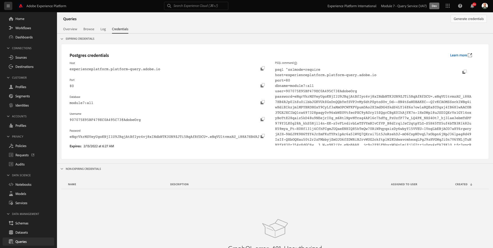
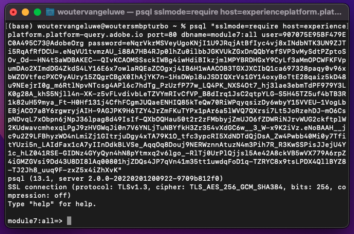

# 4.1 Erste Schritte

## 4.1.1 Kennenlernen der Adobe Experience Platform-Benutzeroberfläche

Navigieren Sie zu [Adobe Experience Platform](https://experience.adobe.com/platform). Nach der Anmeldung landen Sie auf der Startseite von Adobe Experience Platform.

Bevor Sie fortfahren, müssen Sie eine **Sandbox**. Die auszuwählende Sandbox heißt ``--module7sandbox--``. Klicken Sie hierzu auf den Text **[!UICONTROL Produktionsprodukt]** in der blauen Zeile auf Ihrem Bildschirm. Nach Auswahl der entsprechenden [!UICONTROL Sandbox], sehen Sie die Änderung des Bildschirms und befinden sich jetzt in Ihrem [!UICONTROL Sandbox].

## 4.1.2 Daten auf der Plattform durchsuchen

Daten aus verschiedenen Kanälen zu beziehen, ist für jede Marke eine schwierige Aufgabe. In dieser Übung interagieren Kunden von Citi Signal mit Citi Signal auf ihrer Website, über ihre mobile App werden Kaufdaten vom Point of Sale-System von Citi Signal erfasst und sie verfügen über CRM- und Loyalitätsdaten. Citi Signal verwendet Adobe Analytics und Adobe Launch, um Daten über seine Website, mobile App und POS-Systeme zu erfassen. Daher fließen diese Daten bereits in Adobe Experience Platform. Beginnen wir mit der Erforschung aller Daten für Citi Signal, die bereits in Adobe Experience Platform vorhanden sind.

Gehen Sie im linken Menü zu **Datensätze**.

Citi Signal streamt Daten an Adobe Experience Platform, die im Abschnitt `Demo System - Event Dataset for Website (Global v1.1)` Datensatz. Suchen Sie nach `Demo System - Event Dataset for Website`.

Die Callcenter-Interaktionsdaten von Citi Signal werden im `Demo System - Event Dataset for Call Center (Global v1.1)` Datensatz. Suchen Sie nach `Demo System - Event Dataset for Call Center` Daten in das Suchfeld ein. Klicken Sie auf den Namen des Datensatzes, um ihn zu öffnen.

Nachdem Sie auf den Datensatz geklickt haben, erhalten Sie einen Überblick über die Datensatzaktivität, z. B. aufgenommene und fehlgeschlagene Batches.

Klicken Sie auf **Vorschau eines Datensatzes anzeigen** um ein Beispiel der in gespeicherten Daten anzuzeigen `Demo System - Event Dataset for Call Center (Global v1.1)` Datensatz. Das linke Bedienfeld zeigt die Schemastruktur für diesen Datensatz an.

Klicken Sie auf **Schließen** Schaltfläche zum Schließen **Vorschau eines Datensatzes anzeigen** Fenster.

## 4.1.3 Einführung in Query Service

Auf den Adobe Experience Platform-Abfragedienst kann durch Klicken auf **Abfragen** im linken Menü.

Indem Sie **Protokoll** sehen Sie die Seite &quot;Abfrageliste&quot;, die eine Liste aller Abfragen enthält, die in dieser Organisation ausgeführt wurden, wobei sich die neueste Seite oben befindet.

Klicken Sie in der Liste auf eine SQL-Abfrage und beachten Sie die Details in der rechten Leiste.

Sie können im Fenster einen Bildlauf durchführen, um die gesamte Abfrage anzuzeigen, oder auf das unten hervorgehobene Symbol klicken, um die gesamte Abfrage in Ihr Notebook zu kopieren. Sie müssen die Abfrage derzeit nicht kopieren.

Sie können nicht nur die ausgeführten Abfragen sehen, sondern über diese Benutzeroberfläche neue Datensätze aus Abfragen erstellen. Diese Datensätze können mit dem Echtzeit-Kundenprofil von Adobe Experience Platform verknüpft oder als Eingabe für Adobe Experience Platform Data Science Workspace verwendet werden.

## 4.1.4 PSQL-Client mit Query Service verbinden

Query Service unterstützt Clients mit einem Treiber für PostgreSQL. Dabei werden wir PSQL, eine Befehlszeilenschnittstelle, und Power BI oder Tableau verwenden. Stellen wir eine Verbindung zu PSQL her.

Klicken Sie auf **Anmeldeinformationen**.

Daraufhin wird der Bildschirm unten angezeigt. Der Bildschirm &quot;Konfiguration&quot;enthält Serverinformationen und Anmeldedaten für die Authentifizierung bei Query Service. Zunächst konzentrieren wir uns auf die rechte Seite des Bildschirms, der einen Verbindungsbefehl für PSQL enthält. Klicken Sie auf die Schaltfläche Kopieren , um den Befehl in die Zwischenablage zu kopieren.

Windows: Öffnen Sie die Befehlszeile, indem Sie die Windows-Taste drücken, Befehl eingeben und auf das Ergebnis der Eingabeaufforderung klicken.

Für macOS: Öffnen Sie &quot;terminal.app&quot;über die Spotlight-Suche:

Fügen Sie den Verbindungsbefehl ein, den Sie aus der Query Service-Benutzeroberfläche kopiert haben, und drücken Sie die Eingabetaste im Eingabeaufforderungsfenster:

Windows:

MacOS:

Sie sind jetzt mit Query Service über PSQL verbunden.

In den nächsten Übungen wird es eine gewisse Interaktion mit diesem Fenster geben. Wir werden es als Ihre **PSQL-Befehlszeilenschnittstelle**.

Jetzt können Sie mit dem Senden von Abfragen beginnen.

Nächster Schritt: [4.2 Query Service verwenden](./ex2.md)

[Zurück zu Modul 4](./query-service.md)

[Zu allen Modulen zurückkehren](../../overview.md)
