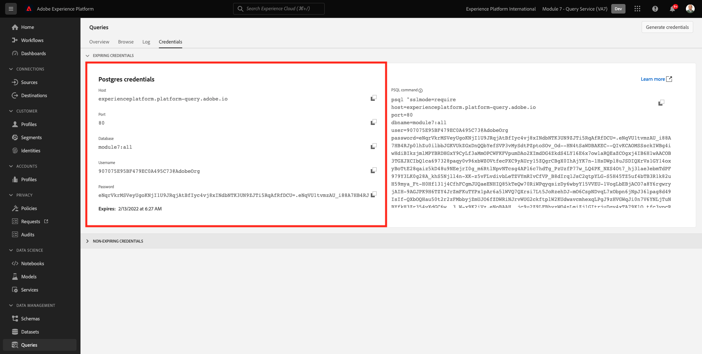
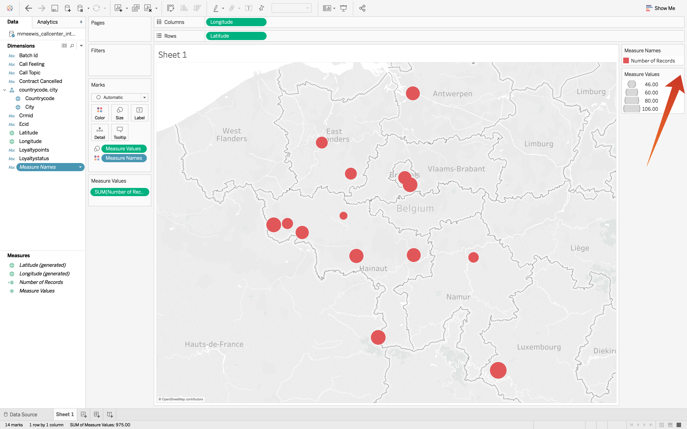

# 4.6 Query Service und Tableau

Öffnen Sie Tableau.

In **Herstellen einer Verbindung zu einem Server** select **PostgreSQL**:

Navigieren Sie zu Adobe Experience Platform, um **Abfragen** und **Anmeldeinformationen**.

Aus dem **Anmeldeinformationen** Seite in Adobe Experience Platform, kopieren Sie die **Host** und fügen Sie sie in **Server** -Feld, kopieren Sie die **Datenbank** und fügen Sie sie in **Datenbank** -Feld in Tableau kopieren Sie die **Port** und fügen Sie ihn in das Feld ein **Port** Gehen Sie in Tableau genauso vor wie für **Benutzername** und **Passwort**. Klicken Sie anschließend auf **Anmelden**.

Anmelden:

Klicken Sie auf &quot;Suchen&quot;(1) und geben Sie Ihre **ldap** Identifizieren Sie in das Suchfeld die Tabelle aus der Ergebnismenge und ziehen Sie sie an die Stelle mit dem Namen **Tabellen hierher ziehen**. Wenn Sie fertig sind, klicken Sie auf **Blatt 1** Absatz 3.

Um unsere Daten auf der Karte zu visualisieren, müssen wir Längen- und Breitengrad in Dimensionen konvertieren. In **Maßnahmen** select **Breitengrad** (1), öffnen Sie das Dropdown-Menü des Felds und wählen Sie **In Dimension konvertieren** Absatz 2. Tun Sie dasselbe für **Längengrad** Maßnahme.

Ziehen Sie die **Längengrad** der **Spalten** und **Breitengrad** zu **Zeilen**. Automatische Zuordnung von **Belgien** werden mit kleinen Punkten angezeigt, die die Städte in einem Datensatz darstellen.

Auswählen **Namen messen** (1), öffnen Sie das Dropdown-Menü und wählen Sie **Zu Tabelle hinzufügen** 2.

Sie haben jetzt eine Karte mit Punkten unterschiedlicher Größe. Die Größe gibt die Anzahl der Interaktionen des Callcenters für diese spezifische Stadt an. Um die Punktgröße zu variieren, navigieren Sie zum rechten Bereich und öffnen Sie **Werte messen** (über das Dropdown-Symbol). Wählen Sie aus der Dropdownliste **Größen bearbeiten**. Spielen Sie mit unterschiedlichen Größen herum.

So zeigen Sie die Daten pro **Anrufthema**, ziehen Sie die **Anrufthema** Dimension auf **Seiten**. Navigieren durch die verschiedenen **Aufrufthemen** mithilfe der **Anrufthema** (2) auf der rechten Bildschirmseite:

Du bist jetzt mit dieser Übung fertig.

Nächster Schritt: [4.7 Query Service-API](./ex7.md)

[Zurück zu Modul 4](./query-service.md)

[Zu allen Modulen zurückkehren](../../overview.md)
