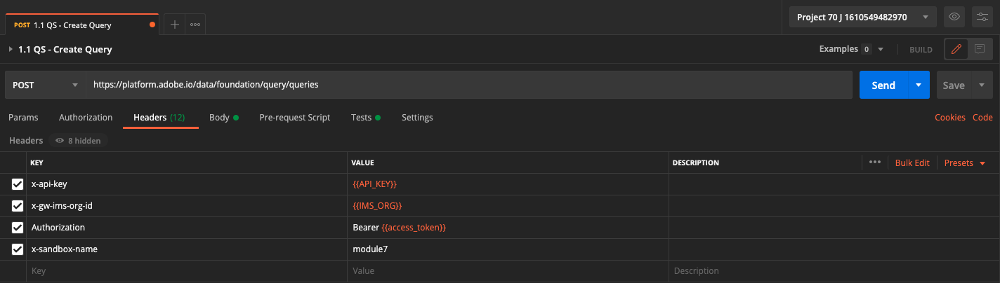

# 4.7 Query Service-API

## Ziel

- Verwenden Sie die Query Service-API zum Verwalten von Abfragevorlagen und Abfragezeitplänen.

## Kontext

In dieser Übung führen Sie API-Aufrufe aus, um Abfragevorlagen und Abfragezeitpläne mithilfe einer Postman-Sammlung zu verwalten. Sie definieren Abfragevorlagen, führen reguläre Abfragen und CTAS-Abfragen aus. A **CTAS** query (Tabelle als ausgewählte Abfrage erstellen) speichert das Ergebnis in einem expliziten Datensatz. Während reguläre Abfragen in einem impliziten (oder systemgenerierten) Datensatz gespeichert werden, wird dieser normalerweise im Parquet-Dateiformat exportiert.

## Dokumentation

- [Hilfe zum Adobe Experience Platform-Abfrageservice](https://experienceleague.adobe.com/docs/experience-platform/query/api/getting-started.html?lang=de)
- [Query Service-API](https://www.adobe.io/apis/experienceplatform/home/api-reference.html#!acpdr/swagger-specs/qs-api.yaml)

## 4.7.1 Query Service-API

Mit der Query Service-API können Sie nicht interaktive Abfragen für den Adobe Experience Platform Data-Lake verwalten.

Nicht interaktiv bedeutet, dass eine Anfrage zur Ausführung einer Abfrage keine sofortige Antwort zur Folge hat. Die Abfrage wird verarbeitet und der Ergebnissatz wird in einem impliziten oder expliziten (CTAS: Tabelle als ausgewählten Datensatz erstellen.

## 4.7.2 Beispielabfrage

Als Beispielabfrage verwenden Sie die erste Abfrage, die unter [4.3 - Abfragen, Abfragen, Abfragen ... und Abwanderungsanalyse](./ex3.md):

Wie viele Produktansichten haben wir täglich?

**SQL**

```sql
select date_format( timestamp , 'yyyy-MM-dd') AS Day,
       count(*) AS productViews
from   demo_system_event_dataset_for_website_global_v1_1
where  --aepTenantId--.demoEnvironment.brandName IN ('Luma Telco', 'Citi Signal')
and eventType = 'commerce.productViews'
group by Day
limit 10;
```

## 4.7.3 Abfragen

Öffnen Sie Postman auf Ihrem Computer. Im Rahmen von Modul 3 haben Sie eine Postman-Umgebung erstellt und eine Postman-Sammlung importiert. Befolgen Sie die Anweisungen unter [Übung 3.3.3](./../module3/ex3.md) falls du das noch nicht getan hast.

Im Rahmen der von Ihnen importierten Postman-Sammlung wird ein Ordner angezeigt **3. Query Service**. Wenn dieser Ordner nicht angezeigt wird, laden Sie den [Postman-Sammlung](../../assets/postman/postman_profile.zip) und importieren Sie diese Sammlung erneut in Postman, wie hier beschrieben: [Übung 3.3.3](./../module3/ex3.md).


>[!NOTE]
>
>Derzeit ist nur der Ordner **1. Abfragen** enthält Anforderungen. Andere Anforderungen werden in einem Ebenenstadium hinzugefügt.

Öffnen Sie diesen Ordner und lernen Sie die Query Service-API-Aufrufe kennen, mit denen Sie die Abfrage-Ergebnismenge ausführen, überwachen und herunterladen können.

Ein POST-Aufruf an [/query/queries] mit der folgenden Payload wird die Ausführung unserer Abfrage Trigger;

### 4.7.3.1 Abfrage erstellen

Klicken Sie auf die Anforderung namens **1.1 QS - Abfrage erstellen** und gehen Sie zu **Kopfzeilen**. Daraufhin sehen Sie Folgendes:



Fokussieren wir uns auf dieses Kopfzeilenfeld:

| Schlüssel | Wert |
| ----------- | ----------- |
| x-sandbox-name | `--module7sandbox--` |

>[!NOTE]
>
>Sie müssen den Namen der verwendeten Adobe Experience Platform-Sandbox angeben. Das Kopfzeilenfeld **x-sandbox-name** sollte `--module7sandbox--`.

Gehen Sie zum **body** -Abschnitt dieser Anfrage. Im **body** dieser Anfrage sehen Sie Folgendes:


```sql
{
    "name" : "ldap - QS API demo - Citi Signal - Product Views Per Day",
	"description": "ldap - QS API demo - Citi Signal - Product Views Per Day",
	"dbName": "module7:all",
	"sql": "select date_format( timestamp , 'yyyy-MM-dd') AS Day, count(*) AS productViews from demo_system_event_dataset_for_website_global_v1_1 where _experienceplatform.demoEnvironment.brandName IN ('Luma Telco', 'Citi Signal') and eventType = 'commerce.productViews' group by Day limit 10"
}
```

Achtung: bitte die Variable aktualisieren **name** in der folgenden Anfrage durch **ldap** mit **ldap**.

Nach dem Hinzufügen Ihrer spezifischen **ldap**, sollte der Hauptteil in etwa wie folgt aussehen:

```json
{
    "name" : "vangeluw - QS API demo - Citi Signal - Product Views Per Day",
	"description": "vangeluw - QS API demo - Citi Signal - Product Views Per Day",
	"dbName": "module7:all",
	"sql": "select date_format( timestamp , 'yyyy-MM-dd') AS Day, count(*) AS productViews from demo_system_event_dataset_for_website_global_v1_1 where _experienceplatform.demoEnvironment.brandName IN ('Luma Telco', 'Citi Signal') and eventType = 'commerce.productViews' group by Day limit 10"
}
```

>[!NOTE]
>
>Der Schlüssel **dbName** im obigen JSON-Hauptteil bezieht sich auf die Sandbox, die in Ihrer Adobe Experience Platform-Instanz verwendet wird. Wenn Sie die PROD-Sandbox verwenden, sollte dbName **prod:all**, wenn Sie eine andere Sandbox verwenden, z. B. **module7**, sollte dbName gleich **module7:all**.

Klicken Sie anschließend auf das blaue **Senden** -Schaltfläche, um das Segment zu erstellen und die Ergebnisse anzuzeigen.


Nach erfolgreichem Abschluss gibt die POST-Anfrage die folgende Antwort zurück:

```json
{
    "isInsertInto": false,
    "request": {
        "dbName": "module7:all",
        "sql": "select date_format( timestamp , 'yyyy-MM-dd') AS Day, count(*) AS productViews from demo_system_event_dataset_for_website_global_v1_1 where _experienceplatform.demoEnvironment.brandName IN ('Luma Telco', 'Citi Signal') and eventType = 'commerce.productViews' group by Day limit 10",
        "name": "vangeluw - QS API demo - Citi Signal - Product Views Per Day",
        "description": "vangeluw - QS API demo - Citi Signal - Product Views Per Day"
    },
    "clientId": "5a143b5ae4aa4631a1f3b09cd051333f",
    "state": "SUBMITTED",
    "rowCount": 0,
    "errors": [],
    "isCTAS": false,
    "version": 1,
    "id": "8f0d7f25-f7aa-493b-9792-290f884a7e5b",
    "elapsedTime": 0,
    "updated": "2021-01-20T13:23:13.951Z",
    "client": "API",
    "userId": "A3392DB95FFF08EE0A495E87@techacct.adobe.com",
    "created": "2021-01-20T13:23:13.951Z",
    "_links": {
        "self": {
            "href": "https://platform-va7.adobe.io/data/foundation/query/queries/8f0d7f25-f7aa-493b-9792-290f884a7e5b",
            "method": "GET"
        },
        "soft_delete": {
            "href": "https://platform-va7.adobe.io/data/foundation/query/queries/8f0d7f25-f7aa-493b-9792-290f884a7e5b",
            "method": "PATCH",
            "body": "{ \"op\": \"soft_delete\"}"
        },
        "cancel": {
            "href": "https://platform-va7.adobe.io/data/foundation/query/queries/8f0d7f25-f7aa-493b-9792-290f884a7e5b",
            "method": "PATCH",
            "body": "{ \"op\": \"cancel\"}"
        }
    }
}
```

Die aktuelle **state** der Abfrage **EINGEREICHT**, wird nach der Ausführung der Status **ERFOLG**.

Sie können auch gesendete Abfragen über die Adobe Experience Platform-Benutzeroberfläche nachschlagen, öffnen Sie [Adobe Experience Platform](https://experience.adobe.com/#/@experienceplatform/platform/home), navigieren Sie zu **Abfragen**, um **Protokoll** und wählen Sie Ihre Abfrage aus:


### 4.7.3.2 Abfragen abrufen

Klicken Sie auf die Anforderung namens **1.2 QS - Abfragen abrufen** und gehen Sie zu **Kopfzeilen**. Daraufhin sehen Sie Folgendes:


Fokussieren wir uns auf dieses Kopfzeilenfeld:

| Schlüssel | Wert |
| ----------- | ----------- |
| x-sandbox-name | `--module7sandbox--` |

>[!NOTE]
>
>Sie müssen den Namen der verwendeten Adobe Experience Platform-Sandbox angeben. Das Kopfzeilenfeld **x-sandbox-name** sollte `--module7sandbox--`.

Navigieren Sie zu **Parameter**. Daraufhin sehen Sie Folgendes:


Die **orderby** -Parameter können Sie eine Sortierreihenfolge basierend auf der **created** -Eigenschaft. Beachten Sie die **&#39;-&#39;** -Zeichen vor der Erstellung verwenden, d. h. die Reihenfolge, in der die Liste der Abfragen zurückgegeben wird, verwendet das von Ihnen erstellte Datum in **absteigend** bestellen. Ihre Abfrage sollte oben in der Liste stehen.

Klicken Sie anschließend auf das blaue **Senden** -Schaltfläche, um das Segment zu erstellen und die Ergebnisse anzuzeigen.


Bei Erfolg gibt die Anfrage eine Antwort zurück, die der folgenden ähnelt. Die **state** der Antwort **EINGEREICHT**, **IN_PROGRESS** oder **ERFOLG**. Es kann mehrere Minuten dauern, bis die Abfrage eine **ERFOLG** state. Sie können den Versand dieser Anfrage mehrmals wiederholen, bis die Variable **ERFOLG** state.

```json
{
    "queries": [
        {
            "isInsertInto": false,
            "request": {
                "dbName": "module7:all",
                "sql": "select date_format( timestamp , 'yyyy-MM-dd') AS Day, count(*) AS productViews from demo_system_event_dataset_for_website_global_v1_1 where _experienceplatform.demoEnvironment.brandName IN ('Luma Telco', 'Citi Signal') and eventType = 'commerce.productViews' group by Day limit 10",
                "name": "vangeluw - QS API demo - Citi Signal - Product Views Per Day",
                "description": "vangeluw - QS API demo - Citi Signal - Product Views Per Day"
            },
            "clientId": "5a143b5ae4aa4631a1f3b09cd051333f",
            "state": "SUCCESS",
            "rowCount": 1,
            "errors": [],
            "isCTAS": false,
            "version": 1,
            "id": "8f0d7f25-f7aa-493b-9792-290f884a7e5b",
            "elapsedTime": 217481,
            "updated": "2021-01-20T13:26:51.432Z",
            "client": "API",
            "userId": "A3392DB95FFF08EE0A495E87@techacct.adobe.com",
            "created": "2021-01-20T13:23:13.951Z",
            "_links": {
                "self": {
                    "href": "https://platform-va7.adobe.io/data/foundation/query/queries/8f0d7f25-f7aa-493b-9792-290f884a7e5b",
                    "method": "GET"
                },
                "soft_delete": {
                    "href": "https://platform-va7.adobe.io/data/foundation/query/queries/8f0d7f25-f7aa-493b-9792-290f884a7e5b",
                    "method": "PATCH",
                    "body": "{ \"op\": \"soft_delete\"}"
                },
                "referenced_datasets": [
                    {
                        "id": "60080ace62c49a19490c5870",
                        "href": "https://platform-va7.adobe.io/data/foundation/catalog/dataSets/60080ace62c49a19490c5870"
                    }
                ]
            }
        }
     ]
    },
    "version": 1
}
```

Wenn der Status **ERFOLG**, fahren Sie mit der nächsten Anfrage fort.

### 4.7.3.3 Abfragestatus abrufen

Klicken Sie auf die Anforderung namens **1.3 QS - Abrufen des Abfragestatus** und gehen Sie zu **Kopfzeilen**. Daraufhin sehen Sie Folgendes:


Fokussieren wir uns auf dieses Kopfzeilenfeld:

| Schlüssel | Wert |
| ----------- | ----------- |
| x-sandbox-name | `--module7sandbox--` |

>[!NOTE]
>
>Sie müssen den Namen der verwendeten Adobe Experience Platform-Sandbox angeben. Das Kopfzeilenfeld **x-sandbox-name** sollte `--module7sandbox--`.

Klicken Sie anschließend auf das blaue **Senden** -Schaltfläche, um das Segment zu erstellen und die Ergebnisse anzuzeigen.


Bei Erfolg gibt die Anfrage eine Antwort zurück, die der folgenden ähnelt.

```json
{
    "isInsertInto": false,
    "request": {
        "dbName": "module7:all",
        "sql": "select date_format( timestamp , 'yyyy-MM-dd') AS Day, count(*) AS productViews from demo_system_event_dataset_for_website_global_v1_1 where _experienceplatform.demoEnvironment.brandName IN ('Luma Telco', 'Citi Signal') and eventType = 'commerce.productViews' group by Day limit 10",
        "name": "vangeluw - QS API demo - Citi Signal - Product Views Per Day",
        "description": "vangeluw - QS API demo - Citi Signal - Product Views Per Day"
    },
    "clientId": "5a143b5ae4aa4631a1f3b09cd051333f",
    "state": "SUCCESS",
    "rowCount": 1,
    "errors": [],
    "isCTAS": false,
    "version": 1,
    "id": "8f0d7f25-f7aa-493b-9792-290f884a7e5b",
    "elapsedTime": 217481,
    "updated": "2021-01-20T13:26:51.432Z",
    "client": "API",
    "userId": "A3392DB95FFF08EE0A495E87@techacct.adobe.com",
    "created": "2021-01-20T13:23:13.951Z",
    "_links": {
        "self": {
            "href": "https://platform-va7.adobe.io/data/foundation/query/queries/8f0d7f25-f7aa-493b-9792-290f884a7e5b",
            "method": "GET"
        },
        "soft_delete": {
            "href": "https://platform-va7.adobe.io/data/foundation/query/queries/8f0d7f25-f7aa-493b-9792-290f884a7e5b",
            "method": "PATCH",
            "body": "{ \"op\": \"soft_delete\"}"
        },
        "referenced_datasets": [
            {
                "id": "60080ace62c49a19490c5870",
                "href": "https://platform-va7.adobe.io/data/foundation/catalog/dataSets/60080ace62c49a19490c5870"
            }
        ]
    }
}
```

Wenn eine Abfrage den Status von **ERFOLG**, zeigt die Antwort auch die Anzahl der Zeilen an, die von der Abfrage über die **rowCount** -Eigenschaft. In unserem Beispiel werden 10 Zeilen von der Abfrage zurückgegeben. Im nächsten Abschnitt sehen wir, wie wir die 10 Zeilen abrufen können.

### 4.7.3.4 Abfrageergebnis abrufen

Die **ERFOLG** Antwort oben enthält eine **referenced_datasets** -Eigenschaft, die auf den impliziten Datensatz verweist, in dem das Abfrageergebnis gespeichert wird. Um Zugriff auf das Ergebnis zu erhalten, verwenden wir dessen **href** oder **id** -Eigenschaft.

Klicken Sie auf die Anforderung namens **1.4 QS - Abfrageergebnis abrufen** und gehen Sie zu **Kopfzeilen**. Daraufhin sehen Sie Folgendes:


Fokussieren wir uns auf dieses Kopfzeilenfeld:

| Schlüssel | Wert |
| ----------- | ----------- |
| x-sandbox-name | `--module7sandbox--` |

>[!NOTE]
>
>Sie müssen den Namen der verwendeten Adobe Experience Platform-Sandbox angeben. Das Kopfzeilenfeld **x-sandbox-name** sollte `--module7sandbox--`.

Klicken Sie anschließend auf das blaue **Senden** -Schaltfläche, um das Segment zu erstellen und die Ergebnisse anzuzeigen.


Die Antwort dieser Anfrage verweist auf die Datensatzdateien:

```json
{
    "60080ace62c49a19490c5870": {
        "name": "Demo System - Event Dataset for Website (Global v1.1)",
        "description": "Demo System - Event Dataset for Website (Global v1.1)",
        "enableErrorDiagnostics": false,
        "tags": {
            "adobe/siphon/partition/definition": [
                "day(timestamp, _ACP_DATE)",
                "identity(_ACP_BATCHID)"
            ],
            "aep/siphon/partitions": [
                "_ACP_DATE",
                "_ACP_BATCHID"
            ],
            "acp_granular_plugin_validation_flags": [
                "identity:enabled",
                "profile:enabled"
            ],
            "adobe/siphon/buffered-promotion-recency": [
                "live"
            ],
            "adobe/siphon/use-buffered-promotion": [
                "true"
            ],
            "adobe/pqs/table": [
                "demo_system_event_dataset_for_website_global_v1_1"
            ],
            "aep/siphon/expire-snapshot-timestamp": [
                "1611141272703"
            ],
            "acp_granular_validation_flags": [
                "requiredFieldCheck:enabled"
            ],
            "acp_validationContext": [
                "enabled"
            ],
            "adobe/siphon/table/format": [
                "iceberg"
            ],
            "unifiedProfile": [
                "enabled:true",
                "enabledAt:2021-01-20 10:49:51"
            ],
            "unifiedIdentity": [
                "enabled:true"
            ]
        },
        "namespace": "ACP",
        "state": "DRAFT",
        "imsOrg": "907075E95BF479EC0A495C73@AdobeOrg",
        "sandboxId": "62cd9f38-8529-4b05-8d9f-388529db0540",
        "lastBatchId": "01EWFQZ15XRNNB1FPKPW5ETRVP",
        "lastBatchStatus": "success",
        "lastSuccessfulBatch": "01EWFQZ15XRNNB1FPKPW5ETRVP",
        "version": "1.0.6",
        "created": 1611139790698,
        "updated": 1611149266031,
        "createdClient": "750e24ee855b4ac18ccc4f4817f96ee1",
        "createdUser": "3A260B485E909A170A495E76@techacct.adobe.com",
        "updatedUser": "acp_foundation_dataTracker@AdobeID",
        "viewId": "60080ace62c49a19490c5871",
        "fileDescription": {
            "persisted": true,
            "containerFormat": "parquet",
            "format": "parquet"
        },
        "files": "@/dataSets/60080ace62c49a19490c5870/views/60080ace62c49a19490c5871/files",
        "schemaMetadata": {
            "delta": [],
            "gdpr": []
        },
        "schemaRef": {
            "id": "https://ns.adobe.com/experienceplatform/schemas/d9b88a044ad96154637965a97ed63c7b20bdf2ab3b4f642e",
            "contentType": "application/vnd.adobe.xed-full+json;version=1"
        }
    }
}
```

>[!NOTE]
>
>In Kürze werden weitere Übungen hinzugefügt, die Ihnen bei der Interaktion mit der Query Service-API helfen.

Nächster Schritt: [Zusammenfassung und Vorteile](./summary.md)

[Zurück zu Modul 4](./query-service.md)

[Zu allen Modulen zurückkehren](../../overview.md)
