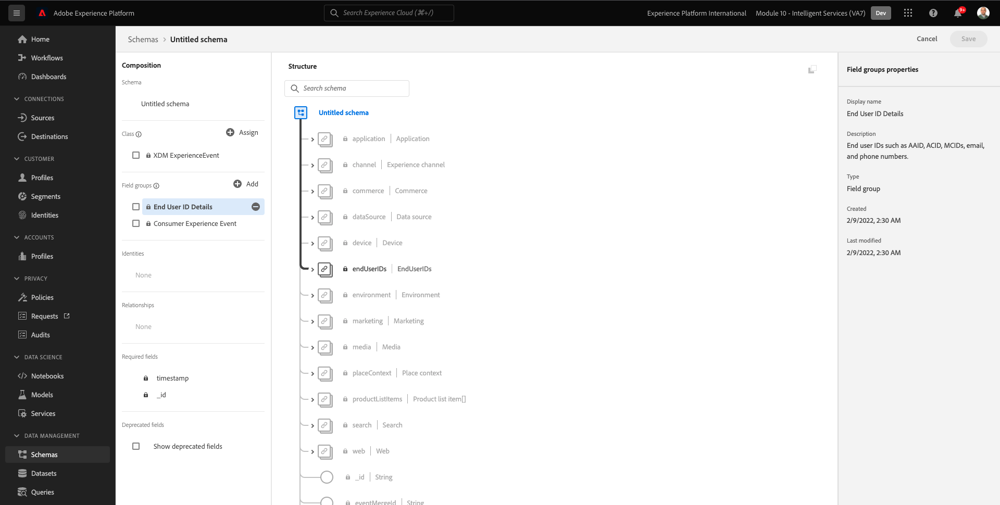
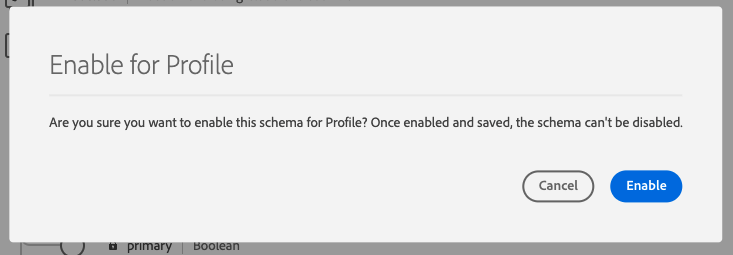
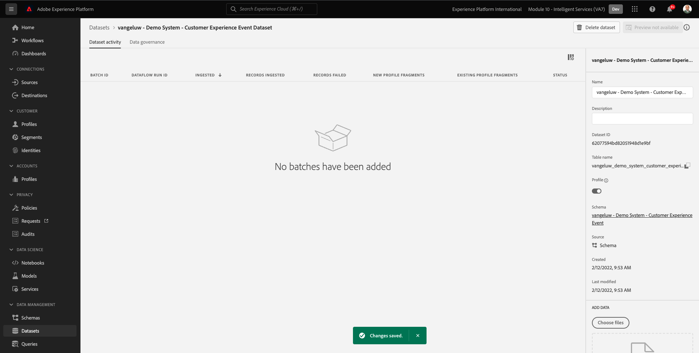
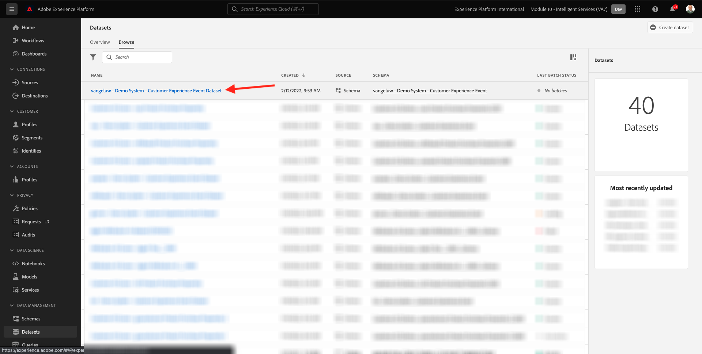

# 5.1 Customer AI - Datenvorbereitung (Aufnahme)

Damit Intelligent Services Einblicke aus Ihren Marketing-Ereignisdaten gewinnen kann, müssen die Daten semantisch angereichert und in einer Standardstruktur verwaltet werden. Intelligent Services nutzt dazu die Experience-Datenmodell (XDM)-Schemas von Adobe.
Insbesondere müssen alle Datensätze, die in Intelligent Services verwendet werden, mit dem **Ereignis für Kundenerlebnisse** XDM-Schema.

## 5.1.1 Schema erstellen

In dieser Übung erstellen Sie ein Schema, das die **Consumer Experience Event-Mixin**, die von der **Customer AI** Intelligent Service.

Melden Sie sich über diese URL bei Adobe Experience Platform an: [https://experience.adobe.com/platform](https://experience.adobe.com/platform).

Nach der Anmeldung landen Sie auf der Startseite von Adobe Experience Platform.

Bevor Sie fortfahren, müssen Sie eine **Sandbox**. Die auszuwählende Sandbox heißt ``--module10sandbox--``. Klicken Sie hierzu auf den Text **[!UICONTROL Produktionsprodukt]** in der blauen Zeile auf Ihrem Bildschirm. Nachdem Sie die entsprechende Sandbox ausgewählt haben, wird die Bildschirmänderung angezeigt und Sie befinden sich jetzt in Ihrer dedizierten Sandbox.

Klicken Sie im linken Menü auf **Schemas** und gehen Sie zu **Durchsuchen**. Klicken **Schema erstellen**.

Wählen Sie im Popup-Fenster **XDM ExperienceEvent**.

Dann wirst du das sehen.

Suchen und wählen Sie Folgendes aus **Mixins** , um dieses Schema hinzuzufügen:

- Ereignis für Kundenerlebnisse

   

- Details zur Endbenutzer-ID

   

Klicken **Feldergruppen hinzufügen**.

Dann wirst du das sehen. Mixin auswählen **Details zur Endbenutzer-ID**.

Navigieren Sie zum Feld **endUserIDs._experience.emailid.id**.

Im rechten Menü für das Feld **endUserIDs._experience.emailid.id**, scrollen Sie nach unten und aktivieren Sie das Kontrollkästchen für **Identität**, aktivieren Sie das Kontrollkästchen für **Primäre Identität** und wählen Sie die **Identitäts-Namespace** von **Email**.

Navigieren Sie zum Feld **endUserIDs._experience.mcid.id**. Aktivieren Sie das Kontrollkästchen für **Identität** und wählen Sie die **Identitäts-Namespace** von **ECID**. Klicken Sie auf **Übernehmen**.

Geben Sie Ihrem Schema jetzt einen Namen.

Als Name für unser Schema verwenden Sie Folgendes:

- `--demoProfileLdap-- - Demo System - Customer Experience Event`

Beispiel für ldap **Vangeluw**, sollte dies der Name des Schemas sein:

- **vangeluw - Demosystem - Customer Experience Event**

Das sollte dir so etwas geben. Klicken Sie auf **+ Hinzufügen** Schaltfläche zum Hinzufügen neuer **Mixins**.

Wählen Sie den Namen Ihres Schemas aus. Sie sollten Ihr Schema jetzt für **Profil**, indem Sie auf **Profil** umschalten.

Dann wirst du das sehen. Klicken **Aktivieren**.

Du solltest das jetzt haben. Klicken **Speichern** , um Ihr Schema zu speichern.

## 5.1.2 Datensatz erstellen

Klicken Sie im linken Menü auf **Datensätze** und gehen Sie zu **Durchsuchen**. Klicken **Datensatz erstellen**.

Klicken Sie auf **Datensatz aus Schema erstellen**.

Wählen Sie im nächsten Bildschirm den Datensatz aus, den Sie in der vorherigen Übung erstellt haben und der **[!UICONTROL ldap - Demosystem - Customer Experience Event]**. Klicken Sie auf **Weiter**.

Verwenden Sie als Namen für Ihren Datensatz `--demoProfileLdap-- - Demo System - Customer Experience Event Dataset`. Klicken Sie auf **Fertigstellen**.

Ihr Datensatz wurde jetzt erstellt. Aktivieren Sie die **Profil** umschalten.

Klicken **Aktivieren**.

Sie sollten jetzt Folgendes haben:

Sie können jetzt mit der Erfassung von Kundenerlebnis-Ereignisdaten beginnen und mit der Verwendung des Customer AI-Dienstes beginnen.

## 5.1.3 Erlebnisereignistestdaten herunterladen

Einmal **Schema** und **Datensatz** konfiguriert sind, können Sie jetzt Erlebnisereignisdaten erfassen. Da Customer AI Daten über **2 Quartale mindestens** müssen Sie extern vorbereitete Daten erfassen.

Die für die Erlebnisereignisse vorbereiteten Daten müssen den Anforderungen und dem Schema der [XDM-Mixin für Kundenerlebnis](https://github.com/adobe/xdm/blob/797cf4930d5a80799a095256302675b1362c9a15/docs/reference/context/experienceevent-consumer.schema.md).

Laden Sie die Datei mit Beispieldaten von diesem Speicherort herunter: [https://dashboard.adobedemo.com/data](https://dashboard.adobedemo.com/data). Klicken Sie auf **Download** Schaltfläche.

Sie haben jetzt eine Datei mit dem Namen **retail-v1-dec2020-xl.json.zip**. Platzieren Sie die Datei auf dem Desktop des Computers und dekomprimieren Sie sie. Danach wird eine Datei mit dem Namen **retail-v1.json**. Sie werden diese Datei in der nächsten Übung benötigen.

## 5.1.4 Erlebnisereignistestdaten erfassen

Navigieren Sie in Adobe Experience Platform zu **Datensätze** und öffnen Sie den Datensatz, der heißt **[!UICONTROL ldap - Demosystem - Datensatz mit Kundenerlebnisereignissen]**.

Klicken Sie in Ihrem Datensatz auf **Dateien auswählen** , um Daten hinzuzufügen.

Wählen Sie im Popup-Fenster die Datei aus **retail-v1.json** und klicken Sie auf **Öffnen**.

Anschließend werden die importierten Daten angezeigt und ein neuer Batch wird im **Laden** state. Navigieren Sie nicht von dieser Seite weg, bis die Datei hochgeladen wurde.

Nach dem Hochladen der Datei wird der Batch-Status von **Laden** nach **Verarbeitung**.

Die Aufnahme und Verarbeitung der Daten kann 10-20 Minuten dauern.

Sobald die Datenerfassung erfolgreich war, ändert sich der Batch-Status in **Erfolg**.

Nächster Schritt: [5.2 Customer AI - Erstellen einer neuen Instanz (Konfigurieren)](./ex2.md)

[Zurück zu Modul 5](./intelligent-services.md)

[Zu allen Modulen zurückkehren](./../../overview.md)
