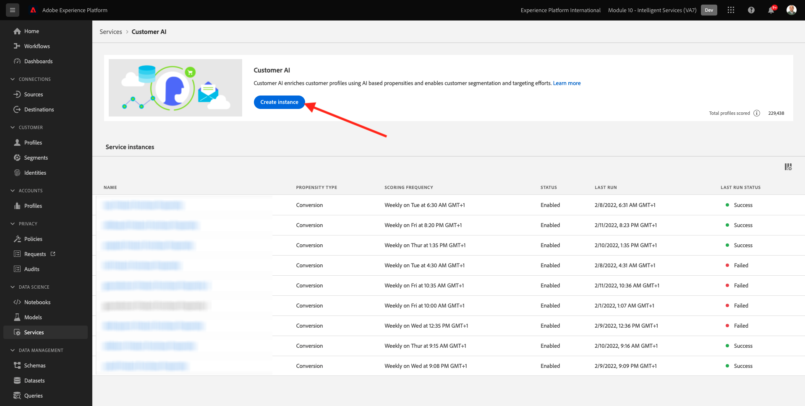

# 5.2 Customer AI - Erstellen einer neuen Instanz (Konfigurieren)

Customer AI analysiert vorhandene Kundenerlebnis-Ereignisdaten, um Tendenzwerte für Abwanderung oder Konversion vorherzusagen. Durch die Erstellung einer neuen Customer AI-Instanz können Marketing-Experten Ziele und Kennzahlen definieren.

## 5.2.1 Einrichten einer neuen Customer AI-Instanz

Klicken Sie in Adobe Experience Platform auf **Dienste** im linken Menü. Der Browser für **Dienste** erscheint und zeigt alle Dienste an, die Ihnen zur Verfügung stehen. Klicken Sie auf der Karte für Customer AI auf **Öffnen**.

Klicken Sie auf **Instanz erstellen**.

Dann wirst du das sehen.

Geben Sie die erforderlichen Details für die Customer AI-Instanz ein:

- Name: use `--demoProfileLdap-- Product Purchase Propensity`
- Beschreibung: verwenden: **Vorhersagen der Wahrscheinlichkeit, mit der Kunden ein Produkt kaufen**
- Tendenztyp: select **Konversion**

Klicken Sie auf **Weiter**.

Dann wirst du das sehen. Wählen Sie den Datensatz aus, den Sie in der vorherigen Übung erstellt haben und der `--demoProfileLdap - Demo System - Customer Experience Event Dataset`. Klicken Sie auf **Weiter**.

Auswählen **Vorkommen** und definieren Sie das Feld **commerce.purchases.value** als Zielvariable.

Klicken Sie auf **Weiter**.

Legen Sie als Nächstes den Zeitplan für die Ausführung fest. **Wöchentlich** und legen Sie die Zeit so nah wie möglich an Ihrer aktuellen Zeit fest. Stellen Sie sicher, dass der Umschalter **Bewertungen für Profil aktivieren** aktiviert ist.

Klicken Sie auf **Fertigstellen**.

Dann sehen Sie dieses Popup. Klicken Sie auf **OK**.

Nachdem Sie die Instanz konfiguriert haben, können Sie sie in der Liste der Customer AI-Instanzen sehen und die Zusammenfassung der Einrichtungs- und Ausführungsdetails durch Klicken auf die Zeile der Customer AI-Instanz in der Vorschau anzeigen. Im Zusammenfassungsfenster werden auch Fehlerdetails angezeigt, falls Fehler gefunden wurden.

>[!NOTE]
>
>Sie können jede Definition oder jedes Attribut ändern, solange der Status Ihrer Customer AI-Instanz entweder **Vorbereitung der Schulung** oder **Fehler**

Nächster Schritt: [5.3 Customer AI - Scoring-Dashboard und Segmentierung (Vorhersagen und Handeln)](./ex3.md)

[Zurück zu Modul 5](./intelligent-services.md)

[Zu allen Modulen zurückkehren](./../../overview.md)
