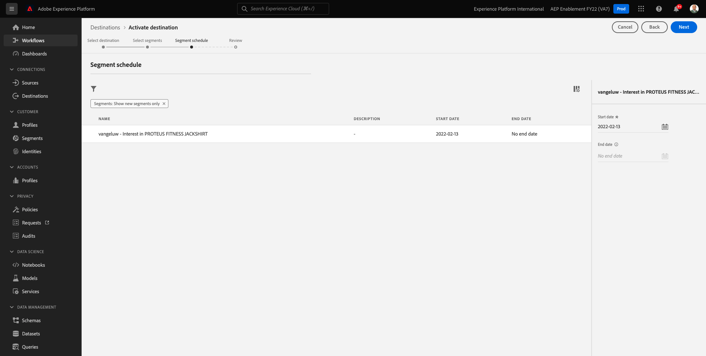

# 6.3 Maßnahmen ergreifen: Senden Ihres Segments an DV360

Navigieren Sie zu [Adobe Experience Platform](https://experience.adobe.com/platform). Nach der Anmeldung landen Sie auf der Startseite von Adobe Experience Platform.

Bevor Sie fortfahren, müssen Sie eine **Sandbox**. Die auszuwählende Sandbox heißt ``--aepSandboxId--``. Klicken Sie hierzu auf den Text **[!UICONTROL Produktionsprodukt]** in der blauen Zeile auf Ihrem Bildschirm. Nach Auswahl der entsprechenden [!UICONTROL Sandbox], sehen Sie die Änderung des Bildschirms und befinden sich jetzt in Ihrem [!UICONTROL Sandbox].

Gehen Sie im linken Menü zu **Ziele**, gehen Sie dann zu **Katalog**. Sie werden dann die **Zielkatalog**.

In **Ziele**, klicken Sie auf die **Segmente aktivieren** auf **Google Display &amp; Video 360** Karte.

Wählen Sie Ihr Ziel aus und klicken Sie auf **Nächste**.

Wählen Sie in der Liste der verfügbaren Segmente das Segment aus, das Sie in der vorherigen Übung erstellt haben. Klicken Sie auf **Weiter**.

Im **Segmentplan** Seite, klicken Sie auf **Nächste**.

Abschließend zur **Überprüfen** Seite, klicken Sie auf **Beenden**.

Ihr Segment ist jetzt mit Google DV360 verknüpft. Jedes Mal, wenn sich ein Kunde für dieses Segment qualifiziert, wird ein Signal an Google DV360 gesendet, um diesen Kunden bei Google DV360 in die Zielgruppe aufzunehmen.

Nächster Schritt: [6.4 Maßnahmen ergreifen: Senden Ihres Segments an ein S3-Ziel](./ex4.md)

[Zurück zu Modul 6](./real-time-cdp-build-a-segment-take-action.md)

[Zu allen Modulen zurückkehren](../../overview.md)
