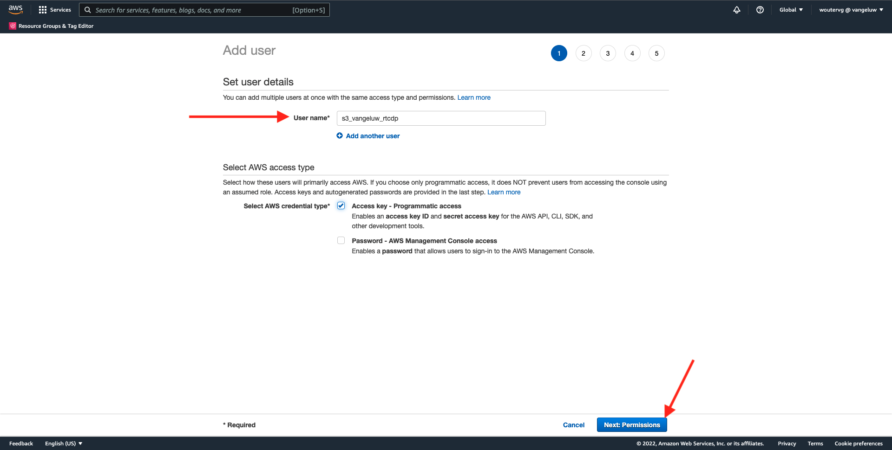
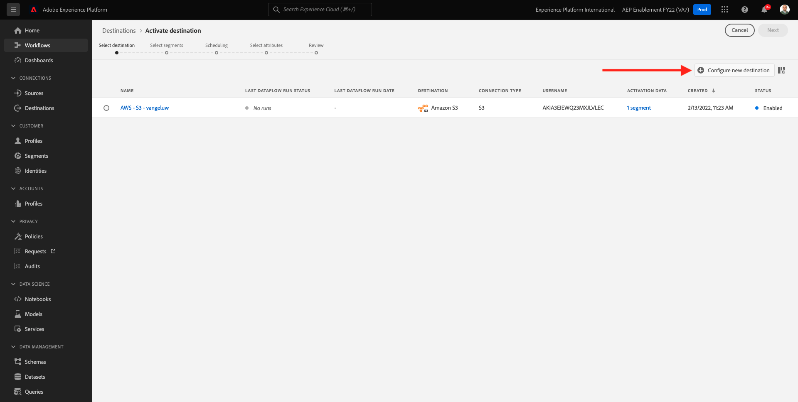
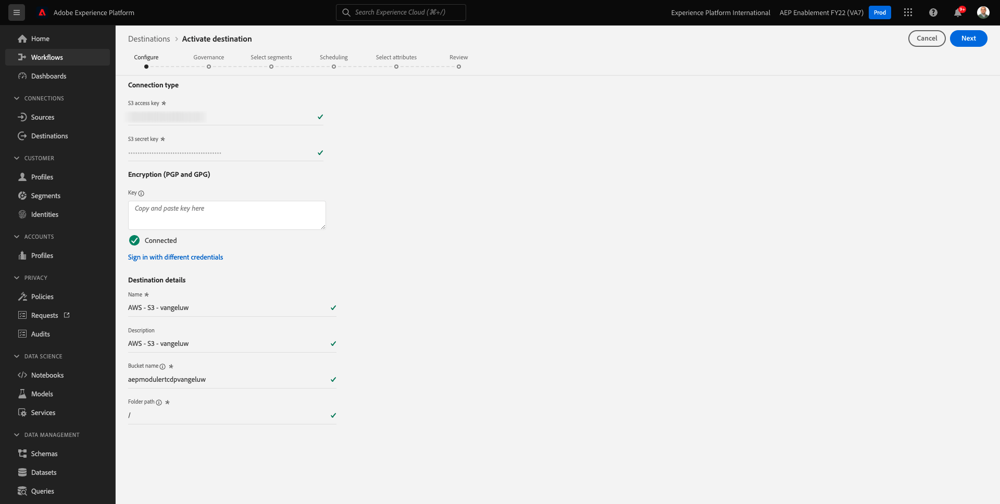

# 6.4 Maßnahmen ergreifen: Senden Ihres Segments an ein S3-Ziel

Adobe Experience Platform kann auch Audiences für E-Mail-Marketing-Ziele wie Salesforce Marketing Cloud, Oracle Eloqua, Oracle Responsys und Adobe Campaign freigeben.

Sie können FTP oder SFTP als Teil der dedizierten Ziele für jedes dieser E-Mail-Marketing-Ziele verwenden oder AWS S3 verwenden, um Kundenlisten zwischen Adobe Experience Platform und diesen E-Mail-Marketing-Zielen auszutauschen.

In diesem Modul konfigurieren Sie ein solches Ziel, indem Sie einen AWS S3-Bucket verwenden.

## 6.4.1 S3-Behälter erstellen

Navigieren Sie zu [https://console.aws.amazon.com](https://console.aws.amazon.com) und melden Sie sich mit dem zuvor erstellten Amazon-Konto an.

Nach der Anmeldung werden Sie zum **AWS Management Console**.

Im **Dienste suchen** Menü, suchen Sie nach **s3**. Klicken Sie auf das erste Suchergebnis: **S3 - Skalierbarer Speicher in der Cloud**.

Sie werden dann die **Amazon S3** homepage. Klicken **Bucket erstellen**.

Im **Bucket erstellen** müssen Sie zwei Dinge konfigurieren:

- Name: den Namen verwenden `aepmodulertcdp--demoProfileLdap--`. In dieser Übung lautet der Bucket-Name beispielsweise **aepmodulertcdpvangeluw**
- Region: Region verwenden **EU (Frankfurt) eu-central-1**

Behalten Sie alle anderen Standardeinstellungen bei. Scrollen Sie nach unten und klicken Sie auf **Behälter erstellen**.

Sie werden sehen, wie Ihr Bucket erstellt wird und zur Amazon S3-Homepage weitergeleitet wird.

## 6.4.2 Berechtigungen für den Zugriff auf Ihren S3-Behälter festlegen

Der nächste Schritt besteht darin, den Zugriff auf Ihren S3-Bucket einzurichten.

Gehen Sie dazu zu [https://console.aws.amazon.com/iam/home](https://console.aws.amazon.com/iam/home).

Der Zugriff auf AWS-Ressourcen wird über die Amazon Identity and Access Management (IAM) gesteuert.

Sie werden jetzt diese Seite sehen.

Klicken Sie im linken Menü auf **Benutzer**. Sie werden dann die **Benutzer** angezeigt. Klicken **Benutzer hinzufügen**.

Konfigurieren Sie dann Ihren Benutzer:

- Benutzername: use `s3_--demoProfileLdap--_rtcdp` als Namen verwenden, also lautet der Name in diesem Beispiel `s3_vangeluw_rtcdp`.
- AWS-Zugriffstyp: select **Zugriffsschlüssel - Programmierter Zugriff**.

Klicken **Weiter: Berechtigungen**.

Dann sehen Sie diesen Berechtigungsbildschirm. Klicken **Vorhandene Richtlinien direkt anhängen**.

Suchbegriff eingeben **s3** um alle zugehörigen S3-Richtlinien anzuzeigen. Richtlinie auswählen **AmazonS3FullAccess**. Klicken **Weiter: Tags**.

Im **Tags** angezeigt, müssen Sie nichts konfigurieren. Klicken **Weiter: Überprüfen**.

Überprüfen Sie Ihre Konfiguration. Klicken Sie auf **Benutzer erstellen**.

Ihr Benutzer wurde erstellt und Sie sehen Ihre Anmeldedaten für den Zugriff auf Ihre S3-Umgebung. Dies ist das einzige Mal, dass Sie Ihre Anmeldedaten sehen. Schreiben Sie sie daher bitte auf.

Klicken **Anzeigen** um Ihren geheimen Zugriffsschlüssel zu sehen:

>[!IMPORTANT]
>
>Speichern Sie Ihre Anmeldedaten in einer Textdatei auf Ihrem Computer.
>
> - Zugriffsschlüssel-ID: ...
> - Geheimer Zugriffsschlüssel: ...
>
> Sobald Sie auf **Schließen** Sie werden Ihre Anmeldedaten nie mehr sehen!

Klicken Sie auf **Schließen**.

Sie haben jetzt erfolgreich einen AWS S3-Bucket erstellt und einen Benutzer mit Zugriffsberechtigungen für diesen Bucket erstellt.

## 6.4.3 Ziel in Adobe Experience Platform konfigurieren

Navigieren Sie zu [Adobe Experience Platform](https://experience.adobe.com/platform). Nach der Anmeldung landen Sie auf der Startseite von Adobe Experience Platform.

Bevor Sie fortfahren, müssen Sie eine **Sandbox**. Die auszuwählende Sandbox heißt ``--aepSandboxId--``. Klicken Sie hierzu auf den Text **[!UICONTROL Produktionsprodukt]** in der blauen Zeile auf Ihrem Bildschirm. Nach Auswahl der entsprechenden [!UICONTROL Sandbox], sehen Sie die Änderung des Bildschirms und befinden sich jetzt in Ihrem [!UICONTROL Sandbox].

Gehen Sie im linken Menü zu **Ziele**, gehen Sie dann zu **Katalog**. Sie werden dann die **Zielkatalog**.

Klicken **Cloud-Speicher** und klicken Sie dann auf **Einrichten** Schaltfläche (oder ein **Segmente aktivieren**, abhängig von Ihrer Umgebung) auf der **Amazon S3** Karte.

Abhängig von Ihrer Umgebung müssen Sie möglicherweise auf **+ Neues Ziel konfigurieren** , um Ihr Ziel zu erstellen.

Auswählen **Neues Konto** als Kontotyp. Bitte verwenden Sie die S3-Anmeldeinformationen, die Ihnen im vorherigen Schritt zugewiesen wurden:

| Zugriffsschlüssel-ID | Geheimer Zugriffsschlüssel |
|:-----------------------:| :-----------------------:|
| AKIA.... | CM5Ln.... |

Klicken **Mit Ziel verbinden**.

Daraufhin wird eine visuelle Bestätigung angezeigt, dass dieses Ziel jetzt verbunden ist.

Sie müssen einen Namen und einen Ordner angeben, damit Adobe Experience Platform eine Verbindung zum S3-Bucket herstellen kann.

Verwenden Sie als Namenskonvention Folgendes:

| Zugriffsschlüssel-ID | Geheimer Zugriffsschlüssel |
|:-----------------------:| :-----------------------:|
| Name | `AWS - S3 - --demoProfileLdap--` |
| Beschreibung | `AWS - S3 - --demoProfileLdap--` |
| Bucket-Name | `aepmodulertcdp--demoProfileLdap--` |
| Ordnerpfad | / |

Klicken Sie auf **Weiter**.

Sie können jetzt optional eine Data Governance-Richtlinie an Ihr neues Ziel anhängen. Klicken Sie auf **Weiter**.

Suchen Sie in der Segmentliste nach dem Segment, das Sie in Übung 1 erstellt haben, und wählen Sie es aus. Klicken Sie auf **Weiter**.

Dann wirst du das sehen. Bei Bedarf können Sie den Zeitplan durch Klick auf die Schaltfläche **Bleistift** Symbol. **Zeitplan erstellen**.

Definieren Sie Ihren Zeitplan Ihrer Wahl. Auswählen **Inkrementelle Dateien exportieren** und legen Sie die Häufigkeit auf **Stündlich** each **3 Stunden**. Klicken Sie auf **Erstellen**.

Dann wirst du das haben. Klicken Sie auf **Weiter**.

Sie können jetzt Attribute für den Export in AWS S3 auswählen. Klicken **Neues Feld hinzufügen** und stellen Sie sicher, dass das Feld `--aepTenantId--.identification.core.ecid` hinzugefügt und als **Deduplizierungsschlüssel**.

Optional können Sie beliebig viele weitere Felder hinzufügen.

Nachdem Sie alle Felder hinzugefügt haben, klicken Sie auf **Nächste**.

Überprüfen Sie Ihre Konfiguration. Klicken **Beenden** , um Ihre Konfiguration abzuschließen.

Sie sind dann wieder im Bildschirm Zielaktivierung und Ihr Segment wird diesem Ziel hinzugefügt.

Wenn Sie weitere Segmentexporte hinzufügen möchten, können Sie auf **Segmente aktivieren** , um den Prozess neu zu starten und weitere Segmente hinzuzufügen.

Nächster Schritt: [6.5 Maßnahmen ergreifen: Senden Ihres Segments an Adobe Target](./ex5.md)

[Zurück zu Modul 6](./real-time-cdp-build-a-segment-take-action.md)

[Zu allen Modulen zurückkehren](../../overview.md)
