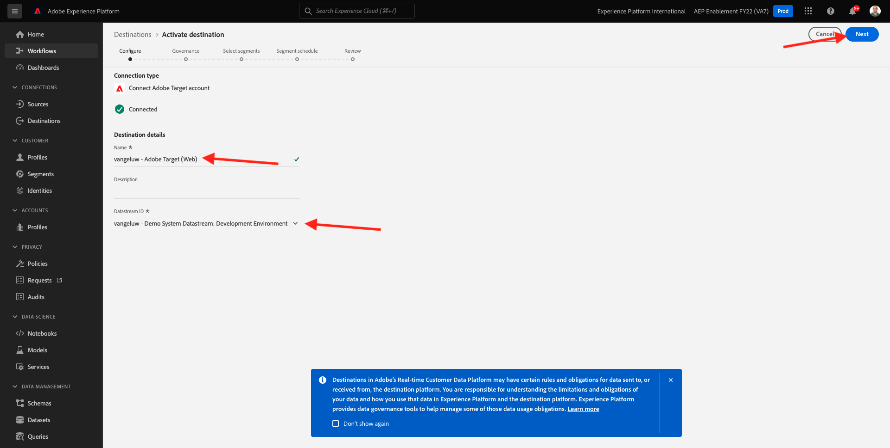
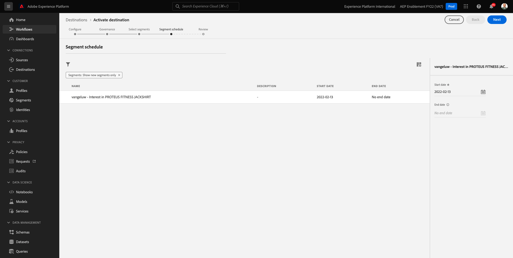
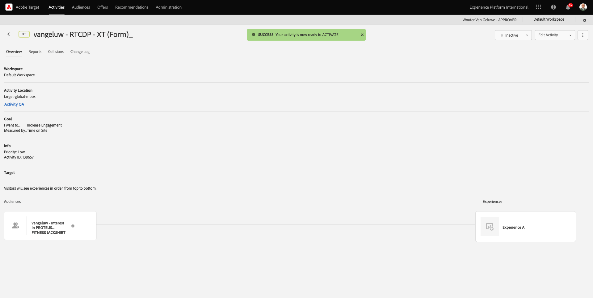

# 6.5 Maßnahmen ergreifen: Senden Ihres Segments an Adobe Target

Navigieren Sie zu [Adobe Experience Platform](https://experience.adobe.com/platform). Nach der Anmeldung landen Sie auf der Startseite von Adobe Experience Platform.


Bevor Sie fortfahren, müssen Sie eine **Sandbox**. Die auszuwählende Sandbox heißt ``--aepSandboxId--``. Klicken Sie hierzu auf den Text **[!UICONTROL Produktionsprodukt]** in der blauen Zeile auf Ihrem Bildschirm. Nach Auswahl der entsprechenden [!UICONTROL Sandbox], sehen Sie die Änderung des Bildschirms und befinden sich jetzt in Ihrem [!UICONTROL Sandbox].


## 6.5.1 Datensatz überprüfen

Das Adobe Target-Ziel in Real-Time CDP ist mit dem Datastream verbunden, der zur Aufnahme von Daten in das Adobe Edge-Netzwerk verwendet wird. Wenn Sie Ihr Adobe Target-Ziel einrichten möchten, müssen Sie zunächst überprüfen, ob Ihr Datenspeicher bereits für Adobe Target aktiviert ist. Ihr Datastram wurde in konfiguriert. [Übung 0.2 Erstellen Ihres Datastrams](./../module0/ex2.md) und benannt wurde `--demoProfileLdap-- - Demo System Datastream`.

Navigieren Sie zu [https://experience.adobe.com/#/data-collection/](https://experience.adobe.com/#/data-collection/)Klicken Sie auf **Datenspeicher** oder **Datenspeicher (Beta)**.


Wählen Sie oben rechts auf Ihrem Bildschirm den Namen Ihrer Sandbox aus, der `--aepSandboxId--`.


Suchen Sie in Datastreams nach Ihrem Datenspeicher, der `--demoProfileLdap-- - Demo System Datastream`. Klicken Sie auf Ihren Datenspeicher, um ihn zu öffnen.


Sie sehen das hier, klicken Sie auf **...** neben **Adobe Experience Platform** und klicken Sie anschließend auf **Bearbeiten**.


Aktivieren Sie die Kontrollkästchen für beide **Edge-Segmentierung** und **Personalisierungsziele**. Klicken Sie auf **Speichern**.


Klicken Sie anschließend auf **+ Dienst hinzufügen**.


Wählen Sie den Dienst aus **Adobe Target**. Klicken Sie auf **Speichern**.


Ihr Datastream ist jetzt für Adobe Target konfiguriert.


## 6.5.2 Adobe Target-Ziel konfigurieren

Adobe Target ist als Ziel von Real-Time CDP verfügbar. Informationen zum Einrichten der Adobe Target-Integration finden Sie unter **Ziele**, um **Katalog**.


Klicken **Personalisierung** im **Kategorien** Menü. Sie werden dann die **Adobe Target** Zielkarte. Klicken **Segmente aktivieren** (oder **Einrichten** abhängig von Ihrer Umgebung).


Abhängig von Ihrer Umgebung müssen Sie möglicherweise auf **+ Neues Ziel konfigurieren** , um Ihr Ziel zu erstellen.


Dann wirst du das sehen.


Im **Neues Ziel konfigurieren** müssen Sie zwei Dinge konfigurieren:

- Name: den Namen verwenden `--demoProfileLdap-- - Adobe Target (Web)`, die wie folgt aussehen sollte: **vangeluw - Adobe Target (Web)**.
- Datastream-ID: Sie müssen den Datenspeicher auswählen, den Sie in [Übung 0.2 Erstellen Ihres Datastrams](./../module0/ex2.md). Der Name Ihres Datastreams sollte wie folgt lauten: `--demoProfileLdap-- - Demo System Datastream`.

Klicken Sie auf **Weiter**.



Im nächsten Bildschirm können Sie optional eine Governance-Richtlinie auswählen. Sie müssen keine auswählen. In diesem Fall müssen Sie keine auswählen. Klicken Sie daher auf **Erstellen**.


Ihr Ziel wird jetzt erstellt und in der Liste angezeigt. Wählen Sie Ihr Ziel aus und klicken Sie auf **Nächste** , um Segmente an Ihr Ziel zu senden.


Wählen Sie in der Liste der verfügbaren Segmente das Segment aus, das Sie in [Übung 6.1 Segment erstellen](./ex1.md), der `--demoProfileLdap-- - Interest in PROTEUS FITNESS JACKSHIRT`. Klicken Sie dann auf **Weiter**.


Klicken Sie auf der nächsten Seite auf **Nächste**.



Klicken Sie auf **Fertigstellen**.


Ihr Segment ist jetzt für Adobe Target aktiviert.


>[!IMPORTANT]
>
>Wenn Sie Ihr Adobe Target-Ziel gerade in Real-Time CDP erstellt haben, kann es bis zu einer Stunde dauern, bis das Ziel aktiv ist. Dies ist eine einmalige Wartezeit aufgrund der Einrichtung der Backend-Konfiguration. Sobald die anfängliche Wartezeit von einer Stunde und die Backend-Konfiguration abgeschlossen sind, sind neu hinzugefügte Edge-Segmente, die an das Adobe Target-Ziel gesendet werden, für das Targeting in Echtzeit verfügbar.

## 6.5.3 Formularbasierte Adobe Target-Aktivität konfigurieren

Nachdem Ihr Real-Time CDP-Segment für den Versand an Adobe Target konfiguriert wurde, können Sie Ihre Erlebnis-Targeting-Aktivität in Adobe Target konfigurieren. In dieser Übung konfigurieren Sie eine formularbasierte Aktivität.

Rufen Sie die Adobe Experience Cloud-Homepage auf, indem Sie [https://experiencecloud.adobe.com/](https://experiencecloud.adobe.com/). Klicken **Target** um es zu öffnen.


Im **Adobe Target** Homepage werden Sie alle vorhandenen Aktivitäten sehen.


Klicken **+ Aktivität erstellen** , um eine neue Aktivität zu erstellen.


Auswählen **Erlebnis-Targeting**.


Auswählen **Formular** und wählen Sie **Keine Eigenschaftenbeschränkungen**. Klicken Sie auf **Weiter**.


Sie befinden sich jetzt im formularbasierten Aktivitäts-Composer.


Für das Feld **STANDORT 1** auswählen **target-global-mbox**.


Die Standardzielgruppe ist derzeit **Alle Besucher**. Klicken Sie auf **3 Punkte** neben **Alle Besucher** und klicken Sie auf **Zielgruppe ändern**.


Jetzt wird die Liste der verfügbaren Zielgruppen angezeigt. Das Adobe Experience Platform-Segment, das Sie zuvor erstellt und an Adobe Target gesendet haben, ist jetzt Teil dieser Liste. Wählen Sie das Segment aus, das Sie zuvor in Adobe Experience Platform erstellt haben. Klicken **Zielgruppe zuweisen**.


Ihr Adobe Experience Platform-Segment ist jetzt Teil dieser Erlebnis-Targeting-Aktivität.


Ändern wir nun das Hero Image auf der Startseite der Website. Klicken Sie auf , um die Dropdown-Liste neben **Standardinhalt** und klicken Sie auf **HTML-Angebot erstellen**.


Fügen Sie den folgenden Code ein. Klicken Sie dann auf **Weiter**.

```javascript
<script>document.querySelector("#home > div > div > div > div > div.banner_img.d-none.d-lg-block > img").src="https://parsefiles.back4app.com/hgJBdVOS2eff03JCn6qXXOxT5jJFzialLAHJixD9/ff92fdc3885972c0090ad5419e0ef4d4_Luma - Product - Proteus - Hero Banner.png"; document.querySelector(".banner_text > *").remove()</script>
```


Anschließend sehen Sie das neue Erlebnis mit dem neuen Bild für Ihre ausgewählte Zielgruppe.


Klicken Sie auf den Titel Ihrer Aktivität in der oberen linken Ecke, um sie umzubenennen.


Für den Namen verwenden Sie bitte:

- `--demoProfileLdap-- - RTCDP - XT (Form)`


Klicken Sie auf **Weiter**.


Im **Ziele und Einstellungen** - Seite, navigieren Sie zu **Zielmetriken**.


Primäres Ziel festlegen auf **Interaktion** - **Besuchszeit pro Site**.


Klicken Sie auf **Speichern und schließen**.


Du bist jetzt auf der **Aktivitätsübersicht** Seite. Sie müssen Ihre Aktivität weiterhin aktivieren.



Klicken Sie auf das Feld **Inaktiv** und wählen Sie **Aktivieren**.


Sie erhalten dann eine visuelle Bestätigung, dass Ihre Aktivität jetzt live ist.


Ihre Aktivität ist jetzt live und kann auf der Demo-Website getestet werden.

>[!IMPORTANT]
>
>Wenn Sie Ihr Adobe Target-Ziel gerade in Real-Time CDP erstellt haben, kann es bis zu einer Stunde dauern, bis das Ziel aktiv ist. Dies ist eine einmalige Wartezeit aufgrund der Einrichtung der Backend-Konfiguration. Sobald die anfängliche Wartezeit von einer Stunde und die Backend-Konfiguration abgeschlossen sind, sind neu hinzugefügte Edge-Segmente, die an das Adobe Target-Ziel gesendet werden, für das Targeting in Echtzeit verfügbar.

Wenn Sie nun zu Ihrer Demo-Website zurückkehren und die Produktseite für PROTEUS FITNESS JACKSHIRT besuchen, qualifizieren Sie sich sofort für das von Ihnen erstellte Segment und die Adobe Target-Aktivität wird auf der Startseite in Echtzeit angezeigt.


Nächster Schritt: [6.6 Externe Zielgruppen](./ex6.md)

[Zurück zu Modul 6](./real-time-cdp-build-a-segment-take-action.md)

[Zu allen Modulen zurückkehren](../../overview.md)
