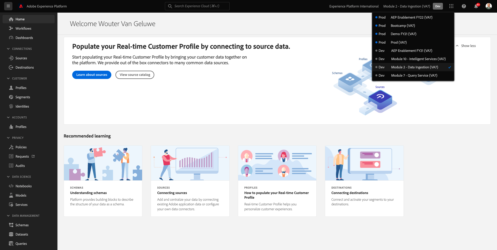
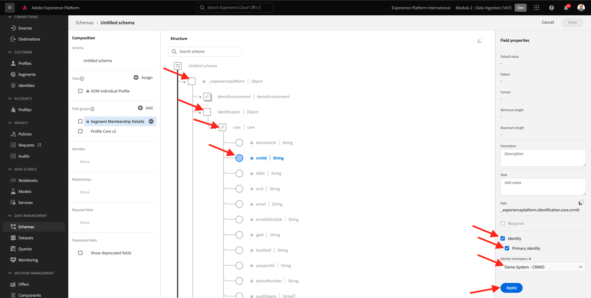
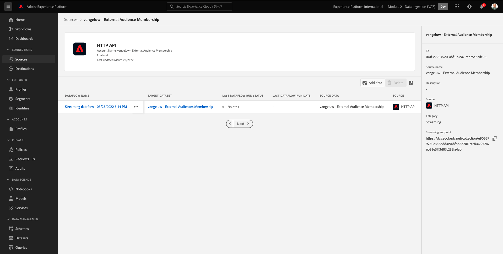

# 6.6 Externe Zielgruppen

In vielen Fällen möchte Ihr Unternehmen vorhandene Segmente aus anderen Anwendungen verwenden, um das Kundenprofil in Adobe Experience Platform anzureichern.
Diese externen Zielgruppen wurden möglicherweise auf der Grundlage eines Datenwissenschaftsmodells oder mithilfe externer Datenplattformen definiert.

Mit der Funktion für externe Zielgruppen in Adobe Experience Platform können Sie sich auf die Erfassung externer Zielgruppen und deren Aktivierung konzentrieren, ohne die entsprechende Segmentdefinition in Adobe Experience Platform detailliert neu definieren zu müssen.

Der Gesamtprozess gliedert sich in drei Hauptschritte:

- Importieren Sie die Metadaten der externen Zielgruppe: Dieser Schritt dient der Aufnahme der externen Zielgruppen-Metadaten, z. B. des Zielgruppennamen, in Adobe Experience Platform.
- Weisen Sie dem Kundenprofil die Mitgliedschaft in einer externen Zielgruppe zu: Dieser Schritt soll das Kundenprofil mit dem Attribut für die Mitgliedschaft in einem externen Segment anreichern.
- Erstellen Sie die Segmente in Adobe Experience Platform: Dieser Schritt dient dazu, umsetzbare Segmente basierend auf der Mitgliedschaft in externen Zielgruppen zu erstellen.

## 6.6.1 Metadaten

Navigieren Sie zu [Adobe Experience Platform](https://experience.adobe.com/platform). Nach der Anmeldung landen Sie auf der Startseite von Adobe Experience Platform.


>[!IMPORTANT]
>
>Die für diese Übung zu verwendende Sandbox lautet ``--module2sandbox--``!

Bevor Sie fortfahren, müssen Sie eine **Sandbox**. Die auszuwählende Sandbox heißt ``--module2sandbox--``. Klicken Sie hierzu auf den Text **[!UICONTROL Produktionsprodukt]** in der blauen Zeile auf Ihrem Bildschirm. Nach Auswahl der entsprechenden [!UICONTROL Sandbox], sehen Sie die Änderung des Bildschirms und befinden sich jetzt in Ihrem [!UICONTROL Sandbox].



Während die Segmentdaten die Bedingung definieren, dass ein Profil Teil eines Segments sein soll, sind die Segmentmetadaten Informationen zum Segment, wie z. B. Name, Beschreibung und Status des Segments. Da die Metadaten externer Zielgruppen in Adobe Experience Platform gespeichert werden, müssen Sie einen Identitäts-Namespace verwenden, um die Metadaten in Adobe Experience Platform zu erfassen.

## 6.6.1.1 Identity-Namespace für externe Zielgruppen

Ein Identitäts-Namespace wurde bereits für die Verwendung mit **Externe Zielgruppen**.
Um die bereits erstellte Identität anzuzeigen, navigieren Sie zu **Identitäten** und suchen Sie nach **Externe**. Klicken Sie auf das Element &quot;Externe Zielgruppen&quot;.

Bitte beachten Sie:

- Das Identitätssymbol **externalaudiences** wird in den nächsten Schritten verwendet, um auf die Identität externer Zielgruppen zu verweisen.
- Die **Personenidentifizierung** für diesen Identitäts-Namespace verwendet wird, da dieser Namespace nicht zur Identifizierung von Kundenprofilen, sondern von Segmenten dient.


## 6.6.1.2 Schema für externe Zielgruppen-Metadaten erstellen

Die Metadaten der externen Zielgruppen basieren auf der **Segmentdefinitionsschema**. Weitere Informationen finden Sie unter [XDM Github-Repository](https://github.com/adobe/xdm/blob/master/docs/reference/classes/segmentdefinition.schema.md).

Gehen Sie im linken Menü zu Schemas. Klicken **+ Schema erstellen** und klicken Sie anschließend auf **Durchsuchen**.


Um eine Klasse zuzuweisen, suchen Sie nach **Segmentdefinition**. Wählen Sie die **Segmentdefinition** -Klasse und klicken Sie auf **Klasse zuweisen**.


Dann wirst du das sehen. Klicken **Abbrechen**.


Dann wirst du das sehen. Feld auswählen **_id**. Scrollen Sie im rechten Menü nach unten und aktivieren Sie die **Identität** und **Primäre Identität** aktivieren. Wählen Sie die **Externe Zielgruppen** Identitäts-Namespace. Klicken Sie auf **Übernehmen**.


Wählen Sie als Nächstes den Schemanamen aus. **Unbenanntes Schema**. Ändern Sie den Namen in `--demoProfileLdap-- - External Audiences Metadata`.


Aktivieren Sie die **Profil** Umschalten und Bestätigen. Klicken Sie abschließend auf **Speichern**.


## 6.6.1.3 Datensatz &quot;Externe Zielgruppen-Metadaten&quot;erstellen

In **Schemas**, gehen Sie zu **Durchsuchen**. Suchen Sie nach und klicken Sie auf `--demoProfileLdap-- - External Audiences Metadata` Schema, das Sie im vorherigen Schritt erstellt haben. Klicken Sie anschließend auf **Datensatz aus Schema erstellen**.


Für das Feld **Name**, eingeben `--demoProfileLdap-- - External Audience Metadata`. Klicken **Datensatz erstellen**.


Dann wirst du das sehen. Vergessen Sie nicht, die **Profil** Umschalten!


## 6.6.1.4 HTTP-API-Quellverbindung erstellen

Als Nächstes müssen Sie den HTTP-API-Quell-Connector konfigurieren, mit dem Sie die Metadaten in den Datensatz aufnehmen.

Navigieren Sie zu **Quellen**. Geben Sie im Suchfeld **HTTP**. Klicken Sie auf **Daten hinzufügen**.


Geben Sie folgende Informationen ein:

- **Kontotyp**: select **Neues Konto**
- **Kontoname**: enter `--demoProfileLdap-- - External Audience Metadata`
- Aktivieren Sie das Kontrollkästchen **XDM-kompatible Box**

Klicken Sie anschließend auf **Verbindung mit Quelle herstellen**.


Dann wirst du das sehen. Klicken Sie auf **Weiter**.


Auswählen **Vorhandener Datensatz** sowie im Dropdown-Menü den Datensatz suchen und auswählen `--demoProfileLdap-- - External Audience Metadata`.

Überprüfen Sie die **Datenflussdetails** und klicken Sie anschließend auf **Nächste**.


Dann wirst du das sehen.

Die **Zuordnung** -Schritt des Assistenten ist leer, da Sie eine XDM-konforme Payload in den HTTP API Source Connector aufnehmen, sodass keine Zuordnung erforderlich ist. Klicken Sie auf **Weiter**.


Im **Überprüfen** Schritt können Sie optional die Verbindung und die Zuordnungsdetails überprüfen. Klicken Sie auf **Fertigstellen**.


Dann wirst du das sehen.


## 6.6.1.5 Aufnahme externer Zielgruppen-Metadaten

Klicken Sie auf der Registerkarte Übersicht über den Quell-Connector auf **...** und klicken Sie anschließend auf **Schema-Payload kopieren**.


Öffnen Sie Ihre Text Editor-Anwendung auf Ihrem Computer und fügen Sie die Payload ein, die Sie soeben kopiert haben, was so aussieht. Als Nächstes müssen Sie die **xdmEntity** -Objekt in dieser Payload.


Das Objekt **xdmEntity** durch den folgenden Code ersetzt werden. Kopieren Sie den unten stehenden Code und fügen Sie ihn in Ihre Textdatei ein, indem Sie die **xdmEntity** -Objekt im Texteditor.

```
"xdmEntity": {
    "_id": "--demoProfileLdap---extaudience-01",
    "description": "--demoProfileLdap---extaudience-01 description",
    "segmentIdentity": {
      "_id": "--demoProfileLdap---extaudience-01",
      "namespace": {
        "code": "externalaudiences"
      }
    },
    "segmentName": "--demoProfileLdap---extaudience-01 name",
    "segmentStatus": "ACTIVE",
    "version": "1.0"
  }
```

Daraufhin sollte Folgendes angezeigt werden:


Als Nächstes öffnen Sie eine neue **Terminal** Fenster. Kopieren Sie den gesamten Text in Ihren Texteditor und fügen Sie ihn in das Terminal-Fenster ein.


Nächste, Treffer **Eingabe**.

Im Terminal-Fenster sehen Sie dann eine Bestätigung Ihrer Datenerfassung:


Aktualisieren Sie den Bildschirm des Connectors für die HTTP-API-Quelle, auf dem jetzt angezeigt wird, dass Daten verarbeitet werden:


## 6.6.1.6 Erfassung externer Zielgruppen überprüfen

Nach Abschluss der Verarbeitung können Sie mithilfe von Query Service die Datenverfügbarkeit im Datensatz überprüfen.

Gehen Sie im rechten Menü zu **Datensätze** und wählen Sie die `--demoProfileLdap-- - External Audience Metadata` Datensatz, den Sie zuvor erstellt haben.


Gehen Sie im rechten Menü zu Abfragen und klicken Sie auf **Abfrage erstellen**.


Geben Sie den folgenden Code ein und drücken Sie dann die **UMSCHALT + EINGABETASTE**:

```
select * from --demoProfileLdap--_external_audience_metadata
```

In den Abfrageergebnissen sehen Sie die Metadaten der externen Audience, die Sie erfasst haben.


## 6.6.2 Segmentzugehörigkeit

Mit den verfügbaren externen Zielgruppen-Metadaten können Sie jetzt die Segmentzugehörigkeit für ein bestimmtes Kundenprofil erfassen.

Sie müssen jetzt einen Profildatensatz vorbereiten, der mit dem Schema der Segmentmitgliedschaft angereichert wird. Weitere Informationen finden Sie unter [XDM Github-Repository](https://github.com/adobe/xdm/blob/master/docs/reference/datatypes/segmentmembership.schema.md).

## 6.6.2.1 Schema für die Mitgliedschaft in externen Zielgruppen erstellen

Gehen Sie im rechten Menü zu **Schemas**. Klicken **Schema erstellen** und klicken Sie anschließend auf **XDM Individual Profile**.


Im **Feldergruppen hinzufügen** Popup, suchen Sie nach **Profil-Core**. Wählen Sie die **Profil Core v2** Feldergruppe.


Als Nächstes wird im **Feldergruppen hinzufügen** Popup, suchen Sie nach **Segmentmitgliedschaft**. Wählen Sie die **Details zur Segmentzugehörigkeit** Feldergruppe. Klicken Sie anschließend auf **Feldergruppen hinzufügen**.


Dann wirst du das sehen. Navigieren Sie zum Feld `--aepTenantId--.identification.core`. Klicken Sie auf **crmId** -Feld. Scrollen Sie im rechten Menü nach unten und überprüfen Sie die **Identität** und **Primäre Identität** Kontrollkästchen. Für **Identitäts-Namespace** select **Demosystem - CRMID**.

Klicken Sie auf **Übernehmen**.



Wählen Sie als Nächstes den Schemanamen aus. **Unbenanntes Schema**. Geben Sie im Feld Anzeigename die `--demoProfileLdap-- - External Audiences Membership`.


Aktivieren Sie als Nächstes die **Profil** Umschalten und Bestätigen. Klicken Sie auf **Speichern**.


## 6.6.2.2 Datensatz zur Mitgliedschaft in externen Zielgruppen erstellen

In **Schemas**, gehen Sie zu **Durchsuchen**. Suchen Sie nach und klicken Sie auf `--demoProfileLdap-- - External Audiences Membership` Schema, das Sie im vorherigen Schritt erstellt haben. Klicken Sie anschließend auf **Datensatz aus Schema erstellen**.


Für das Feld **Name**, eingeben `--demoProfileLdap-- - External Audiences Membership`. Klicken **Datensatz erstellen**.


Dann wirst du das sehen. Vergessen Sie nicht, die **Profil** Umschalten!


## 6.6.2.3 HTTP-API-Quellverbindung erstellen


Als Nächstes müssen Sie den HTTP-API-Quell-Connector konfigurieren, mit dem Sie die Metadaten in den Datensatz aufnehmen.

Navigieren Sie zu **Quellen**. Geben Sie im Suchfeld **HTTP**. Klicken Sie auf **Daten hinzufügen**.


Geben Sie folgende Informationen ein:

- **Kontotyp**: select **Neues Konto**
- **Kontoname**: enter `--demoProfileLdap-- - External Audience Membership`
- Aktivieren Sie das Kontrollkästchen **XDM-kompatible Box**

Klicken Sie anschließend auf **Verbindung mit Quelle herstellen**.


Dann wirst du das sehen. Klicken Sie auf **Weiter**.


Auswählen **Vorhandener Datensatz** sowie im Dropdown-Menü den Datensatz suchen und auswählen `--demoProfileLdap-- - External Audiences Membership`.

Überprüfen Sie die **Datenflussdetails** und klicken Sie anschließend auf **Nächste**.


Dann wirst du das sehen.

Die **Zuordnung** -Schritt des Assistenten ist leer, da Sie eine XDM-konforme Payload in den HTTP API Source Connector aufnehmen, sodass keine Zuordnung erforderlich ist. Klicken Sie auf **Weiter**.


Im **Überprüfen** Schritt können Sie optional die Verbindung und die Zuordnungsdetails überprüfen. Klicken Sie auf **Fertigstellen**.


Dann wirst du das sehen.



## 6.6.2.4 Aufnahme von Daten zur Mitgliedschaft in externen Zielgruppen

Klicken Sie auf der Registerkarte Übersicht über den Quell-Connector auf **...** und klicken Sie anschließend auf **Schema-Payload kopieren**.


Öffnen Sie Ihre Text Editor-Anwendung auf Ihrem Computer und fügen Sie die Payload ein, die Sie soeben kopiert haben, was so aussieht. Als Nächstes müssen Sie die **xdmEntity** -Objekt in dieser Payload.


Das Objekt **xdmEntity** durch den folgenden Code ersetzt werden. Kopieren Sie den unten stehenden Code und fügen Sie ihn in Ihre Textdatei ein, indem Sie die **xdmEntity** -Objekt im Texteditor.

```
  "xdmEntity": {
    "_id": "--demoProfileLdap---profile-test-01",
    "_experienceplatform": {
      "identification": {
        "core": {
          "crmId": "--demoProfileLdap---profile-test-01"
        }
      }
    },
    "personID": "--demoProfileLdap---profile-test-01",
    "segmentMembership": {
      "externalaudiences": {
        "--demoProfileLdap---extaudience-01": {
          "status": "realized",
          "lastQualificationTime": "2022-03-05T00:00:00Z"
        }
      }
    }
  }
```

Daraufhin sollte Folgendes angezeigt werden:


Als Nächstes öffnen Sie eine neue **Terminal** Fenster. Kopieren Sie den gesamten Text in Ihren Texteditor und fügen Sie ihn in das Terminal-Fenster ein.


Nächste, Treffer **Eingabe**.

Im Terminal-Fenster sehen Sie dann eine Bestätigung Ihrer Datenerfassung:


Aktualisieren Sie den Bildschirm des Connectors für die HTTP-API-Quelle, auf dem nach einigen Minuten die Verarbeitung der Daten angezeigt wird:


## 6.6.2.5 Aufnahme externer Zielgruppen validieren

Nach Abschluss der Verarbeitung können Sie mithilfe von Query Service die Datenverfügbarkeit im Datensatz überprüfen.

Gehen Sie im rechten Menü zu **Datensätze** und wählen Sie die `--demoProfileLdap-- - External Audiences Membership ` Datensatz, den Sie zuvor erstellt haben.


Gehen Sie im rechten Menü zu Abfragen und klicken Sie auf **Abfrage erstellen**.


Geben Sie den folgenden Code ein und drücken Sie dann die **UMSCHALT + EINGABETASTE**:

```
select * from --demoProfileLdap--_external_audiences_membership
```

In den Abfrageergebnissen sehen Sie die Metadaten der externen Audience, die Sie erfasst haben.


## 6.6.3 Segment erstellen

Jetzt können Sie Maßnahmen für externe Zielgruppen ergreifen.
In Adobe Experience Platform erfolgt die Aktion durch das Erstellen von Segmenten, das Füllen der jeweiligen Zielgruppen und das Teilen dieser Zielgruppen mit den Zielen.
Jetzt erstellen Sie ein Segment mit der zuvor erstellten externen Zielgruppe.

Gehen Sie im linken Menü zu **Segmente** und klicken Sie auf **Segment erstellen**.


Navigieren Sie zu **Zielgruppen**. Dann wirst du das sehen. Klicken **Externe Zielgruppen**.


Wählen Sie die zuvor erstellte externe Zielgruppe aus, die `--demoProfileLdap---extaudience-01`. Ziehen Sie die Zielgruppe auf die Arbeitsfläche.


Geben Sie Ihrem Segment einen Namen, verwenden Sie `--demoProfileLdap-- - extaudience-01`. Klicken Sie auf **Speichern und schließen**.


Dann wirst du das sehen. Sie werden auch feststellen, dass das Profil, für das Sie die Segmentmitgliedschaft aufgenommen haben, jetzt in der Liste der **Beispielprofile**.


Ihr Segment ist jetzt bereit und kann zur Aktivierung an ein Ziel gesendet werden.

## 6.6.4 Kundenprofil visualisieren

Sie können jetzt auch die Segmentqualifizierung in Ihrem Kundenprofil visualisieren. Navigieren Sie zu **Profile**, verwenden Sie den Identitäts-Namespace **Demosystem - CRMID** und die Identität angeben `--demoProfileLdap---profile-test-01`, die Sie im Rahmen von Übung 6.6.2.4 verwendet haben, und klicken Sie auf **Ansicht**. Klicken Sie anschließend auf das **Profil-ID** , um das Profil zu öffnen.


Navigieren Sie zu **Segmentmitgliedschaft**, wo Ihre externe Zielgruppe angezeigt wird.


Nächster Schritt: [6.7 Destinations SDK](./ex7.md)

[Zurück zu Modul 6](./real-time-cdp-build-a-segment-take-action.md)

[Zu allen Modulen zurückkehren](../../overview.md)
