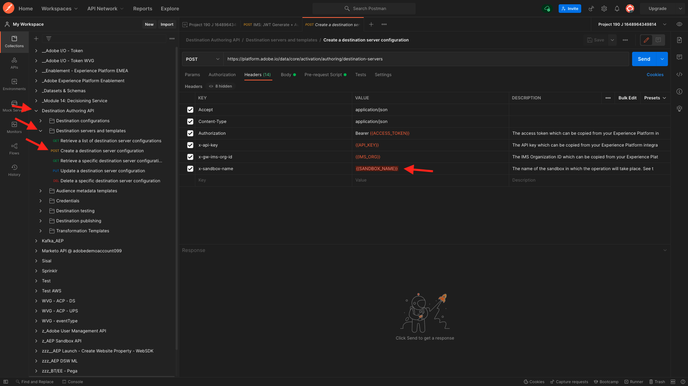
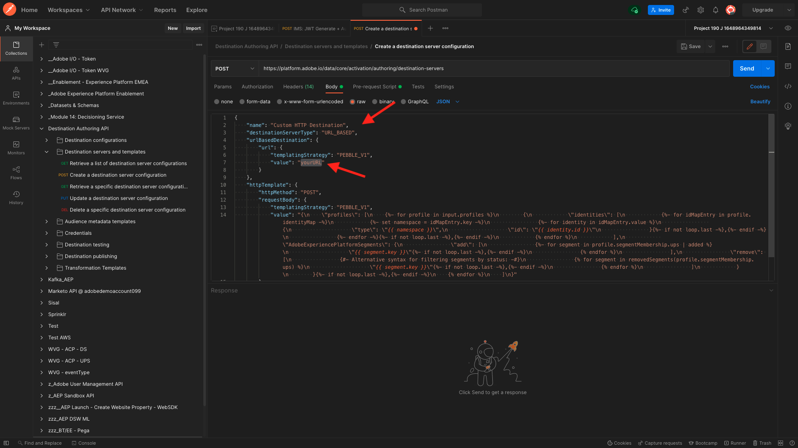
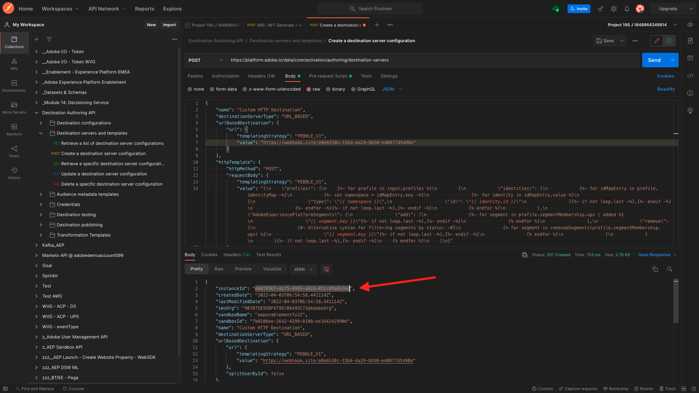
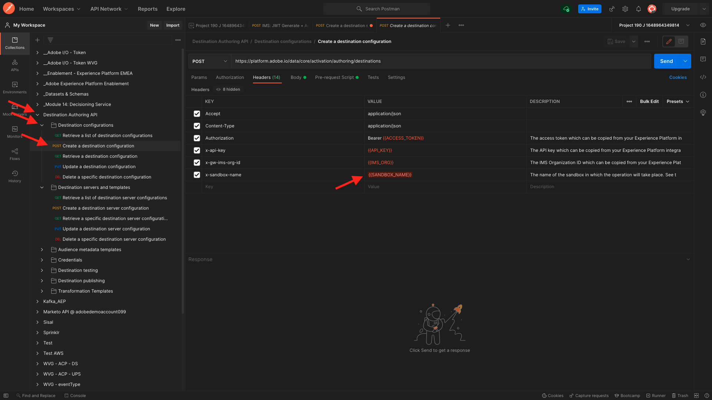
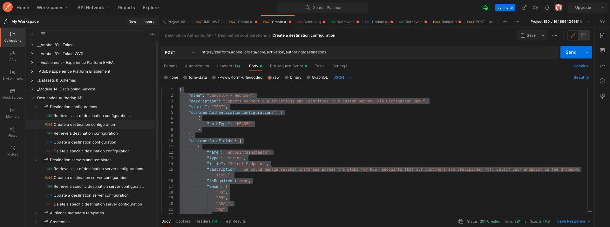
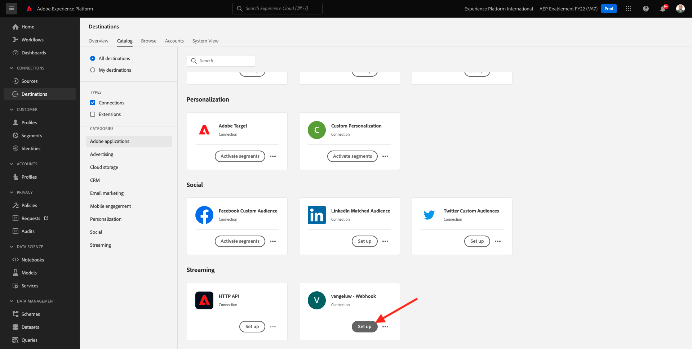
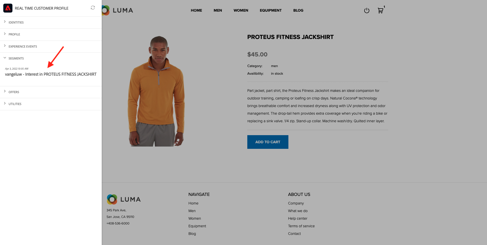
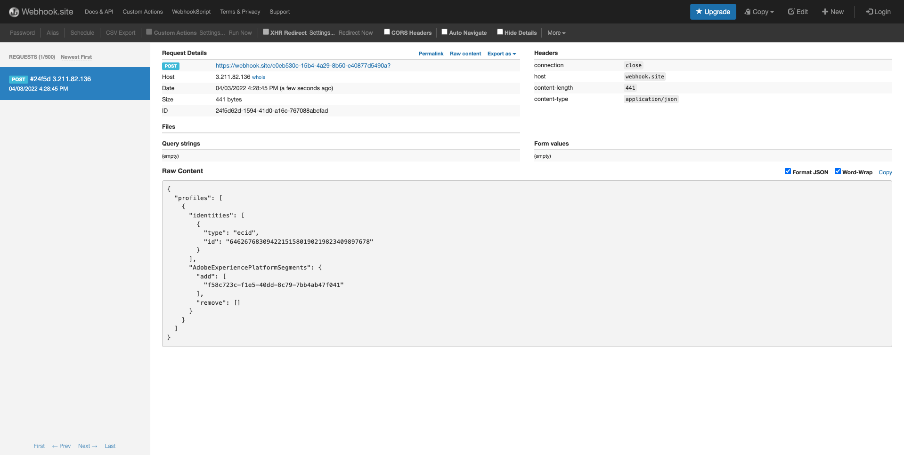

# 6.7 Destinations SDK

## 6.7.1 Adobe I/O-Projekt einrichten

>[!IMPORTANT]
>
>Wenn Sie Ihr Adobe I/O-Projekt nach Dezember 2021 erstellt haben, können Sie dieses Projekt wiederverwenden, diese Übung überspringen und sofort zur Übung 6.7.2 übergehen.
>
>Wenn Sie Ihr Adobe I/O-Projekt vor Dezember 2021 erstellt haben, erstellen Sie bitte ein neues Projekt, um sicherzustellen, dass es mit der Destinations Authoring-API kompatibel ist.

In dieser Übung werden Sie Adobe I/O recht intensiv verwenden, um die APIs von Platform abzufragen. Führen Sie die folgenden Schritte aus, um die Adobe I/O einzurichten.

Navigieren Sie zu [https://developer.adobe.com/console/home](https://developer.adobe.com/console/home)


Wählen Sie oben rechts auf Ihrem Bildschirm die richtige Adobe Experience Platform-Instanz aus. Ihre Instanz ist `--envName--`.


Klicken Sie auf **Neues Projekt erstellen**.

 oder


Auswählen **+ Zum Projekt hinzufügen** und wählen Sie **API**.


Daraufhin sehen Sie Folgendes:


Klicken Sie auf **Adobe Experience Platform** Symbol.


Klicken **Experience Platform-API**.


Klicken Sie auf **Weiter**.


Jetzt können Sie festlegen, ob Adobe I/O das Sicherheitsschlüsselpaar generieren oder ein vorhandenes Schlüsselpaar hochladen soll.

Auswählen **Option 1 - Generieren eines Schlüsselpaars**.


Klicken **Generieren von keypair**.


Du wirst einen Spinner für etwa 30 Sekunden sehen.


Sie sehen dies und Ihr generiertes Keypair wird als ZIP-Datei heruntergeladen: **config.zip**.

Entpacken Sie die Datei. **config.zip** Auf Ihrem Desktop sehen Sie, dass es zwei Dateien enthält:


- **certificate_pub.crt** ist Ihr Zertifikat mit öffentlichem Schlüssel. Aus sicherheitspolitischer Sicht ist dies das Zertifikat, das frei zum Einrichten von Integrationen mit Online-Anwendungen verwendet wird.
- **private.key** ist Ihr privater Schlüssel. Das sollte niemals, niemals mit jemandem geteilt werden. Der private Schlüssel dient zur Authentifizierung bei Ihrer API-Implementierung und sollte ein Geheimnis sein. Wenn Sie Ihren privaten Schlüssel für andere freigeben, können diese auf Ihre Implementierung zugreifen und die API dazu nutzen, schädliche Daten in Platform zu erfassen und alle Daten zu extrahieren, die sich in Platform befinden.


Achten Sie darauf, die **config.zip** an einem sicheren Speicherort speichern, da Sie dies für die nächsten Schritte und für den zukünftigen Zugriff auf Adobe I/O- und Adobe Experience Platform-APIs benötigen werden.

Klicken Sie auf **Weiter**.


Sie müssen nun die **Produktprofil(e)** für Ihre Integration.

Wählen Sie die erforderlichen Produktprofile aus.

**FYI**: in Ihrer Adobe Experience Platform-Instanz haben die Produktprofile eine andere Benennung. Sie müssen mindestens ein Produktprofil mit den entsprechenden Zugriffsrechten auswählen, die in der Adobe Admin Console eingerichtet sind.


Klicken **Konfigurierte API speichern**.


Du wirst ein paar Sekunden lang einen Spinner sehen.


Als Nächstes sehen Sie Ihre Integration.


Klicken Sie auf **Herunterladen für Postman** und klicken Sie auf **Dienstkonto (JWT)** um eine Postman-Umgebung herunterzuladen (warten Sie, bis die Umgebung heruntergeladen wurde. Dies kann einige Sekunden dauern).


Scrollen Sie nach unten, bis Sie **Dienstkonto (JWT)** Hier finden Sie alle Integrationsdetails, die zum Konfigurieren der Integration mit Adobe Experience Platform verwendet werden.


Ihr IO-Projekt hat derzeit einen generischen Namen. Sie müssen Ihrer Integration einen benutzerfreundlichen Namen geben. Klicken Sie auf **Projekt 1** (oder ähnliche Bezeichnung) wie angegeben


Klicken **Projekt bearbeiten**.


Geben Sie einen Namen und eine Beschreibung für Ihre Integration ein. Als Namenskonvention verwenden wir `AEP API --demoProfileLdap--`. Ersetzen Sie ldap durch Ihren ldap.
Wenn Ihr ldap beispielsweise Vangeluw ist, lautet der Name und die Beschreibung Ihrer Integration AEP API Vangeluw.

Eingabe `AEP API --demoProfileLdap--` als **Projekttitel**. Klicken Sie auf **Speichern**.


Ihre Adobe I/O-Integration ist jetzt abgeschlossen.


## 6.7.2 Postman-Authentifizierung für Adobe I/O

Navigieren Sie zu [https://www.getpostman.com/](https://www.getpostman.com/).

Klicken Sie auf **Erste Schritte**.


Laden Sie als Nächstes Postman herunter und installieren Sie es.


Starten Sie nach der Installation von Postman das Programm.

In Postman gibt es zwei Konzepte: Umgebungen und Sammlungen.

- Die Umgebung enthält all Ihre Umgebungsvariablen, die mehr oder weniger konsistent sind. In der Umgebung finden Sie Dinge wie IMSOrg unserer Platform-Umgebung, neben Sicherheitsberechtigungen wie Ihren privaten Schlüssel und andere. Die Umgebungsdatei ist diejenige, die Sie während der Adobe I/O-Einrichtung in der vorherigen Übung heruntergeladen haben. Sie hat folgenden Namen: **service.postman_environment.json**.

- Die Sammlung enthält eine Reihe von API-Anfragen, die Sie verwenden können. Wir werden zwei Sammlungen verwenden
   - 1 Sammlung für Authentifizierung bei Adobe I/0
   - 1 Sammlung für die Übungen in diesem Modul
   - 1 Sammlung für die Übungen im Real-Time CDP-Modul, für Destination Authoring

Bitte laden Sie die Datei herunter [postman.zip](../../assets/postman/postman_profile.zip) auf Ihren lokalen Desktop.

In diesem **postman.zip** -Datei, finden Sie die folgenden Dateien:

- `_Adobe I-O - Token.postman_collection.json`
- `_Adobe Experience Platform Enablement.postman_collection.json`
- `Destination_Authoring_API.json`

Entpacken Sie die **postman.zip** und speichern Sie diese 3 Dateien in einem Ordner auf Ihrem Desktop, zusammen mit der heruntergeladenen Postman-Umgebung von Adobe I/O. Sie müssen diese 4 Dateien in diesem Ordner haben:


Gehen Sie zurück zu Postman. Klicken Sie auf **Importieren**.


Klicken **Hochladen von Dateien**.


Navigieren Sie zum Ordner auf Ihrem Desktop, in den Sie die 4 heruntergeladenen Dateien extrahiert haben. Wählen Sie diese 4 Dateien gleichzeitig aus und klicken Sie auf **Öffnen**.


Nachdem Sie geklickt haben **Öffnen** zeigt Ihnen Postman einen Überblick über die Umgebung und Sammlungen, die Sie importieren möchten. Klicken Sie auf **Importieren**.


Sie haben jetzt alles, was Sie in Postman benötigen, um über die APIs mit Adobe Experience Platform zu interagieren.

Zunächst müssen Sie sicherstellen, dass Sie ordnungsgemäß authentifiziert sind. Um authentifiziert zu werden, müssen Sie ein Zugriffstoken anfordern.

Stellen Sie sicher, dass Sie die richtige Umgebung ausgewählt haben, bevor Sie eine Anforderung ausführen. Sie können die aktuell ausgewählte Umgebung überprüfen, indem Sie die Dropdown-Liste Umgebung oben rechts überprüfen.

Die ausgewählte Umgebung sollte einen ähnlichen Namen haben:


Klicken Sie auf **Auge** und klicken Sie dann auf **Bearbeiten** , um den privaten Schlüssel in der Umgebungsdatei zu aktualisieren.


Dann wirst du das sehen. Alle Felder sind vorausgefüllt, mit Ausnahme des Felds **PRIVATE_KEY**.


Der private Schlüssel wurde bei der Erstellung Ihres Adobe I/O-Projekts generiert. Es wurde als ZIP-Datei mit dem Namen **config.zip**. Extrahieren Sie diese ZIP-Datei auf Ihren Desktop.


Öffnen Sie den Ordner . **config** und öffnen Sie die Datei **private.key** mit Ihrem Texteditor Ihrer Wahl.


Sie sehen dann etwas, das diesem ähnelt, kopieren Sie den gesamten Text in die Zwischenablage.


Gehen Sie zurück zu Postman und fügen Sie den privaten Schlüssel in die Felder neben der Variablen ein. **PRIVATE_KEY** für beide Spalten **ERSTER WERT** und **AKTUELLER WERT**. Klicken Sie auf **Speichern**.


Ihre Postman-Umgebung und -Sammlungen sind jetzt konfiguriert und funktionieren. Sie können sich jetzt von Postman zu Adobe I/O authentifizieren.

Dazu müssen Sie eine externe Bibliothek laden, die für die Verschlüsselung und Entschlüsselung der Kommunikation sorgt. Um diese Bibliothek zu laden, müssen Sie die Anfrage mit dem Namen ausführen **INIT: Crypto-Bibliothek für RS256 laden**. Wählen Sie diese Anforderung im **_Adobe I/O - Token-Sammlung** und Sie sehen es in der Mitte Ihres Bildschirms.


Klicken Sie auf Blau **Senden** Schaltfläche. Nach einigen Sekunden sollte eine Antwort im **body** Abschnitt von Postman:


Nachdem die Kryptobibliothek jetzt geladen ist, können wir uns bei der Adobe I/O authentifizieren.

Im **\_Adobe I/O - Token-Sammlung**, wählen Sie die Anforderung mit dem Namen aus. **IMS: JWT-Generierung + Auth**. Auch hier werden die Anfragedetails in der Mitte des Bildschirms angezeigt.


Klicken Sie auf Blau **Senden** Schaltfläche. Nach einigen Sekunden sollte eine Antwort im **body** Abschnitt von Postman:


Wenn Ihre Konfiguration erfolgreich war, sollte eine ähnliche Antwort mit den folgenden Informationen angezeigt werden:

| Schlüssel | Wert |
|:-------------:| :---------------:| 
| token_type | **bearer** |
| access_token | **eyJ4NXUiJpbXNfbmEx...QT7mqZkumN1tdsPEioOEl4087Dg** |
| expires_in | **86399973** |

Adobe I/O hat Ihnen einen **bearer**-token mit einem bestimmten Wert (dieses sehr lange access_token) und einem Ablauffenster.

Das Token, das wir erhalten haben, gilt nun für 24 Stunden. Das bedeutet, dass Sie nach 24 Stunden ein neues Token generieren müssen, indem Sie diese Anfrage erneut ausführen, wenn Sie Postman zur Authentifizierung bei Adobe I/O verwenden möchten.

## 6.7.3 Endpunkt und Format definieren

Für diese Übung benötigen Sie einen Endpunkt, der so konfiguriert werden muss, dass bei Qualifizierung eines Segments das Qualifikationsereignis an diesen Endpunkt gestreamt werden kann. In dieser Übung verwenden Sie einen Beispielendpunkt mit [https://webhook.site/](https://webhook.site/). Navigieren Sie zu [https://webhook.site/](https://webhook.site/), wo Sie etwas Ähnliches sehen werden. Klicken **In Zwischenablage kopieren** , um die URL zu kopieren. Sie müssen diese URL in der nächsten Übung angeben. Die URL in diesem Beispiel lautet `https://webhook.site/e0eb530c-15b4-4a29-8b50-e40877d5490a`.


Was das Format anbelangt, so verwenden wir eine Standardvorlage, die Segmentqualifikationen oder Nicht-Qualifikationen zusammen mit Metadaten wie Kundenkennungen streamt. Vorlagen können angepasst werden, um die Erwartungen bestimmter Endpunkte zu erfüllen. In dieser Übung verwenden wir jedoch eine Standardvorlage, was zu einer Payload wie dieser führt, die an den Endpunkt gestreamt wird.

```json
{
  "profiles": [
    {
      "identities": [
        {
          "type": "ecid",
          "id": "64626768309422151580190219823409897678"
        }
      ],
      "AdobeExperiencePlatformSegments": {
        "add": [
          "f58c723c-f1e5-40dd-8c79-7bb4ab47f041"
        ],
        "remove": []
      }
    }
  ]
}
```

## 6.7.4 Server- und Vorlagenkonfiguration erstellen

Der erste Schritt zum Erstellen Ihres eigenen Ziels in Adobe Experience Platform besteht darin, einen Server und eine Vorlagenkonfiguration zu erstellen.

Gehen Sie dazu zu **Destination Authoring-API**, um **Zielserver und Vorlagen** und klicken Sie auf , um die Anforderung zu öffnen **POST - Erstellen einer Zielserverkonfiguration**. Dann wirst du das sehen. under **Kopfzeilen**, müssen Sie den Wert für den Schlüssel manuell aktualisieren **x-sandbox-name** und legen Sie `--aepSandboxId--`. Wert auswählen **{{SANDBOX_NAME}}**.



Ersetzen Sie ihn durch `--aepSandboxId--`.


Navigieren Sie als Nächstes zu **body**. Platzhalter auswählen **{{body}}**.


Sie müssen jetzt den Platzhalter ersetzen **{{body}}** durch den folgenden Code:

```json
{
    "name": "Custom HTTP Destination",
    "destinationServerType": "URL_BASED",
    "urlBasedDestination": {
        "url": {
            "templatingStrategy": "PEBBLE_V1",
            "value": "yourURL"
        }
    },
    "httpTemplate": {
        "httpMethod": "POST",
        "requestBody": {
            "templatingStrategy": "PEBBLE_V1",
            "value": "{\n    \"profiles\": [\n    \n        {\n            \"identities\": [\n            \n            \n                \n                {\n                    \"type\": \"{{ namespace }}\",\n                    \"id\": \"{{ identity.id }}\"\n                },\n                ,\n            \n            ],\n            \"AdobeExperiencePlatformSegments\": {\n                \"add\": [\n                \n                    \"{{ segment.key }}\",\n                \n                ],\n                \"remove\": [\n                {#- Alternative syntax for filtering segments by status: -#}\n                \n                    \"{{ segment.key }}\",\n                \n                ]\n            }\n        },\n    \n    ]\n}"
        },
        "contentType": "application/json"
    }
}
```

Nach dem Einfügen des obigen Codes müssen Sie das Feld manuell aktualisieren **urlBasedDestination.url.value** und Sie müssen sie auf die URL des Webhooks setzen, den Sie im vorherigen Schritt erstellt haben, der `https://webhook.site/e0eb530c-15b4-4a29-8b50-e40877d5490a` in diesem Beispiel.



Nach dem Aktualisieren des Felds **urlBasedDescription.url.value**, sollte es wie folgt aussehen. Klicken Sie auf **Senden**.


Nach dem Klicken **Senden**, wird Ihre Servervorlage erstellt und als Teil der Antwort wird ein Feld namens **instanceId**. Schreiben Sie es auf, wie Sie es im nächsten Schritt benötigen werden. In diesem Beispiel wird die **instanceId** is
`eb0f436f-dcf5-4993-a82d-0fcc09a6b36c`.



## 6.7.5 Zielkonfiguration erstellen

In Postman, unter **Destination Authoring-API**, gehen Sie zu **Zielkonfigurationen** und klicken Sie auf , um die Anforderung zu öffnen **POST - Erstellen einer Zielkonfiguration**. Dann wirst du das sehen. under **Kopfzeilen**, müssen Sie den Wert für den Schlüssel manuell aktualisieren **x-sandbox-name** und legen Sie `--aepSandboxId--`. Wert auswählen **{{SANDBOX_NAME}}**.



Ersetzen Sie ihn durch `--aepSandboxId--`.


Navigieren Sie als Nächstes zu **body**. Platzhalter auswählen **{{body}}**.


Sie müssen jetzt den Platzhalter ersetzen **{{body}}** durch den folgenden Code:

```json
{
    "name": "--demoProfileLdap-- - Webhook",
    "description": "Exports segment qualifications and identities to a custom webhook via Destination SDK.",
    "status": "TEST",
    "customerAuthenticationConfigurations": [
        {
            "authType": "BEARER"
        }
    ],
    "customerDataFields": [
        {
            "name": "endpointsInstance",
            "type": "string",
            "title": "Select Endpoint",
            "description": "We could manage several instances across the globe for REST endpoints that our customers are provisioned for. Select your endpoint in the dropdown list.",
            "isRequired": true,
            "enum": [
                "US",
                "EU",
                "APAC",
                "NZ"
            ]
        }
    ],
    "uiAttributes": {
        "documentationLink": "https://experienceleague.adobe.com/docs/experience-platform/destinations/home.html?lang=en",
        "category": "streaming",
        "connectionType": "Server-to-server",
        "frequency": "Streaming"
    },
    "identityNamespaces": {
        "ecid": {
            "acceptsAttributes": true,
            "acceptsCustomNamespaces": false
        }
    },
    "segmentMappingConfig": {
        "mapExperiencePlatformSegmentName": true,
        "mapExperiencePlatformSegmentId": true,
        "mapUserInput": false
    },
    "aggregation": {
        "aggregationType": "BEST_EFFORT",
        "bestEffortAggregation": {
            "maxUsersPerRequest": "1000",
            "splitUserById": false
        }
    },
    "schemaConfig": {
        "profileRequired": false,
        "segmentRequired": true,
        "identityRequired": true
    },
    "destinationDelivery": [
        {
            "authenticationRule": "NONE",
            "destinationServerId": "yourTemplateInstanceID"
        }
    ]
}
```



Nach dem Einfügen des obigen Codes müssen Sie das Feld manuell aktualisieren **destinationDelivery. destinationServerId** und Sie müssen sie auf die **instanceId** der Zielservervorlage, die Sie im vorherigen Schritt erstellt haben und die `eb0f436f-dcf5-4993-a82d-0fcc09a6b36c` in diesem Beispiel. Klicken Sie als Nächstes auf **Senden**.


Dann sehen Sie diese Antwort.


Ihr Ziel wird jetzt in Adobe Experience Platform erstellt. Lass uns dorthin gehen und es überprüfen.

Navigieren Sie zu [Adobe Experience Platform](https://experience.adobe.com/platform). Nach der Anmeldung landen Sie auf der Startseite von Adobe Experience Platform.


Bevor Sie fortfahren, müssen Sie eine **Sandbox**. Die auszuwählende Sandbox heißt ``--aepSandboxId--``. Klicken Sie hierzu auf den Text **[!UICONTROL Produktionsprodukt]** in der blauen Zeile auf Ihrem Bildschirm. Nach Auswahl der entsprechenden [!UICONTROL Sandbox], sehen Sie die Änderung des Bildschirms und befinden sich jetzt in Ihrem [!UICONTROL Sandbox].


Gehen Sie im linken Menü zu **Ziele** klicken **Katalog** und scrollen Sie nach unten zu der Kategorie **Streaming**. Ihr werdet dort jetzt euer Ziel sehen.


## 6.7.6 Segment mit Ihrem Ziel verknüpfen

In **Ziele** > **Katalog** klicken **Einrichten** auf Ihrem Ziel, um Segmente zu Ihrem neuen Ziel hinzuzufügen.



Geben Sie ein Platzhalter-Träger-Token ein, z. B. **1234**. Klicken **Mit Ziel verbinden**.


Dann wirst du das sehen. Verwenden Sie als Namen für Ihr Ziel `--demoProfileLdap-- - Webhook`. Wählen Sie einen gewünschten Endpunkt aus, in diesem Beispiel **EU**. Klicken Sie auf **Weiter**.


Sie können optional eine Data Governance-Richtlinie auswählen. Klicken Sie auf **Weiter**.


Wählen Sie das zuvor erstellte Segment aus, das `--demoProfileLdap-- - Interest in PROTEUS FITNESS JACKSHIRT`. Klicken Sie auf **Weiter**.


Dann wirst du das sehen. Stellen Sie sicher, dass Sie die **QUELLFELD** `--aepTenantId--.identification.core.ecid` zum Feld `Identity: ecid`. Klicken Sie auf **Weiter**.


Klicken Sie auf **Fertigstellen**.


Ihr Ziel ist jetzt live, neue Segmentqualifikationen werden jetzt an Ihren benutzerdefinierten Webhook gestreamt.


## 6.7.7 Testen der Segmentaktivierung

Navigieren Sie zu [https://builder.adobedemo.com/projects](https://builder.adobedemo.com/projects). Nach der Anmeldung bei Ihrer Adobe ID sehen Sie dies. Klicken Sie auf Ihr Website-Projekt, um es zu öffnen.


Sie können nun den unten stehenden Fluss ausführen, um auf die Website zuzugreifen. Klicken **Integrationen**.


Im **Integrationen** müssen Sie die Datenerfassungseigenschaft auswählen, die in Übung 0.1 erstellt wurde.


Sie werden dann Ihre Demowebsite öffnen sehen. Wählen Sie die URL aus und kopieren Sie sie in die Zwischenablage.


Öffnen Sie ein neues Inkognito-Browserfenster.


Fügen Sie die URL Ihrer Demo-Website ein, die Sie im vorherigen Schritt kopiert haben. Sie werden dann aufgefordert, sich mit Ihrer Adobe ID anzumelden.


Wählen Sie Ihren Kontotyp aus und schließen Sie den Anmeldevorgang ab.


Sie sehen dann Ihre Website in einem Inkognito-Browser-Fenster geladen. Für jede Demonstration müssen Sie ein neues Inkognito-Browser-Fenster verwenden, um Ihre Demo-Website-URL zu laden.


Aus dem **Luma** homepage, navigieren Sie zu **Männer** und klicken Sie auf das Produkt **PROTEUS FITNESS JACKSHIRT**.


Sie haben jetzt die Produktseite für **PROTEUS FITNESS JACKSHIRT**, was bedeutet, dass Sie sich jetzt für das Segment qualifizieren, das Sie zuvor in dieser Übung erstellt haben.


Wenn Sie den Profil-Viewer öffnen, gehen Sie zu **Segmente** angezeigt, wird das Segment qualifiziert.



Kehren Sie jetzt zu Ihrem offenen Webhook zurück [https://webhook.site/](https://webhook.site/), wo eine neue eingehende Anfrage angezeigt werden sollte, die von Adobe Experience Platform stammt und das Segmentqualifikationsereignis enthält.



Nächster Schritt: [Zusammenfassung und Vorteile](./summary.md)

[Zurück zu Modul 6](./real-time-cdp-build-a-segment-take-action.md)

[Zu allen Modulen zurückkehren](../../overview.md)
