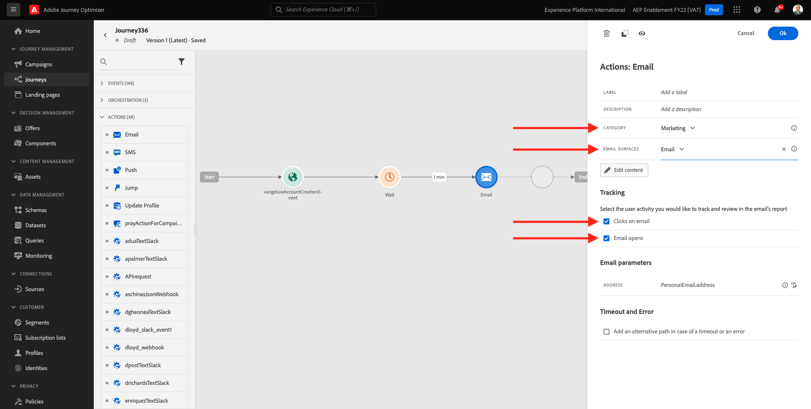
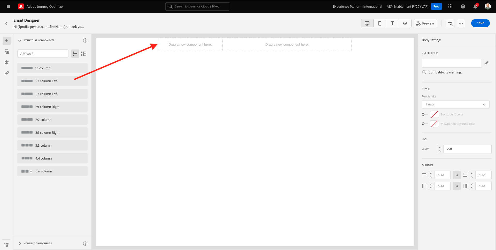

# 7.2 Journey und E-Mail-Nachricht erstellen

In dieser Übung konfigurieren Sie die Journey und die Nachricht, die ausgelöst werden muss, wenn ein Benutzer ein Konto auf der Demowebsite erstellt.

Melden Sie sich bei Adobe Journey Optimizer an, indem Sie [Adobe Experience Cloud](https://experience.adobe.com). Klicken **Journey Optimizer**.

Sie werden zum **Startseite**  in Journey Optimizer anzeigen. Vergewissern Sie sich zunächst, dass Sie die richtige Sandbox verwenden. Die zu verwendende Sandbox heißt `--aepSandboxId--`. Um von einer Sandbox zu einer anderen zu wechseln, klicken Sie auf **PRODUKTIONSPROD (VA7)** und wählen Sie die Sandbox aus der Liste aus. In diesem Beispiel erhält die Sandbox den Namen **AEP-Aktivierung FY22**. Sie sind dann im **Startseite** Ansicht Ihrer Sandbox `--aepSandboxId--`.

## 7.2.1 Journey erstellen

Klicken Sie im linken Menü auf **Journeys**. Klicken Sie anschließend auf **Journey erstellen** , um eine neue Journey zu erstellen.

Dann sehen Sie einen leeren Journey-Bildschirm.

In der vorherigen Übung haben Sie eine neue **Ereignis**. Sie haben es wie folgt benannt: `ldapAccountCreationEvent` und ersetzt `ldap` mit Ihrem ldap. Dies war das Ergebnis der Ereigniserstellung:

Jetzt müssen Sie dieses Ereignis als Beginn dieser Journey nehmen. Gehen Sie dazu zur linken Seite des Bildschirms und suchen Sie in der Ereignisliste nach Ihrem Ereignis.

Wählen Sie das Ereignis aus, ziehen Sie es auf die Journey-Arbeitsfläche und legen Sie es ab. Ihre Journey sieht nun wie folgt aus:

Als zweiten Schritt im Journey müssen Sie eine kurze **Warten** Schritt. Navigieren Sie zur linken Seite Ihres Bildschirms, um die **Orchestrierung** zu finden. Sie verwenden Profilattribute und müssen sicherstellen, dass sie in das Echtzeit-Kundenprofil eingetragen sind.

Ihre Journey sieht jetzt so aus. Auf der rechten Bildschirmseite müssen Sie die Wartezeit konfigurieren. Setzen Sie es auf 1 Minute. Dadurch wird ausreichend Zeit für die Profilattribute zur Verfügung stehen, nachdem das Ereignis ausgelöst wurde.

Klicken **Ok** , um Ihre Änderungen zu speichern.

Als dritten Schritt im Journey müssen Sie eine **Email** Aktion. Navigieren Sie zur linken Seite Ihres Bildschirms, um **Aktionen**, wählen Sie die **Email** -Aktion und ziehen Sie sie dann per Drag-and-Drop auf den zweiten Knoten im Journey. Das sehen Sie jetzt.

Legen Sie die **Kategorie** nach **Marketing** und wählen Sie eine E-Mail-Oberfläche aus, über die Sie E-Mails versenden können. In diesem Fall ist die auszuwählende E-Mail-Oberfläche **Email**. Stellen Sie sicher, dass die Kontrollkästchen für **Klicks auf E-Mail** und **E-Mail-Öffnungen** beide aktiviert sind.

Der nächste Schritt besteht darin, Ihre Nachricht zu erstellen. Klicken Sie dazu auf **Inhalt bearbeiten**.

## 7.2.2 Nachricht erstellen

Um Ihre Nachricht zu erstellen, klicken Sie auf **Inhalt bearbeiten**.

Das sehen Sie jetzt.

Klicken Sie auf **Betreff** Textfeld.

Beginnen Sie im Textbereich mit dem Schreiben **Hi**

Die Betreffzeile ist noch nicht fertig. Als Nächstes müssen Sie das Personalisierungstoken für das Feld einfügen **Vorname** die unter `profile.person.name.firstName`. Scrollen Sie im linken Menü nach unten, um die **Person** und klicken Sie auf den Pfeil, um eine Ebene tiefer zu gehen.

Suchen Sie nun die **Vollständiger Name** und klicken Sie auf den Pfeil, um eine Ebene tiefer zu gehen.

Suchen Sie abschließend die **Vorname** und klicken Sie auf **+** daneben unterschreiben. Daraufhin wird das Personalisierungstoken im Textfeld angezeigt.

Fügen Sie als Nächstes den Text hinzu **, danke für die Registrierung!**. Klicken Sie auf **Speichern**.

Du wirst dann wieder hier sein. Klicken **Email Designer** um den Inhalt der E-Mail zu erstellen.

Im nächsten Bildschirm werden Sie mit 3 verschiedenen Methoden aufgefordert, den Inhalt der E-Mail bereitzustellen:

- **Design von Grund auf neu**: Beginnen Sie mit einer leeren Arbeitsfläche und verwenden Sie den WYSIWYG-Editor, um Struktur- und Inhaltskomponenten per Drag-and-Drop zu verschieben, um den Inhalt der E-Mail visuell zu erstellen.
- **Eigene Code**: Erstellen Sie eine eigene E-Mail-Vorlage durch Codierung mithilfe von HTML
- **HTML importieren**: Importieren Sie eine vorhandene HTML-Vorlage, die Sie bearbeiten können.

Klicken **Design von Grund auf neu**.

Im linken Menü finden Sie die Strukturkomponenten, mit denen Sie die Struktur der E-Mail definieren können (Zeilen und Spalten).

Ziehen und Ablegen eines **1:2 Spalte links** aus dem Menü in die Arbeitsfläche. Dies ist der Platzhalter für das Logo-Bild.

Ziehen und Ablegen eines **1:1-Spalte** unter der vorherigen Komponente. Dies ist der Bannerblock.

Ziehen und Ablegen eines **1:2 Spalte links** unter der vorherigen Komponente. Dies ist der eigentliche Inhalt mit einem Bild auf der linken Seite und Text auf der rechten Seite.

Ziehen Sie als Nächstes eine **1:1-Spalte** unter der vorherigen Komponente. Dies ist die Fußzeile der E-Mail. Ihre Arbeitsfläche sollte jetzt wie folgt aussehen:

Als Nächstes verwenden wir Inhaltskomponenten, um Inhalte in diesen Bausteinen hinzuzufügen. Klicken Sie auf **Inhaltskomponenten** Menüelement

Ziehen und Ablegen eines **Bild** -Komponente in der ersten Zelle der ersten Zeile. Klicken Sie auf **Durchsuchen**.

Dann wirst du das sehen. Navigieren zum Ordner **enable-assets** und wählen Sie die Datei aus **luma-logo.png**. Klicken Sie auf **Auswählen**.

Sie sind jetzt wieder hier:

Navigieren Sie zu **Inhaltskomponenten** und ziehen Sie eine **Bild** -Komponente in der ersten Zelle der ersten Zeile. Klicken Sie auf **Durchsuchen**.

Im **Assets** Popup, navigieren Sie zum **enable-assets** Ordner. In diesem Ordner finden Sie alle Assets, die zuvor vom Kreativteam vorbereitet und hochgeladen wurden. Auswählen **module23-thankyou-new.png** und klicken Sie auf **Auswählen**.

Dann haben Sie Folgendes:

Wählen Sie das Bild aus und scrollen Sie im rechten Menü nach unten, bis Sie die **Größe** Breitenschieberkomponente. Verwenden Sie den Schieberegler, um die Breite auf &quot;f.i.&quot;zu ändern. **60 %**.

Navigieren Sie als Nächstes zu **Inhaltskomponenten** und ziehen Sie eine **Text** -Komponente in der Strukturkomponente in der vierten Zeile.

Standardtext auswählen **Bitte geben Sie Ihren Text hier ein.** wie bei jedem Texteditor. Schreiben **Lieber** anstatt. Beachten Sie, dass die Text-Symbolleiste angezeigt wird, wenn Sie sich im Textmodus befinden.

Klicken Sie in der Symbolleiste auf die **Personalisierung hinzufügen** Symbol.

Als Nächstes müssen Sie die **Vorname** Personalisierungstoken, das unter `profile.person.name.firstName`. Suchen Sie im Menü die **Person** -Element, Drilldown zum **Vollständiger Name** -Element und klicken Sie dann auf das **+** -Symbol, um das Feld Vorname zum Ausdruckseditor hinzuzufügen.

Klicken Sie auf **Speichern**.

Sie werden jetzt feststellen, wie Ihrem Text das Personalisierungsfeld hinzugefügt wurde.

Klicken Sie im selben Textfeld auf **Eingabe** zweimal hinzufügen, um zwei Zeilen hinzuzufügen und zu schreiben **Vielen Dank, dass Sie Ihr Konto bei Luma erstellt haben!**.

Die letzte Prüfung, die durchgeführt werden muss, um sicherzustellen, dass Ihre E-Mail bereit ist, besteht darin, sie in der Vorschau anzuzeigen. Klicken Sie auf **Inhalt simulieren** Schaltfläche.

Bestimmen Sie zunächst, welches Profil Sie für die Vorschau verwenden möchten. Wählen Sie die **email** Namespace durch Klicken auf das Symbol neben **Identitäts-Namespace eingeben** -Feld.

Wählen Sie in der Liste der Identitäts-Namespaces die **Email** Namespace.

Im **Identitätswert** Geben Sie die E-Mail-Adresse eines früheren Demoprofils ein, das bereits im Echtzeit-Kundenprofil gespeichert ist. Beispiel **woutervangeluwe+06022022-01@gmail.com** und klicken Sie auf **Testprofil suchen** button

Sobald Ihr Profil in der Tabelle angezeigt wird, klicken Sie auf die Schaltfläche **Vorschau** -Tab, um auf den Vorschaubildschirm zuzugreifen.

Wenn die Vorschau fertig ist, überprüfen Sie, ob die Personalisierung in der Betreffzeile korrekt ist. Der Text des Hauptteils sowie der Abmelde-Link werden als Hyperlink hervorgehoben.

Klicken **Schließen** , um die Vorschau zu schließen.

Klicken **Speichern** , um Ihre Nachricht zu speichern.

Gehen Sie zum Nachrichten-Dashboard zurück, indem Sie auf die Schaltfläche **Pfeil** neben dem Betreffzeilentext in der oberen linken Ecke.

Sie haben jetzt die Erstellung Ihrer Registrierungs-E-Mail abgeschlossen. Klicken Sie auf den Pfeil in der oberen linken Ecke, um zu Ihrer Journey zurückzukehren.

Klicken Sie auf **OK**.

## 7.2.3 Journey veröffentlichen

Sie müssen Ihrer Journey noch einen Namen geben. Klicken Sie hierzu auf die Schaltfläche **Eigenschaften** rechts oben auf dem Bildschirm angezeigt.

Dann können Sie hier den Namen des Journey eingeben. Verwenden Sie `--demoProfileLdap-- - Account Creation Journey`. Klicken Sie auf **OK**, um die Änderungen zu speichern.

Sie können Ihre Journey jetzt veröffentlichen, indem Sie auf **Veröffentlichen**.

Klicken **Veröffentlichen** erneut.

Sie sehen dann eine grüne Bestätigungsleiste, dass Ihre Journey jetzt veröffentlicht ist.

Du bist jetzt mit dieser Übung fertig.

Nächster Schritt: [7.3 Aktualisieren Sie Ihre Datenerfassungseigenschaft und testen Sie Ihre Journey](./ex3.md)

[Zurück zu Modul 7](./journey-orchestration-create-account.md)

[Zu allen Modulen zurückkehren](../../overview.md)
