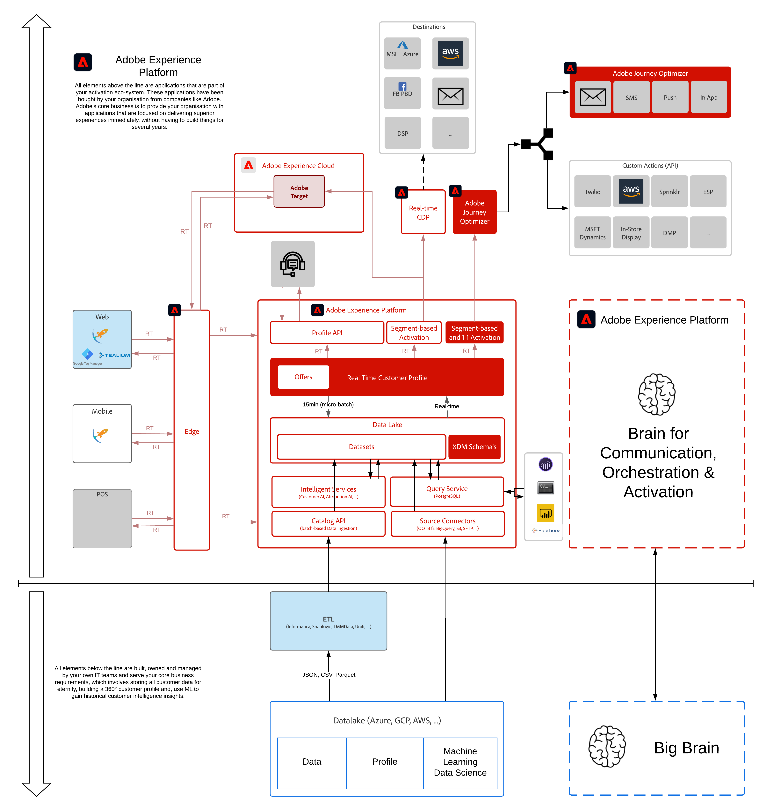

# 7. Adobe Journey Optimizer: Orchestrierung

**Autoren: [Rob In der Maur](https://www.linkedin.com/in/ridmaur/), [Wouter Van Geluwe](https://www.linkedin.com/in/woutervangeluwe/)**

In diesem Modul führen wir Sie durch die Schritte zur Verwendung von Adobe Journey Optimizer. Sie erhalten Zugriff auf Adobe Journey Optimizer und können Ereignisse und Journey konfigurieren, die auf der Grundlage eines Triggers aus einem Erlebnisereignis starten, das an Platform gesendet wird.

## Lernziele

- Erfahren Sie, wie Sie Adobe Journey Optimizer-Ereignisse, -Journey und -Aktionen konfigurieren.
- Erfahren Sie, wie Sie mit Adobe Journey Optimizer eine eigene E-Mail-Nachricht erstellen

## Voraussetzungen

- Zugriff auf [Adobe Experience Platform](https://experience.adobe.com/platform)
- Zugriff auf Adobe Journey Optimizer

>[!IMPORTANT]
>
>Dieses Tutorial wurde erstellt, um ein bestimmtes Workshop-Format zu vereinfachen. Es verwendet bestimmte Systeme und Konten, auf die Sie möglicherweise keinen Zugriff haben. Auch ohne Zugriff können Sie noch viel lernen, indem Sie diesen sehr detaillierten Inhalt durchlesen. Wenn Sie an einem der Workshops teilnehmen und Ihre Zugangsdaten benötigen, wenden Sie sich an Ihren Kundenbetreuer, der Ihnen die erforderlichen Informationen zur Verfügung stellt.

## Architekturüberblick

Sehen Sie sich die folgende Architektur an, in der die Komponenten hervorgehoben werden, die in diesem Modul besprochen und verwendet werden.

## Sandbox zur Verwendung

Verwenden Sie für dieses Modul diese Sandbox: `--aepSandboxId--`.

>[!NOTE]
>
>Vergessen Sie nicht, die Chrome-Erweiterung zu installieren, zu konfigurieren und zu verwenden, wie unter [0.1 - Installieren der Chrome-Erweiterung für die Dokumentation zur Experience League](../module0/ex1.md)

## Übungen

[7.1 Ereignis erstellen](./ex1.md)

In dieser Übung erfahren Sie, wie Sie ein Ereignis konfigurieren.

[7.2 Journey und E-Mail-Nachricht erstellen](./ex2.md)

In dieser Übung erfahren Sie, wie Sie eine E-Mail-Nachricht konfigurieren.

[7.3 Aktualisieren Sie Ihre Datenerfassungseigenschaft und testen Sie Ihre Journey](./ex3.md)

Dies führt Sie durch die Konfiguration von Launch, um Ihr Ereignis Trigger und die richtige Payload bereitzustellen. Schließlich können Sie sich eine E-Mail senden.

[Zusammenfassung und Vorteile](./summary.md)

Zusammenfassung dieses Moduls und Übersicht über die Vorteile.

>[!NOTE]
>
>Vielen Dank, dass Sie Ihre Zeit investiert haben, um alles über Adobe Experience Platform zu erfahren. Wenn Sie Fragen haben, möchten allgemeine Rückmeldungen von Vorschlägen zu künftigen Inhalten teilen, wenden Sie sich bitte direkt an Wouter Van Geluwe, indem Sie eine E-Mail an **vangeluw@adobe.com**.

[Zu allen Modulen zurückkehren](../../overview.md)
