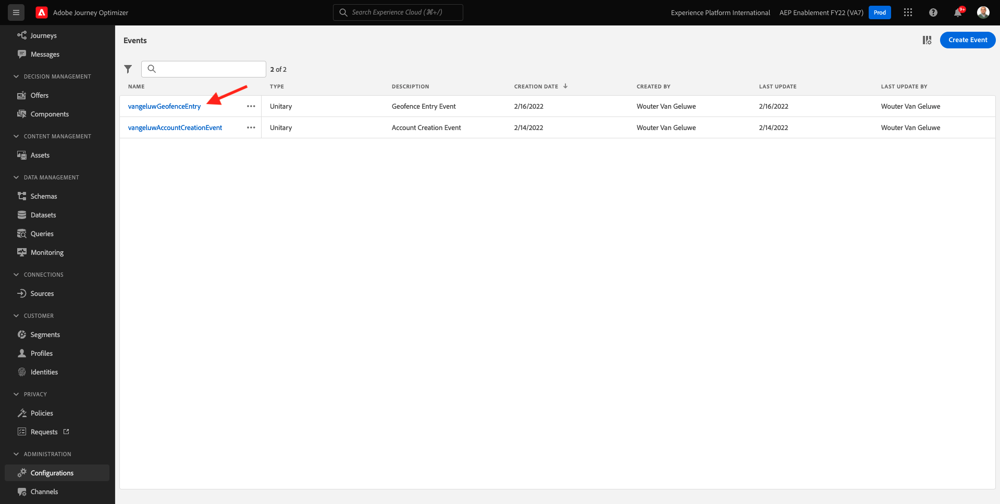

# 8.1 Ereignis definieren

Melden Sie sich bei Adobe Journey Optimizer an, indem Sie [Adobe Experience Cloud](https://experience.adobe.com). Klicken **Journey Optimizer**.

Sie werden zum **Startseite**  in Journey Optimizer anzeigen. Vergewissern Sie sich zunächst, dass Sie die richtige Sandbox verwenden. Die zu verwendende Sandbox heißt `--aepSandboxId--`. Um von einer Sandbox zu einer anderen zu wechseln, klicken Sie auf **PRODUKTIONSPROD (VA7)** und wählen Sie die Sandbox aus der Liste aus. In diesem Beispiel erhält die Sandbox den Namen **AEP-Aktivierung FY22**. Sie sind dann im **Startseite** Ansicht Ihrer Sandbox `--aepSandboxId--`.

Scrollen Sie im linken Menü nach unten und klicken Sie auf **Konfigurationen**. Klicken Sie anschließend auf das **Verwalten** Schaltfläche unter **Veranstaltungen**.

Daraufhin wird eine Übersicht über alle verfügbaren Ereignisse angezeigt. Klicken **Ereignis erstellen** , um mit der Erstellung Ihres eigenen Ereignisses zu beginnen.

Daraufhin wird ein neues, leeres Ereignisfenster angezeigt.

Verwenden Sie als Namen für das Ereignis `--demoProfileLdap--GeofenceEntry`. In diesem Beispiel lautet der Ereignisname `vangeluwGeofenceEntry`.

Legen Sie Beschreibung auf fest: `Geofence Entry Event`.

Stellen Sie als Nächstes sicher, dass die **Typ** auf **Einzelfall** und für die **Ereignis-ID-Typ** Auswahl, wählen Sie **Systemgeneriert**

Als Nächstes müssen Sie ein Schema auswählen. Alle hier gezeigten Schemas sind Adobe Experience Platform-Schemas.

Sie werden feststellen, dass nicht alle Schemas angezeigt werden. In Adobe Experience Platform stehen noch viele weitere Schemata zur Verfügung.
Um in dieser Liste angezeigt zu werden, muss ein Schema eine sehr spezifische Feldergruppe enthalten. Die Feldergruppe, die hier angezeigt werden muss, heißt `Orchestration eventID`.

Sehen wir uns kurz an, wie diese Schemas in Adobe Experience Platform definiert sind.

Gehen Sie im linken Menü zu **Schemas** und öffnen Sie sie in einer neuen Browser-Registerkarte. In **Schemas**, gehen Sie zu **Durchsuchen** um die Liste der verfügbaren Schemas anzuzeigen.
Schema öffnen `Demo System - Event Schema for Website (Global v1.1)`.

Nach dem Öffnen des Schemas sehen Sie, dass die Feldergruppe `Orchestration eventID` ist Teil des Schemas.
Diese Feldergruppe hat nur zwei Felder. `_experience.campaign.orchestration.eventID` und `originJourneyID`.

Sobald diese Feldergruppe und dieses spezifische eventID-Feld Teil eines Schemas sind, kann dieses Schema von Adobe Journey Optimizer verwendet werden.

Gehen Sie zurück zur Ereigniskonfiguration in Adobe Journey Optimizer.

In diesem Anwendungsfall möchten Sie ein Geofence-Ereignis überwachen, um zu verstehen, ob sich ein Kunde an einem bestimmten Ort befindet. Wählen Sie daher jetzt das Schema aus. `Demo System - Event Schema for Website (Global v1.1)` als Schema für Ihr Ereignis.

Adobe Journey Optimizer wählt dann automatisch einige erforderliche Felder aus, Sie können jedoch die Felder bearbeiten, die Adobe Journey Optimizer zur Verfügung gestellt werden.

Klicken Sie auf **Bleistift** -Symbol, um die Felder zu bearbeiten.

Daraufhin wird ein Popup-Fenster mit einer Schemahierarchie angezeigt, in dem Sie Felder auswählen können.

Felder wie die ECID und die Orchestration eventID sind erforderlich und als solche vorausgewählt.

Ein Marketing-Experte muss jedoch flexibel auf alle Datenpunkte zugreifen können, die Kontext zu einer Journey bieten. Stellen Sie also sicher, dass Sie auch die folgenden Felder als Minimum auswählen (zu finden im Kontextknoten Ort ):

- Stadt

Klicken Sie anschließend auf **OK**.

Adobe Journey Optimizer benötigt auch eine Kennung, um den Kunden zu identifizieren. Da Adobe Journey Optimizer mit Adobe Experience Platform verknüpft ist, wird die Primäre Kennung eines Schemas automatisch als Kennung für die Journey verwendet.
Der Primäre Bezeichner berücksichtigt auch automatisch das vollständige Identitätsdiagramm von Adobe Experience Platform und verknüpft das gesamte Verhalten aller verfügbaren Identitäten, Geräte und Kanäle mit demselben Profil, sodass Adobe Journey Optimizer kontextbezogen, relevant und konsistent ist.

Klicken **Speichern** , um Ihr benutzerspezifisches Ereignis zu speichern.

Ihr Ereignis wird dann Teil der Liste der verfügbaren Ereignisse sein.

Schließlich müssen Sie die `Orchestration eventID` für Ihr benutzerspezifisches Ereignis.

Öffnen Sie das Ereignis erneut, indem Sie es in der Ereignisliste auswählen.
Klicken Sie in Ihrem Ereignis auf die **Payload anzeigen** Symbol neben **Felder**.

Klicken Sie auf **Payload anzeigen** -Symbol öffnet eine Beispiel-XDM-Payload für dieses Ereignis.

Scrollen Sie im **Nutzlast** bis Sie die Zeile sehen `eventID`.

Notieren Sie sich die `eventID` wie Sie es in der letzten benötigen, um Ihre Konfiguration zu testen.

In diesem Beispiel wird die `eventID` is `fa42ab7982ba55f039eacec24c1e32e5c51b310c67f0fa559ab49b89b63f4934`.

Sie haben nun das Ereignis definiert, das den Trigger der Journey, die wir erstellen, darstellt. Sobald die Journey ausgelöst wird, werden die Geofence-Felder wie City und alle anderen, von Ihnen ausgewählten Felder (z. B. Land, Breitengrad und Längengrad) der Journey zur Verfügung gestellt.

Wie in der Anwendungsfallbeschreibung erläutert, müssen wir dann kontextbezogene Promotions bereitstellen, die vom Wetter abhängen. Um Wetterinformationen zu erhalten, müssen wir externe Datenquellen definieren, die uns die Wetterinformationen für diesen Ort liefern. Sie werden die **OpenWeather** Service, um uns bereitzustellen, was diese Informationen, als Teil von 2.

Nächster Schritt: [8.2 Externe Datenquelle definieren](./ex2.md)

[Zurück zu Modul 8](journey-orchestration-external-weather-api-sms.md)

[Zu allen Modulen zurückkehren](../../overview.md)
