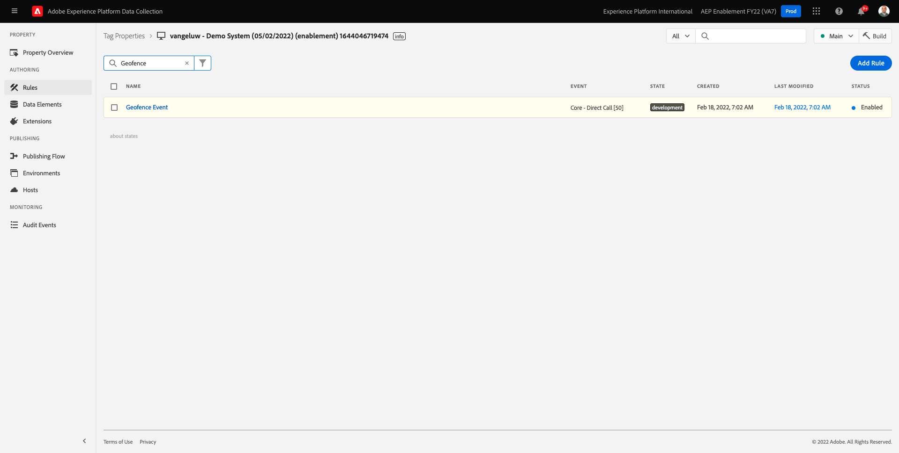

# 8.5 Trigger Journey

In dieser Übung testen und Trigger Sie die Journey, die Sie in diesem Modul konfiguriert haben.

## 8.5.1 Konfiguration des Geofence-Ereignisses aktualisieren

Navigieren Sie zu [Adobe Experience Platform-Datenerfassung](https://experience.adobe.com/launch/) und wählen Sie **Tags**.

Dies ist die Seite mit den Eigenschaften der Adobe Experience Platform-Datenerfassung , die Sie zuvor gesehen haben.

In Modul 0 hat Demo System zwei Client-Eigenschaften für Sie erstellt: eine für die Website und eine für die mobile App. Suchen Sie sie, indem Sie nach `--demoProfileLdap--` im **[!UICONTROL Suche]** ankreuzen. Klicken Sie auf , um die **Web** -Eigenschaft.

Dann wirst du das sehen.

Gehen Sie im linken Menü zu **Regeln** und nach der Regel suchen **Geofence-Ereignis**. Klicken Sie auf die Regel **Geofence-Ereignis** um es zu öffnen.

Dann sehen Sie die Details dieser Regel. Klicken Sie auf , um die Aktion zu öffnen. **Senden des &quot;Geofence-Ereignisses&quot;an AEP - Trigger JO**.

Wenn diese Aktion ausgelöst wird, sehen Sie, dass ein bestimmtes Datenelement verwendet wird, um die XDM-Datenstruktur zu definieren. Sie müssen dieses Datenelement aktualisieren und die **Ereignis-ID** des Ereignisses, das Sie in [Übung 8.1](./ex1.md).

Jetzt müssen Sie das Datenelement aktualisieren **XDM - Geofence-Ereignis**. Gehen Sie dazu zu **Datenelemente**. Suchen Sie nach **XDM - Geofence-Ereignis** und klicken Sie auf , um dieses Datenelement zu öffnen.

Daraufhin sehen Sie Folgendes:

Navigieren Sie zum Feld `_experience.campaign.orchestration.eventID`. Entfernen Sie den aktuellen Wert und fügen Sie dort Ihre eventID ein.

Zur Erinnerung: Die Ereignis-ID finden Sie in Adobe Journey Optimizer unter **Konfigurationen > Ereignisse** und Sie finden die Ereignis-ID in der Beispiel-Payload Ihres Ereignisses, was wie folgt aussieht: `"eventID": "fa42ab7982ba55f039eacec24c1e32e5c51b310c67f0fa559ab49b89b63f4934"`.

Als Nächstes sollten Sie Ihre Stadt in diesem Datenelement definieren. Navigieren Sie zu **placeContext > geo > city** und geben Sie eine Stadt der Wahl ein. Klicken Sie anschließend auf **Speichern** oder **In Bibliothek speichern**.

Schließlich müssen Sie Ihre Änderungen veröffentlichen. Navigieren Sie zu **Veröffentlichungsfluss** im linken Menü.

Klicken **Alle geänderten Ressourcen hinzufügen** und klicken Sie anschließend auf **Speichern und in Entwicklung erstellen**.

## 8.5.2 Trigger Ihrer Journey

Navigieren Sie zu [https://builder.adobedemo.com/projects](https://builder.adobedemo.com/projects). Nach der Anmeldung bei Ihrer Adobe ID sehen Sie dies. Klicken Sie auf Ihr Website-Projekt, um es zu öffnen.

Im **Screens** Seite, klicken Sie auf **Ausführen**.

Sie werden dann Ihre Demowebsite öffnen sehen. Wählen Sie die URL aus und kopieren Sie sie in die Zwischenablage.

Öffnen Sie ein neues Inkognito-Browserfenster.

Fügen Sie die URL Ihrer Demo-Website ein, die Sie im vorherigen Schritt kopiert haben. Sie werden dann aufgefordert, sich mit Ihrer Adobe ID anzumelden.

Wählen Sie Ihren Kontotyp aus und schließen Sie den Anmeldevorgang ab.

Sie sehen dann Ihre Website in einem Inkognito-Browser-Fenster geladen. Für jede Demonstration müssen Sie ein neues Inkognito-Browser-Fenster verwenden, um Ihre Demo-Website-URL zu laden.

Klicken Sie auf das Symbol für das Adobe-Logo oben links im Bildschirm, um den Profilanzeige zu öffnen.

Sehen Sie sich das Bedienfeld Profil-Viewer und das Echtzeit-Kundenprofil mit dem **Experience Cloud-ID** als primäre Kennung für diesen derzeit unbekannten Kunden.

Gehen Sie zur Seite Registrieren/Anmelden . Klicken **KONTO ERSTELLEN**.

Füllen Sie Ihre Details aus und klicken Sie auf **registrieren** Danach werden Sie zur vorherigen Seite weitergeleitet.

Öffnen Sie das Bedienfeld Profil-Viewer und wechseln Sie zum Echtzeit-Kundenprofil. Im Bedienfeld &quot;Profil-Viewer&quot;sollten alle Ihre personenbezogenen Daten angezeigt werden, z. B. Ihre neu hinzugefügten E-Mail- und Telefonkennungen.

Klicken Sie im Bereich &quot;Profil-Viewer&quot;auf **AKTIVITÄTEN**. Eingabe `geofenceevent` und klicken Sie auf **Senden**.

Einige Sekunden später erhalten Sie eine SMS von Adobe Journey Optimizer.

Nächster Schritt: [Zusammenfassung und Vorteile](./summary.md)

[Zurück zu Modul 8](journey-orchestration-external-weather-api-sms.md)

[Zu allen Modulen zurückkehren](../../overview.md)
