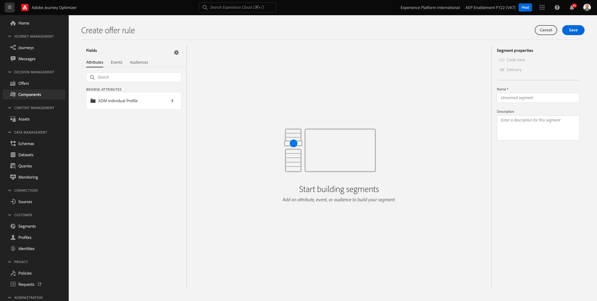

# 9.1 Offer decisioning 101

## 9.1.1 Terminologie

Um ein besseres Verständnis über Offer decisioning zu erhalten, empfehlen wir dringend, die [Übersicht](https://experienceleague.adobe.com/docs/journey-optimizer/using/offer-decisioniong/get-started-decision/starting-offer-decisioning.html?lang=en) Informationen zur Funktionsweise des Offer decisioning Application Service mit Adobe Experience Platform.

Beim Arbeiten mit Offer decisioning müssen Sie die folgenden Begriffe kennen:

| Begriff | Erklärung |
| ------------------------- | -------------------------------------------------------------------------------------------------------------------------------------------------------------------------------------------------------------------------------------------------------- |
| **Angebot** | Ein Angebot ist eine Marketing-Botschaft, der ggf. Regeln zugeordnet sind, die angeben, wer für die Anzeige des Angebots infrage kommt. Ein Angebot hat einen Status: Entwurf, genehmigt oder archiviert. |
| **Platzierung** | Die Kombination aus Position (oder Kanaltyp) und Kontext (oder Content-Typ), in dem ein Angebot für einen Endbenutzer angezeigt wird. Es handelt sich dabei um eine Kombination aus Text-, HTML-, Bild-, JSON-Dateien in mobilen, Web-, Social-, Instant Messaging- und nicht digitalen Kanälen. |
| **Regel** | Die Logik, die die Eignung von Endbenutzern für ein Angebot definiert und steuert. |
| **Personalisiertes Angebot** | Eine anpassbare Marketing-Botschaft, die auf Eignungsregeln und Einschränkungen basiert. |
| **Fallback-Angebot** | Das Standardangebot, das angezeigt wird, wenn ein Endbenutzer für keines der Angebote in der verwendeten Kollektion geeignet ist. |
| **Begrenzung** | Wird in einer Angebotsdefinition verwendet, um festzulegen, wie oft ein Angebot insgesamt und für einen bestimmten Benutzer unterbreitet werden kann. |
| **Priorität** | Ebene zur Bestimmung der Prioritätsstufe aus einem Ergebnissatz von Angeboten. |
| **Sammlung** | Wird verwendet, um eine Untergruppe von Angeboten aus der personalisierten Angebotsliste herauszufiltern und so den offer decisioning-Prozess zu beschleunigen. |
| **Entscheidung** | Eine Kombination aus Angeboten, Platzierungen und Profilen, für die das Entscheidungsmodul das beste Angebot bereitstellen soll. |
| **AEM Assets Essentials** | Ein universelles und zentralisiertes Erlebnis zum Speichern, Suchen und Auswählen von Assets in Adobe Experience Cloud Solutions und Adobe Experience Platform. |

{style=&quot;table-layout:auto&quot;}

## 9.1.2 Offer decisioning

Melden Sie sich bei Adobe Journey Optimizer an, indem Sie [Adobe Experience Cloud](https://experience.adobe.com). Klicken **Journey Optimizer**.

Sie werden zum **Startseite**  in Journey Optimizer anzeigen. Vergewissern Sie sich zunächst, dass Sie die richtige Sandbox verwenden. Die zu verwendende Sandbox heißt `--aepSandboxId--`. Um von einer Sandbox zu einer anderen zu wechseln, klicken Sie auf **PRODUKTIONSPROD (VA7)** und wählen Sie die Sandbox aus der Liste aus. In diesem Beispiel erhält die Sandbox den Namen **AEP-Aktivierung FY22**. Sie sind dann im **Startseite** Ansicht Ihrer Sandbox `--aepSandboxId--`.

Klicken Sie im linken Menü auf **Angebote**. Sie sehen nun das Menü Angebote , das Angebote, Sammlungen und Entscheidungen enthält.

Klicken **Komponenten**. Jetzt wird das Menü Angebote angezeigt, das Elemente wie Platzierungen, Tags, Regeln und Bewertungen enthält.

## 9.1.3 Praktika

Navigieren Sie zu **Praktika**.

Im **Praktika** -Registerkarte können Sie Ihre Platzierungen für Ihre Angebote definieren. Wenn Sie eine Entscheidung definieren, definiert die Platzierung, wo das resultierende Angebot angezeigt wird (Kanaltyp) und in welcher Form oder Form (Inhaltstyp).

Wenn keine Platzierungen in Ihrer Adobe Experience Platform-Instanz angezeigt werden, erstellen Sie sie wie unten und im Screenshot angegeben.

| Name | Kanaltyp | Content-Typ |
| ---------------------- | ------------ | ------------ |
| **Nicht digital – Text** | Nicht digital | Text |
| **Web - JSON** | Web | JSON |
| **Web - HTML** | Web | HTML |
| **Web - Text** | Web | Text |
| **Web – Bild** | Web | Bild |
| **E-Mail - JSON** | E-Mail | JSON |
| **Email - HTML** | E-Mail | HTML |
| **Email - Text** | E-Mail | Text |
| **E-Mail – Bild** | E-Mail | Bild |

{style=&quot;table-layout:auto&quot;}

**Hinweis**: Ändern Sie keine bereits verfügbaren Platzierungen.

Klicken Sie auf eine beliebige Platzierung, um deren Einstellungen zu visualisieren.

Jetzt werden alle Felder der Platzierung angezeigt:

- **Name** der Platzierung
- **Platzierungs-ID**
- **Kanaltyp** für die Platzierung
- **Content-Typ** der Platzierung, die **Text**, **HTML**, **Bild** oder **JSON**
- **Beschreibung** -Feld zum Hinzufügen einer zusätzlichen Beschreibung für die Platzierung

## 9.1.4 Entscheidungsregeln

Eine Regel (auch als Eignungsregel bezeichnet) entspricht einem **Segment**. Eine Regel ist in der Tat ein Segment selbst mit dem einzigen Unterschied, dass eine Regel mit einem Angebot verwendet werden kann, um einem Profil in Adobe Experience Platform das beste Angebot zu unterbreiten.

Da Sie bereits wissen, wie Sie Segmente basierend auf den vorherigen Aktivierungsmodulen definieren, sollten Sie einfach die Segmentierungsumgebung schnell erneut aufrufen:

Navigieren Sie zu **Regeln**. Klicken **+ Regel erstellen**.

Anschließend sehen Sie die Segmentierungsumgebung von Adobe Experience Platform.

Sie können jetzt auf alle Felder zugreifen, die Teil des Vereinigungsschemas für das Echtzeit-Kundenprofil sind, und eine beliebige Regel erstellen.

Interessant ist auch, dass Sie bereits definierte Segmente in Adobe Experience Platform einfach wiederverwenden können, indem Sie **Zielgruppen** > ``--aepTenantIdSchema--``.

Daraufhin sehen Sie Folgendes:

Bei Bedarf können Sie nun Ihre eigenen Regeln konfigurieren. Für diese Übung benötigen Sie zwei Regeln:

- all - Männliche Kunden
- all - Weibliche Kunden

Wenn diese Regeln noch nicht existieren, erstellen Sie sie bitte. Wenn sie bereits existieren, verwenden Sie bitte diese Regeln und erstellen Sie keine neuen Regeln.

Das Attribut, das zum Erstellen der Regel verwendet werden soll, lautet **XDM Individual Profile** > **Person** > **Geschlecht**.

Hier finden Sie beispielsweise die Regeldefinition für die Regel **all - Männliche Kunden**:

Hier finden Sie beispielsweise die Regeldefinition für die Regel **all - Weibliche Kunden**:

## 9.1.5 Angebote

Navigieren Sie zu **Angebote** und wählen Sie **Angebote**. Klicken **+ Angebot erstellen**.

Dann sehen Sie dieses Popup.

Erstellen Sie jetzt keine Angebote - das machen Sie in der nächsten Übung.

Sie sehen nun, dass es zwei Angebotstypen gibt:

- Personalisierte Angebote
- Fallback-Angebote

Ein personalisiertes Angebot ist ein spezifischer Inhalt, der in einer bestimmten Situation angezeigt werden soll. Ein personalisiertes Angebot wurde speziell entwickelt, um ein persönliches und kontextbezogenes Erlebnis bereitzustellen, wenn bestimmte Kriterien erfüllt sind.

Ein Fallback-Angebot ist ein Angebot, das angezeigt wird, wenn die Kriterien für personalisierte Angebote nicht erfüllt sind.

## 9.1.6 Beschlüsse

Eine Entscheidung kombiniert Platzierungen, eine Kollektion personalisierter Angebote und ein Fallback-Angebot, die letztendlich vom Offer decisioning-Modul verwendet werden, um das beste Angebot für ein bestimmtes Profil zu finden, basierend auf den individuellen personalisierten Angebotsmerkmalen wie Priorität, Eignungsbegrenzung und Gesamtanzahl/Benutzerobergrenze.

So konfigurieren Sie **Entscheidung** klicken **Entscheidungen**.

In der nächsten Übung konfigurieren Sie Ihre eigenen Angebote und Entscheidungen.

Nächster Schritt: [9.2 Angebote und Entscheidungen konfigurieren](./ex2.md)

[Zurück zu Modul 9](./offer-decisioning.md)

[Zu allen Modulen zurückkehren](./../../overview.md)
