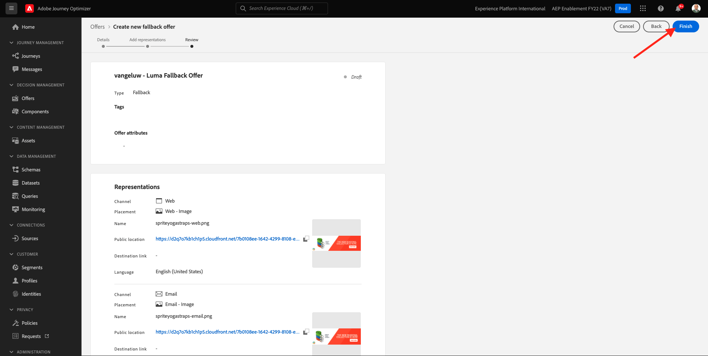
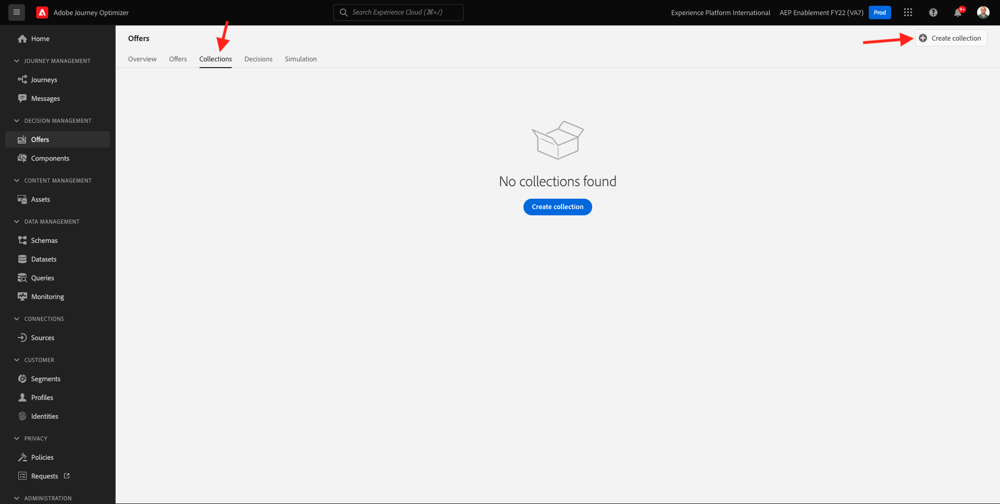
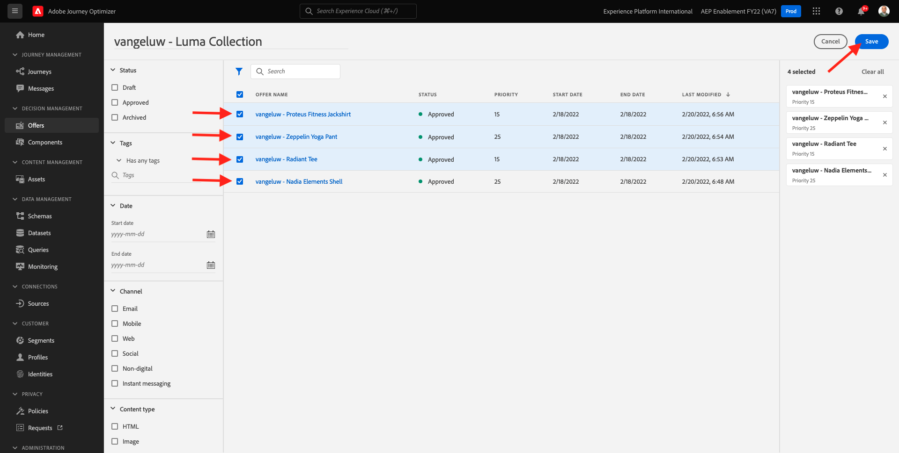
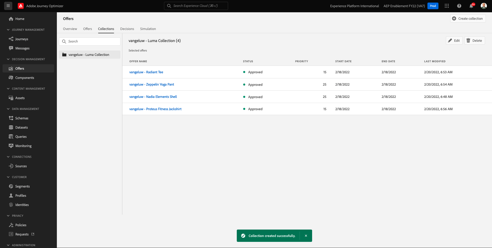
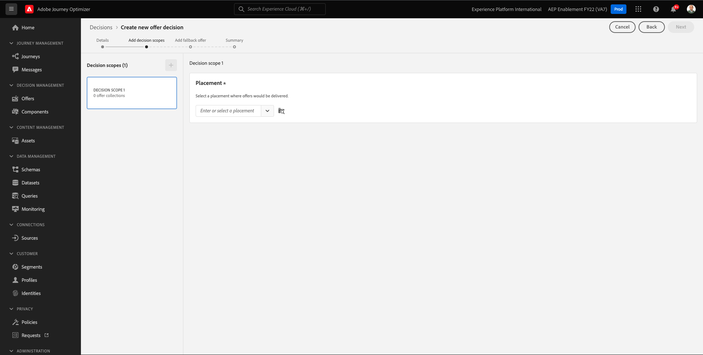

# 9.2 Angebot und Entscheidung konfigurieren

## 9.2.1 Personalisierte Angebote erstellen

In dieser Übung erstellen Sie vier **Personalisierte Angebote**. Im Folgenden finden Sie die Details, die bei der Erstellung dieser Angebote berücksichtigt werden müssen:

| Name | Datumsbereich | Bild-Link für E-Mail | Bild-Link für Web | Text | Priorität | Eignung | Sprache |
|-----|------------|----------------------|--------------------|------|:--------:|--------------|:-------:|
| `--demoProfileLdap-- - Nadia Elements Shell` | noch heute - 1 Monat später | https://bit.ly/3nPiwdZ | https://bit.ly/2INwXjt | `{{ profile.person.name.firstName }}, 10% discount on Nadia Elements Shell` | 25 | all - Weibliche Kunden | Englisch (USA) |
| `--demoProfileLdap-- - Radiant Tee` | noch heute - 1 Monat später | https://bit.ly/2HfA17v | https://bit.ly/3pEIdzn | `{{ profile.person.name.firstName }}, 5% discount on Radiant Tee` | 15 | all - Weibliche Kunden | Englisch (USA) |
| `--demoProfileLdap-- - Zeppelin Yoga Pant` | noch heute - 1 Monat später | https://bit.ly/2IOaItW | https://bit.ly/2INZHZd | `{{ profile.person.name.firstName }}, 10% discount on Zeppelin Yoga Pant` | 25 | all - Männliche Kunden | Englisch (USA) |
| `--demoProfileLdap-- - Proteus Fitness Jackshirt` | noch heute - 1 Monat später | https://bit.ly/330a43n | https://bit.ly/36USaQW | `{{ profile.person.name.firstName }}, 5% discount on Proteus Fitness Jackshirt` | 15 | all - Männliche Kunden | Englisch (USA) |

{style=&quot;table-layout:auto&quot;}

Melden Sie sich bei Adobe Journey Optimizer an, indem Sie [Adobe Experience Cloud](https://experience.adobe.com). Klicken **Journey Optimizer**.

Sie werden zum **Startseite**  in Journey Optimizer anzeigen. Vergewissern Sie sich zunächst, dass Sie die richtige Sandbox verwenden. Die zu verwendende Sandbox heißt `--aepSandboxId--`. Um von einer Sandbox zu einer anderen zu wechseln, klicken Sie auf **PRODUKTIONSPROD (VA7)** und wählen Sie die Sandbox aus der Liste aus. In diesem Beispiel erhält die Sandbox den Namen **AEP-Aktivierung FY22**. Sie sind dann im **Startseite** Ansicht Ihrer Sandbox `--aepSandboxId--`.

Klicken Sie im linken Menü auf **Angebote** und gehen Sie dann zu **Angebote**. Klicken **+ Angebot erstellen**.

Dann sehen Sie dieses Popup. Auswählen **Personalisiertes Angebot** und klicken Sie auf **Nächste**.

Du bist jetzt auf der **Details** anzeigen.

In diesem Fall müssen Sie das Angebot konfigurieren `--demoProfileLdap-- - Nadia Elements Shell`. Füllen Sie die Felder mithilfe der Informationen in der obigen Tabelle aus. In diesem Beispiel lautet der Name des personalisierten Angebots **vangeluw - Nadia Elements Shell**. Legen Sie außerdem die **Startdatum und -zeit** auf &quot;gestern&quot;gesetzt und die **Enddatum und -zeit** in einem Monat.

Nach der Fertigstellung sollten Sie das haben. Klicken Sie auf **Weiter**.

Jetzt müssen Sie **Darstellungen**. Darstellungen stellen eine Kombination aus **Platzierung** und ein echtes Asset.

Für **Darstellung 1** auswählen:

- Kanal: Web
- Platzierung: Web - Image
- Inhalt: URL
- Öffentlicher Standort: die URL aus der Spalte kopieren **Bild-Link für Web** in der obigen Tabelle

Alternativ können Sie **Asset-Bibliothek** für den Inhalt und klicken Sie dann auf **Durchsuchen**.

Daraufhin wird ein Popup der Asset-Bibliothek angezeigt, in dem Sie zum Ordner navigieren **enable-assets** und wählen Sie die Bilddatei aus **nadia-web.png**. Klicken Sie anschließend auf **Auswählen**.

Daraufhin sehen Sie Folgendes:

Klicken **+ Darstellung hinzufügen**.

Für **Darstellung 2** auswählen:

- Kanal: Email
- Platzierung: E-Mail - Bild
- Inhalt: URL
- Öffentlicher Standort: die URL aus der Spalte kopieren **Bild-Link für E-Mail** in der obigen Tabelle

Alternativ können Sie **Asset-Bibliothek** für den Inhalt und klicken Sie dann auf **Durchsuchen**.

Daraufhin wird ein Popup der Asset-Bibliothek angezeigt, in dem Sie zum Ordner navigieren **enable-assets** und wählen Sie die Bilddatei aus **nadia-email.png**. Klicken Sie anschließend auf **Auswählen**.

Daraufhin sehen Sie Folgendes:

Klicken Sie anschließend auf **+ Darstellung hinzufügen**.

Für **Darstellung 3** auswählen:

- Kanal: Nicht digital
- Platzierung: Nicht digital - Text

Als Nächstes müssen Sie Inhalte hinzufügen. In diesem Fall bedeutet dies das Hinzufügen des Textes, der als Aktionsaufruf verwendet werden soll.

Klicken **Inhalt hinzufügen**.

Dann sehen Sie dieses Popup.

Auswählen **Benutzerdefinierter Text** und füllen Sie diese Felder aus:

Sehen Sie sich die **Text** aus der obigen Tabelle und geben Sie diesen Text hier ein: `{{ profile.person.name.firstName }}, 10% discount on Nadia Elements Shell`.

Sie werden auch feststellen, dass Sie jedes Profilattribut auswählen und als dynamisches Feld in den Angebotstext einfügen können. In diesem Beispiel wird das -Feld `{{ profile.person.name.firstName }}` stellt sicher, dass der Vorname des Kunden, der dieses Angebot erhält, im Angebotstext enthalten ist.

Dann wirst du das sehen. Klicken Sie auf **Speichern**.

Das hast du jetzt. Klicken Sie auf **Weiter**.

Daraufhin sehen Sie Folgendes:

Auswählen **Nach definierter Entscheidungsregel** und klicken Sie auf **+** Symbol zum Hinzufügen der Regel **all - Weibliche Kunden**.

Dann wirst du das sehen. Füllen Sie die **Priorität** wie in der obigen Tabelle angegeben. Klicken Sie auf **Weiter**.

Daraufhin wird Ihnen ein Überblick über Ihre neue **Personalisiertes Angebot**.

Klicken Sie abschließend auf **Speichern und genehmigen**.

Ihr neu erstelltes personalisiertes Angebot wird dann in der Angebotsübersicht angezeigt:

Wiederholen Sie nun die oben genannten Schritte, um die drei anderen personalisierten Angebote für die Produkte Radiant Tee, Zeppelin Yoga Pant und Proteus Fitness Jackshirt zu erstellen.

Wenn Sie fertig sind, **Angebotsübersichten** Bildschirm für **Personalisierte Angebote** alle Ihre Angebote anzeigen.

## 9.2.2 Fallback-Angebot erstellen

Nachdem Sie vier personalisierte Angebote erstellt haben, sollten Sie jetzt eine **Fallback-Angebot**.

Stellen Sie sicher, dass Sie sich im **Angebote** Ansicht:

Klicken **+ Angebot erstellen**.

Dann sehen Sie dieses Popup. Auswählen **Fallback-Angebot** und klicken Sie auf **Nächste**.

Daraufhin sehen Sie Folgendes:

Geben Sie diesen Namen für Ihr Fallback-Angebot ein: `--demoProfileLdap-- - Luma Fallback Offer`. Klicken Sie auf **Weiter**.

Jetzt müssen Sie **Darstellungen**. Darstellungen stellen eine Kombination aus **Platzierung** und ein echtes Asset.

Für **Darstellung 1** auswählen:

- Kanal: Web
- Platzierung: Web - Image
- Inhalt: URL
- Öffentlicher Standort: `https://bit.ly/3nBOt9h`

Alternativ können Sie **Asset-Bibliothek** für den Inhalt und klicken Sie dann auf **Durchsuchen**.

Daraufhin wird ein Popup der Asset-Bibliothek angezeigt, in dem Sie zum Ordner navigieren **enable-assets** und wählen Sie die Bilddatei aus **spriteyogastraps-web.png**. Klicken Sie anschließend auf **Auswählen**.

Daraufhin sehen Sie Folgendes:

Für **Darstellung 2** auswählen:

- Kanal: Email
- Platzierung: E-Mail - Bild
- Inhalt: URL
- Öffentlicher Standort: `https://bit.ly/3nF4qvE`

Alternativ können Sie **Asset-Bibliothek** für den Inhalt und klicken Sie dann auf **Durchsuchen**.

Daraufhin wird ein Popup der Asset-Bibliothek angezeigt, in dem Sie zum Ordner navigieren **enable-assets** und wählen Sie die Bilddatei aus **spriteyogastraps-email.png**. Klicken Sie anschließend auf **Auswählen**.

Daraufhin sehen Sie Folgendes:

Klicken Sie anschließend auf **+ Darstellung hinzufügen**.

Für **Darstellung 3** auswählen:

- Kanal: Nicht digital
- Platzierung: Nicht digital - Text

Als Nächstes müssen Sie Inhalte hinzufügen. In diesem Fall bedeutet dies das Hinzufügen des Bild-Links.

Klicken **Inhalt hinzufügen**.

Dann sehen Sie dieses Popup.

Auswählen **Benutzerdefinierter Text** und füllen Sie diese Felder aus:

Text eingeben `{{ profile.person.name.firstName }}, discover our Sprite Yoga Straps!` und klicken Sie auf **Speichern**.

Dann wirst du das sehen. Klicken Sie auf **Weiter**.

Daraufhin wird Ihnen ein Überblick über Ihre neue **Fallback-Angebot**. Klicken Sie auf **Fertigstellen**.

Klicken Sie abschließend auf **Speichern und genehmigen**.

In **Angebotsübersichten** angezeigt, sehen Sie jetzt Folgendes:

## 9.2.3 Sammlung erstellen

Eine Sammlung wird verwendet, um **filter** eine Untergruppe von Angeboten aus der personalisierten Angebotsliste zu erstellen und diese im Rahmen einer Entscheidung zu verwenden, um den Entscheidungsprozess zu beschleunigen.

Navigieren Sie zu **Sammlungen**. Klicken **+ Sammlung erstellen**.

Dann sehen Sie dieses Popup. Konfigurieren Sie Ihre Sammlung wie folgt. Klicken Sie auf **Weiter**.

- Sammlungsname: use `--demoProfileLdap-- - Luma Collection`
- Auswählen **Erstellen einer statischen Sammlung**.

Wählen Sie im nächsten Bildschirm die vier **Personalisierte Angebote** haben Sie in der vorherigen Übung erstellt. Klicken Sie auf **Speichern**.

Jetzt sehen Sie Folgendes:

## 9.2.4 Entscheidung erstellen

Eine Entscheidung kombiniert Platzierungen, eine Kollektion personalisierter Angebote und ein Fallback-Angebot, die letztendlich vom Offer decisioning-Modul verwendet werden, um das beste Angebot für ein bestimmtes Profil zu finden, basierend auf den individuellen personalisierten Angebotsmerkmalen wie Priorität, Eignungsbegrenzung und Gesamtanzahl/Benutzerobergrenze.

So konfigurieren Sie **Entscheidung**, gehen Sie zu **Entscheidungen**. Klicken **+ Aktivität erstellen**.

Daraufhin sehen Sie Folgendes:

Füllen Sie die Felder wie diese aus. Klicken Sie auf **Weiter**.

- Name: `--demoProfileLdap-- - Luma Decision`
- Startdatum und -zeit: gestern
- Enddatum und -zeit: heute + 1 Monat

Im nächsten Bildschirm müssen Sie Platzierungen zu Entscheidungsbereichen hinzufügen. Sie müssen Entscheidungsbereiche für die Platzierungen erstellen **Web - Image**, **E-Mail - Bild** und **Nicht digital - Text**.

Erstellen Sie zunächst den Entscheidungsbereich für **Nicht digital - Text** durch Auswahl dieser Platzierung im Dropdown-Menü. Klicken Sie dann auf die **Hinzufügen** Schaltfläche zum Hinzufügen von Bewertungskriterien.

Auswählen einer Sammlung `--demoProfileLdap-- - Luma Collection` und klicken Sie auf **Hinzufügen**.

Dann wirst du das sehen. Klicken Sie auf **-** -Schaltfläche, um einen neuen Entscheidungsbereich hinzuzufügen.

Platzierung auswählen **Web - Image** und fügen Sie Ihre Sammlung hinzu `--demoProfileLdap-- - Luma Collection` nach Bewertungskriterien. Klicken Sie dann auf die **+** erneut klicken, um einen neuen Entscheidungsbereich hinzuzufügen.

Platzierung auswählen **E-Mail - Bild** und fügen Sie Ihre Sammlung hinzu `--demoProfileLdap-- - Luma Collection` nach Bewertungskriterien. Klicken Sie dann auf **Weiter**.

Sie müssen jetzt Ihre **Fallback-Angebot**, der `--demoProfileLdap-- - Luma Fallback Offer`. Klicken Sie auf **Weiter**.

Überprüfen Sie Ihre Entscheidung. Klicken Sie auf **Fertigstellen**.

Klicken Sie im Popup-Fenster auf **Speichern und aktivieren**.

Und schließlich sehen Sie Ihre Entscheidung in der Übersicht:

Sie haben Ihre Entscheidung jetzt erfolgreich konfiguriert. Ihre Entscheidung ist jetzt live und kann dazu verwendet werden, Ihren Kunden optimierte und personalisierte Angebote in Echtzeit bereitzustellen.

Nächster Schritt: [9.3 Vorbereiten der Datenerfassungs-Client-Eigenschaft und des Web-SDK-Setups für Offer decisioning](./ex3.md)

[Zurück zu Modul 9](./offer-decisioning.md)

[Zu allen Modulen zurückkehren](./../../overview.md)
