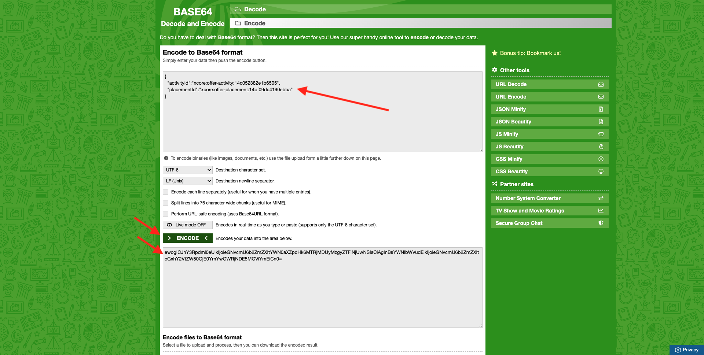

# 9.3 Vorbereiten der Adobe Experience Platform-Datenerfassungs-Client-Eigenschaft und des Web-SDK-Setups für Offer decisioning

>[!NOTE]
>
>Ausgewählten Benutzern wird derzeit vorab Zugriff auf die Verwendung von Offer Decisioning im Adobe Experience Platform Web SDK gewährt. Diese Funktion ist nicht für alle IMS-Organisationen verfügbar.

## 9.3.1 Datenspeicher aktualisieren

In [Übung 0.2](./../../modules/module0/ex2.md), haben Sie eine eigene **[!UICONTROL Datastream]**. Sie haben dann den Namen `--demoProfileLdap-- - Demo System Datastream`.

In dieser Übung müssen Sie Folgendes konfigurieren: **[!UICONTROL Datastream]** , um **[!DNL Offer Decisioning]**.

Gehen Sie dazu zu [https://experience.adobe.com/#/data-collection/](https://experience.adobe.com/#/data-collection/). Dann wirst du das sehen. Klicken **[!UICONTROL Datenspeicher]** oder **[!UICONTROL Datenspeicher (Beta)]**.

Wählen Sie oben rechts auf Ihrem Bildschirm den Namen Ihrer Sandbox aus, der `--aepSandboxId--`.


Suchen Sie nach Ihrer **[!UICONTROL Datastream]**, der `--demoProfileLdap-- - Demo System Datastream`. Klicken Sie auf **[!UICONTROL Datastream]** um es zu öffnen.


Dann wirst du das sehen. Klicken **...** neben **Adobe Experience Platform** und klicken Sie anschließend auf **Bearbeiten**.


Aktivieren **[!DNL Offer Decisioning]**, aktivieren Sie das Kontrollkästchen für **[!DNL Offer Decisioning]**. Klicken Sie auf **Speichern**.


Ihre **[!UICONTROL Datastream]** ist jetzt bereit, mit **[!DNL Offer Decisioning]**.


## 9.3.2 Konfigurieren Sie Ihre Adobe Experience Platform-Datenerfassungs-Client-Eigenschaft, um personalisierte Angebote anzufordern

Navigieren Sie zu [https://experience.adobe.com/#/data-collection/](https://experience.adobe.com/#/data-collection/), um **[!UICONTROL Client]**. Suchen Sie nach Ihren Datenerfassungseigenschaften, die `--demoProfileLdap-- - Demo System (DD/MM/YYYY)`. Öffnen Sie die Client-Eigenschaft &quot;Datenerfassung&quot;für das Web.


Navigieren Sie in Ihrer Eigenschaft zu **[!UICONTROL Regeln]** und öffnen Sie die Regel **[!UICONTROL Seitenansicht]**.


Klicken Sie auf , um die [!UICONTROL Aktion] **[!UICONTROL AEP Web SDK - Ereignis senden]**.


Dann wirst du das sehen. Sie werden die Menüoption für **[!UICONTROL Entscheidungsbereiche]**.


Für jede Anfrage, die an den -Edge und an Adobe Experience Platform gesendet wird, können Sie eine oder mehrere **[!UICONTROL Entscheidungsbereiche]**. A **[!UICONTROL Entscheidungsbereich]** ist eine Kombination aus zwei Elementen:

- [!UICONTROL Entscheidungs-ID]
- [!UICONTROL Platzierungs-ID]

Sehen wir uns zunächst einmal an, wo Sie diese beiden Elemente finden können.

### 9.3.2.1 Ihre [!UICONTROL Platzierungs-ID]

Die [!UICONTROL Platzierungs-ID] gibt den Speicherort und den Typ des erforderlichen Assets an. Beispielsweise entspricht das Hero-Bild auf der Startseite der Luma-Website dem [!UICONTROL Platzierungs-ID] für [!UICONTROL Web - Image].

>[!NOTE]
>
>Als Teil von Modul 6 haben Sie bereits eine Adobe Target-Erlebnis-Targeting-Aktivität konfiguriert, die das Bild der Heldenposition auf der Homepage ändert, wie im Screenshot dargestellt. Um der Übung willen werden Sie Ihre Angebote nun auf dem Bild unterhalb des Heldenbilds erscheinen lassen, wie im Screenshot angegeben.


So suchen Sie die [!UICONTROL Platzierungs-ID] für [!UICONTROL Web - Image] Navigieren Sie zu Adobe Journey Optimizer, indem Sie [Adobe Experience Cloud](https://experience.adobe.com). Klicken **Journey Optimizer**.


Sie werden zum **Startseite**  in Journey Optimizer anzeigen. Vergewissern Sie sich zunächst, dass Sie die richtige Sandbox verwenden. Die zu verwendende Sandbox heißt `--aepSandboxId--`. Um von einer Sandbox zu einer anderen zu wechseln, klicken Sie auf **PRODUKTIONSPROD (VA7)** und wählen Sie die Sandbox aus der Liste aus. In diesem Beispiel erhält die Sandbox den Namen **AEP-Aktivierung FY22**. Sie sind dann im **Startseite** Ansicht Ihrer Sandbox `--aepSandboxId--`.


Navigieren Sie als Nächstes zu [!UICONTROL Komponenten] und anschließend [!UICONTROL Praktika]. Klicken Sie auf [!UICONTROL Web - Image] Platzierung , um die Details anzuzeigen.


Wie Sie im obigen Bild sehen können, wird in diesem Beispiel die [!UICONTROL Platzierungs-ID] is `xcore:offer-placement:14bf09dc4190ebba`. Notieren Sie sich die [!UICONTROL Platzierungs-ID] für Ihre Platzierung für [!UICONTROL Web - Image] wie Sie es in der nächsten Übung brauchen werden.

### 9.3.2.2 Ihre [!UICONTROL Entscheidungs-ID]

Die [!UICONTROL Entscheidungs-ID] identifiziert, welche Kombination aus personalisierten Angeboten und Fallback-Angeboten Sie verwenden möchten. In der vorherigen Übung haben Sie Ihre eigene [!UICONTROL Entscheidung] und benannt `--demoProfileLdap-- - Luma Decision`.

So suchen Sie die [!UICONTROL Entscheidungs-ID] für Ihre `--demoProfileLdap-- - Luma Decision`, gehen Sie zu [https://platform.adobe.com](https://platform.adobe.com).

Navigieren Sie als Nächstes zu [!UICONTROL Angebote] und gehen Sie dann zu [!UICONTROL Entscheidungen]. Klicken Sie auf , um Ihre [!UICONTROL Entscheidung], der `--demoProfileLdap-- - Luma Decision`.


Wie Sie im obigen Bild sehen können, wird in diesem Beispiel die [!UICONTROL Entscheidungs-ID] is `xcore:offer-activity:14c052382e1b6505`. Notieren Sie sich die [!UICONTROL Entscheidungs-ID] für Ihre Entscheidung `--demoProfileLdap-- - Luma Decision` wie Sie es in der nächsten Übung brauchen werden.

Nachdem Sie die beiden Elemente abgerufen haben, müssen Sie eine **[!UICONTROL Entscheidungsbereiche]** können Sie mit dem nächsten Schritt fortfahren, der die Kodierung des Entscheidungsbereichs umfasst.

### 9.3.2.3 BASE64-Kodierung

Die **[!UICONTROL Entscheidungsbereich]** müssen Sie eine BASE64-kodierte Zeichenfolge eingeben. Diese BASE64-kodierte Zeichenfolge ist eine Kombination aus [!UICONTROL Platzierungs-ID] und [!UICONTROL Entscheidungs-ID], wie Sie unten sehen können.

```json
{
  "activityId":"xcore:offer-activity:14c052382e1b6505",
  "placementId":"xcore:offer-placement:14bf09dc4190ebba"
}
```

Die **[!UICONTROL Entscheidungsbereich]** kann auf zwei Arten generiert werden:

- Verwenden Sie einen öffentlichen Dienst wie [https://www.base64encode.org/](https://www.base64encode.org/). Geben Sie den JSON-Code wie oben erwähnt ein, und klicken Sie auf **[!UICONTROL Kodieren]** und Sie erhalten unten Ihre BASE64-kodierte Zeichenfolge.

   

- Rufen Sie die BASE64-kodierte Zeichenfolge aus Adobe Experience Platform ab. Navigieren Sie zu [!UICONTROL Entscheidungen] und klicken Sie auf , um [!UICONTROL Entscheidung], der `--demoProfileLdap-- - Luma Decision`.

   

   Nach dem Öffnen `--demoProfileLdap-- - Luma Decision`, sehen Sie das. Platzierung suchen [!UICONTROL Web - Image] und klicken Sie auf **[!UICONTROL Kopieren]** Schaltfläche. Klicken Sie anschließend auf **[!UICONTROL Kodierter Entscheidungsbereich]**. Die **[!UICONTROL Entscheidungsbereich]** wird jetzt in die Zwischenablage kopiert.

   

Gehen Sie dann zurück zu Launch, zu Ihrer Aktion **[!UICONTROL AEP Web SDK - Ereignis senden]**.


Fügen Sie den kodierten Entscheidungsbereich in das Eingabefeld ein.


Speichern Sie Ihre Änderungen in der Aktion. **[!UICONTROL AEP Web SDK - Ereignis senden]** durch Klicken auf **[!UICONTROL Änderungen beibehalten]**.


Klicken Sie anschließend auf **[!UICONTROL Speichern]** oder **[!UICONTROL In Bibliothek speichern]**


Wechseln Sie in der Adobe Experience Platform-Datenerfassung zu **[!UICONTROL Veröffentlichungsfluss]** und öffnen Sie Ihre **[!UICONTROL Entwicklungsbibliothek]** , der **[!UICONTROL Main]**. Klicken **[!UICONTROL + Alle geänderten Ressourcen hinzufügen]** und klicken Sie anschließend auf **[!UICONTROL Speichern und erstellen für Entwicklung]**. Ihre Änderungen werden jetzt auf Ihrer Demo-Website veröffentlicht.


Jedes Mal, wenn Sie eine **Allgemeine Seite** offer decisioning bewertet nun, wie z. B. die Homepage der Demo-Website, das anwendbare Angebot und gibt eine Antwort mit den Details des anzuzeigenden Angebots zurück. Die Anzeige des Angebots auf der Website erfordert eine zusätzliche Konfiguration, die Sie im nächsten Schritt durchführen werden.

## 9.3.3 Konfigurieren Sie Ihre Adobe Experience Platform-Datenerfassungs-Client-Eigenschaft für den Empfang und die Anwendung personalisierter Angebote

Navigieren Sie zu [https://experience.adobe.com/#/data-collection/](https://experience.adobe.com/#/data-collection/), um **[!UICONTROL Eigenschaften]**. Suchen Sie nach Ihren Datenerfassungseigenschaften, die `--demoProfileLdap-- - Demo System (DD/MM/YYYY)`. Öffnen Sie Ihre Datenerfassungseigenschaft für das Web.


Navigieren Sie in Ihrer Eigenschaft zu **[!UICONTROL Regeln]**.


Regel durchsuchen und öffnen **Erhaltene Entscheidung**.


Dann wirst du das sehen. Öffnen Sie die Aktion **Platzieren des Angebots auf der Seite**.


Klicken Sie auf **[!UICONTROL Editor öffnen]**.


Überschreiben Sie den Code, indem Sie den unten stehenden Code in den Editor einfügen.

```javascript
if(!Array.isArray(event.decisions)) {
  console.log('No decisions returned')
  return;
}
console.log("decision",event.decisions)

event.decisions.forEach(function(payload) {
  payload.items.forEach(function(item){
    console.log("Response from Offer Decisioning ", item.data.content);
   
    var element = document.querySelector("#root > div > div > div.app-content > div > section.feature_part.padding_top > div > div.row.align-items-center.justify-content-between > div.col-lg-7.col-sm-6.\\30  > div");
    if(!element){
      console.log("Offer Placement Area Selector not found")
      return;
    }
    if(!item.data){
      return
    }
    //check if offer already exists
    var offer = document.querySelector("#root > div > div > div.app-content > div > section.feature_part.padding_top > div > div.row.align-items-center.justify-content-between > div.col-lg-7.col-sm-6.\\30  > div");
    if(!offer){ 
      element.insertAdjacentHTML('afterbegin', item.data.content) 
    }
    else { 
      console.log("item.data.deliveryURL: " + item.data.deliveryURL)
      document.querySelector("#root > div > div > div.app-content > div > section.feature_part.padding_top > div > div.row.align-items-center.justify-content-between > div.col-lg-7.col-sm-6.\\30  > div").style.background="url('"+item.data.deliveryURL+"')";
      document.querySelector("#root > div > div > div.app-content > div > section.feature_part.padding_top > div > div.row.align-items-center.justify-content-between > div.col-lg-7.col-sm-6.\\30  > div").style.backgroundRepeat="no-repeat";
      document.querySelector("#root > div > div > div.app-content > div > section.feature_part.padding_top > div > div.row.align-items-center.justify-content-between > div.col-lg-7.col-sm-6.\\30  > div").style.backgroundPosition="center center";
      document.querySelector("#root > div > div > div.app-content > div > section.feature_part.padding_top > div > div.row.align-items-center.justify-content-between > div.col-lg-7.col-sm-6.\\30  > div").style.backgroundSize = "contain";
    }  
  })
});
```

Die Zeilen 26-27-28-29 wenden das Bild an, das von Offer decisioning an die Website zurückgegeben wird. Klicken Sie auf **[!UICONTROL Speichern]**.


Klicken Sie auf **[!UICONTROL Änderungen beibehalten]**.


Klicken Sie anschließend auf **[!UICONTROL Speichern]** oder **[!UICONTROL In Bibliothek speichern]**


Wechseln Sie in der Adobe Experience Platform-Datenerfassung zu **[!UICONTROL Veröffentlichungsfluss]** und öffnen Sie Ihre **[!UICONTROL Entwicklungsbibliothek]** , der **[!UICONTROL Main]**. Klicken **[!UICONTROL + Alle geänderten Ressourcen hinzufügen]** und klicken Sie anschließend auf **[!UICONTROL Speichern und erstellen für Entwicklung]**. Ihre Änderungen werden jetzt auf Ihrer Demo-Website veröffentlicht.


Mit dieser Änderung überwacht diese Regel in der Adobe Experience Platform-Datenerfassung nun die Antwort von Offer decisioning, die Teil der Web SDK-Antwort ist. Sobald die Antwort empfangen wird, wird das Bild des Angebots auf der Homepage angezeigt.

Auf der Demo-Website sehen Sie, dass dieses Bild jetzt ersetzt wird:

>[!NOTE]
>
>Als Teil von Modul 6 haben Sie bereits eine Adobe Target-Erlebnis-Targeting-Aktivität konfiguriert, die das Bild der Heldenposition auf der Homepage ändert, wie im Screenshot dargestellt. Um der Übung willen werden Sie Ihre Angebote nun auf dem Bild unterhalb des Heldenbilds erscheinen lassen, wie im Screenshot angegeben.


Und anstelle der standardmäßigen Luma-Website-Bilder sehen Sie jetzt ein Angebot wie dieses. In diesem Fall wird das Fallback-Angebot angezeigt.


Sie haben nun zwei Personalisierungstypen konfiguriert:

- 1 Erlebnis-Targeting-Aktivität mit Adobe Target in Modul 6
- 1 Offer decisioning-Implementierung mithilfe der Datenerfassungseigenschaft

In der nächsten Übung erfahren Sie, wie Sie Ihre in Adobe Journey Optimizer erstellten Angebote und Entscheidungen mit einer Erlebnis-Targeting-Aktivität von Adobe Target kombinieren können.

Nächster Schritt: [9.4 Adobe Target und Offer decisioning kombinieren](./ex4.md)

[Zurück zu Modul 9](./offer-decisioning.md)

[Zu allen Modulen zurückkehren](./../../overview.md)
