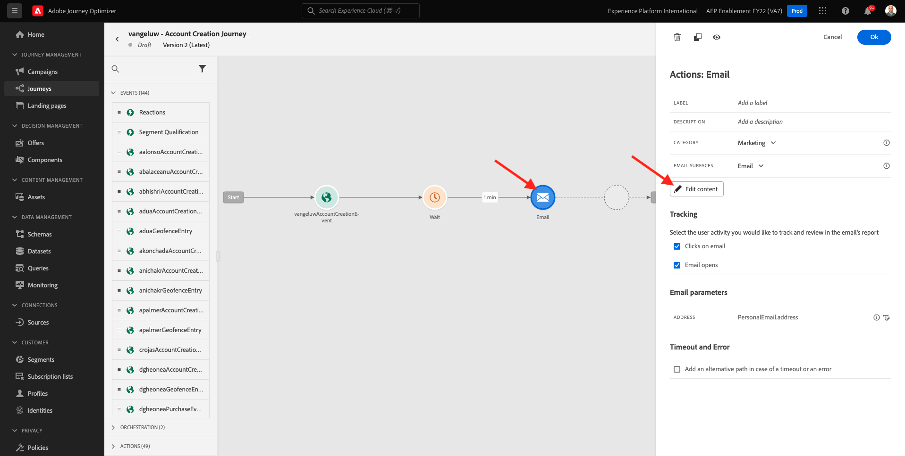
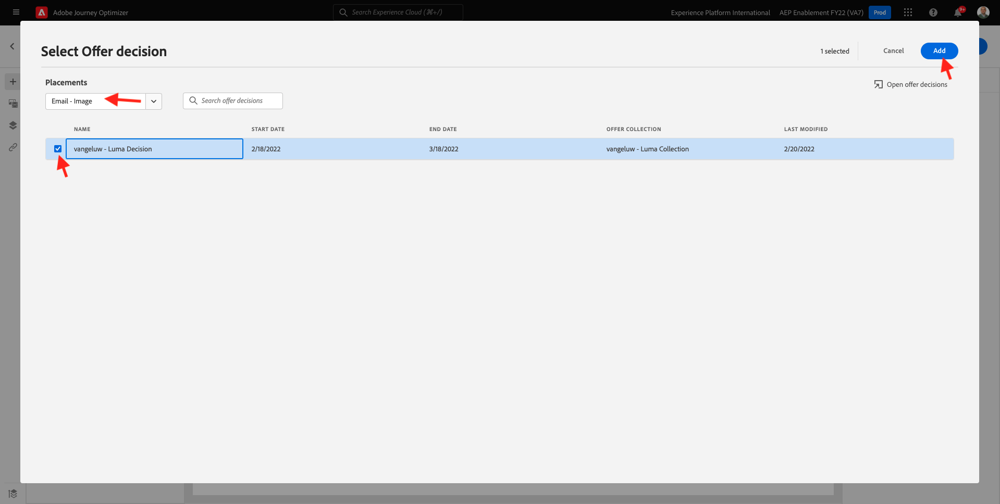

# 9.5 Ihre Entscheidung in einer E-Mail verwenden

In dieser Übung verwenden Sie Ihre Entscheidung, um den Versand einer E-Mail und einer SMS zu personalisieren.

Navigieren Sie zu **Journey**. Suchen Sie die Journey, die Sie in Übung 7.2 erstellt haben, die den Namen `--demoProfileLdap-- - Account Creation Journey`. Klicken Sie auf Ihre Journey, um sie zu öffnen.

Dann wirst du das sehen. Klicken **Neue Version erstellen**.

Klicken **Neue Version erstellen**.

Klicken Sie auf **Email** und klicken Sie dann auf **Inhalt bearbeiten**.

Daraufhin wird das Nachrichten-Dashboard angezeigt. Klicken **Email Designer**.

Dann wirst du das sehen.

Dann wirst du das sehen. Ziehen Sie eine neue **1:1-Spalte** Strukturkomponente auf der Arbeitsfläche.

Gehen Sie im Menü zu **Inhaltskomponenten**. Wählen Sie die **Angebotsentscheidung** und ziehen Sie diese Komponente per Drag-and-Drop in den Platzhalter für das Inhaltsangebot der E-Mail. Klicken Sie anschließend auf **Hinzufügen**.

Wählen Sie den Platzierungstyp aus, den Sie in die E-Mail aufnehmen möchten. Im **Praktika** Dropdown-Menüauswahl **E-Mail - Bild** und wählen Sie dann Ihre Entscheidung aus `--demoProfileLdap-- - Luma Decision`. Klicken Sie auf **Hinzufügen**.

Jetzt werden alle personalisierten Angebote und das Fallback-Angebot im E-Mail-Designer visualisiert. Klicken  **Inhalt simulieren** um die E-Mail-Nachricht mit einem echten Kundenprofil in der Vorschau anzuzeigen.

Bestimmen Sie zunächst, welches Profil Sie für die Vorschau verwenden möchten. Wählen Sie die **email** und geben Sie die E-Mail-Adresse eines Kundenprofils ein, das Sie auf der Demowebsite erstellt haben. Klicken Sie anschließend auf **Vorschau**.

Nachdem die E-Mail angezeigt und das Angebot korrekt angezeigt wurde, klicken Sie auf die **Schließen** Schaltfläche.

Klicken Sie abschließend auf **Speichern**.

Klicken Sie nun auf den Pfeil, um zum vorherigen Bildschirm zurückzukehren.

Dann wirst du das sehen. Klicken Sie auf den Pfeil in der oberen linken Ecke, um zu Ihrer Journey zurückzukehren.

Klicken **Ok** zum Schließen **Email** Aktion.

Klicken **Veröffentlichen** um Ihre aktualisierte Journey zu veröffentlichen.

Bestätigen durch Klicken auf **Veröffentlichen** erneut.

Ihre Nachricht ist jetzt veröffentlicht.

Wenn Sie ein neues Konto auf der Demo-Website erstellen, erhalten Sie jetzt diese E-Mail:

Du hast diese Übung beendet.

Nächster Schritt: [9.6 Testen Ihrer Entscheidung mit der API](./ex6.md)

[Zurück zu Modul 9](./offer-decisioning.md)

[Zu allen Modulen zurückkehren](./../../overview.md)
