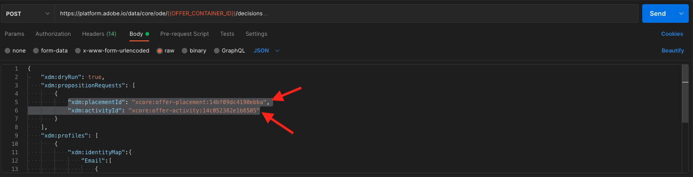

# 9.6 Entscheidung mithilfe der API testen

## 9.6.1 Arbeiten mit der Offer decisioning-API mithilfe von Postman

Download [Diese Postman-Sammlung für Offer decisioning](./../../assets/postman/postman_offer-decisioning.zip) auf Ihren Desktop kopieren und dekomprimieren Sie ihn. Dann haben Sie Folgendes:

Sie haben diese Datei jetzt auf Ihrem Desktop:

- [!UICONTROL _Modul 14 - Decisioning Service.postman_collection.json]

In [Übung 3.3.3 - Postman-Authentifizierung für Adobe I/O](./../../modules/module3/ex3.md) Sie haben Postman installiert. Sie müssen Postman erneut für diese Übung verwenden.

Öffnen Sie Postman. Klicken Sie auf **[!UICONTROL Importieren]**.

Klicken Sie auf **[!UICONTROL Dateien hochladen]**.

Datei auswählen **[!UICONTROL _Modul 14 - Decisioning Service.postman_collection.json]** und klicken Sie auf **[!UICONTROL Öffnen]**.

Diese Sammlung ist dann in Postman verfügbar.

Sie haben jetzt alles, was Sie in Postman benötigen, um über die APIs mit Adobe Experience Platform zu interagieren.

### 9.6.1.1 Listencontainer

Klicken Sie auf , um die Anforderung zu öffnen **[!UICONTROL GET - Listencontainer]**.

under **[!UICONTROL Parameter]** sehen Sie Folgendes:

- property: `_instance.parentName==aepenablementfy22`

In diesem Parameter **[!UICONTROL aepenablementfy22]** ist der Name der Sandbox, die in Adobe Experience Platform verwendet wird. Die Sandbox, die Sie verwenden sollten, lautet `--aepSandboxId--`. Text ersetzen **[!UICONTROL aepenablementfy22]** von `--aepSandboxId--`.

Nachdem Sie den Sandbox-Namen ersetzt haben, klicken Sie auf **[!UICONTROL Senden]**.

Dies ist die Antwort, die den Angebotscontainer für die von Ihnen angegebene Sandbox anzeigt. Bitte kopieren Sie die **[!UICONTROL container instanceId]** wie unten angegeben, und schreiben Sie es in eine Textdatei auf Ihrem Computer. Sie müssen dies **[!UICONTROL container instanceId]** für die nächste Übung!

### 9.6.1.2 Listenplatzierungen

Klicken Sie auf , um die Anforderung zu öffnen **[!UICONTROL GET - Listenplatzierungen]**. Klicken Sie auf **[!UICONTROL Senden]**.

Jetzt werden alle verfügbaren Platzierungen in Ihrem Angebotscontainer angezeigt. Die Platzierungen, die Sie sehen, wurden in der Adobe Experience Platform-Benutzeroberfläche definiert, wie Sie in [Übung 9.1.3](./ex1.md).

### 9.6.1.3 Regeln für Listenentscheidungen

Klicken Sie auf , um die Anforderung zu öffnen **[!UICONTROL GET - Entscheidungsregeln auflisten]**. Klicken Sie auf **[!UICONTROL Senden]**.

In der Antwort sehen Sie die Entscheidungsregeln, die Sie in der Adobe Experience Platform-Benutzeroberfläche definiert haben, wie Sie in [Übung 9.1.4](./ex1.md).

### 9.6.1.4 Personalisierte Angebote auflisten

Klicken Sie auf , um die Anforderung zu öffnen **[!UICONTROL GET - Auflisten personalisierter Angebote]**. Klicken Sie auf **[!UICONTROL Senden]**.

In der Antwort sehen Sie die personalisierten Angebote, die Sie in der Adobe Experience Platform-Benutzeroberfläche unter [Übung 9.2.1](./ex2.md).

### 9.6.1.5 Listen-Fallback-Angebote

Klicken Sie auf , um die Anforderung zu öffnen **[!UICONTROL GET - Fallback-Angebote auflisten]**. Klicken Sie auf **[!UICONTROL Senden]**.

In der Antwort sehen Sie das Fallback-Angebot, das Sie in der Adobe Experience Platform-Benutzeroberfläche unter [Übung 9.2.2](./ex2.md).

### 9.6.1.6 Listen-Sammlungen

Klicken Sie auf , um die Anforderung zu öffnen **[!UICONTROL GET - Auflisten von Sammlungen]**.

In der Antwort sehen Sie die Sammlung, die Sie in der Adobe Experience Platform-Benutzeroberfläche unter [Übung 9.2.3](./ex2.md).

### 9.6.1.7 Detaillierte Angebote für das Kundenprofil abrufen

Klicken Sie auf , um die Anforderung zu öffnen **[!UICONTROL POST - Erhalten detaillierter Angebote für das Kundenprofil]**. Diese Anfrage ähnelt der vorherigen, gibt jedoch Details wie Bild-URLs, Text usw. zurück.

Für diese Anfrage müssen Sie, ähnlich wie bei der vorherigen Übung mit ähnlichen Anforderungen, die Werte für **[!UICONTROL xdm:placementId]** und **[!UICONTROL xdm:activityId]** , um die spezifischen Angebotsdetails für einen Kunden abzurufen.

Das Feld **[!UICONTROL xdm:activityId]** ausgefüllt werden. Sie können dies wie unten beschrieben in der Adobe Experience Platform-Benutzeroberfläche abrufen.

Das Feld **[!UICONTROL xdm:placementId]** ausgefüllt werden. Sie können dies wie unten beschrieben in der Adobe Experience Platform-Benutzeroberfläche abrufen. Im folgenden Beispiel sehen Sie die placementId für die Platzierung **[!UICONTROL Web - Image]**.

Navigieren Sie zu **[!UICONTROL body]** und geben Sie die E-Mail-Adresse des Kunden ein, für den Sie ein Angebot anfordern möchten. Klicken Sie auf **[!UICONTROL Senden]**.

Schließlich sehen Sie das Ergebnis dessen, welche Art von personalisiertem Angebot und welche Assets diesem Kunden angezeigt werden müssen.

Du hast diese Übung jetzt abgeschlossen.

Nächster Schritt: [Zusammenfassung und Vorteile](./summary.md)

[Zurück zu Modul 9](./offer-decisioning.md)

[Zu allen Modulen zurückkehren](./../../overview.md)
